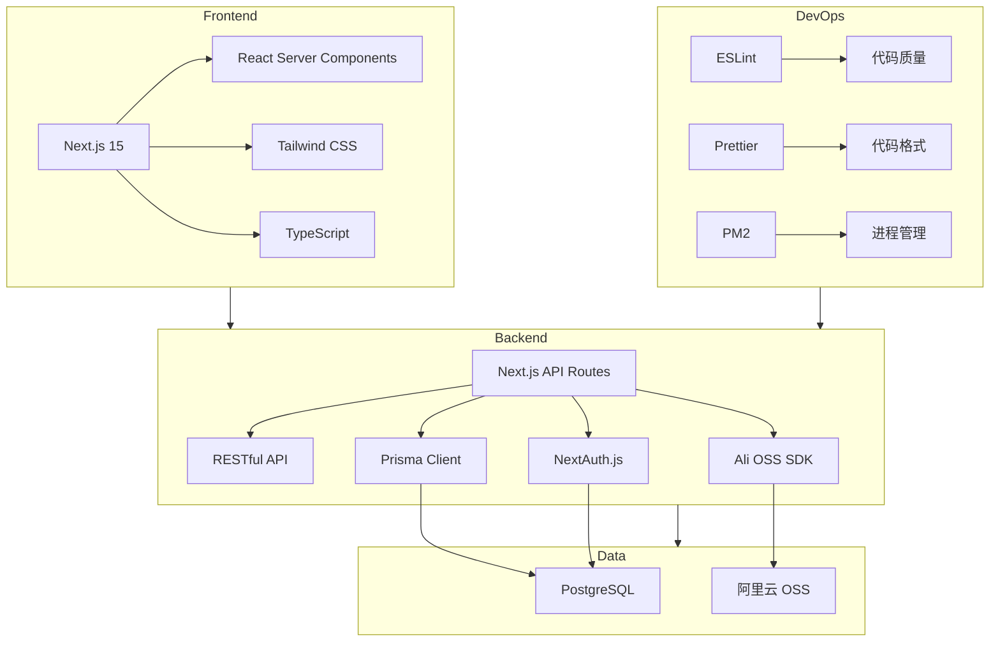

# 技术栈

<cite>
**本文档引用的文件**
- [package.json](file://package.json)
- [next.config.ts](file://next.config.ts)
- [tailwind.config.js](file://tailwind.config.js)
- [ecosystem.config.js](file://ecosystem.config.js)
- [prisma.ts](file://src/lib/prisma.ts)
- [auth.ts](file://src/lib/auth.ts)
- [oss.ts](file://src/lib/oss.ts)
- [middleware.ts](file://middleware.ts)
- [tsconfig.json](file://tsconfig.json)
- [postcss.config.js](file://postcss.config.js)
</cite>

## 目录
1. [简介](#简介)
2. [前端技术](#前端技术)
3. [后端与API](#后端与api)
4. [数据层](#数据层)
5. [认证体系](#认证体系)
6. [基础设施](#基础设施)
7. [开发与构建](#开发与构建)
8. [技术栈全景图](#技术栈全景图)

## 简介
本项目为“数字化作品互动展示平台”，采用现代化全栈技术架构，从前端到后端、数据层、认证、存储及部署流程均使用业界主流且高效的技术栈。系统基于 Next.js 15 构建，充分利用其 App Router 模式与 React Server Components 实现高性能服务端渲染。前端使用 Tailwind CSS 进行原子化样式开发，TypeScript 提供类型安全。后端通过 Next.js API 路由实现 RESTful 风格接口，数据层采用 Prisma ORM 连接 PostgreSQL 实现类型安全的数据库操作。认证体系基于 NextAuth.js 实现，支持角色权限控制。文件存储集成阿里云 OSS，部署使用 PM2 进行进程管理。整体技术选型兼顾开发效率、可维护性与生产稳定性。

## 前端技术

### Next.js 15（App Router模式）
项目采用 Next.js 15 的 App Router 模式作为核心框架，利用其基于文件系统的路由机制（`app/` 目录结构）实现清晰的页面组织。App Router 支持 React Server Components，允许在服务端直接渲染组件，减少客户端 JavaScript 负载，提升首屏加载性能。同时支持客户端交互逻辑的渐进增强。

### React Server Components
通过 App Router 的默认行为，页面组件在服务端渲染，有效减少客户端 bundle 大小，提升 SEO 和加载速度。仅在需要交互的组件中使用 `'use client'` 指令，实现服务端与客户端组件的混合渲染策略。

### Tailwind CSS
使用 Tailwind CSS 实现原子化 CSS 开发，通过实用类（utility classes）快速构建 UI。配置文件 `tailwind.config.js` 中扩展了动画功能，如 `marquee` 跑马灯效果，用于作品展示区域，提升视觉体验。

**Section sources**
- [tailwind.config.js](file://tailwind.config.js#L1-L25)

### TypeScript
项目全程使用 TypeScript，通过 `tsconfig.json` 配置严格的类型检查（`"strict": true`），确保代码的健壮性和可维护性。通过路径别名 `@/*` 简化模块导入，提升开发体验。

**Section sources**
- [tsconfig.json](file://tsconfig.json#L1-L41)

## 后端与API

### Next.js API路由
项目后端逻辑通过 `src/app/api` 目录下的 API 路由实现，每个 `.ts` 文件对应一个 RESTful 端点。例如 `/api/admin/users/route.ts` 处理用户管理相关请求。API 路由与前端同属一个应用，共享环境变量和依赖，简化开发与部署。

### RESTful设计风格
API 设计遵循 RESTful 原则，使用标准 HTTP 方法（GET, POST, PUT, DELETE）操作资源。例如：
- `GET /api/works`：获取作品列表
- `POST /api/works`：创建新作品
- `PUT /api/works/[id]/approve`：审核通过作品
- `DELETE /api/admin/users/[id]`：删除用户

API 响应通过 `next.config.ts` 中的 `headers` 配置，统一设置 CORS 策略，确保前端跨域请求的安全性。

**Section sources**
- [next.config.ts](file://next.config.ts#L20-L45)

## 数据层

### Prisma ORM（连接PostgreSQL）
数据访问层采用 Prisma ORM，通过 `@prisma/client` 与 PostgreSQL 数据库交互。`prisma.ts` 文件中初始化 PrismaClient 实例，并使用全局变量缓存，避免在开发环境下重复创建连接实例，提升性能。

Prisma 提供类型安全的数据库查询，其 Schema 定义在 `prisma/schema.prisma` 中，通过 `prisma generate` 命令生成 TypeScript 类型，确保数据库操作与代码类型一致。

**Section sources**
- [prisma.ts](file://src/lib/prisma.ts#L1-L19)

### 数据库迁移机制
项目使用 Prisma Migrate 进行数据库版本控制。每次数据模型变更后，通过 `npx prisma migrate dev` 生成新的迁移文件（位于 `prisma/migrations/` 目录），包含 SQL 脚本和 Prisma Schema 快照。生产环境可通过 `prisma db push` 或 CI/CD 流程应用迁移，确保数据库结构与代码同步。

## 认证体系

### NextAuth.js（配置与自定义）
认证系统基于 NextAuth.js 实现，通过 `auth.ts` 文件中的 `authOptions` 配置。使用 Prisma Adapter 将用户数据持久化到数据库，支持自定义凭证提供者（CredentialsProvider）实现邮箱密码登录。

认证流程包括：
1. 用户提交邮箱密码
2. 系统通过 Prisma 查询用户
3. 使用 `bcryptjs` 验证密码哈希
4. 成功后生成 JWT 会话，包含用户角色（`role`）

通过 `callbacks` 钩子将用户角色注入 JWT 和会话对象，实现基于角色的访问控制（RBAC）。

**Section sources**
- [auth.ts](file://src/lib/auth.ts#L7-L71)
- [middleware.ts](file://middleware.ts#L1-L50)

## 基础设施

### 阿里云OSS文件存储集成
文件上传功能集成阿里云对象存储（OSS）。`oss.ts` 文件封装了 OSS 客户端，提供 `uploadToOSS`、`deleteFromOSS`、`getSignedUrl` 等函数，支持文件上传、删除、生成临时访问链接等功能。

上传流程：
1. 前端上传文件到 `/api/upload` API 路由
2. 后端调用 `uploadToOSS` 将文件存入 OSS
3. 返回 OSS 文件 URL 存入数据库

所有 OSS 操作通过环境变量配置访问密钥，确保安全性。

**Section sources**
- [oss.ts](file://src/lib/oss.ts#L1-L302)

## 开发与构建

### ESLint、Prettier
项目使用 ESLint 进行代码质量检查，配置 `eslint-config-next` 以支持 Next.js 最佳实践。Prettier 用于代码格式化，确保团队代码风格统一。`next.config.ts` 中配置 `eslint.ignoreDuringBuilds: false`，确保构建时进行 ESLint 检查，防止问题代码上线。

### PM2（ecosystem.config.js）
生产环境使用 PM2 作为进程管理器，通过 `ecosystem.config.js` 配置应用。包含两个应用实例：
- `yunqi-platform`：生产环境，`npm start` 启动
- `yunqi-platform-dev`：开发环境，`npm run dev` 启动，支持文件监听

配置了日志文件路径、内存重启阈值、环境变量等，确保应用稳定运行。支持 `pm2 startup` 实现开机自启。

**Section sources**
- [ecosystem.config.js](file://ecosystem.config.js#L1-L109)

## 技术栈全景图

**Diagram sources**
- [package.json](file://package.json#L1-L61)
- [next.config.ts](file://next.config.ts#L1-L68)
- [tailwind.config.js](file://tailwind.config.js#L1-L25)
- [ecosystem.config.js](file://ecosystem.config.js#L1-L109)
- [prisma.ts](file://src/lib/prisma.ts#L1-L19)
- [auth.ts](file://src/lib/auth.ts#L1-L71)
- [oss.ts](file://src/lib/oss.ts#L1-L302)