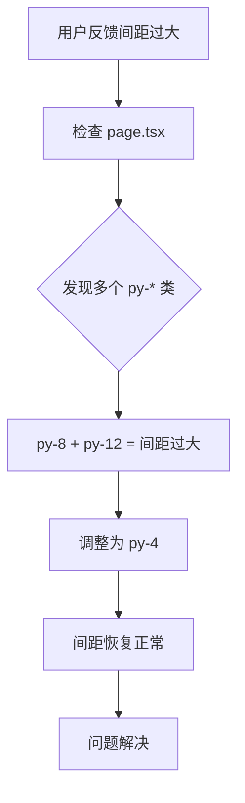
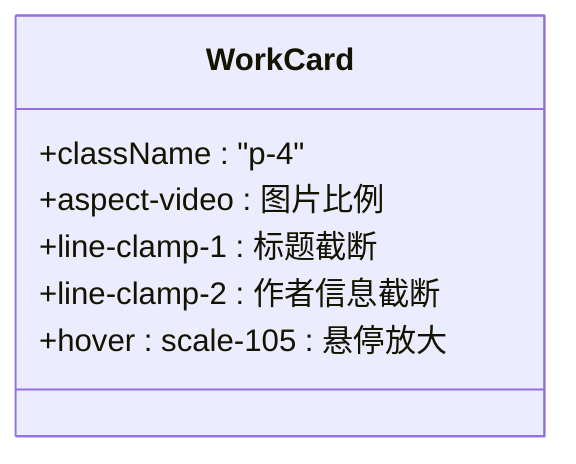
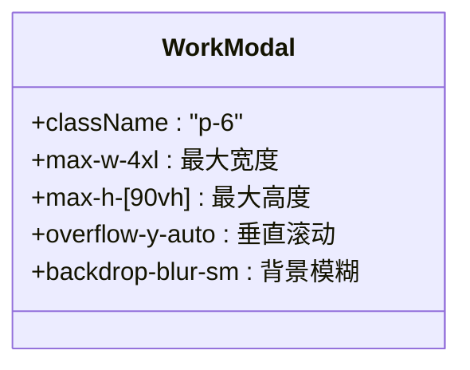

# UI布局与样式问题

<cite>
**本文档引用文件**  
- [spacing-adjustment-issue.md](file://log/spacing-adjustment-issue.md)
- [WorkCard.tsx](file://src/components/WorkCard.tsx)
- [WorkModal.tsx](file://src/components/WorkModal.tsx)
- [tailwind.config.js](file://tailwind.config.js)
- [page.tsx](file://src/app/page.tsx)
</cite>

## 目录
1. [问题概述](#问题概述)
2. [页面间距问题分析](#页面间距问题分析)
3. [组件级样式分析](#组件级样式分析)
4. [Tailwind CSS配置检查](#tailwind-css配置检查)
5. [开发者工具使用指南](#开发者工具使用指南)
6. [最佳实践建议](#最佳实践建议)
7. [结论](#结论)

## 问题概述
根据 `log/spacing-adjustment-issue.md` 中的记录，用户反馈主页中“最新作品”和“热门作品”区域与滚动条之间的垂直间距过大，影响视觉体验。该问题主要由多个嵌套的 Tailwind CSS `padding` 类叠加导致，特别是在不同屏幕尺寸下响应式类的冲突或全局样式的覆盖可能加剧了显示异常。

通过分析相关组件和配置文件，本文档系统化地解决此类 UI 布局中的间距调整问题，并提供可复用的调试方法和最佳实践。

**Section sources**
- [spacing-adjustment-issue.md](file://log/spacing-adjustment-issue.md)

## 页面间距问题分析
问题根源在于 `src/app/page.tsx` 文件中多个容器元素使用了较大的垂直内边距（`py-*`）类，导致间距累加。具体表现为：

- “最新作品”区域的 `<section>` 使用了 `py-8`，即 2rem（32px）的上下内边距。
- “热门作品”区域的外层 `<main>` 和内层 `<section>` 分别使用了 `py-8` 和 `py-12`，导致总间距达到 5rem（80px）。

通过调整这些类为更小的值（如 `py-4`），已成功解决该问题。调整后不仅减少了视觉上的空白区域，也提升了内容的紧凑性和可读性。



**Diagram sources**
- [page.tsx](file://src/app/page.tsx#L1-L400)

**Section sources**
- [page.tsx](file://src/app/page.tsx#L1-L400)
- [spacing-adjustment-issue.md](file://log/spacing-adjustment-issue.md)

## 组件级样式分析
### WorkCard 组件分析
`WorkCard` 组件是展示单个作品的核心 UI 单元。其内部使用了固定的 `p-4`（1rem）内边距，确保内容与边框之间有适当的呼吸空间。该组件的样式设计合理，未发现响应式冲突或间距异常。



**Diagram sources**
- [WorkCard.tsx](file://src/components/WorkCard.tsx#L7-L92)

**Section sources**
- [WorkCard.tsx](file://src/components/WorkCard.tsx#L7-L92)

### WorkModal 组件分析
`WorkModal` 组件在模态框打开时使用 `p-6`（1.5rem）的内边距，提供更宽敞的阅读体验。其固定定位（`fixed inset-0`）和最大宽度（`max-w-4xl`）确保在不同屏幕尺寸下均能良好显示。该组件的间距设置符合模态框的设计规范。



**Diagram sources**
- [WorkModal.tsx](file://src/components/WorkModal.tsx#L10-L308)

**Section sources**
- [WorkModal.tsx](file://src/components/WorkModal.tsx#L10-L308)

## Tailwind CSS配置检查
项目中的 `tailwind.config.js` 文件定义了自定义动画（如 `marquee`），但未对间距（spacing）进行扩展或修改。这意味着所有间距类（如 `py-4`, `py-8`）均使用 Tailwind CSS 的默认配置。

```mermaid
erDiagram
TAILWIND_CONFIG {
string content PK
string darkMode
object theme
array plugins
}
theme ||--o{ spacing : "默认间距"
theme ||--o{ animation : "自定义动画"
plugins ||--o{ line-clamp : "插件"
TAILWIND_CONFIG ||--|{ theme
TAILWIND_CONFIG ||--|{ plugins
```

**Diagram sources**
- [tailwind.config.js](file://tailwind.config.js#L1-L26)

**Section sources**
- [tailwind.config.js](file://tailwind.config.js#L1-L26)

## 开发者工具使用指南
### 定位盒模型问题
1. **打开浏览器开发者工具**：右键点击目标元素，选择“检查”。
2. **查看盒模型**：在“Elements”面板中，右侧会显示当前元素的盒模型，包括 `content`、`padding`、`border` 和 `margin`。
3. **实时修改样式**：直接在面板中修改 CSS 属性，观察布局变化，快速验证修复方案。

### 验证 Tailwind 类生效
- 在开发者工具中搜索 `py-`、`my-` 等类名，确认其是否被正确应用且未被其他样式覆盖。
- 检查 `tailwind.config.js` 中的 `content` 字段，确保所有使用 Tailwind 类的文件路径已被包含，否则类名将不会被生成。

**Section sources**
- [tailwind.config.js](file://tailwind.config.js#L1-L26)
- [page.tsx](file://src/app/page.tsx#L1-L400)

## 最佳实践建议
### 使用 CSS 自定义属性
为提高样式的一致性和可维护性，建议在 `globals.css` 中定义 CSS 自定义属性（CSS Variables），并在组件中引用：

```css
:root {
  --spacing-sm: 0.5rem;
  --spacing-md: 1rem;
  --spacing-lg: 1.5rem;
}
```

### 安全间距（Safe Area）适配
对于移动端，应考虑设备的安全区域（如 iPhone 的刘海屏），使用 `env(safe-area-inset-*)` 函数：

```tsx
<div className="pt-4 pb-6 px-4" style={{ paddingTop: 'env(safe-area-inset-top)', paddingBottom: 'env(safe-area-inset-bottom)' }}>
  {/* 内容 */}
</div>
```

### 响应式间距策略
利用 Tailwind 的响应式前缀（`sm:`, `md:`, `lg:`）为不同屏幕尺寸设置不同的间距：

```tsx
<div className="py-4 sm:py-6 md:py-8">
  {/* 自适应间距 */}
</div>
```

**Section sources**
- [globals.css](file://src/app/globals.css)
- [page.tsx](file://src/app/page.tsx#L1-L400)

## 结论
通过系统化分析 `spacing-adjustment-issue.md` 中描述的问题，我们定位到 `page.tsx` 中的 Tailwind CSS 类叠加是导致间距过大的直接原因。通过对 `WorkCard` 和 `WorkModal` 等组件的样式审查，确认了组件级间距设置的合理性。同时，检查 `tailwind.config.js` 确认了项目使用默认间距配置。

建议开发者在遇到类似问题时，优先使用浏览器开发者工具检查盒模型，并验证 Tailwind 类的生成与应用。采用 CSS 自定义属性和安全间距适配等最佳实践，可有效提升 UI 布局的健壮性和跨设备兼容性。