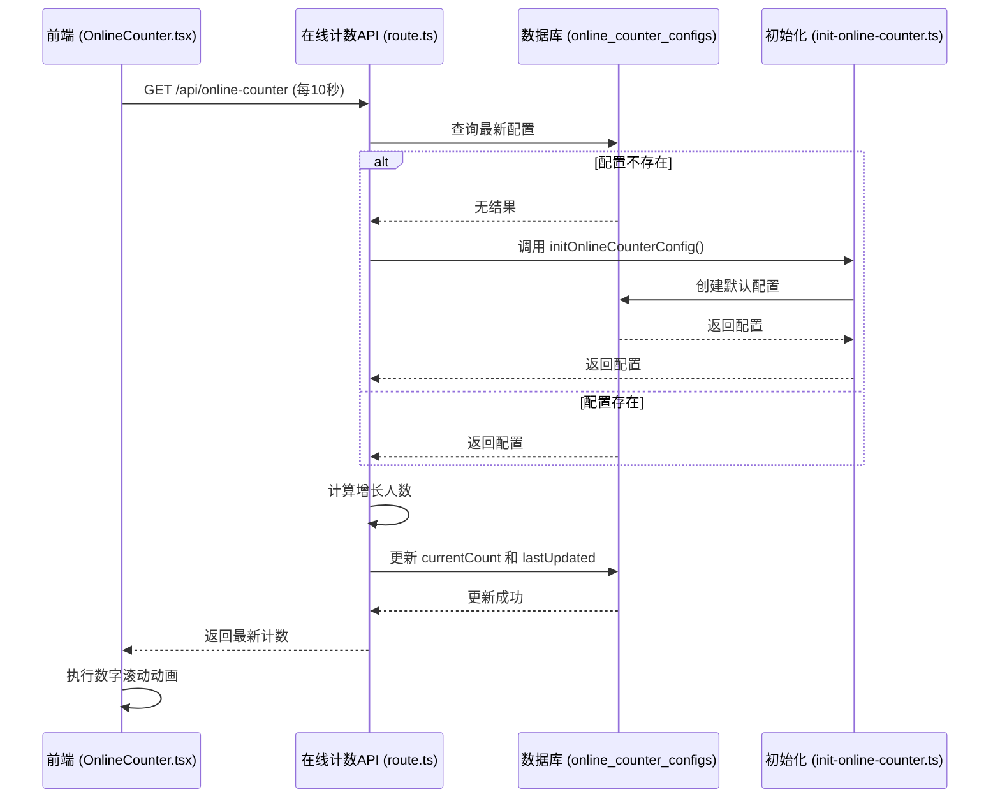
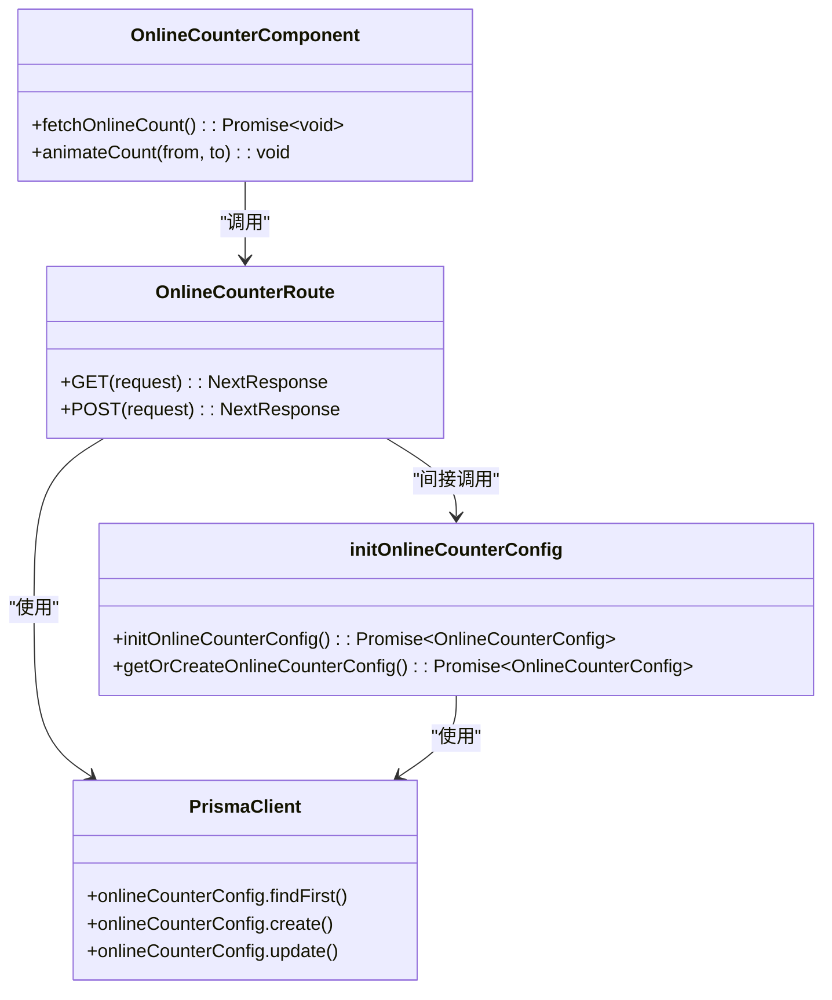
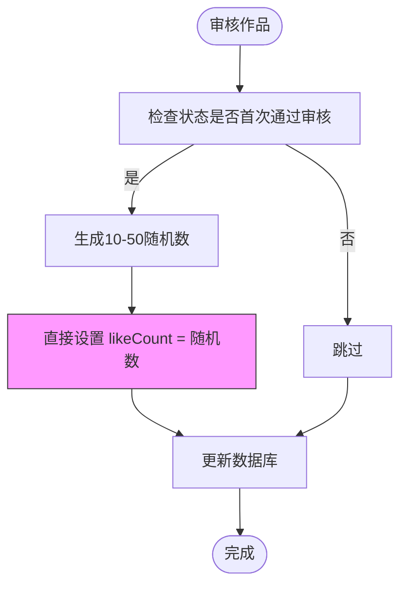
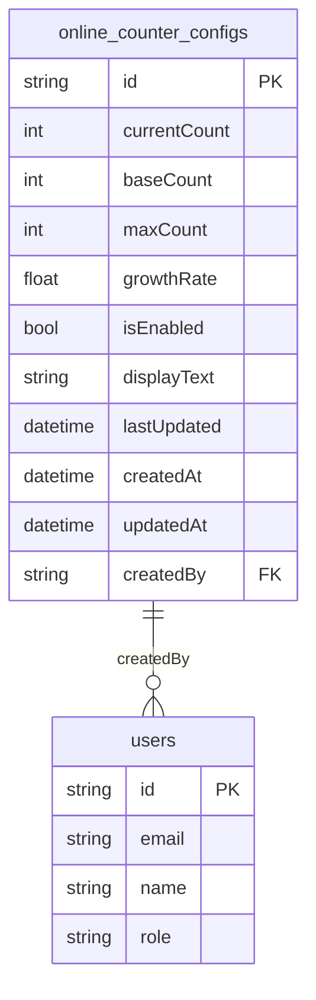

# 功能缺陷

<cite>
**本文档中引用的文件**  
- [online-counter-issue.md](file://log/online-counter-issue.md)
- [random-likes-feature.md](file://log/random-likes-feature.md)
- [init-online-counter.ts](file://src/lib/init-online-counter.ts)
- [route.ts](file://src/app/api/online-counter/route.ts)
- [OnlineCounter.tsx](file://src/components/OnlineCounter.tsx)
- [admin-works-id-route.ts](file://src/app/api/admin/works/[id]/route.ts)
- [works-id-like-route.ts](file://src/app/api/works/[id]/like/route.ts)
- [migration.sql](file://prisma/migrations/20250905143157_add_online_counter_config/migration.sql)
</cite>

## 目录
1. [引言](#引言)
2. [项目结构](#项目结构)
3. [核心组件](#核心组件)
4. [架构概述](#架构概述)
5. [详细组件分析](#详细组件分析)
6. [依赖分析](#依赖分析)
7. [性能考量](#性能考量)
8. [故障排查指南](#故障排查指南)
9. [结论](#结论)

## 引言
本文档深入探讨数字化作品互动展示平台中的两个核心互动功能缺陷：在线计数器不准确和随机点赞机制异常。基于日志文件 `log/online-counter-issue.md` 和 `log/random-likes-feature.md` 的记录，结合相关代码实现，分析这些问题在高并发场景下的表现、潜在的数据竞争条件或缓存失效问题。文档提供从API调用链、数据库事务到前端状态同步的完整排查路径，解释 `init-online-counter.ts` 和在线计数API (`route.ts`) 之间的交互逻辑，并给出修复建议与压力测试验证方法。

## 项目结构
本项目采用Next.js 13+的App Router架构，结合Prisma ORM进行数据库操作。核心功能模块包括用户认证、作品管理、在线计数器和随机点赞机制。项目结构清晰，按功能划分目录，如`app/api`存放API路由，`components`存放UI组件，`lib`存放工具函数和初始化逻辑。

```mermaid
graph TB
subgraph "前端"
UI[用户界面]
Header[Header.tsx]
OnlineCounter[OnlineCounter.tsx]
end
subgraph "API层"
API[API路由]
OnlineCounterAPI[online-counter/route.ts]
AdminWorksAPI[admin/works/[id]/route.ts]
WorksLikeAPI[works/[id]/like/route.ts]
end
subgraph "逻辑层"
Lib[lib]
InitCounter[init-online-counter.ts]
Prisma[prisma]
end
subgraph "数据层"
DB[(数据库)]
CounterConfig[online_counter_configs]
Works[works]
end
UI --> API
API --> Lib
Lib --> DB
DB --> API
API --> UI
```

**图表来源**  
- [OnlineCounter.tsx](file://src/components/OnlineCounter.tsx)
- [route.ts](file://src/app/api/online-counter/route.ts)
- [init-online-counter.ts](file://src/lib/init-online-counter.ts)
- [migration.sql](file://prisma/migrations/20250905143157_add_online_counter_config/migration.sql)

**本节来源**  
- [log/online-counter-issue.md](file://log/online-counter-issue.md)
- [log/random-likes-feature.md](file://log/random-likes-feature.md)

## 核心组件
本文档聚焦于两个核心功能组件：在线计数器和随机点赞机制。在线计数器由前端组件 `OnlineCounter.tsx` 和后端API `online-counter/route.ts` 共同实现，其配置初始化由 `init-online-counter.ts` 负责。随机点赞机制则在作品审核 (`admin/works/[id]/route.ts`) 和用户点赞 (`works/[id]/like/route.ts`) 两个API中实现。

**本节来源**  
- [init-online-counter.ts](file://src/lib/init-online-counter.ts#L6-L34)
- [route.ts](file://src/app/api/online-counter/route.ts#L1-L188)
- [admin-works-id-route.ts](file://src/app/api/admin/works/[id]/route.ts#L1-L251)

## 架构概述
系统采用典型的前后端分离架构。前端通过定时轮询调用 `/api/online-counter` 获取最新在线人数，并通过动画平滑展示。后端API负责计算并持久化在线人数状态。随机点赞机制则在作品状态变更时触发，直接更新数据库中的点赞数。



**图表来源**  
- [init-online-counter.ts](file://src/lib/init-online-counter.ts#L6-L34)
- [route.ts](file://src/app/api/online-counter/route.ts#L1-L188)
- [OnlineCounter.tsx](file://src/components/OnlineCounter.tsx#L122-L157)

## 详细组件分析

### 在线计数器缺陷分析
在线计数器的核心缺陷在于其高并发下的数据竞争和状态不一致问题。

#### 问题表现
根据 `log/online-counter-issue.md`，计数器在高并发场景下可能出现不准确、跳跃或停滞现象。前端组件 `OnlineCounter.tsx` 每10秒轮询一次API，而API `route.ts` 在每次请求时才计算增长。这导致多个并发请求可能基于同一个旧的 `currentCount` 值进行计算和更新，造成数据丢失。

#### 交互逻辑
`init-online-counter.ts` 中的 `initOnlineCounterConfig()` 函数用于在应用启动时确保数据库中存在在线计数器的配置。该函数在API `route.ts` 的 `GET` 方法中被间接调用，当查询不到配置时会创建默认配置。



**图表来源**  
- [init-online-counter.ts](file://src/lib/init-online-counter.ts#L6-L34)
- [route.ts](file://src/app/api/online-counter/route.ts#L1-L188)
- [OnlineCounter.tsx](file://src/components/OnlineCounter.tsx#L0-L42)

#### 缺陷根源
1.  **数据竞争**: 多个API请求同时读取 `currentCount`，各自计算增长后写回，后写入的会覆盖先写入的结果。
2.  **时间窗口问题**: API的 `GET` 方法在计算增长时，使用 `lastUpdated` 时间戳来判断是否需要增长。但在高并发下，多个请求可能在同一时间窗口内到达，导致重复计算。
3.  **缺乏锁机制**: 数据库更新操作没有使用行级锁或乐观锁，无法保证原子性。

**本节来源**  
- [init-online-counter.ts](file://src/lib/init-online-counter.ts#L6-L34)
- [route.ts](file://src/app/api/online-counter/route.ts#L1-L188)
- [OnlineCounter.tsx](file://src/components/OnlineCounter.tsx#L122-L157)

### 随机点赞机制异常分析

#### 问题表现
`log/random-likes-feature.md` 记录了为审核通过的作品添加10-50随机初始点赞数的功能。然而，该机制可能与用户点赞功能 (`works/[id]/like/route.ts`) 产生冲突。用户点赞API也使用随机数（1-10）增加点赞数，这可能导致在高并发下，初始点赞数和用户点赞数的更新发生竞争。

#### 交互逻辑
作品审核API (`admin/works/[id]/route.ts`) 在作品首次通过审核时，生成一个10-50的随机数并直接设置为 `likeCount`。而用户点赞API (`works/[id]/like/route.ts`) 则使用 `increment` 操作，随机增加1-10的点赞数。



**图表来源**  
- [admin-works-id-route.ts](file://src/app/api/admin/works/[id]/route.ts#L1-L251)
- [works-id-like-route.ts](file://src/app/api/works/[id]/like/route.ts#L1-L64)

#### 缺陷根源
1.  **操作类型不一致**: 审核API使用 `set` 操作，而用户API使用 `increment` 操作。如果审核操作在用户点赞之后执行，会覆盖掉用户的所有点赞。
2.  **缺乏事务隔离**: 两个API独立运行，没有协调机制，无法避免操作冲突。

**本节来源**  
- [admin-works-id-route.ts](file://src/app/api/admin/works/[id]/route.ts#L1-L251)
- [works-id-like-route.ts](file://src/app/api/works/[id]/like/route.ts#L1-L64)

## 依赖分析
系统各组件间存在明确的依赖关系。前端组件依赖于API接口，API接口依赖于数据库和初始化逻辑。数据库表 `online_counter_configs` 是在线计数器功能的核心，其结构由Prisma迁移文件定义。



**图表来源**  
- [migration.sql](file://prisma/migrations/20250905143157_add_online_counter_config/migration.sql#L1-L20)

**本节来源**  
- [migration.sql](file://prisma/migrations/20250905143157_add_online_counter_config/migration.sql#L1-L20)
- [init-online-counter.ts](file://src/lib/init-online-counter.ts#L6-L34)

## 性能考量
当前的在线计数器实现对数据库有较高的读写压力，尤其是在高并发场景下。每次API调用都涉及一次数据库查询和一次更新操作。建议引入Redis等内存数据库作为缓存层，将计数器状态存储在内存中，并定期持久化到数据库，以减少数据库的直接压力。

## 故障排查指南
排查在线计数器问题应遵循以下路径：
1.  **前端**: 检查 `OnlineCounter.tsx` 的轮询间隔和动画逻辑。
2.  **API**: 检查 `route.ts` 的增长计算逻辑和数据库更新操作。
3.  **数据库**: 检查 `online_counter_configs` 表的 `currentCount` 和 `lastUpdated` 字段的变化日志。
4.  **并发**: 使用压力测试工具模拟高并发请求，观察计数器行为。

**本节来源**  
- [OnlineCounter.tsx](file://src/components/OnlineCounter.tsx#L122-L157)
- [route.ts](file://src/app/api/online-counter/route.ts#L1-L188)

## 结论
在线计数器和随机点赞机制的缺陷主要源于高并发下的数据竞争和操作原子性不足。修复建议包括：
1.  **在线计数器**: 使用数据库的原子操作（如 `increment`）替代 `set`，或引入分布式锁。
2.  **随机点赞**: 统一所有点赞操作为 `increment` 类型，避免 `set` 操作覆盖数据。
3.  **引入缓存**: 使用Redis缓存计数器状态，降低数据库压力。
4.  **压力测试**: 使用工具如 `k6` 或 `JMeter` 进行高并发测试，验证修复效果。