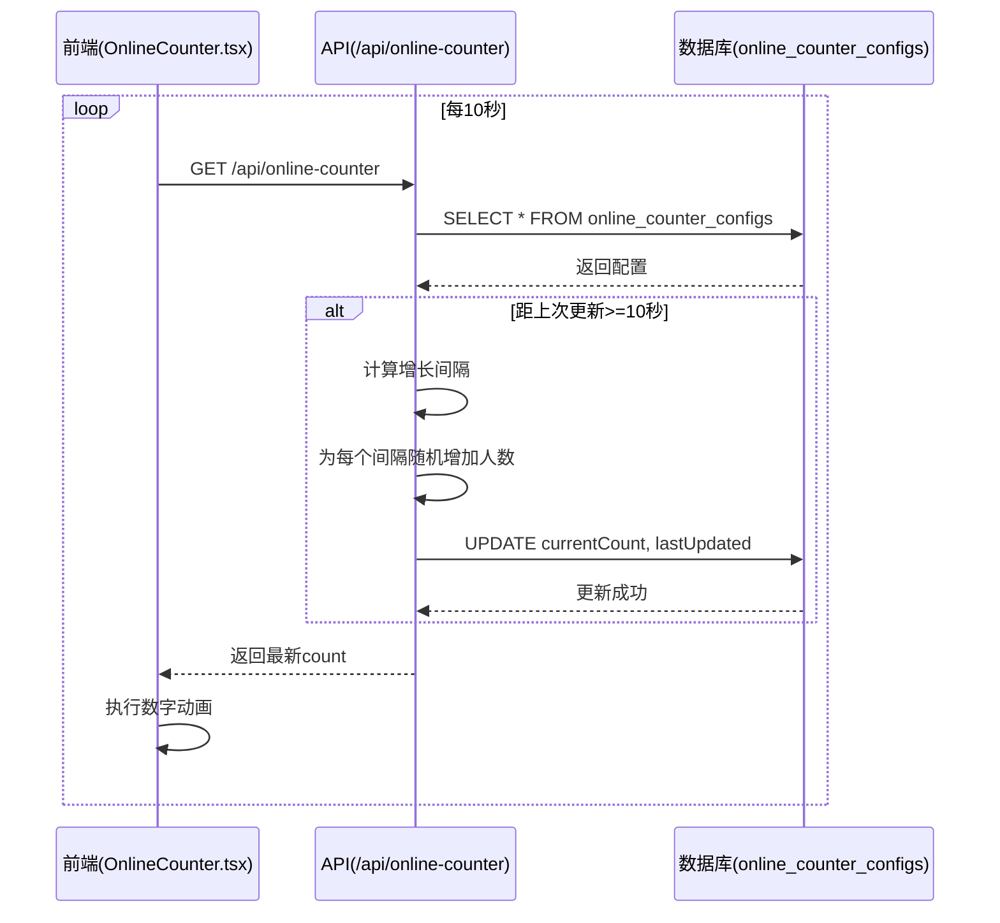
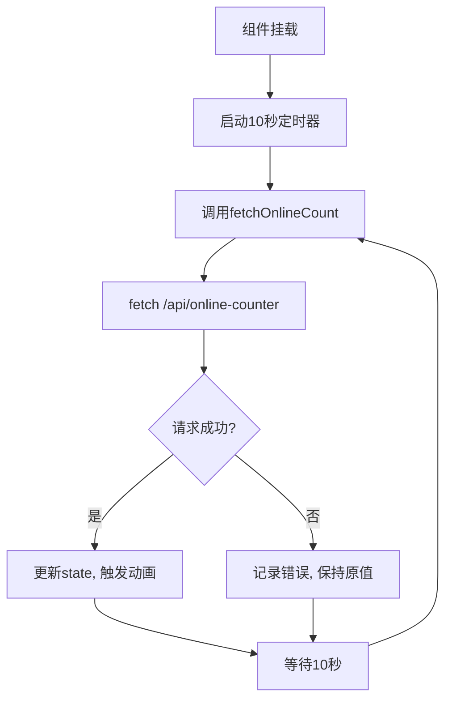
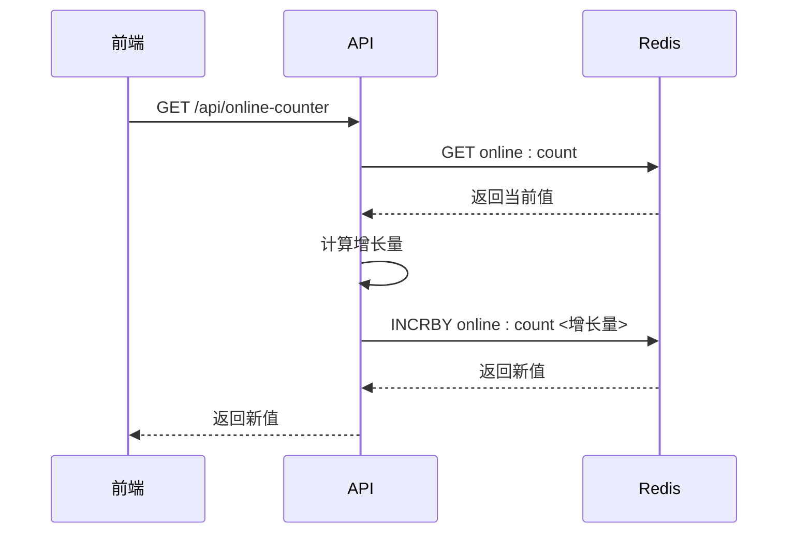

# 在线计数器缺陷

<cite>
**本文档引用的文件**  
- [online-counter-issue.md](file://log/online-counter-issue.md)
- [init-online-counter.ts](file://src/lib/init-online-counter.ts)
- [route.ts](file://src/app/api/online-counter/route.ts)
- [migration.sql](file://prisma/migrations/20250905143157_add_online_counter_config/migration.sql)
- [schema.prisma](file://prisma/schema.prisma)
- [OnlineCounter.tsx](file://src/components/OnlineCounter.tsx)
</cite>

## 目录
1. [问题概述](#问题概述)
2. [系统架构与组件交互](#系统架构与组件交互)
3. [高并发场景下的数据不一致分析](#高并发场景下的数据不一致分析)
4. [调用链路与轮询机制](#调用链路与轮询机制)
5. [数据库事务与隔离级别](#数据库事务与隔离级别)
6. [修复方案](#修复方案)
7. [压力测试用例设计](#压力测试用例设计)
8. [结论与建议](#结论与建议)

## 问题概述

根据 `log/online-counter-issue.md` 中的描述，系统实现了在线人数计数器功能，用于在主页显示“xxx人正在云栖大会创作”的动态人数。该功能通过前端组件 `OnlineCounter.tsx` 每 10 秒轮询后端 API 获取最新人数，并在前端进行动画展示。

然而，在高并发访问场景下，该计数器出现了数据不准确的问题。核心问题在于：多个并发请求同时读取数据库中的 `currentCount` 值，基于相同旧值进行增长计算，并几乎同时写回数据库，导致后续的更新覆盖了前面的更新，造成部分增长丢失，最终显示的人数低于实际应有值。

**Section sources**
- [online-counter-issue.md](file://log/online-counter-issue.md)

## 系统架构与组件交互

在线计数器功能涉及多个组件的协同工作，其核心交互流程如下：

1.  **初始化 (`init-online-counter.ts`)**: 应用启动时，通过 `initOnlineCounterConfig` 函数检查数据库中是否存在 `online_counter_configs` 表的配置记录。若不存在，则创建一条包含默认值（如 `currentCount: 1075`, `growthRate: 0.5`）的记录。
2.  **API 服务 (`online-counter/route.ts`)**: 处理前端的 GET 请求。获取当前配置后，根据 `lastUpdated` 时间戳计算自上次更新以来经过的秒数。若超过 10 秒，则按每 10 秒一个间隔，为每个间隔随机增加 0 到 `growthRate` 之间的人数（向下取整），然后更新数据库中的 `currentCount` 和 `lastUpdated` 字段。
3.  **前端轮询 (`OnlineCounter.tsx`)**: 前端组件使用 `fetch` 每 10 秒调用一次 `/api/online-counter` 接口，获取最新的计数并触发数字滚动动画。



**Diagram sources**
- [init-online-counter.ts](file://src/lib/init-online-counter.ts)
- [route.ts](file://src/app/api/online-counter/route.ts)
- [OnlineCounter.tsx](file://src/components/OnlineCounter.tsx)

**Section sources**
- [init-online-counter.ts](file://src/lib/init-online-counter.ts)
- [route.ts](file://src/app/api/online-counter/route.ts)
- [OnlineCounter.tsx](file://src/components/OnlineCounter.tsx)

## 高并发场景下的数据不一致分析

在高并发场景下，上述设计存在严重的竞态条件（Race Condition），导致数据不准确。问题的根本原因在于**非原子性的读-改-写操作**。

### 竞态条件分析

假设当前数据库中的 `currentCount` 为 1000，`lastUpdated` 为 T0。当时间到达 T0+15 秒时，多个用户（或服务）几乎同时发起请求。

1.  **请求A**: 读取数据库，`currentCount=1000`，`lastUpdated=T0`。
2.  **请求B**: 几乎同时读取数据库，同样得到 `currentCount=1000`，`lastUpdated=T0`。
3.  **请求A**: 计算出经过了 1 个 10 秒间隔，随机增加 1 人，得到 `newCount=1001`，并更新数据库。
4.  **请求B**: 也计算出经过了 1 个 10 秒间隔，随机增加 2 人，得到 `newCount=1002`，并更新数据库。

最终，数据库中的 `currentCount` 被设置为 1002。然而，正确的结果应该是 1000 + 1 + 2 = 1003。请求A的更新被请求B的更新覆盖，导致增长了1人的人数丢失。

### 缓存失效与状态同步延迟

-   **缓存失效**: 由于每次请求都直接读写数据库，没有使用缓存，因此不存在缓存一致性问题。但这也意味着每次请求都对数据库产生压力。
-   **状态同步延迟**: 在请求A和请求B的执行间隙，数据库状态是不一致的。当请求A更新后，请求B仍然基于旧状态进行计算，造成了逻辑上的延迟和数据丢失。

**Section sources**
- [route.ts](file://src/app/api/online-counter/route.ts)

## 调用链路与轮询机制

### 前端调用链路

前端组件 `OnlineCounter.tsx` 的 `useEffect` 钩子在组件挂载后启动一个每 10 秒执行一次的定时器。该定时器调用 `fetchOnlineCount` 函数，通过 `fetch` API 向 `/api/online-counter` 发起 GET 请求。



**Diagram sources**
- [OnlineCounter.tsx](file://src/components/OnlineCounter.tsx)

### API 处理逻辑

后端 API 的处理逻辑是问题的核心。其关键步骤如下：
1.  从数据库获取最新的配置。
2.  计算距离 `lastUpdated` 的时间差。
3.  如果时间差 >= 10 秒，则计算需要增长的间隔数。
4.  **关键问题**: 在一个 `for` 循环中，为每个间隔计算随机增长值，并累加到 `newCount` 变量。
5.  **关键问题**: 最后，使用 `prisma.onlineCounterConfig.update` 将新的 `currentCount` 和 `lastUpdated` 写回数据库。

这个过程中的第4步和第5步不是原子操作。多个请求可以同时进入第4步，基于相同的旧 `currentCount` 进行计算，导致最终写入的数据不准确。

**Section sources**
- [route.ts](file://src/app/api/online-counter/route.ts)

## 数据库事务与隔离级别

### 数据库表结构

根据 `prisma/schema.prisma` 和迁移文件 `migration.sql`，`online_counter_configs` 表的结构如下：

**在线计数器配置表 (online_counter_configs)**
| 字段名 | 类型 | 默认值 | 说明 |
| :--- | :--- | :--- | :--- |
| `id` | TEXT | - | 主键 |
| `currentCount` | INTEGER | 1075 | 当前显示人数 |
| `baseCount` | INTEGER | 1000 | 基础人数 |
| `maxCount` | INTEGER | 2000 | 最大人数 |
| `growthRate` | DOUBLE PRECISION | 0.5 | 增长速率（每分钟） |
| `isEnabled` | BOOLEAN | true | 功能开关 |
| `displayText` | TEXT | '人正在云栖大会创作' | 显示文本 |
| `lastUpdated` | TIMESTAMP(3) | CURRENT_TIMESTAMP | 最后更新时间 |
| `createdAt` | TIMESTAMP(3) | CURRENT_TIMESTAMP | 创建时间 |
| `updatedAt` | TIMESTAMP(3) | - | 更新时间 |
| `createdBy` | TEXT | - | 创建者ID |

**Section sources**
- [schema.prisma](file://prisma/schema.prisma)
- [migration.sql](file://prisma/migrations/20250905143157_add_online_counter_config/migration.sql)

### 事务隔离级别

当前代码中，`update` 操作是在一个隐式的数据库事务中执行的。Prisma 默认使用数据库的默认隔离级别。对于 PostgreSQL，其默认隔离级别是 **READ COMMITTED**。

在 `READ COMMITTED` 隔离级别下，一个事务可以看到其他已提交事务的修改。这正是导致竞态条件的原因：事务A和事务B都能读取到 `currentCount=1000`，然后各自计算并提交更新，后提交的事务会覆盖先提交的事务的 `currentCount` 值。

## 修复方案

为了解决高并发下的数据不一致问题，必须确保“读取-计算-写入”这一系列操作的原子性。以下是两种推荐的修复方案：

### 方案一：使用数据库行锁（悲观锁）

在读取配置时，使用 `FOR UPDATE` 锁定该行，防止其他事务同时修改。

```typescript
// 修改 online-counter/route.ts 中的 GET 函数
const config = await prisma.$transaction(async (prisma) => {
  // 使用行锁锁定配置行
  const lockedConfig = await prisma.onlineCounterConfig.findFirst({
    orderBy: { createdAt: 'desc' },
    lock: { mode: 'FOR UPDATE' } // Prisma v5+ 语法，具体语法可能因版本而异
  });

  if (!lockedConfig) {
    // ... 创建默认配置
    return lockedConfig;
  }

  // ... 执行增长计算逻辑

  // 更新数据库
  const updatedConfig = await prisma.onlineCounterConfig.update({
    where: { id: lockedConfig.id },
    data: {
      currentCount: newCount,
      lastUpdated: now
    }
  });

  return updatedConfig;
});
```

**优点**: 实现简单，能有效防止并发更新。
**缺点**: 性能较低，所有请求都需要排队等待锁，可能成为性能瓶颈。

### 方案二：使用 Redis 原子操作（推荐）

将计数器状态从数据库迁移到 Redis，利用 Redis 的原子操作来保证一致性。

1.  **数据结构**: 使用 Redis 的 `INCRBY` 或 `INCRBYFLOAT` 命令。
2.  **实现逻辑**:
    -   将 `currentCount` 存储在 Redis 的一个键中（如 `online:count`）。
    -   API 接口首先尝试从 Redis 获取当前值。
    -   计算增长量，并使用 `INCRBY` 命令原子性地增加计数。
    -   同时，可以将 `lastUpdated` 等配置信息仍保留在数据库中，或也存入 Redis。



**优点**: Redis 是内存数据库，读写速度极快，`INCRBY` 是原子操作，能完美解决并发问题，性能远优于数据库锁。
**缺点**: 引入了新的依赖（Redis），需要维护 Redis 的高可用和持久化。

## 压力测试用例设计

为了验证修复效果，设计以下压力测试用例：

### 测试目标
验证在高并发下，计数器的增长值是否准确，无数据丢失。

### 测试工具
使用 `k6` 或 `JMeter` 等工具模拟并发请求。

### 测试用例

**用例1: 基准性能测试**
-   **描述**: 测试系统在低并发下的响应时间和准确性。
-   **步骤**:
    1.  初始化计数器为 1000。
    2.  使用 10 个并发用户，每 10 秒发起一次 GET 请求，持续 1 分钟。
    3.  记录最终的计数值。
-   **预期结果**: 最终计数值应与理论