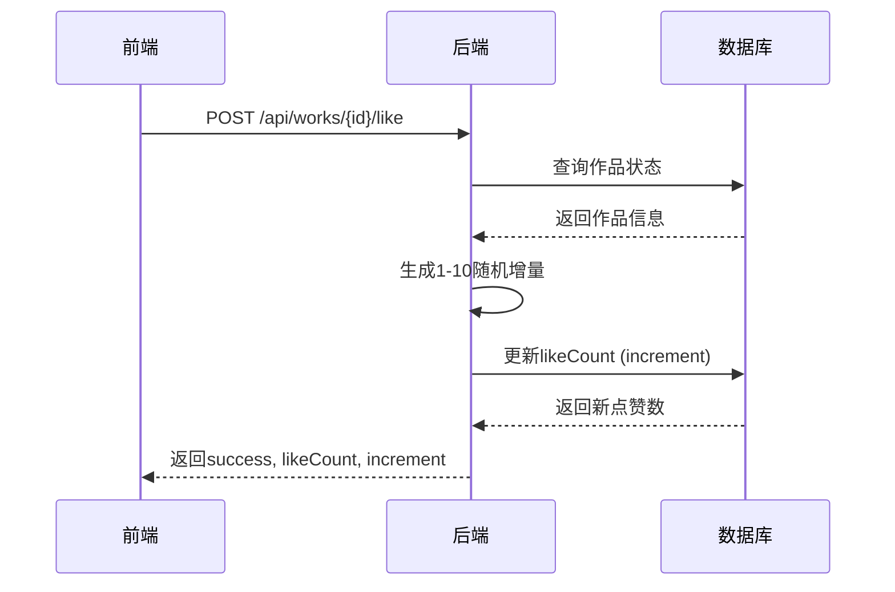
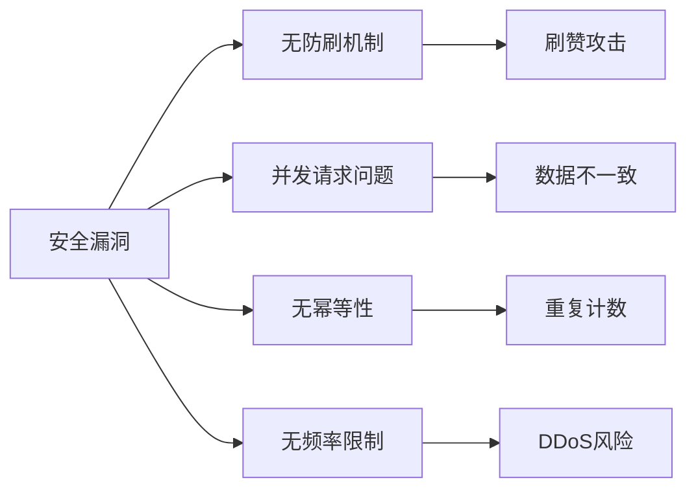
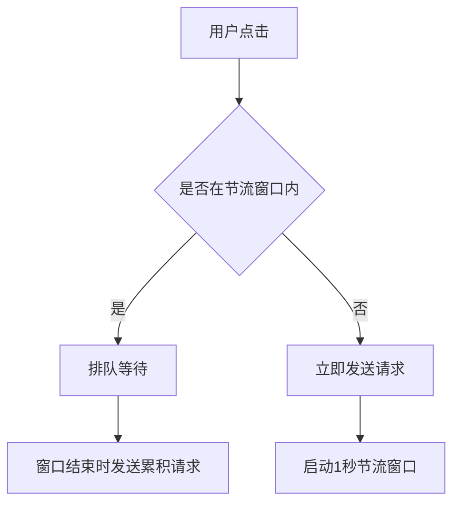
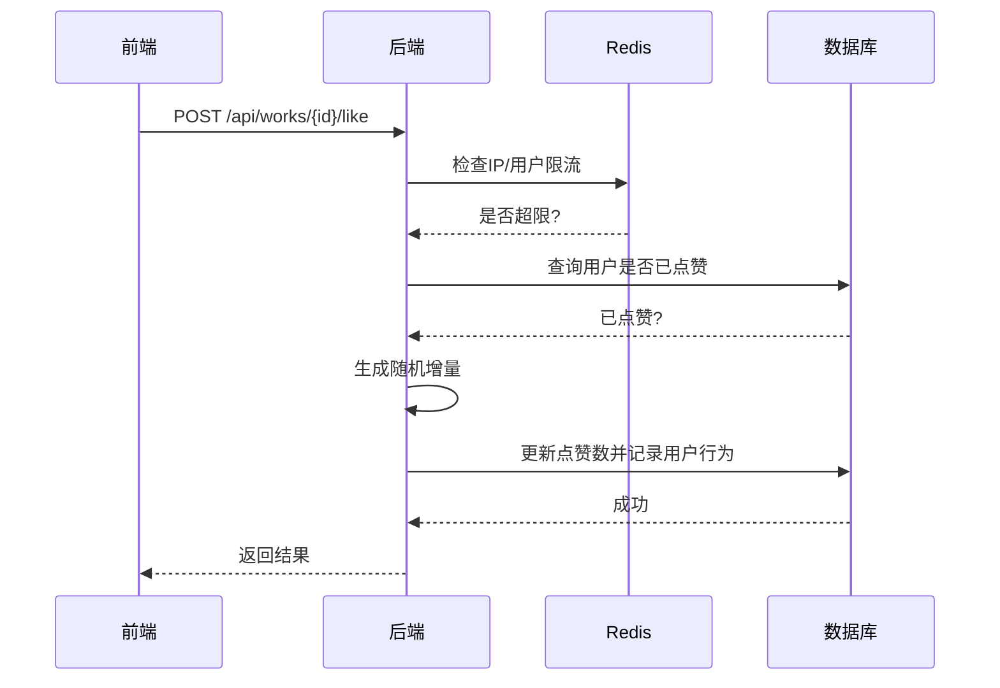
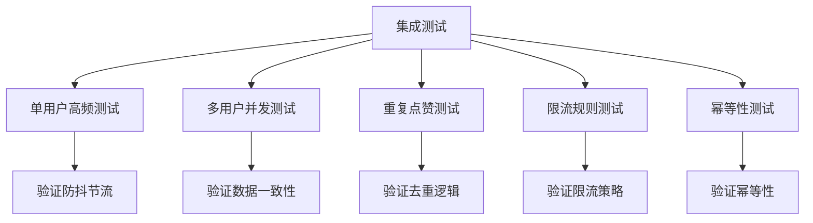

# 随机点赞机制异常

<cite>
**本文档引用文件**  
- [random-likes-feature.md](file://log/random-likes-feature.md)
- [WorkCard.tsx](file://src/components/WorkCard.tsx)
- [like/route.ts](file://src/app/api/works/[id]/like/route.ts)
- [page.tsx](file://src/app/page.tsx)
- [useDebounce.ts](file://src/hooks/useDebounce.ts)
- [数字化作品互动展示平台 PRD (产品需求文档).md](file://数字化作品互动展示平台 PRD (产品需求文档).md)
- [admin/works/[id]/route.ts](file://src/app/api/admin/works/[id]/route.ts)
</cite>

## 目录
1. [问题概述](#问题概述)
2. [前端触发逻辑分析](#前端触发逻辑分析)
3. [后端处理逻辑分析](#后端处理逻辑分析)
4. [不一致性与异常行为分析](#不一致性与异常行为分析)
5. [潜在安全漏洞与逻辑缺陷](#潜在安全漏洞与逻辑缺陷)
6. [改进方案](#改进方案)
7. [修复后集成测试方法](#修复后集成测试方法)

## 问题概述
根据日志文件 `log/random-likes-feature.md` 的记录，系统在作品审核通过时会为新作品赋予10-50之间的随机初始点赞数。然而，在用户交互过程中，前端 `WorkCard` 组件触发的点赞事件与后端 `/api/works/[id]/like/route.ts` 接口处理之间存在不一致性，可能导致重复请求、状态未及时更新或后端未正确校验用户行为等问题。

**Section sources**
- [random-likes-feature.md](file://log/random-likes-feature.md)

## 前端触发逻辑分析
前端 `WorkCard` 组件通过 `onLike` 回调函数处理点赞事件，该回调最终在 `page.tsx` 中实现。当前实现中，`handleLike` 函数使用 `likingWorks` 状态集合防止短时间内重复点击，但防抖时间仅为1秒，且未结合节流机制。

```mermaid
flowchart TD
A[用户点击点赞按钮] --> B{是否已在likingWorks中}
B --> |是| C[忽略点击]
B --> |否| D[添加到likingWorks]
D --> E[发送POST请求到/api/works/[id]/like]
E --> F{响应成功?}
F --> |是| G[更新本地likeCount]
F --> |否| H[显示错误提示]
G --> I[显示成功toast]
H --> I
I --> J[1秒后从likingWorks移除]
```

**Diagram sources**
- [WorkCard.tsx](file://src/components/WorkCard.tsx#L7-L92)
- [page.tsx](file://src/app/page.tsx#L211-L254)

**Section sources**
- [WorkCard.tsx](file://src/components/WorkCard.tsx#L7-L92)
- [page.tsx](file://src/app/page.tsx#L211-L254)

## 后端处理逻辑分析
后端 `works/[id]/like/route.ts` 接口在每次收到点赞请求时，会为作品随机增加1-10之间的点赞数。该接口仅检查作品是否存在且已审核通过，但缺乏对同一用户重复请求的校验，也未实现幂等性控制。



**Diagram sources**
- [like/route.ts](file://src/app/api/works/[id]/like/route.ts#L0-L64)

**Section sources**
- [like/route.ts](file://src/app/api/works/[id]/like/route.ts#L0-L64)

## 不一致性与异常行为分析
当前实现存在以下不一致性问题：

1. **防抖机制不完善**：前端仅使用1秒防抖，用户可在1秒后立即再次点击，导致高频请求。
2. **缺乏节流机制**：PRD文档要求前端做节流处理（如每500ms合并一次请求），但当前实现未遵循。
3. **状态更新延迟**：前端依赖后端返回的 `likeCount` 更新UI，但在高并发下可能出现状态不一致。
4. **无用户行为校验**：后端未记录用户点赞行为，无法防止同一用户对同一作品的刷赞行为。

**Section sources**
- [page.tsx](file://src/app/page.tsx#L211-L254)
- [like/route.ts](file://src/app/api/works/[id]/like/route.ts#L0-L64)
- [数字化作品互动展示平台 PRD (产品需求文档).md](file://数字化作品互动展示平台 PRD (产品需求文档).md#L75-L134)

## 潜在安全漏洞与逻辑缺陷
当前点赞机制存在以下安全漏洞和逻辑缺陷：

1. **缺乏防刷机制**：攻击者可通过脚本频繁调用接口，快速增加作品点赞数。
2. **并发请求问题**：多个并发点赞请求可能导致数据库更新竞争，出现数据不一致。
3. **无幂等性保障**：相同请求可能产生不同结果，违反REST API设计原则。
4. **无频率限制**：未对IP或用户进行请求频率限制，易受DDoS攻击。



**Diagram sources**
- [like/route.ts](file://src/app/api/works/[id]/like/route.ts#L0-L64)
- [page.tsx](file://src/app/page.tsx#L211-L254)

**Section sources**
- [like/route.ts](file://src/app/api/works/[id]/like/route.ts#L0-L64)
- [page.tsx](file://src/app/page.tsx#L211-L254)

## 改进方案
为解决上述问题，提出以下改进方案：

### 1. 客户端防抖与节流
引入 `useDebounce` 钩子并结合节流策略，限制用户点击频率。



### 2. 服务器端限流策略
在后端实现基于Redis的滑动窗口限流，限制单个IP或用户每分钟请求次数。

### 3. 幂等性校验
通过JWT获取用户ID，在数据库中记录用户点赞历史，确保同一用户对同一作品只能点赞一次。



**Diagram sources**
- [like/route.ts](file://src/app/api/works/[id]/like/route.ts#L0-L64)
- [useDebounce.ts](file://src/hooks/useDebounce.ts#L0-L16)

**Section sources**
- [like/route.ts](file://src/app/api/works/[id]/like/route.ts#L0-L64)
- [useDebounce.ts](file://src/hooks/useDebounce.ts#L0-L16)

## 修复后集成测试方法
为验证修复效果，建议进行以下集成测试：

1. **单用户高频点击测试**：模拟同一用户在短时间内连续点击点赞按钮，验证防抖节流效果。
2. **多用户并发测试**：使用压力测试工具模拟多用户同时点赞，验证系统稳定性和数据一致性。
3. **重复点赞测试**：验证同一用户对同一作品多次点赞时，后端是否正确返回"已点赞"状态。
4. **限流规则测试**：验证IP或用户超过请求频率限制后，接口是否返回429状态码。
5. **幂等性测试**：重放相同请求，验证结果是否一致。



**Diagram sources**
- [like/route.ts](file://src/app/api/works/[id]/like/route.ts#L0-L64)
- [page.tsx](file://src/app/page.tsx#L211-L254)

**Section sources**
- [like/route.ts](file://src/app/api/works/[id]/like/route.ts#L0-L64)
- [page.tsx](file://src/app/page.tsx#L211-L254)