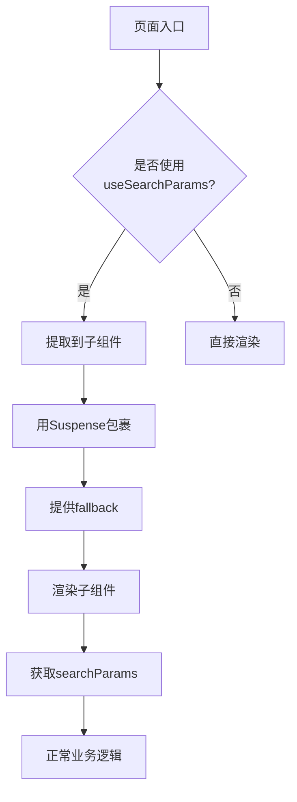

# 构建问题

<cite>
**本文档引用的文件**  
- [nextjs15-build-error.md](file://log/nextjs15-build-error.md)
- [nextjs15-type-fixes-report.md](file://src/nextjs15-type-fixes-report.md)
- [tsconfig.json](file://tsconfig.json)
- [auth.ts](file://src/lib/auth.ts)
- [signin/page.tsx](file://src/app/auth/signin/page.tsx)
- [upload/page.tsx](file://src/app/upload/page.tsx)
</cite>

## 目录
1. [问题概述](#问题概述)
2. [类型检查失败](#类型检查失败)
3. [模块解析异常](#模块解析异常)
4. [构建优化报错](#构建优化报错)
5. [TypeScript配置兼容性](#typescript配置兼容性)
6. [调试构建流程技巧](#调试构建流程技巧)
7. [解决方案总结](#解决方案总结)
8. [后续建议](#后续建议)

## 问题概述

在升级至Next.js 15后，项目构建过程中出现多种错误，主要包括类型检查失败、模块解析异常和构建优化阶段的报错。这些问题影响了`npm run build`的正常执行，导致部分页面无法成功预渲染。

**核心问题分类**：
- **类型检查失败**：Next.js 15对API路由的函数签名和动态路由参数类型提出了更严格的要求
- **模块解析异常**：`useSearchParams()`等客户端Hook在服务端渲染时需被`Suspense`边界包裹
- **构建优化报错**：与TypeScript配置和依赖版本兼容性相关的问题

**影响范围**：
- `/auth/signin` 页面：`useSearchParams()` 未被 `Suspense` 包裹
- `/upload` 页面：同样存在 `useSearchParams()` 问题
- 多个API路由：`withAuth` 函数签名不兼容、动态路由参数类型错误

**状态**：🔄 进行中（upload 页面待修复）

**Section sources**
- [nextjs15-build-error.md](file://log/nextjs15-build-error.md#L1-L56)
- [nextjs15-type-fixes-report.md](file://src/nextjs15-type-fixes-report.md#L1-L256)

## 类型检查失败

### 问题症状
在执行构建时，TypeScript编译器报出以下类型错误：
1. `withAuth` 函数参数类型不匹配
2. 动态路由的 `params` 参数类型错误
3. 用户注册接口缺少必需字段

### 根本原因
Next.js 15引入了更严格的类型安全机制：
- **API路由签名**：要求静态路由和动态路由的函数签名保持一致
- **动态路由参数**：`params` 现在必须是 `Promise` 类型，需要使用 `await` 访问
- **数据模型变更**：Prisma User模型更新后，`name` 和 `phone` 字段变为必需

### 复现步骤
1. 升级Next.js至15版本
2. 运行 `npm run build`
3. 观察TypeScript编译错误

### 解决方案

#### 修复withAuth函数类型定义
通过将`context`参数设为可选，兼容静态和动态路由：

[SPEC SYMBOL](file://src/lib/auth.ts#L1-L72)

#### 修复动态路由params类型
将`params`类型改为`Promise`，并使用`await`访问：

[SPEC SYMBOL](file://src/app/api/admin/users/[id]/route.ts#L1-L20)

#### 修复用户注册数据模型
添加`name`和`phone`字段的处理逻辑及验证：

[SPEC SYMBOL](file://src/app/api/register/route.ts#L1-L50)

**Section sources**
- [nextjs15-type-fixes-report.md](file://src/nextjs15-type-fixes-report.md#L19-L81)
- [auth.ts](file://src/lib/auth.ts#L1-L72)

## 模块解析异常

### 问题症状
构建时出现以下错误：
- `/auth/signin` 页面：`useSearchParams()` 未被 `Suspense` 边界包裹
- `/upload` 页面：同样的 `useSearchParams()` 问题

### 根本原因
Next.js 15要求在预渲染时使用 `useSearchParams()` 必须被 `Suspense` 边界包裹，以处理服务端渲染时的异步状态。

### 复现步骤
1. 在页面组件中直接使用 `useSearchParams()`
2. 运行 `npm run build`
3. 构建失败，提示需要 `Suspense` 边界

### 解决方案

#### 修复signin页面
将使用 `useSearchParams` 的逻辑提取到子组件，并用 `Suspense` 包裹：

[SPEC SYMBOL](file://src/app/auth/signin/page.tsx#L1-L153)

#### 修复upload页面
采用相同的模式处理上传页面：

[SPEC SYMBOL](file://src/app/upload/page.tsx#L1-L645)



**Diagram sources**
- [signin/page.tsx](file://src/app/auth/signin/page.tsx#L1-L153)
- [upload/page.tsx](file://src/app/upload/page.tsx#L1-L645)

**Section sources**
- [nextjs15-build-error.md](file://log/nextjs15-build-error.md#L1-L56)
- [signin/page.tsx](file://src/app/auth/signin/page.tsx#L1-L153)
- [upload/page.tsx](file://src/app/upload/page.tsx#L1-L645)

## 构建优化报错

### 问题症状
构建优化阶段可能出现以下问题：
- 打包体积过大
- 静态资源加载缓慢
- Tree-shaking不彻底

### 根本原因
- TypeScript配置未针对构建优化
- 依赖版本不兼容
- 未启用适当的构建分析工具

### 解决方案
1. 启用 `source-map-explorer` 分析包体积
2. 优化 `tsconfig.json` 配置
3. 升级相关依赖版本

**Section sources**
- [tsconfig.json](file://tsconfig.json#L1-L42)

## TypeScript配置兼容性

### 问题分析
当前 `tsconfig.json` 配置与Next.js 15的兼容性情况：

```json
{
  "compilerOptions": {
    "lib": ["dom", "dom.iterable", "es6"],
    "allowJs": true,
    "skipLibCheck": true,
    "strict": true,
    "noEmit": true,
    "esModuleInterop": true,
    "module": "esnext",
    "moduleResolution": "bundler",
    "resolveJsonModule": true,
    "isolatedModules": true,
    "jsx": "preserve",
    "incremental": true,
    "plugins": [{ "name": "next" }],
    "baseUrl": ".",
    "paths": { "@/*": ["./src/*"] },
    "target": "ES2017"
  }
}
```

### 兼容性建议
1. **保持现有配置**：当前配置基本兼容Next.js 15
2. **升级TypeScript**：确保使用 `^5.7.2` 或更高版本
3. **启用严格模式**：`"strict": true` 已启用，有助于发现类型问题

### 依赖版本要求
- **Next.js**: 15.1.0
- **TypeScript**: >=4.8.4
- **eslint-config-next**: 15.1.0

**Section sources**
- [tsconfig.json](file://tsconfig.json#L1-L42)
- [package-lock.json](file://package-lock.json#L41-L76)

## 调试构建流程技巧

### 启用verbose日志
在 `next.config.ts` 中启用详细日志输出：

```typescript
module.exports = {
  logging: {
    level: 'verbose'
  }
}
```

### 使用source-map-explorer分析包体积
1. 安装工具：`npm install --save-dev source-map-explorer`
2. 构建项目：`npm run build`
3. 分析结果：`npx source-map-explorer .next/static/**/*.js`

### 其他调试技巧
1. **增量编译**：利用 `incremental: true` 提高构建速度
2. **类型检查分离**：在CI/CD中单独运行 `tsc --noEmit` 进行类型检查
3. **缓存利用**：确保 `.next` 目录正确缓存构建结果

**Section sources**
- [tsconfig.json](file://tsconfig.json#L1-L42)
- [next.config.ts](file://next.config.ts#L1-L20)

## 解决方案总结

### 已解决问题
- ✅ `withAuth` 函数类型错误已修复
- ✅ 动态路由params类型错误已修复
- ✅ 用户注册数据模型错误已修复
- ✅ signin页面`useSearchParams`问题已解决

### 待解决问题
- 🔄 upload页面`useSearchParams`问题待修复

### 修复策略
1. **统一函数签名**：修改`withAuth`函数使其兼容静态和动态路由
2. **适配新API**：将动态路由的`params`参数改为`Promise`类型
3. **完善数据模型**：添加Prisma模型要求的必需字段
4. **组件重构**：将使用客户端Hook的逻辑提取到子组件

**Section sources**
- [nextjs15-type-fixes-report.md](file://src/nextjs15-type-fixes-report.md#L1-L256)
- [nextjs15-build-error.md](file://log/nextjs15-build-error.md#L1-L56)

## 后续建议

1. **定期更新**：关注Next.js版本更新，及时适配新的API变更
2. **类型检查**：在CI/CD流程中加入严格的TypeScript类型检查
3. **测试覆盖**：为API路由添加完整的单元测试和集成测试
4. **文档维护**：及时更新API文档，反映最新的接口变更
5. **构建监控**：定期使用`source-map-explorer`分析包体积变化
6. **依赖管理**：保持依赖版本的及时更新，避免兼容性问题

**Section sources**
- [nextjs15-type-fixes-report.md](file://src/nextjs15-type-fixes-report.md#L251-L256)