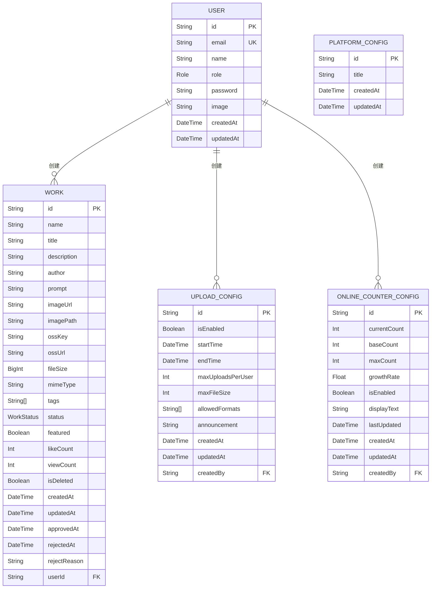

# 数据库设计

<cite>
**本文档引用的文件**
- [schema.prisma](file://prisma/schema.prisma)
- [seed.ts](file://prisma/seed.ts)
- [20250831084947_add_featured_field/migration.sql](file://prisma/migrations/20250831084947_add_featured_field/migration.sql)
- [20250905143157_add_online_counter_config/migration.sql](file://prisma/migrations/20250905143157_add_online_counter_config/migration.sql)
- [20250905150839_add_platform_config/migration.sql](file://prisma/migrations/20250905150839_add_platform_config/migration.sql)
- [20250917050212_add_missing_fields/migration.sql](file://prisma/migrations/20250917050212_add_missing_fields/migration.sql)
</cite>

## 目录
1. [引言](#引言)
2. [核心数据模型](#核心数据模型)
3. [实体关系图（ER图）](#实体关系图er图)
4. [数据模型变更与迁移机制](#数据模型变更与迁移机制)
5. [种子数据与初始化流程](#种子数据与初始化流程)
6. [索引策略与查询优化](#索引策略与查询优化)
7. [业务规则与约束](#业务规则与约束)
8. [数据模型变更操作指引](#数据模型变更操作指引)

## 引言
本文档详细描述了数字化作品互动展示平台的数据库设计，基于Prisma ORM的schema.prisma文件。文档涵盖了核心数据实体（User、Work、PlatformConfig、OnlineCounterConfig）的结构、字段定义、数据类型、约束条件、实体间关系以及相关的业务规则。同时，文档解释了数据迁移机制、种子数据初始化流程、索引策略和数据模型变更的操作指引，为开发和维护提供全面的参考。

## 核心数据模型
本节详细描述了数据库中的核心数据模型，包括User（用户）、Work（作品）、PlatformConfig（平台配置）和OnlineCounterConfig（在线计数配置）。

### User（用户）模型
用户模型是系统的基础，用于存储注册用户的信息。

**字段定义：**
- `id` (String): 用户唯一标识符，使用cuid()函数生成，默认为主键。
- `email` (String): 用户邮箱，具有唯一性约束(@unique)，用于登录和身份识别。
- `name` (String?): 用户真实姓名，可选字段。
- `role` (Role): 用户角色，枚举类型，默认值为USER。角色分为USER（普通用户）和ADMIN（管理员）。
- `password` (String?): 用户密码，存储加密后的哈希值。
- `image` (String?): 用户头像的URL。
- `createdAt` (DateTime): 记录创建时间，默认值为当前时间(now())。
- `updatedAt` (DateTime): 记录最后更新时间，由Prisma自动维护。

**关联关系：**
- 一个用户可以创建多个作品（`works`），与Work模型形成一对多关系。
- 一个用户可以创建多个上传配置（`uploadConfigs`），与UploadConfig模型形成一对多关系。
- 一个用户可以创建多个在线计数配置（`onlineCounterConfigs`），与OnlineCounterConfig模型形成一对多关系。

**Section sources**
- [schema.prisma](file://prisma/schema.prisma#L20-L37)

### Work（作品）模型
作品模型用于存储用户上传的数字化作品信息。

**字段定义：**
- `id` (String): 作品唯一标识符，使用cuid()函数生成，默认为主键。
- `name` (String): 作品名称。
- `title` (String): 作品简述。
- `description` (String?): 作品详细描述，可选字段。
- `author` (String): 作者名。
- `prompt` (String?): AI生成提示词，可选字段。
- `imageUrl` (String): 作品图片的URL。
- `imagePath` (String?): OSS文件路径/键名，可选字段。
- `ossKey` (String?): OSS文件键名，可选字段。
- `ossUrl` (String?): OSS完整访问URL，可选字段。
- `fileSize` (BigInt?): 文件大小（字节），可选字段。
- `mimeType` (String?): 文件MIME类型，可选字段。
- `tags` (String[]): 标签数组，用于作品分类和搜索，默认为空数组。
- `status` (WorkStatus): 作品审核状态，枚举类型，默认值为PENDING（待审核）。状态包括PENDING（待审核）、APPROVED（已通过）、REJECTED（已拒绝）。
- `featured` (Boolean): 精选标记，布尔类型，默认值为false。
- `likeCount` (Int): 点赞数，整数类型，默认值为0。
- `viewCount` (Int): 浏览数，整数类型，默认值为0。
- `isDeleted` (Boolean): 软删除标记，布尔类型，默认值为false。
- `createdAt` (DateTime): 作品创建时间，默认值为当前时间(now())。
- `updatedAt` (DateTime): 作品最后更新时间，由Prisma自动维护。
- `approvedAt` (DateTime?): 审核通过时间，可选字段。
- `rejectedAt` (DateTime?): 审核拒绝时间，可选字段。
- `rejectReason` (String?): 拒绝原因，可选字段。

**关联关系：**
- 一个作品由一个用户创建（`user`），与User模型形成多对一关系。`userId`为外键，当用户被删除时，该字段设为NULL（onDelete: SetNull）。

**Section sources**
- [schema.prisma](file://prisma/schema.prisma#L101-L144)

### PlatformConfig（平台配置）模型
平台配置模型用于存储平台级别的全局配置信息。

**字段定义：**
- `id` (String): 配置唯一标识符，使用cuid()函数生成，默认为主键。
- `title` (String): 平台主标题，字符串类型，默认值为"Qoder和通义灵码 AI Coding 作品秀"。
- `createdAt` (DateTime): 配置创建时间，默认值为当前时间(now())。
- `updatedAt` (DateTime): 配置最后更新时间，由Prisma自动维护。

**Section sources**
- [schema.prisma](file://prisma/schema.prisma#L203-L210)

### OnlineCounterConfig（在线计数配置）模型
在线计数配置模型用于管理在线人数计数器的显示和行为。

**字段定义：**
- `id` (String): 配置唯一标识符，使用cuid()函数生成，默认为主键。
- `currentCount` (Int): 当前显示的人数，整数类型，默认值为1075。
- `baseCount` (Int): 基础人数，整数类型，默认值为1000。
- `maxCount` (Int): 最大人数上限，整数类型，默认值为2000。
- `growthRate` (Float): 增长速率（每分钟增长人数），浮点数类型，默认值为0.5。
- `isEnabled` (Boolean): 功能开关，布尔类型，默认值为true。
- `displayText` (String): 显示文本，字符串类型，默认值为"人正在云栖大会创作"。
- `lastUpdated` (DateTime): 最后更新时间，默认值为当前时间(now())。
- `createdAt` (DateTime): 配置创建时间，默认值为当前时间(now())。
- `updatedAt` (DateTime): 配置最后更新时间，由Prisma自动维护。

**关联关系：**
- 一个配置由一个用户创建（`creator`），与User模型形成多对一关系。`createdBy`为外键，当用户被删除时，该字段设为NULL（onDelete: SetNull）。

**Section sources**
- [schema.prisma](file://prisma/schema.prisma#L175-L193)

## 实体关系图（ER图）
以下ER图可视化展示了数据库中各表之间的关联关系。



**Diagram sources**
- [schema.prisma](file://prisma/schema.prisma#L20-L210)

## 数据模型变更与迁移机制
数据库模式的变更通过Prisma的迁移（Migration）功能进行管理，确保变更过程安全、可追溯。

### 迁移流程
1.  **修改Schema**: 开发者首先在`prisma/schema.prisma`文件中修改数据模型（例如，添加新字段、修改类型或添加新模型）。
2.  **生成迁移文件**: 执行命令`npx prisma migrate dev --name <migration-name>`。Prisma会对比当前的schema与数据库的实际状态，自动生成一个SQL迁移文件，并将其存放在`prisma/migrations`目录下。
3.  **应用迁移**: Prisma会自动将生成的SQL语句应用到数据库中，更新表结构。
4.  **更新客户端**: 迁移成功后，Prisma Client会自动重新生成，以反映最新的数据模型。

### 迁移文件示例
- **`20250831084947_add_featured_field`**: 此迁移文件为`works`表添加了`featured`布尔字段，并设置了默认值为false。这对应于在Work模型中添加`featured Boolean @default(false)`的变更。
- **`20250905143157_add_online_counter_config`**: 此迁移文件创建了新的`online_counter_configs`表，用于存储在线计数器的配置。
- **`20250905150839_add_platform_config`**: 此迁移文件创建了新的`platform_configs`表，用于存储平台标题等全局配置。
- **`20250917050212_add_missing_fields`**: 此迁移文件为`works`表添加了`fileSize`, `imagePath`, `mimeType`, `ossKey`, `ossUrl`, `tags`等缺失的字段，以完善作品信息。

**Section sources**
- [schema.prisma](file://prisma/schema.prisma)
- [20250831084947_add_featured_field/migration.sql](file://prisma/migrations/20250831084947_add_featured_field/migration.sql)
- [20250905143157_add_online_counter_config/migration.sql](file://prisma/migrations/20250905143157_add_online_counter_config/migration.sql)
- [20250905150839_add_platform_config/migration.sql](file://prisma/migrations/20250905150839_add_platform_config/migration.sql)
- [20250917050212_add_missing_fields/migration.sql](file://prisma/migrations/20250917050212_add_missing_fields/migration.sql)

## 种子数据与初始化流程
种子数据（Seed Data）用于在开发和测试环境中初始化数据库，填充基础的用户和作品数据。

### 种子数据结构
种子数据定义在`prisma/seed.ts`文件中，主要包含：
1.  **用户数据**: 创建了10个测试用户，包括2个管理员（admin@yunqi.com, admin2@yunqi.com）和8个普通用户（如user1@yunqi.com, artist1@yunqi.com等）。所有用户的密码均为`123456`（在代码中通过bcrypt加密后存储）。
2.  **作品数据**: 
    -   创建了5个详细的作品，包括已通过、待审核和已拒绝状态的作品。
    -   批量创建了最多50个作品，这些作品的图片路径、作者、标题等信息通过模板和随机算法生成，状态按70%通过、20%待审核、10%拒绝的权重随机分配。

### 初始化流程
1.  **清理（可选）**: 脚本中注释了清理现有数据的代码，通常在初始化前会手动取消注释以清空数据库。
2.  **创建用户**: 脚本遍历用户数组，使用`prisma.user.upsert()`方法创建或更新用户。`upsert`操作会检查邮箱是否已存在，如果存在则更新，否则创建新用户。
3.  **创建作品**: 脚本首先创建5个详细作品，然后循环创建批量作品。在创建前会检查作品名称是否已存在，避免重复。
4.  **统计与输出**: 初始化完成后，脚本会输出统计信息，包括用户总数、作品总数、各状态作品数量以及测试账号的登录信息。

**Section sources**
- [seed.ts](file://prisma/seed.ts)

## 索引策略与查询优化
为了优化数据库查询性能，系统在关键字段上建立了索引。

### 索引定义
- **唯一索引 (Unique Index)**:
  - `users.email`: 在用户邮箱上建立唯一索引，确保邮箱的唯一性，并加速基于邮箱的查询（如登录验证）。
  - `accounts.provider` 和 `accounts.providerAccountId`: 在账户表的provider和providerAccountId上建立联合唯一索引，确保一个用户在同一个第三方平台只能有一个账户。
  - `sessions.sessionToken`: 在会话令牌上建立唯一索引，确保令牌的唯一性。
- **普通索引 (Index)**:
  - `works.createdAt`: 虽然schema中未显式声明，但根据业务需求（如按时间排序展示最新作品），应在`works`表的`createdAt`字段上建立索引，以优化按创建时间排序的查询性能。

**Section sources**
- [schema.prisma](file://prisma/schema.prisma)
- [20250831084947_add_featured_field/migration.sql](file://prisma/migrations/20250831084947_add_featured_field/migration.sql)

## 业务规则与约束
数据模型的设计体现了以下核心业务规则：

1.  **用户角色与权限**: 用户分为普通用户和管理员。管理员拥有审核作品、管理配置等高级权限。
2.  **作品审核流程**: 所有上传的作品默认处于`PENDING`（待审核）状态。只有经过管理员审核通过后，状态才会变为`APPROVED`（已通过），才能在前台展示。审核拒绝的作品状态为`REJECTED`（已拒绝）。
3.  **精选作品规则**: `featured`字段用于标记精选作品。根据业务逻辑，只有状态为`APPROVED`（已通过）的作品才能被标记为精选。此规则应在应用层（如API路由）进行强制校验。
4.  **数据完整性**: 通过`@unique`约束保证邮箱的唯一性；通过`@default`约束为`createdAt`、`updatedAt`、`status`、`likeCount`等字段提供默认值，确保数据的一致性。
5.  **软删除**: `isDeleted`字段作为软删除标记，允许逻辑上删除作品而不从数据库中物理移除，便于数据恢复和审计。

**Section sources**
- [schema.prisma](file://prisma/schema.prisma)
- [seed.ts](file://prisma/seed.ts)

## 数据模型变更操作指引
当需要修改数据模型时，请遵循以下步骤：

1.  **编辑Schema**: 在`prisma/schema.prisma`文件中进行所需的修改（如添加字段、修改类型、新增模型）。
2.  **生成并应用迁移**:
    ```bash
    npx prisma migrate dev --name <descriptive-name-for-change>
    ```
    例如，如果要为User模型添加手机号字段，可以执行：
    ```bash
    npx prisma migrate dev --name add_phone_to_user
    ```
3.  **验证迁移**: 检查生成的SQL迁移文件（位于`prisma/migrations`目录）是否符合预期。
4.  **重新生成Prisma Client**: 迁移成功后，Prisma Client会自动更新。如果未自动更新，可手动