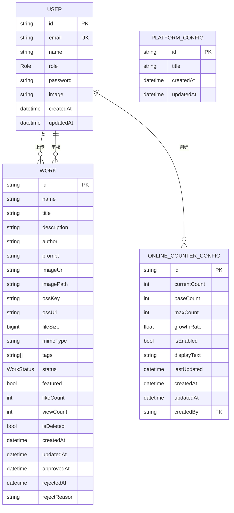

# 数据库设计

<cite>
**本文档引用的文件**  
- [schema.prisma](file://prisma/schema.prisma)
- [seed.ts](file://prisma/seed.ts)
- [20250831084947_add_featured_field/migration.sql](file://prisma/migrations/20250831084947_add_featured_field/migration.sql)
- [20250905143157_add_online_counter_config/migration.sql](file://prisma/migrations/20250905143157_add_online_counter_config/migration.sql)
- [20250905150839_add_platform_config/migration.sql](file://prisma/migrations/20250905150839_add_platform_config/migration.sql)
- [20250917050212_add_missing_fields/migration.sql](file://prisma/migrations/20250917050212_add_missing_fields/migration.sql)
- [init-online-counter.ts](file://src/lib/init-online-counter.ts)
- [OnlineCounterManagement.tsx](file://src/components/admin/OnlineCounterManagement.tsx)
- [PlatformConfigManagement.tsx](file://src/components/admin/PlatformConfigManagement.tsx)
</cite>

## 目录
1. [核心数据模型](#核心数据模型)
2. [数据库迁移历史](#数据库迁移历史)
3. [种子数据说明](#种子数据说明)
4. [实体关系图（ER图）](#实体关系图（er图）)
5. [设计权衡与策略](#设计权衡与策略)

## 核心数据模型

本系统的核心数据模型定义在 `prisma/schema.prisma` 文件中，主要包括 `User`（用户）、`Work`（作品）、`PlatformConfig`（平台配置）和 `OnlineCounterConfig`（在线人数配置）四个核心模型。

### User（用户）模型
用户模型是系统的基础，用于管理平台的注册用户和管理员。

**字段说明：**
- `id`: 字符串类型，主键，使用 `cuid()` 生成唯一标识。
- `email`: 字符串类型，唯一索引，用于用户登录和身份识别。
- `name`: 字符串类型，可选，存储用户的真实姓名或昵称。
- `role`: 枚举类型（`Role`），默认值为 `USER`，用于区分普通用户和管理员。
- `password`: 字符串类型，存储经过哈希处理的密码。
- `image`: 字符串类型，可选，存储用户头像的URL。
- `createdAt`, `updatedAt`: 日期时间类型，分别记录用户创建和最后更新时间。

**关系：**
- 一个用户可以拥有多个作品（`works`），形成一对多关系。
- 用户与上传配置（`uploadConfigs`）和在线人数配置（`onlineCounterConfigs`）也存在一对多关系，通过 `@relation` 指定关系名称。

**Section sources**
- [schema.prisma](file://prisma/schema.prisma#L20-L41)

### Work（作品）模型
作品模型是系统的核心，用于存储和管理用户上传的数字化作品。

**字段说明：**
- `id`, `name`, `title`, `author`, `imageUrl`: 基础信息字段，分别存储作品的ID、名称、简述、作者名和图片URL。
- `description`, `prompt`: 可选文本字段，用于存储作品的详细描述和AI生成提示词。
- `status`: 枚举类型（`WorkStatus`），默认值为 `PENDING`，表示作品的审核状态（待审核、已通过、已拒绝）。
- `featured`: 布尔类型，布尔类型，`@default(false)`，表示作品是否被标记为精选。
- `likeCount`, `viewCount`: 整数类型，分别记录作品的点赞数和浏览数，初始值为0。
- `isDeleted`: 布尔类型，布尔类型，`@default(false)`，作为软删除标记，避免物理删除数据。
- `createdAt`, `updatedAt`, `approvedAt`, `rejectedAt`: 时间戳字段，用于记录作品的创建、更新、审核通过和拒绝时间。
- `rejectReason`: 字符串类型，可选，存储作品被拒绝的原因。

**新增字段（20250917迁移）：**
- `fileSize`: 长整型（`BigInt`），可选，存储文件大小（字节）。
- `imagePath`, `ossKey`, `ossUrl`: 字符串类型，可选，用于存储OSS（对象存储服务）相关的路径和URL。
- `tags`: 字符串数组，`@default([])`，用于存储作品的标签。

**关系：**
- 一个作品属于一个用户（`user`），通过 `userId` 外键关联，删除用户时，作品的 `userId` 被设为 `NULL`（`ON DELETE SET NULL`）。

**Section sources**
- [schema.prisma](file://prisma/schema.prisma#L104-L137)
- [20250917050212_add_missing_fields/migration.sql](file://prisma/migrations/20250917050212_add_missing_fields/migration.sql#L0-L7)

### PlatformConfig（平台配置）模型
平台配置模型用于存储平台的全局设置，目前仅包含主标题。

**字段说明：**
- `id`: 字符串类型，主键。
- `title`: 字符串类型，`@default("Qoder和通义灵码 AI Coding 作品秀")`，存储平台的主标题。
- `createdAt`, `updatedAt`: 时间戳字段。

**关系：**
- 该模型与 `User` 模型无直接关联，但其配置的修改由管理员用户通过API完成。

**Section sources**
- [schema.prisma](file://prisma/schema.prisma#L198-L205)
- [20250905150839_add_platform_config/migration.sql](file://prisma/migrations/20250905150839_add_platform_config/migration.sql#L0-L8)

### OnlineCounterConfig（在线人数配置）模型
在线人数配置模型用于动态管理前端展示的“在线创作人数”功能。

**字段说明：**
- `currentCount`: 整数类型，`@default(1075)`，当前显示的在线人数。
- `baseCount`: 整数类型，`@default(1000)`，基础人数，用于重置或初始化。
- `maxCount`: 整数类型，`@default(2000)`，最大人数上限。
- `growthRate`: 浮点类型，`@default(0.5)`，每分钟增长的人数（可为小数，实现平滑增长）。
- `isEnabled`: 布尔类型，`@default(true)`，控制该功能是否启用。
- `displayText`: 字符串类型，`@default("人正在云栖大会创作")`，与人数拼接后显示的文本。
- `lastUpdated`: 日期时间类型，`@default(now())`，记录最后一次更新时间，用于计算增长。
- `createdBy`: 字符串类型，可选，外键，关联创建此配置的管理员用户ID。

**关系：**
- 一个配置由一个用户（`creator`）创建，形成多对一关系。

**Section sources**
- [schema.prisma](file://prisma/schema.prisma#L177-L196)
- [20250905143157_add_online_counter_config/migration.sql](file://prisma/migrations/20250905143157_add_online_counter_config/migration.sql#L0-L18)

## 数据库迁移历史

数据库的变更历史通过Prisma的迁移系统（`prisma/migrations/` 目录）进行管理，确保了数据库结构的版本化和可追溯性。

### 20250831084947_add_featured_field
这是项目的初始迁移，创建了所有基础表和枚举类型。
- **创建了枚举**：`Role` (USER, ADMIN) 和 `WorkStatus` (PENDING, APPROVED, REJECTED)。
- **创建了表**：`users`, `accounts`, `sessions`, `verificationtokens`, `works`, `upload_configs`。
- **关键操作**：为 `works` 表添加了 `featured` 字段（`BOOLEAN NOT NULL DEFAULT false`），并建立了所有必要的外键约束和唯一索引。

**Section sources**
- [20250831084947_add_featured_field/migration.sql](file://prisma/migrations/20250831084947_add_featured_field/migration.sql#L0-L122)

### 20250905143157_add_online_counter_config
此迁移添加了在线人数配置功能。
- **创建了表**：`online_counter_configs`，包含了所有配置项。
- **关键操作**：添加了 `createdBy` 外键，使其与 `users` 表关联，实现了配置创建者的追溯。

**Section sources**
- [20250905143157_add_online_counter_config/migration.sql](file://prisma/migrations/20250905143157_add_online_counter_config/migration.sql#L0-L18)

### 20250905150839_add_platform_config
此迁移添加了平台配置功能。
- **创建了表**：`platform_configs`，用于存储平台的全局设置。
- **关键操作**：仅包含 `id`, `title`, `createdAt`, `updatedAt` 四个字段，结构简单。

**Section sources**
- [20250905150839_add_platform_config/migration.sql](file://prisma/migrations/20250905150839_add_platform_config/migration.sql#L0-L8)

### 20250917050212_add_missing_fields
此迁移为 `works` 表添加了缺失的字段，以支持更丰富的功能。
- **修改了表**：`works`。
- **关键操作**：使用 `ALTER TABLE` 语句添加了 `fileSize`, `imagePath`, `mimeType`, `ossKey`, `ossUrl`, `tags` 六个新字段，其中 `tags` 被定义为字符串数组。

**Section sources**
- [20250917050212_add_missing_fields/migration.sql](file://prisma/migrations/20250917050212_add_missing_fields/migration.sql#L0-L7)

## 种子数据说明

种子数据文件 `prisma/seed.ts` 用于在开发和测试环境中初始化数据库，填充示例数据，以便快速验证功能。

### 内容
1.  **创建测试用户**：脚本会创建10个用户，包括2名管理员（`admin@yunqi.com`, `admin2@yunqi.com`）和8名普通用户（如 `user1@yunqi.com`, `artist1@yunqi.com`）。所有用户的密码均为 `123456`（在存入数据库前已使用 `bcryptjs` 进行哈希处理）。
2.  **创建详细作品**：脚本会创建5个详细的作品，包括已通过、待审核和已拒绝状态的作品，并设置了相应的 `approvedAt`, `rejectedAt` 和 `rejectReason`。
3.  **批量创建作品**：为了模拟真实环境，脚本会批量创建最多50个作品（从第6个开始），使用随机的作者、标题、描述等，并根据权重（70%通过，20%待审核，10%拒绝）随机分配状态和统计数据（点赞数、浏览数）。
4.  **统计输出**：脚本最后会输出数据库中用户和作品的统计信息，并打印出测试账号的登录信息。

### 用途
- **开发**：开发者在本地启动项目时，可以运行 `npx prisma db seed` 来填充数据，无需手动创建，极大提高了开发效率。
- **测试**：为前端和后端的自动化测试提供了稳定、可预测的数据环境。
- **演示**：在向客户或团队成员演示时，可以直接展示一个包含丰富内容的系统，而无需手动上传。

**Section sources**
- [seed.ts](file://prisma/seed.ts#L0-L318)

## 实体关系图（ER图）

**Diagram sources**
- [schema.prisma](file://prisma/schema.prisma#L20-L205)

## 设计权衡与策略

### 字段命名规范
- **驼峰命名法（CamelCase）**：在Prisma Schema中，所有字段均采用驼峰命名法（如 `createdAt`, `likeCount`），这与TypeScript的命名习惯保持一致。
- **数据库映射**：通过 `@@map` 指令，将Prisma中的驼峰命名映射到数据库中的蛇形命名（如 `users`, `works`），这符合PostgreSQL等关系型数据库的常见命名规范，提高了数据库的可读性。

### 索引策略
- **主键（Primary Key）**：每个模型都通过 `@id` 定义了主键，确保了数据的唯一性。
- **唯一索引（Unique Index）**：对 `User.email` 和 `Session.sessionToken` 等需要保证全局唯一的字段，使用 `@unique` 创建了唯一索引，防止重复数据。
- **外键约束（Foreign Key Constraint）**：所有关联关系都通过 `@relation` 和 `AddForeignKey` 语句建立了外键约束，保证了数据的引用完整性。例如，当删除一个用户时，其创建的在线人数配置的 `createdBy` 字段会被设为 `NULL`（`ON DELETE SET NULL`），避免了数据孤岛。

### 扩展性设计
- **枚举类型（Enum）**：使用 `enum` 定义 `Role` 和 `WorkStatus`，使得状态管理更加清晰和类型安全，未来添加新角色或状态时只需修改枚举，易于维护。
- **软删除（Soft Delete）**：`Work` 模型中的 `isDeleted` 字段实现了软删除功能。当需要删除作品时，只需将其标记为 `true`，而不会从数据库中物理移除数据。这有利于数据恢复和审计。
- **预留字段**：`Work` 模型中的 `tags` 字符串数组为未来的内容分类和搜索功能预留了空间。`PlatformConfig` 模型结构简单，未来可以轻松添加更多配置项（如主题、公告等）。
- **配置中心化**：将 `OnlineCounterConfig` 和 `PlatformConfig` 独立成表，而不是硬编码在代码中，使得这些可变的业务参数可以通过管理后台动态调整，极大地提升了系统的灵活性和可运营性。

**Section sources**
- [schema.prisma](file://prisma/schema.prisma#L1-L205)
- [init-online-counter.ts](file://src/lib/init-online-counter.ts#L0-L52)
- [OnlineCounterManagement.tsx](file://src/components/admin/OnlineCounterManagement.tsx#L5-L16)
- [PlatformConfigManagement.tsx](file://src/components/admin/PlatformConfigManagement.tsx#L5-L9)