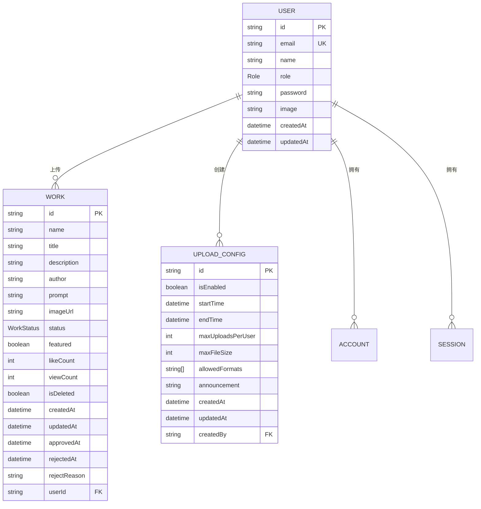
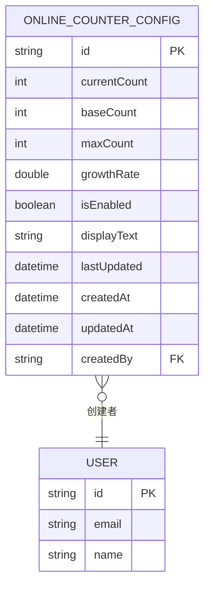
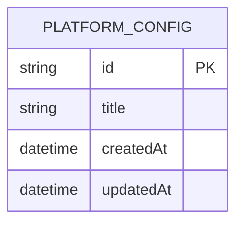
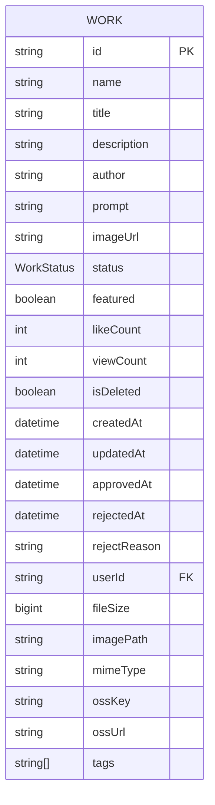

# 数据库迁移

<cite>
**本文档引用的文件**
- [20250831084947_add_featured_field/migration.sql](file://prisma/migrations/20250831084947_add_featured_field/migration.sql)
- [20250905143157_add_online_counter_config/migration.sql](file://prisma/migrations/20250905143157_add_online_counter_config/migration.sql)
- [20250905150839_add_platform_config/migration.sql](file://prisma/migrations/20250905150839_add_platform_config/migration.sql)
- [20250917050212_add_missing_fields/migration.sql](file://prisma/migrations/20250917050212_add_missing_fields/migration.sql)
- [seed.ts](file://prisma/seed.ts)
- [migration_lock.toml](file://prisma/migrations/migration_lock.toml)
</cite>

## 目录
1. [引言](#引言)
2. [数据库迁移机制概述](#数据库迁移机制概述)
3. [迁移版本历史分析](#迁移版本历史分析)
4. [种子数据脚本分析](#种子数据脚本分析)
5. [迁移操作标准流程](#迁移操作标准流程)
6. [常见问题与解决方案](#常见问题与解决方案)
7. [生产环境迁移最佳实践](#生产环境迁移最佳实践)
8. [结论](#结论)

## 引言
本文档全面记录了数字化作品互动展示平台的数据库迁移机制与历史变更。通过分析Prisma迁移目录下的各个版本，详细说明每次迁移的业务背景、变更内容及执行逻辑。同时，文档还介绍了种子数据脚本的作用和使用方法，提供了迁移操作的标准流程和生产环境的最佳实践，为开发团队和运维人员提供完整的数据库管理指南。

## 数据库迁移机制概述
本项目采用Prisma ORM框架进行数据库管理，通过迁移文件实现数据库模式的版本控制。迁移机制的核心是将数据库模式变更以可重复执行的SQL脚本形式进行管理，确保开发、测试和生产环境之间的一致性。

迁移文件存储在`prisma/migrations/`目录下，每个迁移版本都有唯一的名称和时间戳前缀，如`20250831084947_add_featured_field`。迁移锁文件`migration_lock.toml`用于确保迁移操作的原子性和一致性，防止并发迁移导致的冲突。

Prisma迁移机制提供了以下优势：
- **版本控制**：每个迁移都是数据库模式的版本快照，可追溯历史变更
- **可重复性**：迁移脚本可在不同环境中重复执行，确保环境一致性
- **自动化**：通过命令行工具自动创建和应用迁移
- **安全性**：在应用迁移前进行安全检查，避免破坏性变更

**Section sources**
- [migration_lock.toml](file://prisma/migrations/migration_lock.toml#L1-L3)

## 迁移版本历史分析

### 20250831084947_add_featured_field 迁移
此迁移版本创建了数据库的初始结构，包括用户、作品、账户等核心表，并引入了`featured`字段支持精选功能。

主要变更内容：
- 创建`Role`和`WorkStatus`枚举类型
- 创建`users`、`accounts`、`sessions`、`verificationtokens`、`works`和`upload_configs`表
- 在`works`表中添加`featured`布尔字段，默认值为`false`
- 建立表间外键关系和唯一索引

业务背景：此迁移为系统初始版本，建立了用户认证、作品管理和上传配置的基础架构。`featured`字段的引入为后续的精选作品展示功能奠定了基础，允许管理员将优质作品标记为精选，在首页进行重点展示。

**Diagram sources**
- [20250831084947_add_featured_field/migration.sql](file://prisma/migrations/20250831084947_add_featured_field/migration.sql#L1-L122)

**Section sources**
- [20250831084947_add_featured_field/migration.sql](file://prisma/migrations/20250831084947_add_featured_field/migration.sql#L1-L122)

### 20250905143157_add_online_counter_config 迁移
此迁移版本增加了在线计数器配置功能，支持动态展示平台活跃用户数。

主要变更内容：
- 创建`online_counter_configs`表，包含计数器的各项配置参数
- 添加`currentCount`、`baseCount`、`maxCount`等字段用于控制计数器行为
- 设置`growthRate`字段控制计数器增长速度
- 添加`displayText`字段自定义显示文本
- 建立与`users`表的外键关系，记录创建者信息

业务背景：随着平台用户数量的增长，需要一个可视化的方式展示平台的活跃度。在线计数器功能通过模拟真实用户增长，营造平台繁荣的氛围，提升新用户的参与意愿。管理员可以配置计数器的起始值、最大值和增长速率，灵活调整展示效果。

**Diagram sources**
- [20250905143157_add_online_counter_config/migration.sql](file://prisma/migrations/20250905143157_add_online_counter_config/migration.sql#L1-L19)

**Section sources**
- [20250905143157_add_online_counter_config/migration.sql](file://prisma/migrations/20250905143157_add_online_counter_config/migration.sql#L1-L19)

### 20250905150839_add_platform_config 迁移
此迁移版本增加了平台配置功能，支持自定义平台标题等基本信息。

主要变更内容：
- 创建`platform_configs`表，用于存储平台级别的配置信息
- 添加`title`字段存储平台标题
- 设置创建和更新时间戳字段

业务背景：为了提高平台的可配置性和品牌识别度，需要支持自定义平台标题。此功能允许管理员根据不同的活动或场景修改平台名称，如"云栖大会AI作品秀"、"Qoder编程大赛"等，增强平台的灵活性和适应性。

**Diagram sources**
- [20250905150839_add_platform_config/migration.sql](file://prisma/migrations/20250905150839_add_platform_config/migration.sql#L1-L9)

**Section sources**
- [20250905150839_add_platform_config/migration.sql](file://prisma/migrations/20250905150839_add_platform_config/migration.sql#L1-L9)

### 20250917050212_add_missing_fields 迁移
此迁移版本为作品表添加了缺失的字段，完善了作品的元数据信息。

主要变更内容：
- 在`works`表中添加`fileSize`、`imagePath`、`mimeType`、`ossKey`、`ossUrl`和`tags`字段
- `tags`字段使用数组类型，支持为作品添加多个标签

业务背景：随着作品管理功能的深入，发现原有的作品模型缺少一些重要的元数据字段。文件大小、MIME类型等信息对于作品的存储管理和前端展示都很重要。标签功能的引入则支持作品的分类和搜索，提升用户体验。OSS相关字段的添加为作品文件的云存储提供了支持。

**Diagram sources**
- [20250917050212_add_missing_fields/migration.sql](file://prisma/migrations/20250917050212_add_missing_fields/migration.sql#L1-L7)

**Section sources**
- [20250917050212_add_missing_fields/migration.sql](file://prisma/migrations/20250917050212_add_missing_fields/migration.sql#L1-L7)

## 种子数据脚本分析
`seed.ts`脚本是数据库初始化的重要工具，用于在开发和测试环境中快速创建预设数据。

### 脚本功能
- **初始化管理员账户**：创建具有管理员角色的用户账号，用于系统管理
- **创建默认平台配置**：设置平台的基本信息，如标题等
- **生成测试作品数据**：批量创建不同状态（已通过、待审核、已拒绝）的作品，用于功能测试
- **数据统计**：输出初始化后的数据统计信息，便于验证

### 开发环境搭建
在开发环境搭建过程中，种子脚本的使用流程如下：
1. 创建或重置数据库
2. 执行`npx prisma migrate dev`应用所有迁移
3. 运行`npx ts-node prisma/seed.ts`执行种子脚本
4. 验证数据是否正确初始化

### 自动化测试中的使用
在自动化测试中，种子脚本可用于：
- 每次测试前重置数据库状态
- 确保测试环境有一致的初始数据
- 模拟不同场景下的数据状态（如大量待审核作品）
- 测试管理员和普通用户的权限差异

脚本中包含了详细的测试账号信息，方便开发和测试人员快速登录：
- 管理员账号：admin@yunqi.com / 123456
- 普通用户：user1@yunqi.com / 123456
- 艺术家：artist1@yunqi.com / 123456

**Section sources**
- [seed.ts](file://prisma/seed.ts#L1-L318)

## 迁移操作标准流程
### 开发环境迁移流程
1. **修改Prisma Schema**：在`prisma/schema.prisma`中定义新的数据模型
2. **创建迁移**：运行`npx prisma migrate dev --name migration-name`创建新的迁移文件
3. **审查迁移脚本**：检查生成的SQL脚本是否符合预期
4. **应用迁移**：Prisma会自动将迁移应用到数据库
5. **更新种子数据**：如有必要，修改`seed.ts`以包含新模型的测试数据
6. **提交代码**：将迁移文件和相关代码变更提交到版本控制系统

### 团队协作流程
1. **拉取最新代码**：在执行迁移前，确保已获取团队成员的最新变更
2. **检查待应用迁移**：运行`npx prisma migrate status`查看待应用的迁移
3. **应用迁移**：运行`npx prisma migrate dev`应用所有待处理的迁移
4. **解决冲突**：如遇迁移冲突，需与相关开发人员协调解决
5. **验证数据**：检查数据库状态是否符合预期

## 常见问题与解决方案

### 迁移冲突
**问题描述**：当多个开发者同时创建迁移时，可能出现迁移历史分支，导致无法应用迁移。

**解决方案**：
1. 暂停所有开发者的迁移操作
2. 选择一个主迁移分支，将其他分支的变更合并到主分支
3. 手动编辑迁移文件，确保SQL脚本的正确性
4. 更新`migrations_lock.toml`文件
5. 通知所有团队成员拉取最新代码并应用迁移

### 数据丢失风险
**问题描述**：某些迁移操作（如删除字段）可能导致数据丢失。

**预防措施**：
1. 在迁移脚本中添加安全检查
2. 在应用迁移前备份数据库
3. 使用`--create-only`选项先创建迁移文件，审查后再应用
4. 在非生产环境充分测试迁移脚本

### 环境不一致
**问题描述**：开发、测试和生产环境的数据库状态不一致。

**解决方案**：
1. 使用相同的迁移历史
2. 定期同步环境间的迁移状态
3. 使用`prisma migrate status`命令检查各环境状态
4. 建立迁移应用的标准化流程

## 生产环境迁移最佳实践
### 迁移前准备
1. **完整备份**：在应用迁移前，对生产数据库进行完整备份
2. **影响评估**：评估迁移对系统性能和可用性的影响
3. **维护窗口**：选择低峰时段执行迁移操作
4. **回滚计划**：制定详细的回滚方案

### 迁移执行
1. **预演**：在预发布环境执行相同的迁移操作
2. **监控**：迁移过程中密切监控系统性能和错误日志
3. **分步执行**：对于大型迁移，考虑分步执行，减少对系统的影响
4. **验证**：迁移完成后，立即验证关键功能是否正常

### 安全措施
1. **权限控制**：限制生产环境迁移操作的执行权限
2. **审计日志**：记录所有迁移操作的时间、执行人和变更内容
3. **自动化检查**：使用自动化工具检查迁移脚本的安全性
4. **多环境验证**：确保迁移在开发、测试和预发布环境都已成功验证

## 结论
数据库迁移是数字化作品互动展示平台持续发展的重要保障。通过系统化的迁移机制和严格的管理流程，我们能够安全、可靠地演进数据库模式，支持业务功能的快速迭代。种子数据脚本为开发和测试提供了便利，而标准化的迁移流程和最佳实践则确保了生产环境的稳定性和安全性。未来，建议进一步完善迁移的自动化测试和监控体系，提高数据库管理的效率和可靠性。