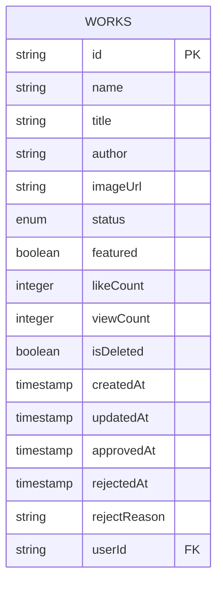
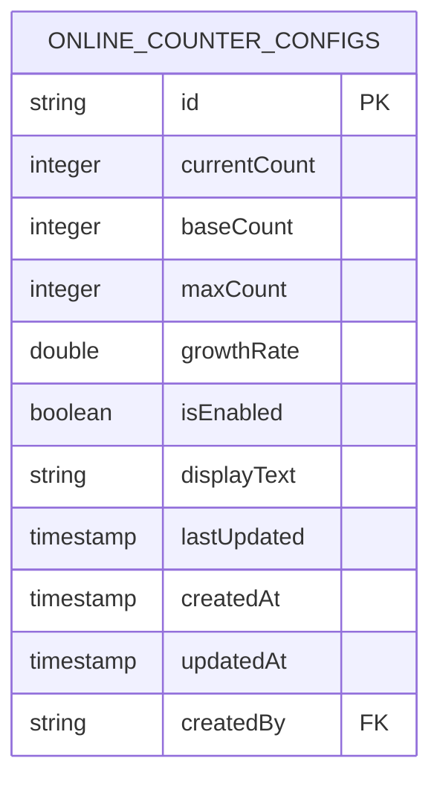
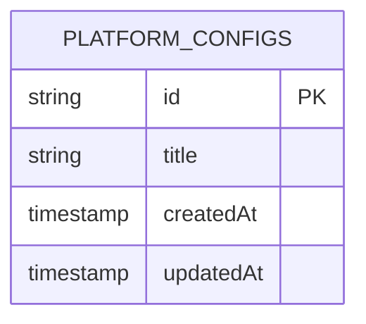
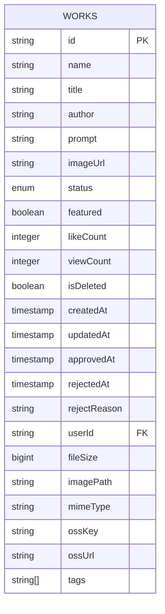
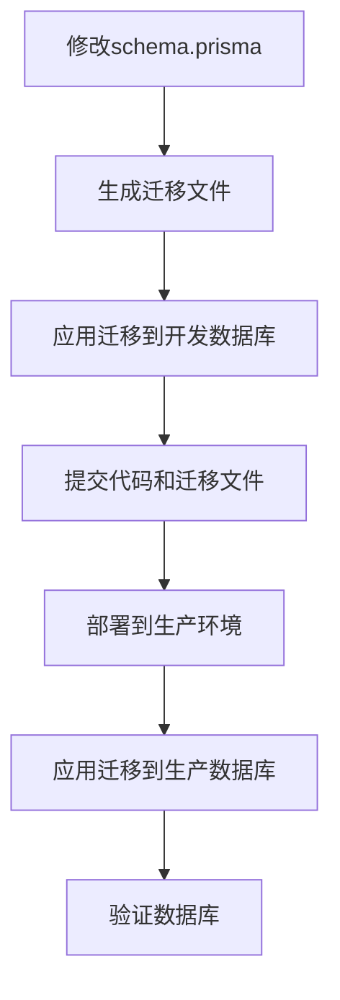

# 数据库迁移管理

<cite>
**本文档引用的文件**  
- [20250831084947_add_featured_field\migration.sql](file://prisma/migrations/20250831084947_add_featured_field/migration.sql)
- [20250905143157_add_online_counter_config\migration.sql](file://prisma/migrations/20250905143157_add_online_counter_config/migration.sql)
- [20250905150839_add_platform_config\migration.sql](file://prisma/migrations/20250905150839_add_platform_config/migration.sql)
- [20250917050212_add_missing_fields\migration.sql](file://prisma/migrations/20250917050212_add_missing_fields/migration.sql)
- [migration_lock.toml](file://prisma/migrations/migration_lock.toml)
- [schema.prisma](file://prisma/schema.prisma)
- [verify-database.ts](file://verify-database.ts)
</cite>

## 目录
1. [引言](#引言)
2. [迁移机制概述](#迁移机制概述)
3. [迁移文件分析](#迁移文件分析)
4. [migration_lock.toml的作用](#migration_locktoml的作用)
5. [迁移版本控制流程](#迁移版本控制流程)
6. [常见问题与解决方案](#常见问题与解决方案)
7. [团队协作最佳实践](#团队协作最佳实践)
8. [结论](#结论)

## 引言
数据库迁移是数字化作品互动展示平台开发过程中的关键环节，确保了数据结构的演进与业务需求的同步。本文档深入讲解基于Prisma的数据库迁移机制，分析迁移文件中的具体变更语句，解释每次迁移所引入的业务功能变化，并阐述迁移版本控制流程及常见问题解决方案。

## 迁移机制概述
Prisma迁移机制通过生成和应用SQL脚本，实现数据库模式的版本控制和演进。每次迁移都包含一个唯一的标识符和描述，确保迁移的可追溯性和一致性。迁移文件存储在`prisma/migrations`目录中，每个迁移文件夹包含一个`migration.sql`文件，记录了具体的数据库变更语句。

## 迁移文件分析

### 添加推荐作品字段
该迁移在`works`表中添加了`featured`字段，支持推荐作品功能。



**图示来源**  
- [20250831084947_add_featured_field\migration.sql](file://prisma/migrations/20250831084947_add_featured_field/migration.sql#L1-L122)

**本节来源**  
- [20250831084947_add_featured_field\migration.sql](file://prisma/migrations/20250831084947_add_featured_field/migration.sql#L1-L122)

### 添加在线计数器配置
该迁移创建了`online_counter_configs`表，支持在线计数器配置功能。



**图示来源**  
- [20250905143157_add_online_counter_config\migration.sql](file://prisma/migrations/20250905143157_add_online_counter_config/migration.sql#L1-L19)

**本节来源**  
- [20250905143157_add_online_counter_config\migration.sql](file://prisma/migrations/20250905143157_add_online_counter_config/migration.sql#L1-L19)

### 添加平台配置
该迁移创建了`platform_configs`表，支持平台配置功能。



**图示来源**  
- [20250905150839_add_platform_config\migration.sql](file://prisma/migrations/20250905150839_add_platform_config/migration.sql#L1-L9)

**本节来源**  
- [20250905150839_add_platform_config\migration.sql](file://prisma/migrations/20250905150839_add_platform_config/migration.sql#L1-L9)

### 添加缺失字段
该迁移在`works`表中添加了多个字段，完善了作品信息。



**图示来源**  
- [20250917050212_add_missing_fields\migration.sql](file://prisma/migrations/20250917050212_add_missing_fields/migration.sql#L1-L7)

**本节来源**  
- [20250917050212_add_missing_fields\migration.sql](file://prisma/migrations/20250917050212_add_missing_fields/migration.sql#L1-L7)

## migration_lock.toml的作用
`migration_lock.toml`文件用于锁定迁移提供程序，确保团队协作中的迁移一致性。该文件包含以下内容：

```toml
# 请勿手动编辑此文件
# 它应被添加到版本控制系统中（如Git）
provider = "postgresql"
```

该文件确保所有开发人员使用相同的数据库提供程序，避免因提供程序不一致导致的迁移问题。

**本节来源**  
- [migration_lock.toml](file://prisma/migrations/migration_lock.toml#L1-L3)

## 迁移版本控制流程
迁移版本控制流程从开发环境生成迁移文件到生产环境应用，确保数据库模式的演进与代码变更同步。

### 开发环境
1. 修改`prisma/schema.prisma`文件，定义新的数据模型。
2. 使用`prisma migrate dev`命令生成迁移文件。
3. 应用迁移到本地数据库，验证变更。

### 生产环境
1. 使用`prisma migrate deploy`命令将迁移应用到生产数据库。
2. 验证数据库模式和数据完整性。



**本节来源**  
- [schema.prisma](file://prisma/schema.prisma)
- [verify-database.ts](file://verify-database.ts)

## 常见问题与解决方案

### 迁移冲突处理
当多个开发人员同时修改数据库模式时，可能产生迁移冲突。解决方案包括：
- 使用`prisma migrate resolve`命令标记已应用的迁移。
- 手动合并迁移文件，确保变更顺序正确。

### 回滚策略
Prisma不支持自动回滚迁移。建议的回滚策略包括：
- 在应用迁移前备份数据库。
- 手动编写回滚脚本，撤销数据库变更。

### 手动修复迁移错误
当迁移失败时，可手动修复错误：
- 检查迁移文件中的SQL语句，修正语法错误。
- 使用数据库管理工具直接修改数据库模式。

**本节来源**  
- [verify-database.ts](file://verify-database.ts)

## 团队协作最佳实践
在团队协作中，编写清晰的迁移描述和避免破坏性变更是确保数据库迁移顺利进行的关键。

### 编写清晰的迁移描述
- 使用有意义的迁移名称，如`add_featured_field`。
- 在迁移文件中添加注释，解释变更的目的和影响。

### 避免破坏性变更
- 避免删除表或字段，使用软删除替代。
- 在添加新字段时，提供默认值，确保现有数据的兼容性。

**本节来源**  
- [schema.prisma](file://prisma/schema.prisma)

## 结论
基于Prisma的数据库迁移机制为数字化作品互动展示平台提供了可靠的数据库版本控制方案。通过分析迁移文件、理解`migration_lock.toml`的作用、遵循迁移版本控制流程和应用最佳实践，团队可以高效地管理数据库模式的演进，确保系统的稳定性和可维护性。