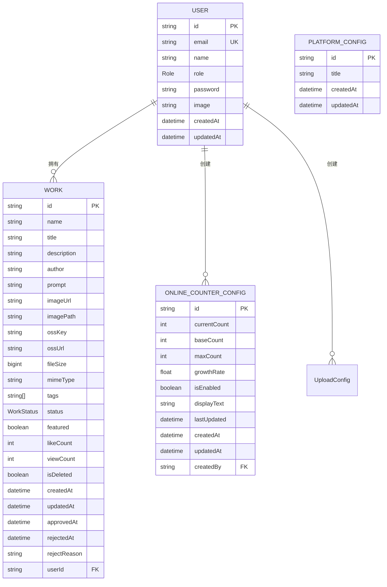

# 数据模型

<cite>
**本文档引用文件**   
- [schema.prisma](file://prisma/schema.prisma)
- [platform-config/route.ts](file://src/app/api/platform-config/route.ts)
- [online-counter/route.ts](file://src/app/api/online-counter/route.ts)
- [admin/online-counter/route.ts](file://src/app/api/admin/online-counter/route.ts)
- [PlatformConfigManagement.tsx](file://src/components/admin/PlatformConfigManagement.tsx)
- [OnlineCounterManagement.tsx](file://src/components/admin/OnlineCounterManagement.tsx)
- [init-online-counter.ts](file://src/lib/init-online-counter.ts)
- [20250905143157_add_online_counter_config/migration.sql](file://prisma/migrations/20250905143157_add_online_counter_config/migration.sql)
- [20250905150839_add_platform_config/migration.sql](file://prisma/migrations/20250905150839_add_platform_config/migration.sql)
</cite>

## 目录
1. [核心实体定义](#核心实体定义)
2. [User实体](#user实体)
3. [Work实体](#work实体)
4. [PlatformConfig实体](#platformconfig实体)
5. [OnlineCounterConfig实体](#onlinecounterconfig实体)
6. [实体关系说明](#实体关系说明)
7. [字段命名规范与业务语义](#字段命名规范与业务语义)
8. [实体关系图（ER Diagram）](#实体关系图er-diagram)
9. [业务用途与访问模式](#业务用途与访问模式)
10. [Prisma Schema对TypeScript类型生成的影响](#prisma-schema对typescript类型生成的影响)

## 核心实体定义

本文档详细描述基于 `prisma/schema.prisma` 文件定义的四个核心数据模型：User、Work、PlatformConfig 和 OnlineCounterConfig。这些实体构成了数字化作品互动展示平台的数据基础，分别用于管理用户信息、作品数据、平台全局配置和在线人数模拟功能。

**本文档引用文件**   
- [schema.prisma](file://prisma/schema.prisma)

## User实体

`User` 模型代表系统中的用户，是权限管理和作品归属的核心。

- **字段定义与数据类型**:
  - `id`: String，主键，使用 `cuid()` 生成唯一标识
  - `email`: String，用户邮箱，通过 `@unique` 约束保证唯一性
  - `name`: String?，用户姓名，可为空
  - `role`: Role，用户角色，枚举类型，默认值为 `USER`
  - `password`: String?，密码哈希值，可为空（支持第三方登录）
  - `image`: String?，用户头像URL，可为空
  - `createdAt`: DateTime，创建时间，默认值为当前时间
  - `updatedAt`: DateTime，更新时间，由Prisma自动维护

- **索引与约束**:
  - 主键约束：`id` 字段
  - 唯一性约束：`email` 字段
  - 数据库表映射：`@@map("users")`

- **关联关系**:
  - 一对多关联：一个用户可以拥有多个 `Work`（作品）
  - 一对多关联：一个用户可以创建多个 `UploadConfig`（上传配置）
  - 一对多关联：一个用户可以创建多个 `OnlineCounterConfig`（在线人数配置）
  - 与NextAuth相关联：`accounts`、`sessions`、`verificationtokens`

**本文档引用文件**   
- [schema.prisma](file://prisma/schema.prisma#L18-L39)

## Work实体

`Work` 模型代表用户上传的数字化作品，是平台的核心业务数据。

- **字段定义与数据类型**:
  - `id`: String，主键，使用 `cuid()` 生成
  - `name`: String，作品名称
  - `title`: String，作品简述
  - `description`: String?，作品详细描述，可为空
  - `author`: String，作者名
  - `prompt`: String?，AI生成提示词，可为空
  - `imageUrl`: String，作品图片的URL
  - `imagePath`: String?，OSS文件路径，可为空
  - `ossKey`: String?，OSS文件键名，可为空
  - `ossUrl`: String?，OSS完整访问URL，可为空
  - `fileSize`: BigInt?，文件大小（字节），可为空
  - `mimeType`: String?，文件MIME类型，可为空
  - `tags`: String[]，标签数组，默认为空数组
  - `status`: WorkStatus，审核状态，枚举类型，默认为 `PENDING`
  - `featured`: Boolean，精选标记，布尔值，默认为 `false`
  - `likeCount`: Int，点赞数，整数，默认为 `0`
  - `viewCount`: Int，浏览数，整数，默认为 `0`
  - `isDeleted`: Boolean，软删除标记，布尔值，默认为 `false`
  - `createdAt`: DateTime，创建时间，默认为当前时间
  - `updatedAt`: DateTime，更新时间，自动更新
  - `approvedAt`: DateTime?，审核通过时间，可为空
  - `rejectedAt`: DateTime?，审核拒绝时间，可为空
  - `rejectReason`: String?，拒绝原因，可为空
  - `userId`: String?，外键，关联用户ID，可为空

- **索引与约束**:
  - 主键约束：`id` 字段
  - 外键约束：`userId` 字段引用 `User` 模型的 `id`
  - 数据库表映射：`@@map("works")`

- **业务语义**:
  - `featured` 字段表示该作品是否为精选作品，用于在前端进行特殊展示。
  - `status` 字段的枚举值 `PENDING`、`APPROVED`、`REJECTED` 分别代表待审核、已通过、已拒绝三种状态。
  - `isDeleted` 实现软删除，避免数据物理删除。

**本文档引用文件**   
- [schema.prisma](file://prisma/schema.prisma#L105-L144)

## PlatformConfig实体

`PlatformConfig` 模型用于存储平台的全局配置信息，目前主要管理平台主标题。

- **字段定义与数据类型**:
  - `id`: String，主键，使用 `cuid()` 生成
  - `title`: String，平台主标题，默认值为 "Qoder和通义灵码 AI Coding 作品秀"
  - `createdAt`: DateTime，创建时间，默认为当前时间
  - `updatedAt`: DateTime，更新时间，自动更新

- **索引与约束**:
  - 主键约束：`id` 字段
  - 数据库表映射：`@@map("platform_configs")`

- **业务用途**:
  - 该模型与系统全局配置关联，通过API接口 `/api/platform-config` 进行读取和更新。
  - 管理员可以在后台管理界面修改平台标题，修改后前端Header组件会实时更新显示。

**本文档引用文件**   
- [schema.prisma](file://prisma/schema.prisma#L178-L185)
- [platform-config/route.ts](file://src/app/api/platform-config/route.ts)
- [PlatformConfigManagement.tsx](file://src/components/admin/PlatformConfigManagement.tsx)

## OnlineCounterConfig实体

`OnlineCounterConfig` 模型用于配置和管理在线人数模拟功能。

- **字段定义与数据类型**:
  - `id`: String，主键，使用 `cuid()` 生成
  - `currentCount`: Int，当前显示人数，默认值为 `1075`
  - `baseCount`: Int，基础人数，默认值为 `1000`
  - `maxCount`: Int，最大人数，默认值为 `2000`
  - `growthRate`: Float，增长速率（每分钟增长人数），默认值为 `0.5`
  - `isEnabled`: Boolean，功能开关，默认值为 `true`
  - `displayText`: String，显示文本，默认值为 "人正在云栖大会创作"
  - `lastUpdated`: DateTime，最后更新时间，默认为当前时间
  - `createdAt`: DateTime，创建时间，默认为当前时间
  - `updatedAt`: DateTime，更新时间，自动更新
  - `createdBy`: String?，创建者ID，外键，可为空

- **索引与约束**:
  - 主键约束：`id` 字段
  - 外键约束：`createdBy` 字段引用 `User` 模型的 `id`，删除时设为NULL
  - 数据库表映射：`@@map("online_counter_configs")`

- **业务逻辑**:
  - 系统每10秒检查一次，根据 `growthRate` 随机增加在线人数。
  - 当前人数会动态增长，但不会超过 `maxCount`，也不会低于 `baseCount`。
  - 管理员可以手动重置人数至 `baseCount`。

**本文档引用文件**   
- [schema.prisma](file://prisma/schema.prisma#L157-L176)
- [online-counter/route.ts](file://src/app/api/online-counter/route.ts)
- [admin/online-counter/route.ts](file://src/app/api/admin/online-counter/route.ts)
- [OnlineCounterManagement.tsx](file://src/components/admin/OnlineCounterManagement.tsx)

## 实体关系说明

- **User与Work的关系**:
  - 一对多关系（One-to-Many）。
  - 一个 `User` 可以拥有多个 `Work`。
  - 在 `Work` 模型中通过 `userId` 字段作为外键关联 `User` 的 `id`。
  - 关系定义：`user User? @relation(fields: [userId], references: [id])`。

- **PlatformConfig与系统全局配置的关联方式**:
  - `PlatformConfig` 是单例模式，系统中通常只存在一条记录。
  - 通过 `GET /api/platform-config` 接口获取配置，如果不存在则创建默认配置。
  - 通过 `POST /api/platform-config` 接口更新配置，如果存在则更新，否则创建。
  - 前端组件（如 `Header.tsx`）通过API获取配置并显示平台标题。

- **OnlineCounterConfig与系统全局配置的关联方式**:
  - `OnlineCounterConfig` 也是单例模式，系统中通常只有一条有效配置。
  - 通过 `GET /api/online-counter` 接口获取当前在线人数，系统会自动计算增长。
  - 通过 `GET /api/admin/online-counter` 接口获取完整配置，供管理员修改。
  - 通过 `PUT /api/admin/online-counter` 接口更新配置。
  - 初始化脚本 `init-online-counter.ts` 确保配置存在。

**本文档引用文件**   
- [schema.prisma](file://prisma/schema.prisma)
- [platform-config/route.ts](file://src/app/api/platform-config/route.ts)
- [online-counter/route.ts](file://src/app/api/online-counter/route.ts)
- [admin/online-counter/route.ts](file://src/app/api/admin/online-counter/route.ts)
- [init-online-counter.ts](file://src/lib/init-online-counter.ts)

## 字段命名规范与业务语义

- **命名规范**:
  - Prisma Schema 中使用 **camelCase**（驼峰命名法），如 `currentCount`、`baseCount`。
  - 数据库表名和字段名在迁移SQL中使用 **snake_case**（下划线命名法），如 `online_counter_configs`、`current_count`。
  - 这种映射由Prisma自动处理，开发者在应用代码中始终使用camelCase。

- **关键业务语义**:
  - `Work` 表中的 `featured` 字段：表示该作品是否被标记为精选，用于在首页或特定区域进行突出展示。
  - `status` 字段：控制作品的审核流程，`PENDING` 表示待审核，`APPROVED` 表示已发布，`REJECTED` 表示被拒绝。
  - `OnlineCounterConfig` 的 `growthRate`：定义了在线人数模拟的增长速度，系统每10秒会根据此值随机增加人数，营造活跃氛围。

**本文档引用文件**   
- [schema.prisma](file://prisma/schema.prisma)
- [20250905143157_add_online_counter_config/migration.sql](file://prisma/migrations/20250905143157_add_online_counter_config/migration.sql)
- [20250905150839_add_platform_config/migration.sql](file://prisma/migrations/20250905150839_add_platform_config/migration.sql)

## 实体关系图（ER Diagram）



**图表来源**  
- [schema.prisma](file://prisma/schema.prisma)

## 业务用途与访问模式

- **User**:
  - **业务用途**: 用户身份认证、权限控制、作品归属。
  - **访问模式**: 通过NextAuth进行登录认证，管理员通过 `/api/admin/users` 管理用户。

- **Work**:
  - **业务用途**: 存储和展示用户上传的AI作品。
  - **访问模式**: 用户通过 `/api/upload` 上传，管理员通过 `/api/admin/works` 审核，公众通过 `/api/works` 浏览。

- **PlatformConfig**:
  - **业务用途**: 统一管理平台的全局显示信息。
  - **访问模式**: 管理员通过后台界面 `/admin` 修改，前端通过 `/api/platform-config` 读取并显示。

- **OnlineCounterConfig**:
  - **业务用途**: 模拟和展示平台在线活跃人数，提升用户体验。
  - **访问模式**: 公众通过 `/api/online-counter` 获取动态人数，管理员通过 `/api/admin/online-counter` 配置参数。

**本文档引用文件**   
- [schema.prisma](file://prisma/schema.prisma)
- [platform-config/route.ts](file://src/app/api/platform-config/route.ts)
- [online-counter/route.ts](file://src/app/api/online-counter/route.ts)
- [admin/online-counter/route.ts](file://src/app/api/admin/online-counter/route.ts)

## Prisma Schema对TypeScript类型生成的影响

Prisma Schema 定义直接决定了Prisma Client生成的TypeScript类型。

- **模型生成**:
  - 每个 `model` 在 `@prisma/client` 中生成对应的TypeScript接口。
  - 例如，`User` 模型会生成 `User` 类型，包含所有字段及其类型。

- **枚举生成**:
  - `enum Role` 和 `enum WorkStatus` 会生成对应的TypeScript枚举类型，确保类型安全。

- **关系导航**:
  - Prisma Client 会生成关系导航属性。例如，`User` 类型会包含 `works: Work[]` 属性，可以直接进行关联查询。

- **实际代码示例**:
  ```typescript
  // 查询用户及其所有作品
  const userWithWorks = await prisma.user.findUnique({
    where: { id: 'some-id' },
    include: { works: true }
  });
  // userWithWorks.works 的类型是 Work[]
  ```

- **类型安全**:
  - 所有数据库操作都具有完整的类型检查，避免运行时错误。
  - 字段的可空性（`?`）和默认值在类型系统中得到