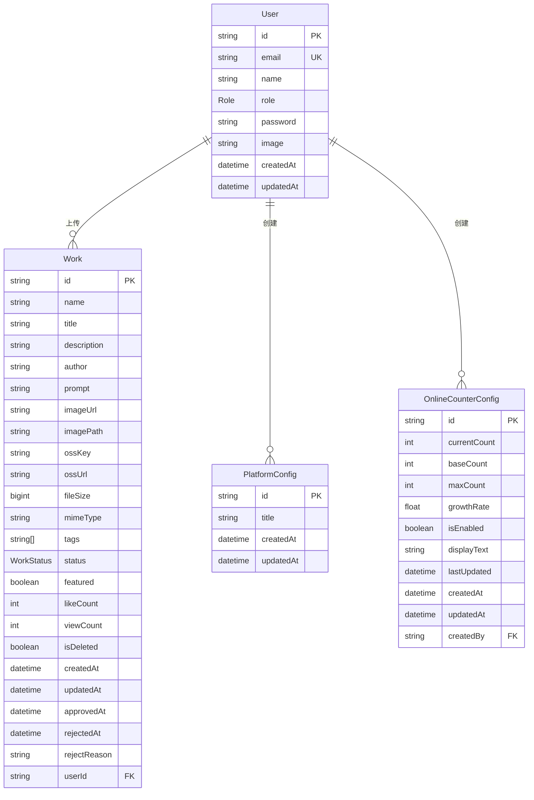
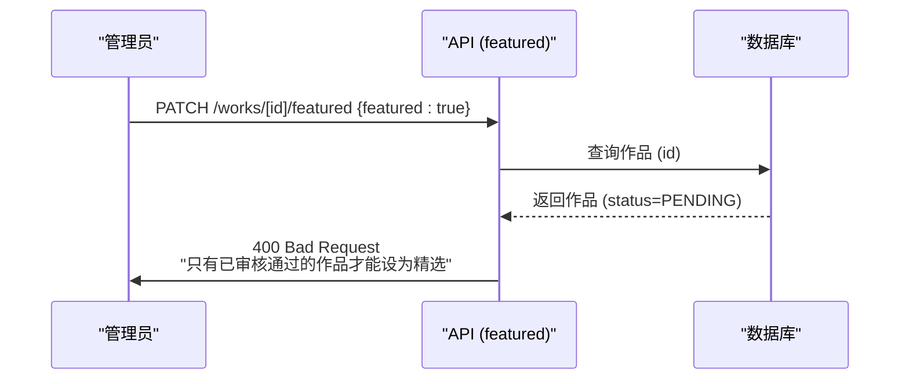

# 数据模型

<cite>
**本文档中引用的文件**  
- [prisma/schema.prisma](file://prisma/schema.prisma)
- [src/types/work.d.ts](file://src/types/work.d.ts)
- [src/app/api/works/route.ts](file://src/app/api/works/route.ts)
- [src/app/api/works/[id]/featured/route.ts](file://src/app/api/works/[id]/featured/route.ts)
- [src/app/api/admin/works/[id]/approve/route.ts](file://src/app/api/admin/works/[id]/approve/route.ts)
- [src/components/WorkCard.tsx](file://src/components/WorkCard.tsx)
- [src/lib/prisma.ts](file://src/lib/prisma.ts)
</cite>

## 目录
1. [简介](#简介)
2. [核心实体与关系](#核心实体与关系)
3. [User（用户）模型](#user用户模型)
4. [Work（作品）模型](#work作品模型)
5. [PlatformConfig（平台配置）模型](#platformconfig平台配置模型)
6. [OnlineCounterConfig（在线计数配置）模型](#onlinecounterconfig在线计数配置模型)
7. [业务规则与约束](#业务规则与约束)
8. [常见查询场景与Prisma Client调用](#常见查询场景与prisma-client调用)
9. [结论](#结论)

## 简介
本文档基于 `prisma/schema.prisma` 文件，全面描述数字化作品互动展示平台的核心数据模型。重点涵盖 `User`（用户）、`Work`（作品）、`PlatformConfig`（平台配置）和 `OnlineCounterConfig`（在线计数配置）四个主要实体。文档详细阐述了各模型的字段定义、数据类型、主键、唯一约束、默认值、索引等Prisma特性，并明确了实体间的关联关系。同时，文档解释了业务规则在数据模型中的体现，并提供了Prisma Client的类型安全查询示例，旨在为开发者提供一份清晰、准确的数据架构参考。

## 核心实体与关系
平台的核心数据模型围绕用户和作品展开，辅以独立的配置表。`User` 模型是系统身份的基础，`Work` 模型是内容的核心。两者通过外键形成一对多关系，即一个用户可以拥有多个作品。`PlatformConfig` 和 `OnlineCounterConfig` 模型则用于存储全局的平台设置和在线计数配置，它们与 `User` 模型存在一对多关系，记录了配置的创建者，但其数据本身是独立于用户和作品的全局状态。



**Diagram sources**
- [prisma/schema.prisma](file://prisma/schema.prisma#L18-L160)

## User（用户）模型
`User` 模型是系统身份管理的基础，用于存储平台注册用户和管理员的信息。

### 字段定义
| 字段名 | 类型 | 说明 |
| :--- | :--- | :--- |
| `id` | String | 主键，使用 `@id` 和 `@default(cuid())` 生成唯一标识符。 |
| `email` | String | 用户邮箱，通过 `@unique` 约束保证系统内唯一性，用于登录和身份识别。 |
| `name` | String? | 用户姓名或昵称，可为空。 |
| `role` | Role | 用户角色，枚举类型（`USER` 或 `ADMIN`），通过 `@default(USER)` 设置默认值为普通用户，用于权限控制。 |
| `password` | String? | 存储经过哈希处理的密码，可为空以支持第三方登录。 |
| `image` | String? | 用户头像的URL，可为空。 |
| `createdAt` | DateTime | 记录用户创建时间，通过 `@default(now())` 自动填充。 |
| `updatedAt` | DateTime | 记录用户信息最后更新时间，通过 `@updatedAt` 修饰符自动维护。 |

### 约束与索引
- **主键 (PK)**: `id` 字段。
- **唯一约束 (UK)**: `email` 字段。
- **数据库表映射**: `@@map("users")`。

**Section sources**
- [prisma/schema.prisma](file://prisma/schema.prisma#L18-L38)

## Work（作品）模型
`Work` 模型是平台的核心业务实体，承载了用户上传的所有AI创作内容。

### 字段定义
| 字段名 | 类型 | 说明 |
| :--- | :--- | :--- |
| `id` | String | 主键，使用 `@id` 和 `@default(cuid())` 生成唯一标识符。 |
| `name` | String | 作品名称。 |
| `title` | String | 作品简述。 |
| `description` | String? | 作品详细描述，可为空。 |
| `author` | String | 作者名。 |
| `prompt` | String? | AI生成提示词，可为空。 |
| `imageUrl` | String | 作品图片的URL地址。 |
| `imagePath` | String? | 作品在OSS中的文件路径，可为空。 |
| `ossKey` | String? | 作品在OSS中的文件键名，可为空。 |
| `ossUrl` | String? | 作品在OSS中的完整访问URL，可为空。 |
| `fileSize` | BigInt? | 文件大小（字节），可为空。 |
| `mimeType` | String? | 文件MIME类型，可为空。 |
| `tags` | String[] | 标签数组，通过 `@default([])` 设置默认为空数组。 |
| `status` | WorkStatus | 审核状态，枚举类型（`PENDING`/`APPROVED`/`REJECTED`），通过 `@default(PENDING)` 设置默认为待审核。 |
| `featured` | Boolean | 精选标记，布尔值，通过 `@default(false)` 设置默认为非精选。 |
| `likeCount` | Int | 点赞数，整数，通过 `@default(0)` 设置默认为0。 |
| `viewCount` | Int | 浏览数，整数，通过 `@default(0)` 设置默认为0。 |
| `isDeleted` | Boolean | 软删除标记，布尔值，通过 `@default(false)` 设置默认为未删除。 |
| `createdAt` | DateTime | 作品创建时间，通过 `@default(now())` 自动填充。 |
| `updatedAt` | DateTime | 作品最后更新时间，通过 `@updatedAt` 自动维护。 |
| `approvedAt` | DateTime? | 审核通过时间，可为空。 |
| `rejectedAt` | DateTime? | 审核拒绝时间，可为空。 |
| `rejectReason` | String? | 拒绝原因，可为空。 |
| `userId` | String? | 外键，关联到 `User` 模型的 `id` 字段，表示作品的上传者，可为空以支持匿名上传。 |

### 约束与索引
- **主键 (PK)**: `id` 字段。
- **外键 (FK)**: `userId` 字段引用 `User` 模型的 `id` 字段。
- **数据库表映射**: `@@map("works")`。

**Section sources**
- [prisma/schema.prisma](file://prisma/schema.prisma#L105-L144)

## PlatformConfig（平台配置）模型
`PlatformConfig` 模型用于存储平台的全局配置信息。

### 字段定义
| 字段名 | 类型 | 说明 |
| :--- | :--- | :--- |
| `id` | String | 主键，使用 `@id` 和 `@default(cuid())` 生成唯一标识符。 |
| `title` | String | 平台主标题，通过 `@default("Qoder和通义灵码 AI Coding 作品秀")` 设置默认值。 |
| `createdAt` | DateTime | 配置创建时间，通过 `@default(now())` 自动填充。 |
| `updatedAt` | DateTime | 配置最后更新时间，通过 `@updatedAt` 自动维护。 |

### 约束与索引
- **主键 (PK)**: `id` 字段。
- **数据库表映射**: `@@map("platform_configs")`。

**Section sources**
- [prisma/schema.prisma](file://prisma/schema.prisma#L158-L164)

## OnlineCounterConfig（在线计数配置）模型
`OnlineCounterConfig` 模型用于存储在线人数计数器的配置参数。

### 字段定义
| 字段名 | 类型 | 说明 |
| :--- | :--- | :--- |
| `id` | String | 主键，使用 `@id` 和 `@default(cuid())` 生成唯一标识符。 |
| `currentCount` | Int | 当前显示人数，通过 `@default(1075)` 设置默认值。 |
| `baseCount` | Int | 基础人数，通过 `@default(1000)` 设置默认值。 |
| `maxCount` | Int | 最大人数，通过 `@default(2000)` 设置默认值。 |
| `growthRate` | Float | 增长速率（每分钟增长人数），通过 `@default(0.5)` 设置默认值。 |
| `isEnabled` | Boolean | 功能开关，通过 `@default(true)` 设置默认为启用。 |
| `displayText` | String | 显示文本，通过 `@default("人正在云栖大会创作")` 设置默认值。 |
| `lastUpdated` | DateTime | 最后更新时间，通过 `@default(now())` 自动填充。 |
| `createdAt` | DateTime | 配置创建时间，通过 `@default(now())` 自动填充。 |
| `updatedAt` | DateTime | 配置最后更新时间，通过 `@updatedAt` 自动维护。 |
| `createdBy` | String? | 外键，关联到 `User` 模型的 `id` 字段，表示配置的创建者，可为空。 |

### 约束与索引
- **主键 (PK)**: `id` 字段。
- **外键 (FK)**: `createdBy` 字段引用 `User` 模型的 `id` 字段。
- **数据库表映射**: `@@map("online_counter_configs")`。

**Section sources**
- [prisma/schema.prisma](file://prisma/schema.prisma#L146-L156)

## 业务规则与约束
数据模型的设计直接体现了平台的核心业务规则。

### 精选作品必须为已审核通过状态
业务规则要求只有审核通过的作品才能被设为“精选”。这一规则在后端API中强制执行。当管理员尝试通过 `PATCH /api/admin/works/[id]/featured` 接口将一个作品设为精选时，后端会检查该作品的 `status` 字段。如果 `status` 不是 `APPROVED`，请求将被拒绝并返回错误。



**Diagram sources**
- [src/app/api/admin/works/[id]/featured/route.ts](file://src/app/api/admin/works/[id]/featured/route.ts#L46-L55)

### 用户与作品的一对多关系
一个用户可以上传多个作品，这通过 `Work` 模型中的 `userId` 外键实现。`User` 模型中的 `works Work[]` 字段是反向关联，允许通过 `include` 选项一次性获取用户及其所有作品。

**Section sources**
- [prisma/schema.prisma](file://prisma/schema.prisma#L25-L26)
- [prisma/schema.prisma](file://prisma/schema.prisma#L115-L117)

## 常见查询场景与Prisma Client调用
以下是基于Prisma Client的常见查询示例，展示了类型安全的查询模式。

### 获取精选作品列表
获取所有已审核通过且被标记为精选的作品，并按点赞数降序排列。

```ts
const featuredWorks = await prisma.work.findMany({
  where: {
    status: WorkStatus.APPROVED,
    featured: true
  },
  orderBy: {
    likeCount: 'desc'
  },
  include: {
    user: {
      select: {
        id: true,
        name: true,
        email: true
      }
    }
  }
});
```

**Section sources**
- [src/app/api/works/route.ts](file://src/app/api/works/route.ts#L60-L65)

### 统计用户作品数量
统计特定用户已审核通过的作品总数。

```ts
const approvedWorkCount = await prisma.work.count({
  where: {
    userId: 'usr_abc123',
    status: WorkStatus.APPROVED
  }
});
```

**Section sources**
- [src/app/api/admin/stats/route.ts](file://src/app/api/admin/stats/route.ts#L34-L38)

### 原子性增加点赞数
为避免并发问题，使用 `increment` 原子操作安全地增加作品的点赞数。

```ts
const updatedWork = await prisma.work.update({
  where: { id: 'wk_xyz789' },
  data: {
    likeCount: {
      increment: 1
    }
  },
  select: {
    likeCount: true
  }
});
```

**Section sources**
- [src/app/api/works/[id]/like/route.ts](file://src/app/api/works/[id]/like/route.ts#L45-L55)

## 结论
本数据模型文档详细阐述了平台的核心实体及其关系。`User` 和 `Work` 模型构成了内容生产与消费的基础，通过清晰的一对多关系进行关联。`PlatformConfig` 和 `OnlineCounterConfig` 模型则提供了灵活的全局配置能力。模型设计充分考虑了业务规则，如通过API逻辑强制“精选作品必须已审核通过”，并通过Prisma的默认值、枚举、外键等特性保证了数据的完整性和一致性。提供的Prisma Client查询示例展示了如何进行类型安全的数据操作，为后续的开发工作奠定了坚实的基础。