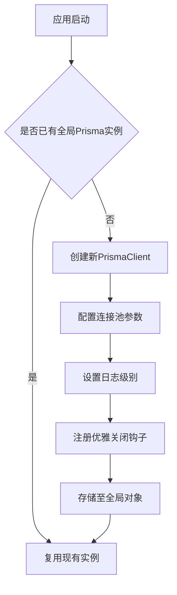
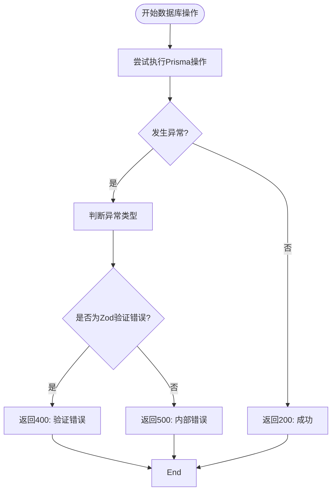
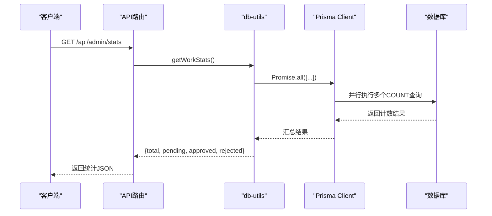

# 数据访问模式与实践

<cite>
**本文档引用的文件**  
- [prisma.ts](file://src/lib/prisma.ts)
- [db-utils.ts](file://src/lib/db-utils.ts)
- [route.ts](file://src/app/api/admin/works/[id]/approve/route.ts)
- [route.ts](file://src/app/api/works/[id]/route.ts)
- [seed.ts](file://prisma/seed.ts)
</cite>

## 目录
1. [简介](#简介)
2. [数据库连接管理](#数据库连接管理)
3. [Prisma Client 使用模式](#prisma-client-使用模式)
4. [异常处理机制](#异常处理机制)
5. [事务与复合操作](#事务与复合操作)
6. [数据查询封装与工具函数](#数据查询封装与工具函数)
7. [API 路由中的实际调用示例](#api-路由中的实际调用示例)
8. [性能优化建议](#性能优化建议)
9. [数据一致性保障措施](#数据一致性保障措施)
10. [总结](#总结)

## 简介
本文档系统性地分析了项目中 Prisma Client 的使用模式，涵盖数据库连接管理、异常处理、事务使用、查询封装、API 调用实践及性能优化策略。通过具体代码文件和调用场景，展示如何高效、安全地操作数据库，避免常见问题如 N+1 查询，并确保数据一致性。

## 数据库连接管理
项目通过 `prisma.ts` 实现 Prisma Client 的单例模式，确保在开发和生产环境中仅存在一个数据库连接实例，避免内存泄漏和连接过多问题。

连接配置根据环境变量 `DATABASE_URL` 动态生成，并针对服务器硬件（8核16GB）优化连接池参数，包括最大连接数、超时设置等，提升数据库性能和稳定性。



**Diagram sources**
- [prisma.ts](file://src/lib/prisma.ts#L1-L50)

**Section sources**
- [prisma.ts](file://src/lib/prisma.ts#L1-L50)

## Prisma Client 使用模式
Prisma Client 在项目中被广泛用于执行 CRUD 操作。通过 `include` 和 `select` 选项精确控制返回字段，减少不必要的数据传输，提升性能。

例如，在更新作品信息时，使用 `include` 加载关联的用户信息，确保响应数据完整。

## 异常处理机制
所有数据库操作均包裹在 `try-catch` 块中，捕获并处理可能的异常。对于验证错误（如 Zod 解析失败），返回结构化错误响应，包含错误码和详细信息，便于前端处理。

在审核作品或更新用户信息等关键路径中，错误被记录到服务端日志，便于排查问题。



**Diagram sources**
- [route.ts](file://src/app/api/admin/works/[id]/approve/route.ts#L17-L111)
- [route.ts](file://src/app/api/works/[id]/route.ts#L87-L262)

**Section sources**
- [route.ts](file://src/app/api/admin/works/[id]/approve/route.ts#L17-L111)
- [route.ts](file://src/app/api/works/[id]/route.ts#L87-L262)

## 事务与复合操作
在需要保证数据一致性的复合操作中，使用 Prisma 事务（`$transaction`）确保多个操作的原子性。例如，在审核作品时，需同时更新作品状态、记录审核时间、可能增加初始点赞数，这些操作应在一个事务中完成。

虽然当前代码未显式使用 `$transaction`，但通过单个 `update` 操作完成多字段更新，已具备原子性。对于更复杂场景（如同时创建日志记录），建议使用事务。

## 数据查询封装与工具函数
`db-utils.ts` 文件封装了常用的数据库查询逻辑，提高代码复用性和可维护性。

### 常用查询工具函数
| 函数名 | 功能 | 查询条件 | 排序方式 |
|--------|------|----------|----------|
| `getPopularWorks` | 获取热门作品 | 状态为 APPROVED 且未删除 | 点赞数降序、浏览数降序、创建时间降序 |
| `getLatestWorks` | 获取最新作品 | 状态为 APPROVED 且未删除 | 审核通过时间降序 |
| `incrementViewCount` | 增加浏览数 | 根据作品ID | - |
| `incrementLikeCount` | 增加点赞数 | 根据作品ID | - |
| `getWorkStats` | 获取作品统计 | 按状态分类计数 | - |

```mermaid
classDiagram
class DbUtils {
+getPopularWorks(limit : number) : Promise<Work[]>
+getLatestWorks(limit : number) : Promise<Work[]>
+incrementViewCount(workId : string) : Promise<void>
+incrementLikeCount(workId : string) : Promise<Work>
+getWorkStats() : Promise<{total, pending, approved, rejected}>
}
class PrismaClient {
+work : WorkModel
+user : UserModel
}
DbUtils --> PrismaClient : "依赖"
```

**Diagram sources**
- [db-utils.ts](file://src/lib/db-utils.ts#L4-L67)

**Section sources**
- [db-utils.ts](file://src/lib/db-utils.ts#L4-L67)

## API 路由中的实际调用示例
### 作品列表查询
在 `/api/works` 路由中，调用 `getPopularWorks` 或 `getLatestWorks` 获取作品列表，结合分页参数实现高效查询。

### 用户作品统计
在管理员统计接口 `/api/admin/stats` 中，使用 `Promise.all` 并行执行多个计数查询，提升响应速度。



**Diagram sources**
- [route.ts](file://src/app/api/admin/stats/route.ts#L20-L20)
- [db-utils.ts](file://src/lib/db-utils.ts#L58-L67)

**Section sources**
- [route.ts](file://src/app/api/admin/stats/route.ts#L20-L20)
- [db-utils.ts](file://src/lib/db-utils.ts#L58-L67)

## 性能优化建议
### 避免 N+1 查询
通过 `include` 一次性加载关联数据，避免在循环中多次查询数据库。

### 合理使用 select
仅选择需要的字段，减少网络传输和内存占用。

### 分页策略
建议采用游标分页（cursor-based pagination）替代偏移量分页，避免大数据集下的性能问题。

### 索引优化
确保在常用查询字段（如 `status`, `approvedAt`, `likeCount`）上建立适当索引，加速查询。

### 缓存考虑
对于高频读取、低频更新的数据（如热门作品列表），可引入 Redis 等缓存机制，减轻数据库压力。

## 数据一致性保障措施
- **单例连接**：防止连接泄漏和竞争。
- **事务支持**：对复合操作使用 `$transaction`。
- **输入验证**：在数据库操作前进行严格的数据验证。
- **权限检查**：在更新操作前验证用户权限，防止越权操作。
- **状态机控制**：作品状态转换遵循预定义规则，避免非法状态。

## 总结
本项目通过 Prisma Client 实现了高效、安全的数据访问。通过单例模式管理数据库连接，封装常用查询逻辑，结合合理的异常处理和性能优化策略，构建了一个稳定可靠的后端数据层。未来可进一步引入事务、缓存和更精细的索引策略，提升系统整体性能和一致性。