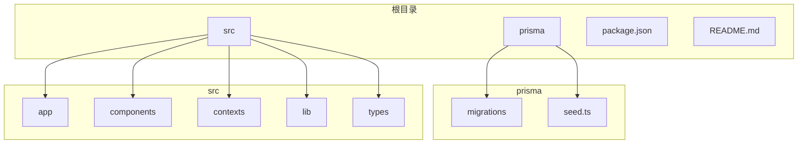
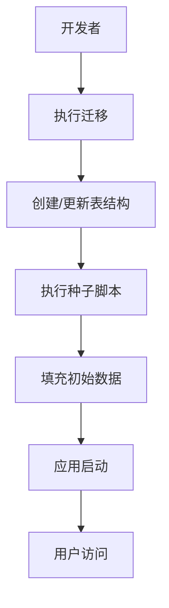
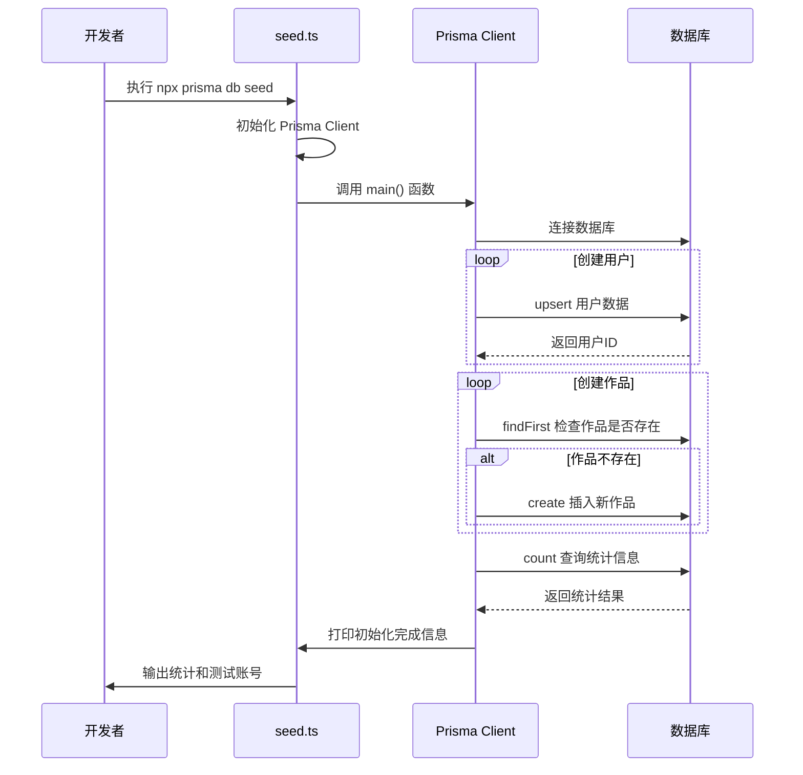
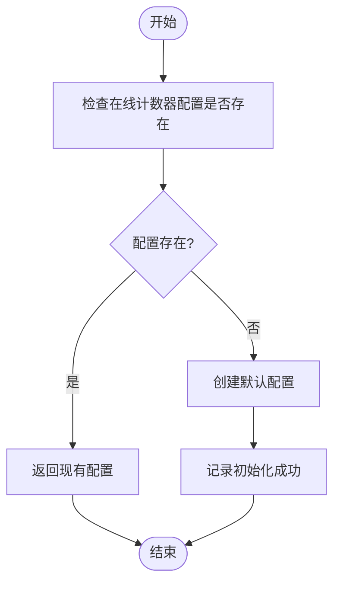

# 种子数据

<cite>
**本文档中引用的文件**   
- [seed.ts](file://prisma/seed.ts)
- [package.json](file://package.json)
- [schema.prisma](file://prisma/schema.prisma)
- [init-online-counter.ts](file://src/lib/init-online-counter.ts)
- [verify-database.ts](file://verify-database.ts)
</cite>

## 目录
1. [引言](#引言)
2. [项目结构](#项目结构)
3. [核心组件](#核心组件)
4. [架构概述](#架构概述)
5. [详细组件分析](#详细组件分析)
6. [依赖分析](#依赖分析)
7. [性能考虑](#性能考虑)
8. [故障排除指南](#故障排除指南)
9. [结论](#结论)

## 引言
种子数据初始化是数字化作品互动展示平台开发和测试过程中的关键环节。本文件详细说明了 `prisma/seed.ts` 脚本的结构与执行机制，解释如何通过该脚本在数据库初始化或重置时填充基础数据，例如创建默认管理员账户、预设平台配置参数、初始化在线计数器状态。文档还描述了脚本中使用的Prisma Client API进行数据插入的操作模式，包括 `createMany` 批量插入作品示例、设置默认配置值等。此外，提供了执行种子数据的命令（`npx prisma db seed`）及其在开发、测试环境中的应用场景，并说明了种子数据与迁移的协同关系：迁移负责表结构，种子负责初始内容。

## 项目结构

数字化作品互动展示平台的项目结构清晰，主要分为以下几个核心目录：

- `prisma/`：包含数据库迁移文件和种子脚本。
- `src/`：包含应用的前端页面、API路由、组件、上下文、钩子、库文件和类型定义。
- 根目录：包含构建配置、环境变量、依赖管理文件和文档。

种子数据脚本位于 `prisma/seed.ts`，是数据库初始化流程的核心部分。



**Diagram sources**
- [prisma/seed.ts](file://prisma/seed.ts#L1-L318)
- [package.json](file://package.json#L1-L62)

**Section sources**
- [prisma/seed.ts](file://prisma/seed.ts#L1-L318)
- [package.json](file://package.json#L1-L62)

## 核心组件

`prisma/seed.ts` 文件是本项目的核心组件之一，负责在数据库中填充初始数据。该脚本的主要功能包括：

1.  **创建测试用户账号**：脚本定义了一个用户数组，包含管理员和普通用户，通过 `prisma.user.upsert` 方法创建或更新这些用户。密码使用 `bcryptjs` 进行哈希处理，确保安全性。
2.  **创建详细的作品数据**：脚本定义了多个作品对象，包括已通过、待审核和已拒绝状态的作品，并使用 `prisma.work.create` 方法将其插入数据库。
3.  **批量创建更多作品**：为了模拟真实环境，脚本使用循环和随机数据生成大量作品，并根据权重随机分配状态（70%通过，20%待审核，10%拒绝）。
4.  **输出统计信息**：脚本最后会统计并输出数据库中的用户和作品总数，以及测试账号信息，方便开发者快速了解初始化结果。

**Section sources**
- [prisma/seed.ts](file://prisma/seed.ts#L1-L318)

## 架构概述

整个平台的架构围绕Next.js 14 (App Router) 构建，采用TypeScript和Prisma ORM。数据库使用SQLite（生产环境可切换为PostgreSQL），身份认证使用NextAuth.js。

种子数据初始化是数据库层的重要组成部分，它与Prisma迁移（Migrations）协同工作。迁移文件（位于 `prisma/migrations/`）负责定义和更新数据库的表结构，而种子脚本则负责在表结构创建后填充初始内容。



**Diagram sources**
- [prisma/seed.ts](file://prisma/seed.ts#L1-L318)
- [prisma/migrations](file://prisma/migrations)

## 详细组件分析

### 种子脚本分析

`prisma/seed.ts` 脚本的执行流程如下：

1.  **初始化Prisma客户端**：导入 `PrismaClient` 并创建实例。
2.  **定义主函数**：`main()` 函数是脚本的入口点，包含所有数据初始化逻辑。
3.  **创建用户**：遍历预定义的用户列表，使用 `bcrypt.hash` 对密码进行哈希，然后通过 `upsert` 操作创建用户。`upsert` 方法确保了数据的幂等性，即使多次运行脚本，也不会创建重复的用户。
4.  **创建作品**：首先创建几个具有详细信息的示例作品。然后，通过一个循环批量创建更多作品，使用随机数据填充标题、描述、作者等字段，并根据预设的权重分配作品状态。
5.  **数据验证与插入**：在插入每个作品前，脚本会检查该作品是否已存在，避免重复插入。
6.  **统计与日志**：脚本最后会查询数据库，统计用户和作品的数量，并将结果和测试账号信息打印到控制台。

#### 对于API/服务组件：


**Diagram sources**
- [prisma/seed.ts](file://prisma/seed.ts#L1-L318)

**Section sources**
- [prisma/seed.ts](file://prisma/seed.ts#L1-L318)

### 在线计数器配置初始化

除了 `seed.ts`，项目中还有一个用于初始化在线计数器配置的脚本 `src/lib/init-online-counter.ts`。该脚本与种子数据脚本的功能相似，但专注于特定的业务配置。



**Diagram sources**
- [src/lib/init-online-counter.ts](file://src/lib/init-online-counter.ts#L1-L52)

**Section sources**
- [src/lib/init-online-counter.ts](file://src/lib/init-online-counter.ts#L1-L52)

## 依赖分析

种子数据脚本 `prisma/seed.ts` 依赖于以下关键模块和文件：

- **Prisma Client**：通过 `@prisma/client` 包导入，是与数据库交互的核心。
- **bcryptjs**：用于对用户密码进行安全的哈希处理。
- **Prisma Schema**：`prisma/schema.prisma` 文件定义了 `User` 和 `Work` 模型，`seed.ts` 脚本中的数据结构必须与之匹配。
- **环境变量**：虽然脚本中未直接使用，但Prisma Client会读取 `DATABASE_URL` 环境变量来连接数据库。

```mermaid
graph LR
A[seed.ts] --> B[@prisma/client]
A --> C[bcryptjs]
B --> D[schema.prisma]
D --> E[数据库表结构]
```

**Diagram sources**
- [prisma/seed.ts](file://prisma/seed.ts#L1-L318)
- [prisma/schema.prisma](file://prisma/schema.prisma#L1-L160)

**Section sources**
- [prisma/seed.ts](file://prisma/seed.ts#L1-L318)
- [prisma/schema.prisma](file://prisma/schema.prisma#L1-L160)

## 性能考虑

在执行种子数据脚本时，性能是一个需要考虑的因素，尤其是在需要插入大量数据时。

- **批量操作**：虽然当前脚本使用循环逐个创建作品，但对于海量数据，可以考虑使用Prisma的 `createMany` 方法来提高插入效率。
- **事务处理**：对于关键的初始化操作，可以将数据插入包裹在事务中，确保数据的一致性。如果某个步骤失败，可以回滚所有更改。
- **索引影响**：大量数据的插入可能会触发数据库索引的重建，这在大型数据库中可能耗时较长。在开发环境中，这通常不是问题。

## 故障排除指南

在执行种子数据脚本时，可能会遇到一些常见问题。以下是一些解决方案：

- **数据库连接失败**：确保 `DATABASE_URL` 环境变量已正确设置，并且数据库服务正在运行。可以使用 `npx prisma db push` 或 `npx prisma migrate dev` 来验证数据库连接。
- **种子脚本执行失败**：检查控制台输出的错误信息。常见的错误包括数据验证失败（如邮箱重复）、外键约束错误或语法错误。脚本末尾的 `catch` 块会捕获并打印错误。
- **数据重复插入**：脚本使用 `upsert` 和 `findFirst` 检查来避免重复。但如果需要完全清除并重新初始化，可以取消注释脚本中的 `deleteMany` 语句，但这会清除所有现有数据，需谨慎使用。
- **哈希密码错误**：确保 `bcryptjs` 正确导入，并且哈希的 `saltRounds`（当前为12）与登录验证时使用的值一致。

**Section sources**
- [prisma/seed.ts](file://prisma/seed.ts#L1-L318)
- [verify-database.ts](file://verify-database.ts#L1-L125)

## 结论

`prisma/seed.ts` 脚本是数字化作品互动展示平台开发流程中不可或缺的一部分。它提供了一种可靠、可重复的方式来初始化数据库，为开发和测试环境准备一致的、丰富的测试数据。通过理解其结构、执行机制和与迁移的协同关系，开发者可以高效地管理数据库的初始状态，加速开发迭代。遵循本文档中的指导原则，可以确保种子数据的编写更加规范、健壮和易于维护。