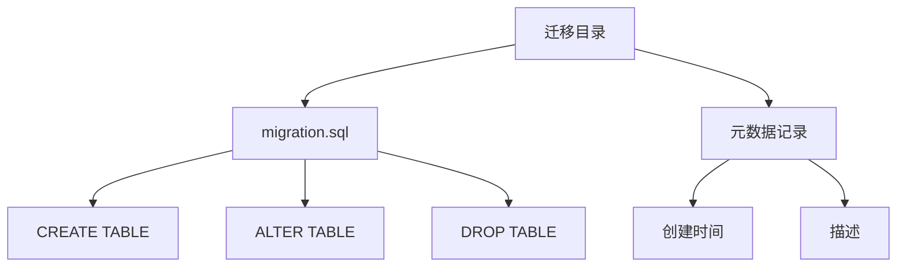
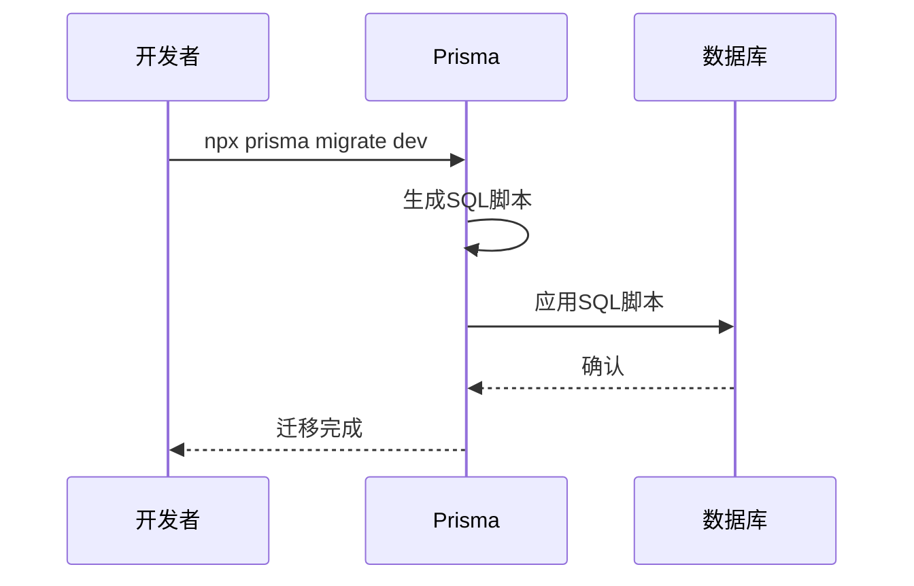
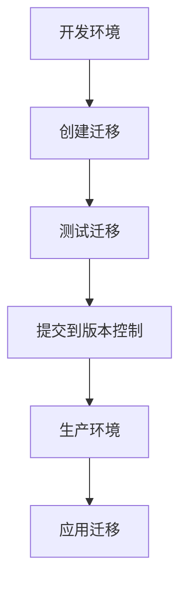

# 迁移管理

<cite>
**本文档引用文件**  
- [migration_lock.toml](file://prisma/migrations/migration_lock.toml)
- [add_featured_field/migration.sql](file://prisma/migrations/20250831084947_add_featured_field/migration.sql)
- [add_online_counter_config/migration.sql](file://prisma/migrations/20250905143157_add_online_counter_config/migration.sql)
- [add_platform_config/migration.sql](file://prisma/migrations/20250905150839_add_platform_config/migration.sql)
- [add_missing_fields/migration.sql](file://prisma/migrations/20250917050212_add_missing_fields/migration.sql)
- [seed.ts](file://prisma/seed.ts)
- [prisma.ts](file://src/lib/prisma.ts)
- [package.json](file://package.json)
</cite>

## 目录
1. [引言](#引言)
2. [迁移文件结构](#迁移文件结构)
3. [迁移锁定机制](#迁移锁定机制)
4. [典型迁移操作](#典型迁移操作)
5. [迁移流程](#迁移流程)
6. [常见问题排查](#常见问题排查)
7. [生产环境最佳实践](#生产环境最佳实践)
8. [完整迁移示例](#完整迁移示例)

## 引言
本文档详细说明基于Prisma Migrate的版本化数据库变更流程。通过`npx prisma migrate dev`命令创建迁移，自动生成SQL脚本并应用到数据库。文档涵盖迁移文件结构、`migration_lock.toml`的作用、典型迁移操作指南、常见问题排查以及生产环境迁移的最佳实践。

## 迁移文件结构
每个迁移目录包含`migration.sql`文件和元数据记录。`migration.sql`文件包含实际的SQL变更语句，而元数据记录则包含迁移的创建时间、描述等信息。



**图示来源**
- [add_featured_field/migration.sql](file://prisma/migrations/20250831084947_add_featured_field/migration.sql)
- [add_online_counter_config/migration.sql](file://prisma/migrations/20250905143157_add_online_counter_config/migration.sql)

**本节来源**
- [add_featured_field/migration.sql](file://prisma/migrations/20250831084947_add_featured_field/migration.sql)
- [add_online_counter_config/migration.sql](file://prisma/migrations/20250905143157_add_online_counter_config/migration.sql)

## 迁移锁定机制
`migration_lock.toml`文件用于确保迁移执行顺序和团队协作一致性。该文件不应手动编辑，并应加入版本控制系统（如Git）。

```toml
# 请勿手动编辑此文件
# 应将其加入版本控制系统（如Git）
provider = "postgresql"
```

**本节来源**
- [migration_lock.toml](file://prisma/migrations/migration_lock.toml)

## 典型迁移操作
### 添加字段
例如，为`Work`表添加`featured`字段：

```sql
-- AlterTable
ALTER TABLE "works" ADD COLUMN "featured" BOOLEAN NOT NULL DEFAULT false;
```

### 创建新表
例如，创建`PlatformConfig`表：

```sql
-- CreateTable
CREATE TABLE "platform_configs" (
    "id" TEXT NOT NULL,
    "title" TEXT NOT NULL DEFAULT 'Qoder和通义灵码 AI Coding 作品秀',
    "createdAt" TIMESTAMP(3) NOT NULL DEFAULT CURRENT_TIMESTAMP,
    "updatedAt" TIMESTAMP(3) NOT NULL,
    CONSTRAINT "platform_configs_pkey" PRIMARY KEY ("id")
);
```

### 修改字段类型
例如，为`Work`表添加多个字段：

```sql
-- AlterTable
ALTER TABLE "works" ADD COLUMN "fileSize" BIGINT,
ADD COLUMN "imagePath" TEXT,
ADD COLUMN "mimeType" TEXT,
ADD COLUMN "ossKey" TEXT,
ADD COLUMN "ossUrl" TEXT,
ADD COLUMN "tags" TEXT[] DEFAULT ARRAY[]::TEXT[];
```

**本节来源**
- [add_featured_field/migration.sql](file://prisma/migrations/20250831084947_add_featured_field/migration.sql)
- [add_platform_config/migration.sql](file://prisma/migrations/20250905150839_add_platform_config/migration.sql)
- [add_missing_fields/migration.sql](file://prisma/migrations/20250917050212_add_missing_fields/migration.sql)

## 迁移流程
1. 使用`npx prisma migrate dev`命令创建迁移。
2. Prisma自动生成SQL脚本并应用到数据库。
3. 检查`migration_lock.toml`文件以确保迁移顺序。



**图示来源**
- [add_featured_field/migration.sql](file://prisma/migrations/20250831084947_add_featured_field/migration.sql)
- [add_online_counter_config/migration.sql](file://prisma/migrations/20250905143157_add_online_counter_config/migration.sql)

**本节来源**
- [add_featured_field/migration.sql](file://prisma/migrations/20250831084947_add_featured_field/migration.sql)
- [add_online_counter_config/migration.sql](file://prisma/migrations/20250905143157_add_online_counter_config/migration.sql)

## 常见问题排查
### 迁移冲突
当多个开发者同时进行迁移时，可能会发生冲突。解决方案包括：
- 确保所有开发者都使用最新的`migration_lock.toml`文件。
- 在合并代码前，先同步迁移文件。

### 数据库状态不一致
如果数据库状态与迁移文件不一致，可以使用`npx prisma migrate reset`命令重置数据库。

### 回滚策略
使用`npx prisma migrate resolve`命令来标记迁移为已解决，或使用`npx prisma migrate down`命令回滚到指定迁移。

**本节来源**
- [add_featured_field/migration.sql](file://prisma/migrations/20250831084947_add_featured_field/migration.sql)
- [add_online_counter_config/migration.sql](file://prisma/migrations/20250905143157_add_online_counter_config/migration.sql)
- [add_platform_config/migration.sql](file://prisma/migrations/20250905150839_add_platform_config/migration.sql)

## 生产环境最佳实践
### 使用`npx prisma migrate deploy`
在生产环境中，使用`npx prisma migrate deploy`命令来应用迁移。

### 预演迁移
在应用迁移前，使用`npx prisma migrate status`命令检查迁移状态。

### 备份数据库
在应用迁移前，务必备份数据库，以防迁移失败。

**本节来源**
- [package.json](file://package.json)
- [prisma.ts](file://src/lib/prisma.ts)

## 完整迁移示例
从开发到生产的完整迁移流程包括：
1. 在开发环境中创建迁移。
2. 测试迁移。
3. 将迁移文件提交到版本控制系统。
4. 在生产环境中应用迁移。



**图示来源**
- [add_featured_field/migration.sql](file://prisma/migrations/20250831084947_add_featured_field/migration.sql)
- [add_online_counter_config/migration.sql](file://prisma/migrations/20250905143157_add_online_counter_config/migration.sql)
- [add_platform_config/migration.sql](file://prisma/migrations/20250905150839_add_platform_config/migration.sql)

**本节来源**
- [add_featured_field/migration.sql](file://prisma/migrations/20250831084947_add_featured_field/migration.sql)
- [add_online_counter_config/migration.sql](file://prisma/migrations/20250905143157_add_online_counter_config/migration.sql)
- [add_platform_config/migration.sql](file://prisma/migrations/20250905150839_add_platform_config/migration.sql)
- [seed.ts](file://prisma/seed.ts)