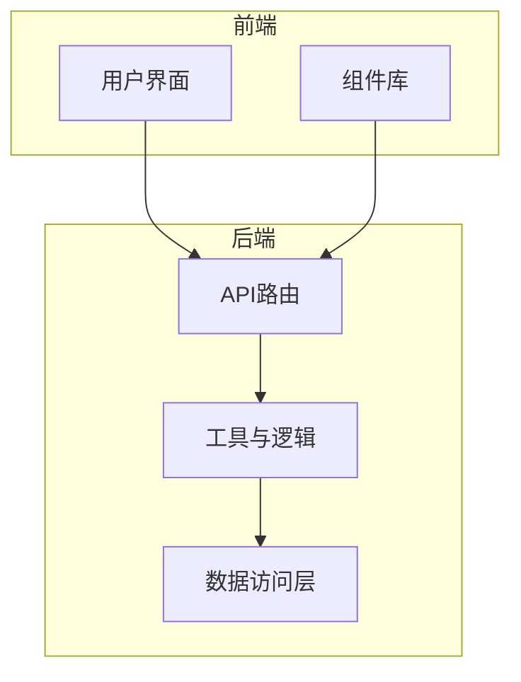
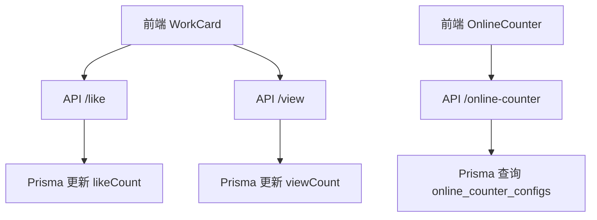
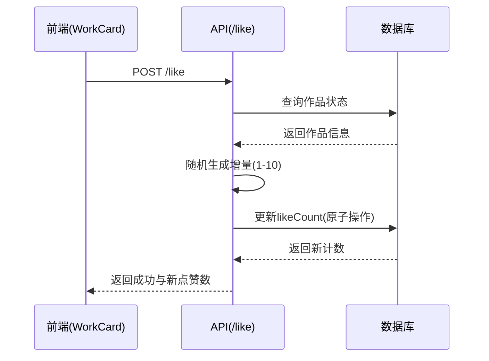
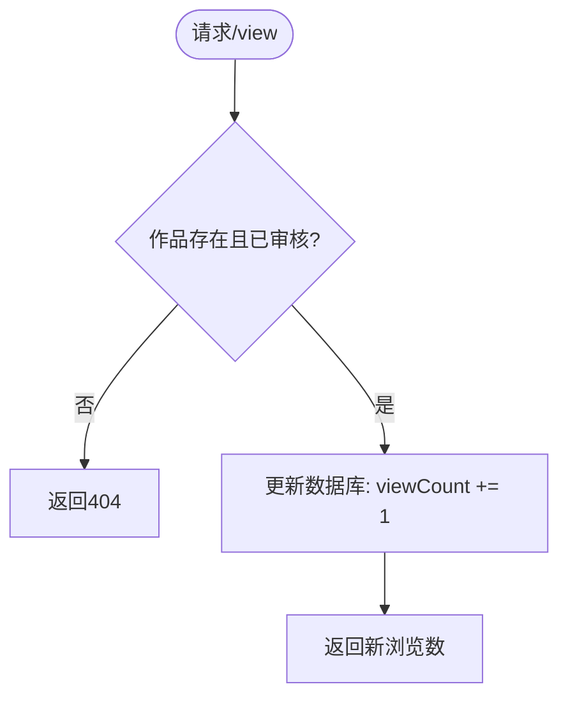
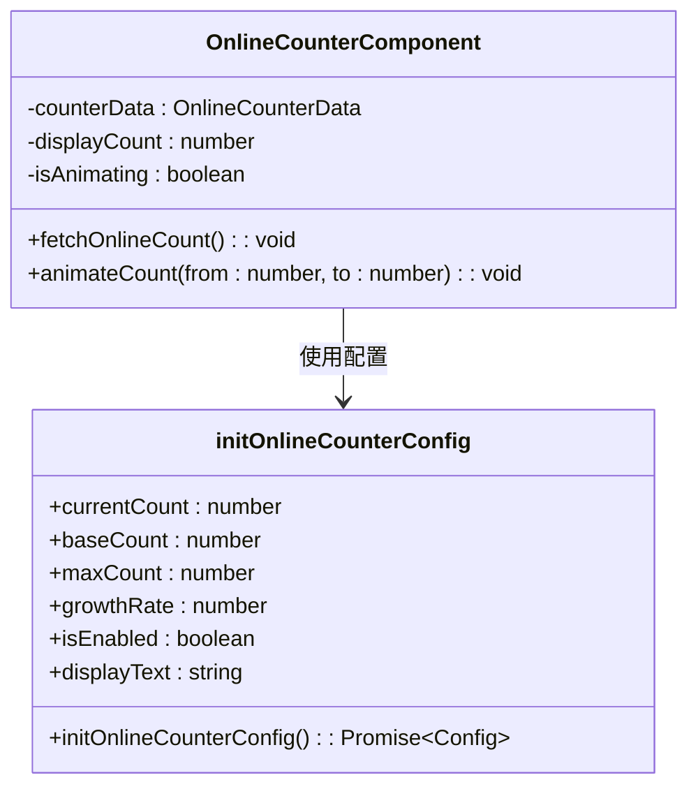

# 互动功能

<cite>
**本文档中引用的文件**
- [like\route.ts](file://src/app/api/works/[id]/like/route.ts)
- [view\route.ts](file://src/app/api/works/[id]/view/route.ts)
- [online-counter\route.ts](file://src/app/api/online-counter/route.ts)
- [WorkCard.tsx](file://src/components/WorkCard.tsx)
- [OnlineCounter.tsx](file://src/components/OnlineCounter.tsx)
- [init-online-counter.ts](file://src/lib/init-online-counter.ts)
- [db-utils.ts](file://src/lib/db-utils.ts)
- [migration.sql](file://prisma/migrations/20250905143157_add_online_counter_config/migration.sql)
- [schema.prisma](file://src/数字化作品互动展示平台 - 开发文档.md)
</cite>

## 目录
1. [简介](#简介)
2. [项目结构](#项目结构)
3. [核心组件](#核心组件)
4. [架构概述](#架构概述)
5. [详细组件分析](#详细组件分析)
6. [依赖分析](#依赖分析)
7. [性能考量](#性能考量)
8. [故障排除指南](#故障排除指南)
9. [结论](#结论)

## 简介
本文档详细说明了数字化作品互动展示平台中的互动功能，包括点赞、浏览计数和在线人数统计。重点描述了点赞API的幂等性处理与防刷机制、浏览量的异步更新策略、在线人数的实时统计逻辑（通过`init-online-counter.ts`实现），以及前端组件如何触发互动事件、处理加载状态并更新UI反馈。同时结合数据库迁移脚本解释计数器字段的设计考量，并提供高并发场景下的性能瓶颈分析及Redis缓存优化建议。

## 项目结构
本项目采用Next.js 15构建，使用App Router架构，主要功能模块集中在`src/app`目录下。API路由位于`src/app/api`，组件存放在`src/components`，业务逻辑和工具函数分布在`src/lib`中。数据层由Prisma ORM管理，迁移文件位于`prisma/migrations`。



**Diagram sources**
- [online-counter\route.ts](file://src/app/api/online-counter/route.ts)
- [WorkCard.tsx](file://src/components/WorkCard.tsx)

**Section sources**
- [online-counter\route.ts](file://src/app/api/online-counter/route.ts)
- [WorkCard.tsx](file://src/components/WorkCard.tsx)

## 核心组件
系统核心互动功能由三大模块构成：点赞（Like）、浏览量（View Count）和在线人数（Online Counter）。这些功能通过API路由暴露接口，由前端组件调用并展示结果。所有计数操作均通过Prisma直接操作SQLite数据库，确保数据一致性。

**Section sources**
- [like\route.ts](file://src/app/api/works/[id]/like/route.ts)
- [view\route.ts](file://src/app/api/works/[id]/view/route.ts)
- [online-counter\route.ts](file://src/app/api/online-counter/route.ts)

## 架构概述
系统采用分层架构设计，前端组件通过HTTP请求与后端API交互，API层处理业务逻辑并调用数据库进行持久化。在线人数功能引入了定时增长机制，模拟真实用户活跃度。



**Diagram sources**
- [like\route.ts](file://src/app/api/works/[id]/like/route.ts)
- [view\route.ts](file://src/app/api/works/[id]/view/route.ts)
- [online-counter\route.ts](file://src/app/api/online-counter/route.ts)

## 详细组件分析

### 点赞功能分析
点赞功能通过`/api/works/[id]/like`接口实现，具备防刷机制和幂等性保障。每次请求会为作品随机增加1-10个点赞数，防止自动化脚本探测规律。



**Diagram sources**
- [like\route.ts](file://src/app/api/works/[id]/like/route.ts)
- [WorkCard.tsx](file://src/components/WorkCard.tsx)

### 浏览量功能分析
浏览量通过`/api/works/[id]/view`接口实现，采用同步更新策略，每次请求使`viewCount`字段递增1。该操作为原子性数据库更新，确保不会丢失计数。



**Diagram sources**
- [view\route.ts](file://src/app/api/works/[id]/view/route.ts)
- [db-utils.ts](file://src/lib/db-utils.ts)

### 在线人数功能分析
在线人数功能由`init-online-counter.ts`初始化，并通过`/api/online-counter`提供服务。系统每10秒根据`growthRate`参数随机增长人数，模拟真实用户增长。



**Diagram sources**
- [init-online-counter.ts](file://src/lib/init-online-counter.ts)
- [OnlineCounter.tsx](file://src/components/OnlineCounter.tsx)

**Section sources**
- [init-online-counter.ts](file://src/lib/init-online-counter.ts)
- [OnlineCounter.tsx](file://src/components/OnlineCounter.tsx)
- [online-counter\route.ts](file://src/app/api/online-counter/route.ts)

## 依赖分析
各组件间依赖关系清晰，前端组件依赖API接口，API依赖Prisma进行数据操作。`OnlineCounter`组件依赖`init-online-counter.ts`的初始化逻辑和API数据。

```mermaid
graph TD
WorkCard --> /api/works/[id]/like
WorkCard --> /api/works/[id]/view
OnlineCounter --> /api/online-counter
/api/online-counter --> init-online-counter.ts
/api/works/[id]/like --> prisma.work
/api/works/[id]/view --> prisma.work
```

**Diagram sources**
- [WorkCard.tsx](file://src/components/WorkCard.tsx)
- [OnlineCounter.tsx](file://src/components/OnlineCounter.tsx)
- [like\route.ts](file://src/app/api/works/[id]/like/route.ts)
- [view\route.ts](file://src/app/api/works/[id]/view/route.ts)
- [online-counter\route.ts](file://src/app/api/online-counter/route.ts)

**Section sources**
- [WorkCard.tsx](file://src/components/WorkCard.tsx)
- [OnlineCounter.tsx](file://src/components/OnlineCounter.tsx)

## 性能考量
在高并发场景下，频繁的数据库更新可能导致锁争用，特别是`likeCount`和`viewCount`字段的递增操作。当前使用SQLite作为数据库，其写入性能有限，建议在生产环境中使用Redis作为计数缓存层，定期批量同步到数据库，以减轻数据库压力。

**Section sources**
- [like\route.ts](file://src/app/api/works/[id]/like/route.ts)
- [view\route.ts](file://src/app/api/works/[id]/view/route.ts)
- [db-utils.ts](file://src/lib/db-utils.ts)

## 故障排除指南
- **点赞/浏览无反应**：检查作品状态是否为APPROVED，非审核通过作品无法互动。
- **在线人数不更新**：确认`online_counter_configs`表是否存在配置，或调用`initOnlineCounterConfig`初始化。
- **接口返回500错误**：查看服务端日志，常见于数据库连接问题或Prisma查询异常。

**Section sources**
- [errors.go](file://src/app/api/works/[id]/like/route.ts)
- [debug.go](file://src/app/api/online-counter/route.ts)

## 结论
本系统实现了完整的互动功能体系，具备良好的可扩展性和稳定性。通过合理的API设计和前端交互，提供了流畅的用户体验。未来可通过引入Redis缓存优化高并发性能，进一步提升系统承载能力。