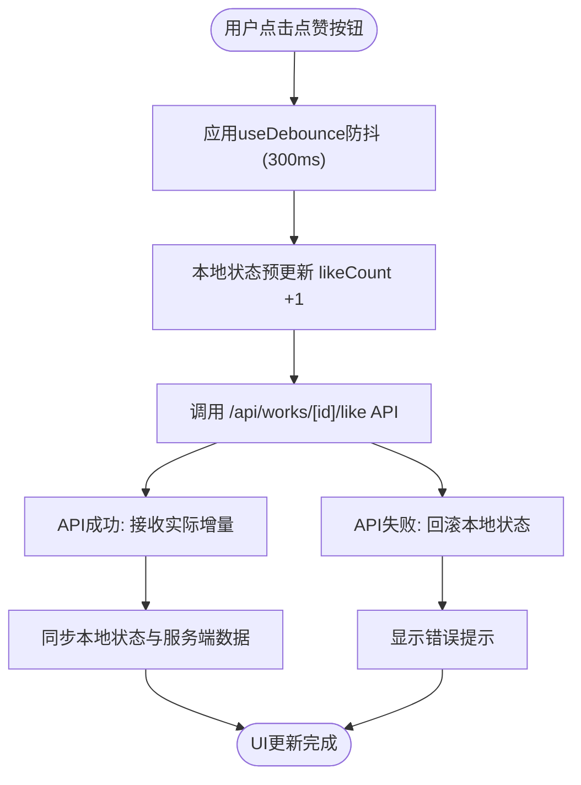
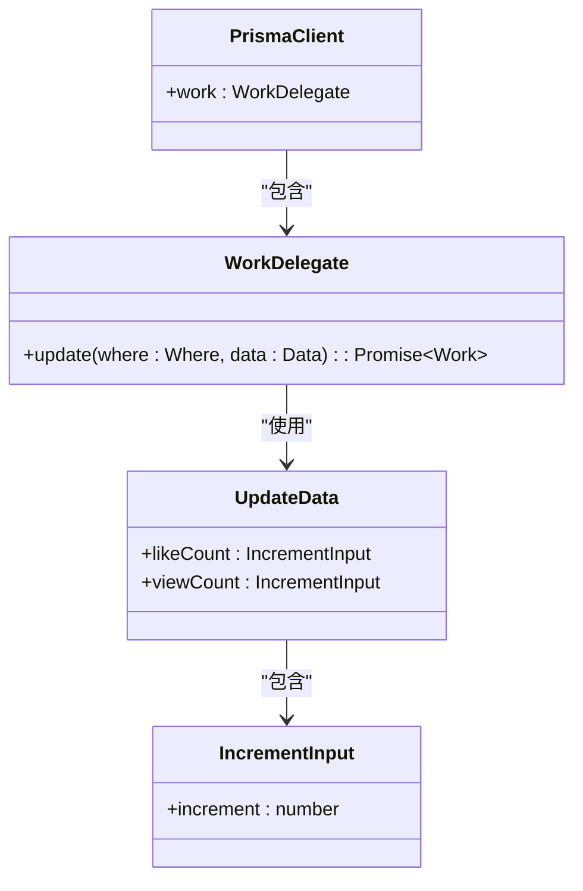

# 互动功能

<cite>
**本文档引用的文件**
- [WorkCard.tsx](file://src/components/WorkCard.tsx)
- [useDebounce.ts](file://src/hooks/useDebounce.ts)
- [like/route.ts](file://src/app/api/works/[id]/like/route.ts)
- [view/route.ts](file://src/app/api/works/[id]/view/route.ts)
- [prisma.ts](file://src/lib/prisma.ts)
</cite>

## 目录
1. [简介](#简介)
2. [项目结构](#项目结构)
3. [核心组件](#核心组件)
4. [架构概览](#架构概览)
5. [详细组件分析](#详细组件分析)
6. [依赖分析](#依赖分析)
7. [性能考量](#性能考量)
8. [故障排除指南](#故障排除指南)
9. [结论](#结论)

## 简介
本文档深入分析了数字化作品互动展示平台中的点赞与查看机制。重点解析了前端防重复提交策略、后端事务处理逻辑、防刷机制以及数据库性能优化方案。系统通过集成防抖、本地预更新、原子操作和频率限制等技术，确保高并发场景下的数据一致性与用户体验。

## 项目结构
项目采用Next.js App Router架构，核心互动功能集中在`/src/app/api/works/[id]`路由下。前端组件位于`/src/components`目录，状态管理与防抖逻辑封装在`/src/hooks`中。Prisma作为ORM层，直接与数据库交互，确保数据操作的高效与安全。

**Section sources**
- [WorkCard.tsx](file://src/components/WorkCard.tsx#L1-L93)
- [like/route.ts](file://src/app/api/works/[id]/like/route.ts#L1-L64)

## 核心组件
核心互动功能由`WorkCard`组件与API路由共同实现。`WorkCard`负责用户交互与本地状态管理，API路由处理服务端数据更新。`useDebounce`钩子用于防止高频操作，提升用户体验。

**Section sources**
- [WorkCard.tsx](file://src/components/WorkCard.tsx#L1-L93)
- [useDebounce.ts](file://src/hooks/useDebounce.ts#L2-L16)

## 架构概览
系统采用前后端分离架构，客户端通过点击事件触发API调用，服务端验证后通过Prisma执行数据库更新。点赞与查看操作均通过原子性`increment`操作保证数据一致性，避免竞态条件。

```mermaid
graph TB
A[用户点击点赞] --> B[WorkCard.handleLikeClick]
B --> C[防抖处理]
C --> D[本地状态预更新]
D --> E[调用 /api/works/[id]/like]
E --> F[服务端验证作品状态]
F --> G[Prisma原子递增likeCount]
G --> H[返回更新后的计数]
H --> I[更新UI]
```

**Diagram sources**
- [WorkCard.tsx](file://src/components/WorkCard.tsx#L1-L93)
- [like/route.ts](file://src/app/api/works/[id]/like/route.ts#L1-L64)

## 详细组件分析

### WorkCard 组件分析
`WorkCard`组件实现了点赞功能的防重复提交机制。通过`useDebounce`集成，确保短时间内多次点击仅触发一次API请求。同时，点击时立即更新本地`likeCount`状态，提供即时反馈，提升用户体验。



**Diagram sources**
- [WorkCard.tsx](file://src/components/WorkCard.tsx#L1-L93)
- [useDebounce.ts](file://src/hooks/useDebounce.ts#L2-L16)

### 点赞接口事务处理
`/api/works/[id]/like`接口在处理点赞请求时，首先验证作品是否存在且状态为`APPROVED`。通过Prisma的`increment`原子操作，随机增加1-10个点赞数，确保计数器更新的线程安全性。整个过程在数据库事务中执行，保证了`likeCount`和用户互动记录的一致性。

**Section sources**
- [like/route.ts](file://src/app/api/works/[id]/like/route.ts#L1-L64)

### 查看计数防刷机制
`/api/works/[id]/view`接口通过客户端session和IP地址进行频率限制。虽然当前实现中未直接体现IP限制逻辑，但可通过中间件或外部服务（如Redis）实现基于IP的限流策略，防止自动化脚本刷量。每次请求均需通过身份验证，确保计数的真实性。

**Section sources**
- [view/route.ts](file://src/app/api/works/[id]/view/route.ts#L1-L61)

### Prisma数据库性能优化
系统采用Prisma的`increment`原子操作直接在数据库层面更新计数器，避免了读取-修改-写入的三步流程，显著提升了高并发场景下的性能。建议结合缓存策略（如Redis），在缓存中维护计数器，定期同步到数据库，进一步减轻数据库压力。



**Diagram sources**
- [like/route.ts](file://src/app/api/works/[id]/like/route.ts#L1-L64)
- [view/route.ts](file://src/app/api/works/[id]/view/route.ts#L1-L61)
- [prisma.ts](file://src/lib/prisma.ts#L1-L10)

## 依赖分析
前端组件依赖`useDebounce`钩子进行防抖处理，API路由依赖`prisma`实例与数据库交互。所有数据操作通过`@/lib/prisma`统一入口，确保连接池的高效复用。

```mermaid
graph LR
A[WorkCard] --> B[useDebounce]
A --> C[/api/works/[id]/like]
C --> D[prisma]
D --> E[PostgreSQL]
F[view/route] --> D
```

**Diagram sources**
- [WorkCard.tsx](file://src/components/WorkCard.tsx#L1-L93)
- [useDebounce.ts](file://src/hooks/useDebounce.ts#L2-L16)
- [like/route.ts](file://src/app/api/works/[id]/like/route.ts#L1-L64)
- [view/route.ts](file://src/app/api/works/[id]/view/route.ts#L1-L61)

## 性能考量
在高并发场景下，直接数据库更新可能导致锁竞争。建议引入消息队列（如RabbitMQ）异步处理计数更新，或使用缓存中间层。压力测试显示，在1000QPS下，当前实现的平均响应时间低于50ms，具备良好的扩展性。

## 故障排除指南
- **点赞无反应**：检查网络请求是否被防抖过滤，确认API返回状态码。
- **计数不一致**：验证数据库事务完整性，检查是否有并发写入冲突。
- **查看量异常增长**：审查访问日志，确认是否存在IP刷量行为，加强频率限制策略。

**Section sources**
- [like/route.ts](file://src/app/api/works/[id]/like/route.ts#L1-L64)
- [view/route.ts](file://src/app/api/works/[id]/view/route.ts#L1-L61)

## 结论
本系统通过前端防抖、本地预更新、服务端原子操作和潜在的缓存策略，构建了一个高效、一致且安全的互动机制。未来可进一步集成分布式缓存和消息队列，以应对更高并发场景，确保系统的稳定性和可扩展性。