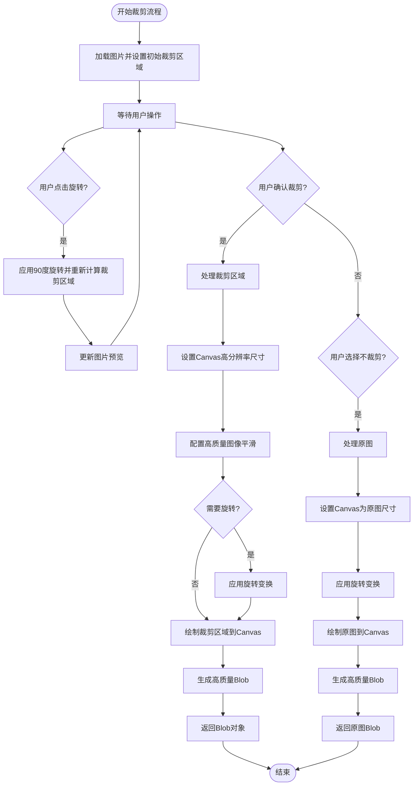
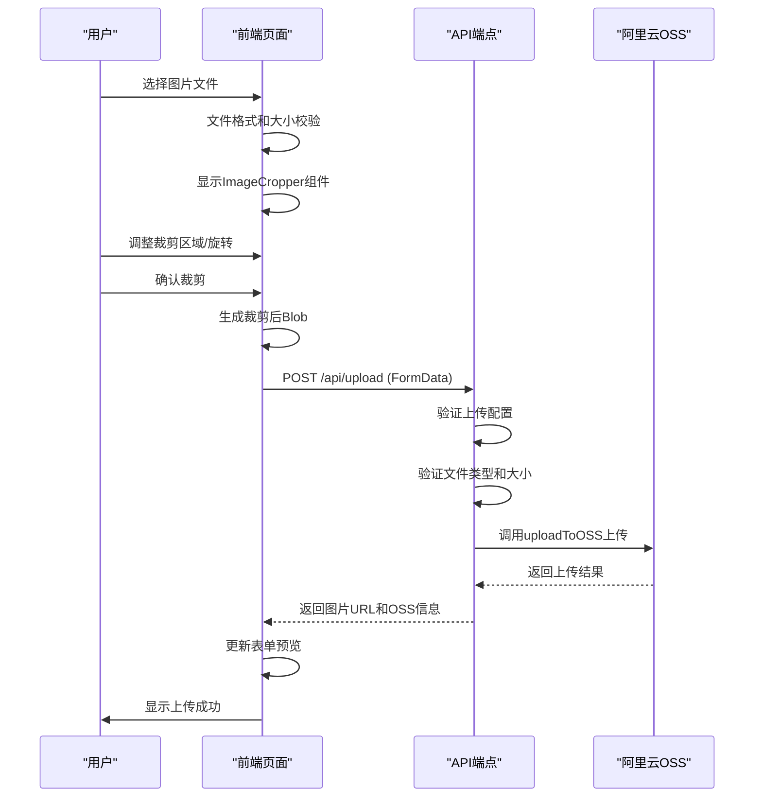

# 作品上传

<cite>
**本文档引用的文件**  
- [ImageCropper.tsx](file://src/components/ImageCropper.tsx)
- [upload\page.tsx](file://src/app/upload/page.tsx)
- [route.ts](file://src/app/api/upload/route.ts)
- [oss.ts](file://src/lib/oss.ts)
- [work.d.ts](file://src/types/work.d.ts)
</cite>

## 目录
1. [流程概述](#流程概述)
2. [文件选择与裁剪](#文件选择与裁剪)
3. [图像处理逻辑](#图像处理逻辑)
4. [OSS上传机制](#oss上传机制)
5. [上传状态与刷新](#上传状态与刷新)
6. [常见问题与解决方案](#常见问题与解决方案)

## 流程概述

作品上传功能从Upload页面的文件选择开始，用户通过点击或拖拽方式选择图片文件。系统首先进行文件格式和大小的前端校验，随后进入ImageCropper组件进行16:9比例裁剪和旋转处理。裁剪完成后，图像以Blob形式通过OSS签名上传至阿里云存储，上传成功后作品状态设置为PENDING待审核，并自动刷新作品流以反映最新状态。

**Section sources**
- [upload\page.tsx](file://src/app/upload/page.tsx#L0-L645)

## 文件选择与裁剪

上传流程始于Upload页面的文件选择功能，用户可通过点击或拖拽方式选择图片。系统在前端进行文件格式和大小校验，确保符合上传配置要求。验证通过后，系统使用FileReader创建图片预览并触发ImageCropper组件。

ImageCropper组件集成ReactCrop库，强制16:9的宽高比裁剪。用户可拖拽调整裁剪区域，组件提供旋转功能，每次点击旋转按钮将图片顺时针旋转90度，并重新计算裁剪区域以保持16:9比例。用户可选择"确认裁剪"应用裁剪，或"不裁剪"直接使用原图（含旋转效果）。

**Section sources**
- [upload\page.tsx](file://src/app/upload/page.tsx#L158-L201)
- [ImageCropper.tsx](file://src/components/ImageCropper.tsx#L40-L309)

## 图像处理逻辑

ImageCropper组件使用HTML5 Canvas进行图像处理。裁剪逻辑通过`getCroppedImg`函数实现，该函数根据裁剪区域坐标、图片自然尺寸和设备像素比计算精确的像素坐标。处理流程包括：设置Canvas尺寸为裁剪区域的高分辨率版本，配置高质量图像平滑，应用旋转变换（如需要），然后使用`drawImage`方法绘制裁剪区域。

旋转功能通过`handleRotate`函数实现，该函数更新旋转状态并重新计算中心裁剪区域。当用户选择"不裁剪"时，系统会创建一个与原图等大的Canvas，应用旋转变换后绘制原图，最后通过`canvas.toBlob`生成高质量JPEG格式的Blob对象（质量设置为0.95）。

**Diagram sources**
- [ImageCropper.tsx](file://src/components/ImageCropper.tsx#L40-L309)

**Section sources**
- [ImageCropper.tsx](file://src/components/ImageCropper.tsx#L40-L309)

## OSS上传机制

裁剪后的图像通过`uploadToOSS`函数上传至阿里云OSS。该函数支持File或Buffer类型的输入，自动处理文件类型转换。上传前，系统根据配置生成唯一文件名（包含时间戳和随机字符串），并添加"works"文件夹前缀。上传请求包含详细的OSS头部信息，包括存储类型（Standard）、访问权限（public-read）、缓存控制和文件标签。

前端通过调用`/api/upload` API端点触发上传，该端点验证上传配置后调用`uploadToOSS`函数。上传成功后返回包含URL、OSS键名、文件大小和MIME类型的信息。系统未实现分片上传优化和错误重试机制，所有上传均以单次请求完成。

**Diagram sources**
- [route.ts](file://src/app/api/upload/route.ts#L0-L114)
- [oss.ts](file://src/lib/oss.ts#L50-L106)

**Section sources**
- [upload\page.tsx](file://src/app/upload/page.tsx#L0-L645)
- [route.ts](file://src/app/api/upload/route.ts#L0-L114)
- [oss.ts](file://src/lib/oss.ts#L50-L106)

## 上传状态与刷新

上传成功后，系统通过`/api/works`端点创建作品记录，作品状态自动设置为PENDING待审核。审核流程由管理员通过后台管理界面完成，审核通过后状态变为APPROVED，作品将公开展示。

作品流的刷新通过InfiniteScrollWorks组件实现，该组件使用IntersectionObserver监听滚动位置，当用户滚动到页面底部时自动加载下一页作品。组件还提供`refreshTrigger`属性，当该值变化时会重新加载第一页数据，实现手动刷新功能。上传成功后跳转回首页会触发作品流的重新加载。

**Section sources**
- [upload\page.tsx](file://src/app/upload/page.tsx#L0-L645)
- [route.ts](file://src/app/api/works/route.ts#L0-L206)
- [InfiniteScrollWorks.tsx](file://src/components/InfiniteScrollWorks.tsx#L7-L267)

## 常见问题与解决方案

### 大文件上传失败
当上传文件超过配置的最大大小时，前端会显示"文件大小不能超过XMB"的错误提示。解决方案包括：压缩图片质量、调整图片尺寸或联系管理员提高上传限制。

### 跨域配置错误
系统未显示具体的跨域配置，但OSS上传通过服务器端API代理，避免了前端直接与OSS交互的跨域问题。如遇上传失败，应检查服务器端环境变量（ALI_OSS_REGION, ALI_OSS_ACCESS_KEY_ID等）是否正确配置。

### 文件格式不支持
仅支持JPG、JPEG、PNG和GIF格式的图片上传。上传其他格式文件会显示"不支持的文件类型"错误。用户应确保上传文件为支持的格式。

### 上传功能不可用
上传功能受管理员配置控制，包括启用状态、开始时间和结束时间。如上传按钮显示"上传已关闭"或"上传未开始"，需等待管理员开启上传或在指定时间窗口内上传。

**Section sources**
- [upload\page.tsx](file://src/app/upload/page.tsx#L0-L645)
- [route.ts](file://src/app/api/upload/route.ts#L0-L114)
- [UploadConfigManagement.tsx](file://src/components/admin/UploadConfigManagement.tsx#L0-L48)