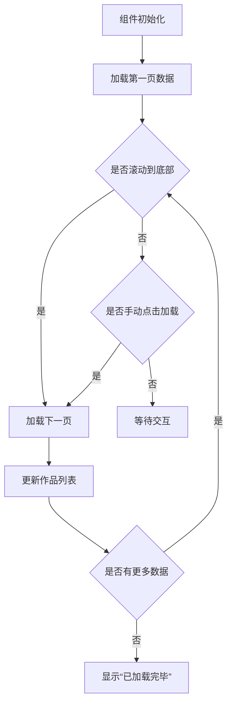
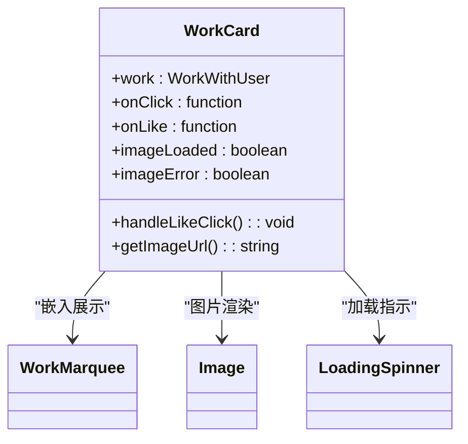
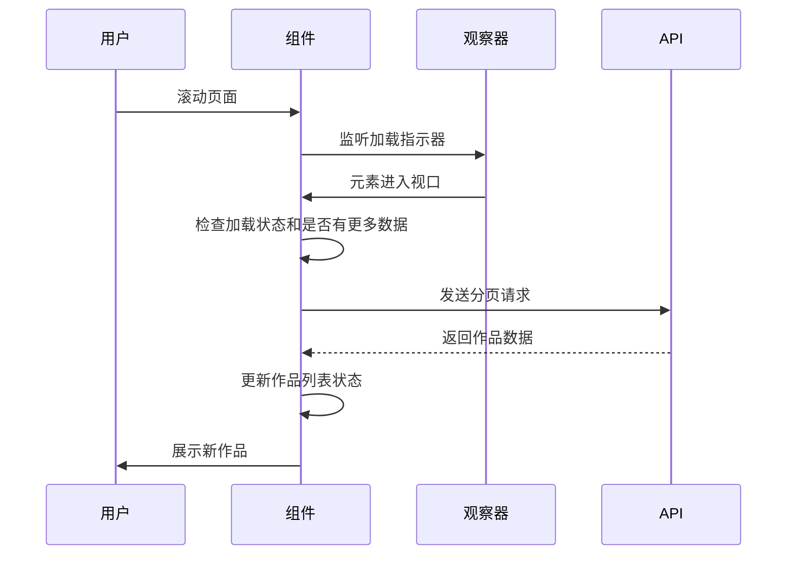
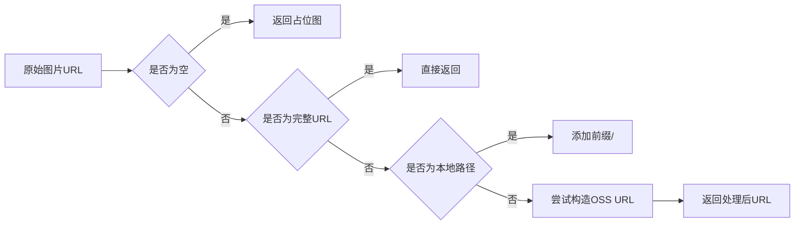
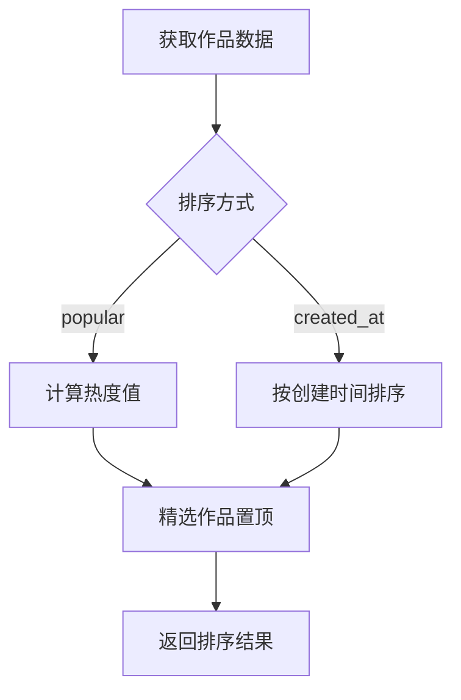
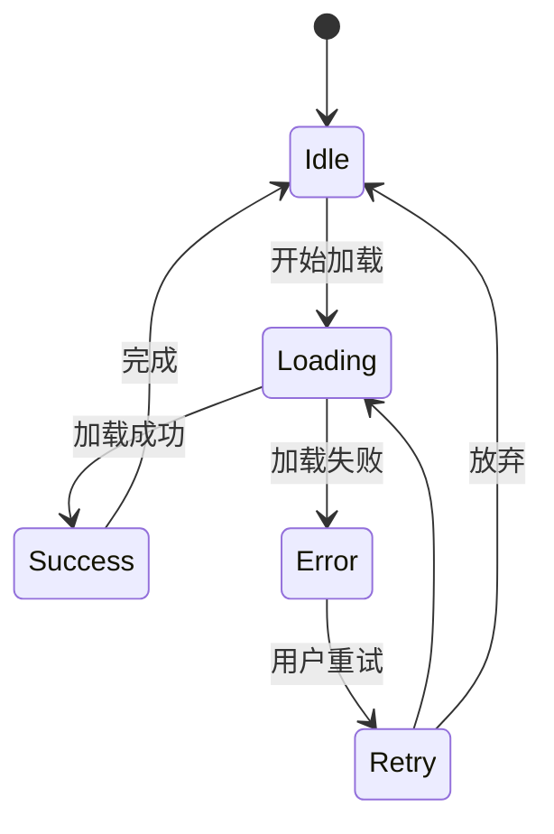

# 作品展示

<cite>
**本文档引用文件**  
- [InfiniteScrollWorks.tsx](file://src/components/InfiniteScrollWorks.tsx)
- [WorkCard.tsx](file://src/components/WorkCard.tsx)
- [WorkMarquee.tsx](file://src/components/WorkMarquee.tsx)
- [image-url.ts](file://src/lib/image-url.ts)
- [globals.css](file://src/app/globals.css)
- [route.ts](file://src/app/api/works/route.ts)
</cite>

## 目录
1. [简介](#简介)
2. [核心组件分析](#核心组件分析)
3. [无限滚动机制](#无限滚动机制)
4. [作品卡片实现](#作品卡片实现)
5. [API 接口与查询参数](#api-接口与查询参数)
6. [排序算法实现](#排序算法实现)
7. [错误处理与加载状态](#错误处理与加载状态)
8. [性能优化建议](#性能优化建议)

## 简介
本系统实现了数字化作品的互动展示功能，核心机制包括无限滚动加载、响应式布局、图片懒加载和分页缓存管理。通过 `InfiniteScrollWorks` 组件实现流畅的作品展示，结合 `WorkCard` 和 `WorkMarquee` 提供良好的用户体验。系统支持按热度和时间排序，并具备完善的错误处理和加载反馈机制。

## 核心组件分析

### InfiniteScrollWorks 组件
该组件负责管理作品列表的无限滚动加载逻辑，采用 IntersectionObserver 实现滚动触发加载，结合分页缓存策略提升性能。

**组件特性：**
- 使用 ref 同步状态避免闭包问题
- 支持手动和自动加载两种模式
- 内置防抖机制防止重复请求
- 支持刷新触发器重新加载数据



**图示来源**  
- [InfiniteScrollWorks.tsx](file://src/components/InfiniteScrollWorks.tsx#L7-L267)

### WorkCard 组件
实现作品卡片的响应式布局和图片懒加载功能，提供精选徽章、点赞和浏览量展示等交互元素。

**核心功能：**
- 图片加载状态管理（加载中、成功、失败）
- 点击事件隔离（防止冒泡）
- 响应式尺寸适配
- 图片错误降级处理



**图示来源**  
- [WorkCard.tsx](file://src/components/WorkCard.tsx#L7-L92)

## 无限滚动机制

### IntersectionObserver 实现
使用现代浏览器的 IntersectionObserver API 检测可视区域变化，当加载指示器进入视口时触发下一页加载。

**防抖策略：**
- 使用 `isLoadingRef` ref 避免重复请求
- 通过 `hasMoreRef` 控制是否还有更多数据
- 设置 `rootMargin: '200px'` 提前触发加载

**分页缓存管理：**
- 所有已加载作品存储在 `allWorks` 状态中
- 按每行 8 个作品进行分组展示
- 支持刷新触发器重新初始化状态



**图示来源**  
- [InfiniteScrollWorks.tsx](file://src/components/InfiniteScrollWorks.tsx#L7-L267)

## 作品卡片实现

### 响应式布局
通过 Tailwind CSS 的响应式设计实现多端适配：

- 移动端：单列布局
- 平板端：双列布局
- 桌面端：多列网格布局

使用 `responsive-grid` 工具类实现自适应网格。

### 图片懒加载
实现三级图片加载状态管理：

1. **加载中**：显示旋转加载动画
2. **加载成功**：渐变显示图片（opacity 从 0 到 1）
3. **加载失败**：显示占位符和错误提示

**图片 URL 处理：**
- 支持绝对 URL（HTTP/HTTPS）
- 支持本地路径（以 / 开头）
- 兼容 Cloudinary 和 OSS 存储
- 自动构造阿里云 OSS URL



**图示来源**  
- [image-url.ts](file://src/lib/image-url.ts#L2-L49)
- [WorkCard.tsx](file://src/components/WorkCard.tsx#L7-L92)

## API 接口与查询参数

### `/api/works` 接口
提供作品数据查询服务，支持多种筛选和排序参数。

**查询参数：**
- `page`: 页码（从 1 开始）
- `limit`: 每页数量（默认 24）
- `status`: 作品状态（APPROVED, PENDING, REJECTED）
- `sortBy`: 排序方式（popular, created_at）

**响应结构：**
```json
{
  "success": true,
  "data": {
    "works": [...],
    "pagination": {
      "page": 1,
      "pages": 5,
      "total": 120
    }
  }
}
```

**图示来源**  
- [route.ts](file://src/app/api/works/route.ts)

## 排序算法实现

### 热度排序 (popular)
综合考虑点赞数和浏览量，计算热度值：

```
热度值 = 点赞数 × 2 + 浏览量 × 0.1
```

在数据库查询层面实现排序，避免前端计算性能开销。

### 时间排序 (created_at)
按作品创建时间倒序排列，最新作品优先展示。

**排序优先级：**
1. 精选作品（featured = true）置顶
2. 按指定排序规则排序
3. 同热度作品按创建时间排序



**图示来源**  
- [route.ts](file://src/app/api/works/route.ts)

## 错误处理与加载状态

### 用户体验设计
提供清晰的加载反馈和错误恢复机制：

**加载状态：**
- 初始加载：显示“正在加载热门作品...”
- 分页加载：显示“加载更多作品...”
- 加载完成：显示“所有热门作品已加载完毕”

**错误处理：**
- 网络错误：显示具体错误信息
- 数据错误：提供“重试”按钮
- 图片加载失败：显示占位符和错误提示

**视觉反馈：**
- 使用渐变遮罩实现平滑滚动过渡
- 卡片悬停效果（缩放和阴影）
- 加载动画和脉冲效果



**图示来源**  
- [InfiniteScrollWorks.tsx](file://src/components/InfiniteScrollWorks.tsx#L7-L267)
- [WorkCard.tsx](file://src/components/WorkCard.tsx#L7-L92)

## 性能优化建议

### 虚拟滚动替代方案
对于大量作品展示，建议采用虚拟滚动：

**优势：**
- 只渲染可视区域内的作品
- 大幅减少 DOM 节点数量
- 提升滚动流畅度

**实现思路：**
- 计算可视区域高度
- 动态渲染可见范围内的作品
- 维持滚动位置一致性

### CDN 缓存策略
优化图片资源加载性能：

**建议配置：**
- 静态资源设置长期缓存（1年）
- API 响应设置短时缓存（5-10分钟）
- 启用 Gzip/Brotli 压缩
- 使用强缓存 + 内容哈希

**缓存层级：**
1. 浏览器缓存（强缓存）
2. CDN 边缘节点缓存
3. 服务器端数据缓存
4. 数据库查询缓存

**图示来源**  
- [image-url.ts](file://src/lib/image-url.ts#L2-L49)
- [globals.css](file://src/app/globals.css)