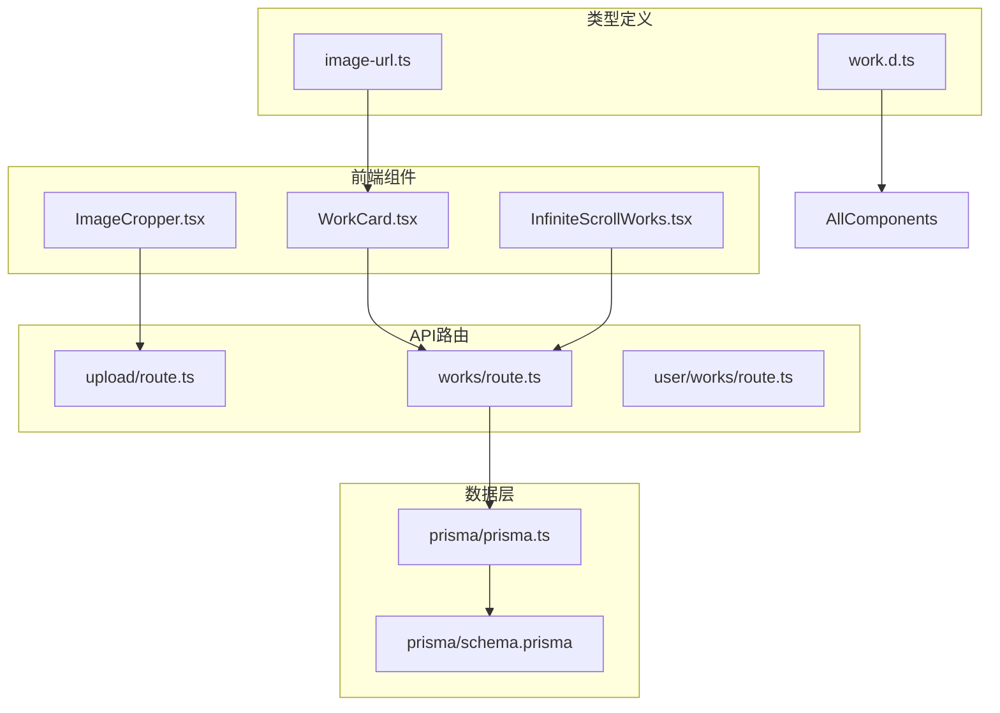
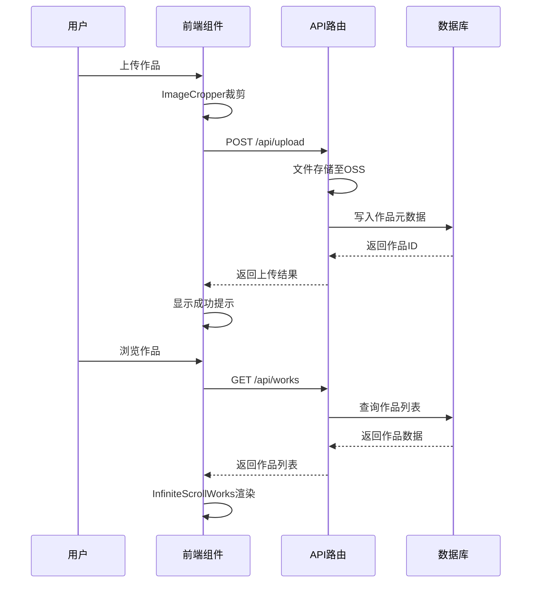
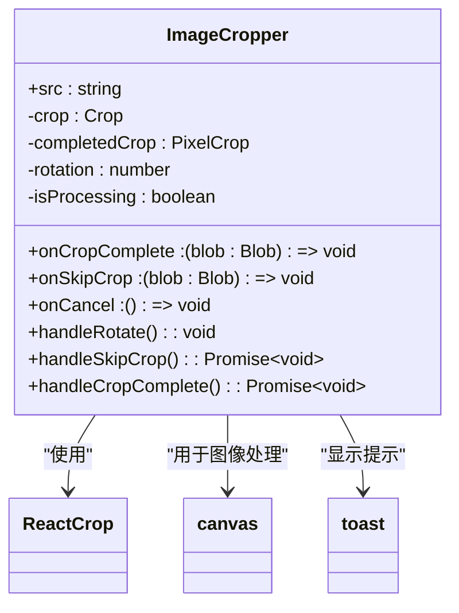
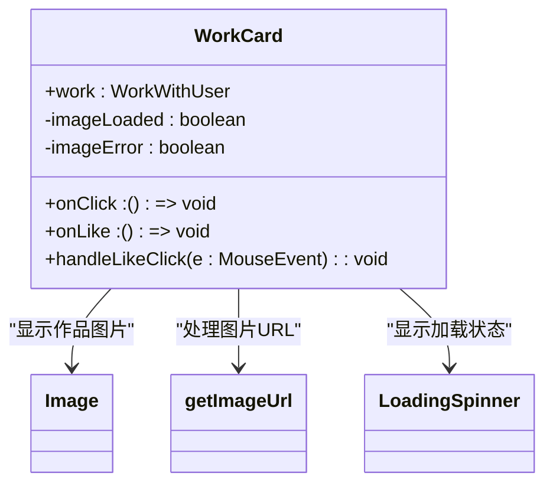

# 作品管理

<cite>
**本文档引用文件**  
- [ImageCropper.tsx](file://src/components/ImageCropper.tsx)
- [WorkCard.tsx](file://src/components/WorkCard.tsx)
- [InfiniteScrollWorks.tsx](file://src/components/InfiniteScrollWorks.tsx)
- [work.d.ts](file://src/types/work.d.ts)
- [image-url.ts](file://src/lib/image-url.ts)
- [upload/route.ts](file://src/app/api/upload/route.ts)
- [works/route.ts](file://src/app/api/works/route.ts)
- [prisma/schema.prisma](file://prisma/schema.prisma)
</cite>

## 目录
1. [简介](#简介)
2. [项目结构](#项目结构)
3. [核心组件](#核心组件)
4. [架构概览](#架构概览)
5. [详细组件分析](#详细组件分析)
6. [依赖分析](#依赖分析)
7. [性能考虑](#性能考虑)
8. [故障排除指南](#故障排除指南)
9. [结论](#结论)

## 简介
本系统实现了完整的数字化作品管理功能，涵盖用户上传、浏览、个人作品展示等核心环节。前端采用现代化组件架构，后端通过API路由处理文件存储与元数据写入，数据库使用Prisma ORM进行Work模型持久化。系统支持无限滚动加载、响应式布局适配，并具备完善的错误边界保护机制。

## 项目结构
作品管理功能分布在多个目录中，形成清晰的分层架构：



**图示来源**  
- [ImageCropper.tsx](file://src/components/ImageCropper.tsx)
- [WorkCard.tsx](file://src/components/WorkCard.tsx)
- [InfiniteScrollWorks.tsx](file://src/components/InfiniteScrollWorks.tsx)
- [work.d.ts](file://src/types/work.d.ts)
- [image-url.ts](file://src/lib/image-url.ts)
- [upload/route.ts](file://src/app/api/upload/route.ts)
- [works/route.ts](file://src/app/api/works/route.ts)
- [prisma/schema.prisma](file://prisma/schema.prisma)

**本节来源**  
- [src/components](file://src/components)
- [src/app/api](file://src/app/api)
- [src/types](file://src/types)
- [prisma](file://prisma)

## 核心组件
系统核心功能由三大组件构成：上传裁剪组件（ImageCropper）、作品卡片组件（WorkCard）和无限滚动组件（InfiniteScrollWorks）。这些组件协同工作，实现从上传到展示的完整流程。

**本节来源**  
- [ImageCropper.tsx](file://src/components/ImageCropper.tsx)
- [WorkCard.tsx](file://src/components/WorkCard.tsx)
- [InfiniteScrollWorks.tsx](file://src/components/InfiniteScrollWorks.tsx)

## 架构概览
系统采用前后端分离架构，前端通过API路由与后端交互，数据持久化通过Prisma ORM完成。



**图示来源**  
- [ImageCropper.tsx](file://src/components/ImageCropper.tsx)
- [upload/route.ts](file://src/app/api/upload/route.ts)
- [works/route.ts](file://src/app/api/works/route.ts)
- [prisma/schema.prisma](file://prisma/schema.prisma)

## 详细组件分析

### 上传裁剪组件分析
ImageCropper组件提供用户友好的图片裁剪功能，支持旋转和比例控制。



**图示来源**  
- [ImageCropper.tsx](file://src/components/ImageCropper.tsx#L40-L309)

**本节来源**  
- [ImageCropper.tsx](file://src/components/ImageCropper.tsx)

### 作品卡片组件分析
WorkCard组件负责单个作品的展示，包含图片加载状态管理和交互功能。



**图示来源**  
- [WorkCard.tsx](file://src/components/WorkCard.tsx#L7-L92)
- [image-url.ts](file://src/lib/image-url.ts#L2-L49)

**本节来源**  
- [WorkCard.tsx](file://src/components/WorkCard.tsx)
- [image-url.ts](file://src/lib/image-url.ts)

### 无限滚动组件分析
InfiniteScrollWorks组件实现作品列表的无限滚动加载，优化用户体验。


**图示来源**  
- [InfiniteScrollWorks.tsx](file://src/components/InfiniteScrollWorks.tsx#L7-L267)

**本节来源**  
- [InfiniteScrollWorks.tsx](file://src/components/InfiniteScrollWorks.tsx)

## 依赖分析
系统各组件之间存在明确的依赖关系，形成清晰的调用链。

```mermaid
graph LR
ImageCropper --> ReactCrop
ImageCropper --> toast
WorkCard --> Image
WorkCard --> getImageUrl
WorkCard --> LoadingSpinner
InfiniteScrollWorks --> WorkMarquee
InfiniteScrollWorks --> LoadingSpinner
InfiniteScrollWorks --> fetch
getImageUrl --> environment : "环境变量"
style ImageCropper fill:#f9f,stroke:#333
style WorkCard fill:#f9f,stroke:#333
style InfiniteScrollWorks fill:#f9f,stroke:#333
```

**图示来源**  
- [ImageCropper.tsx](file://src/components/ImageCropper.tsx)
- [WorkCard.tsx](file://src/components/WorkCard.tsx)
- [InfiniteScrollWorks.tsx](file://src/components/InfiniteScrollWorks.tsx)
- [image-url.ts](file://src/lib/image-url.ts)

**本节来源**  
- [src/components](file://src/components)
- [src/lib](file://src/lib)

## 性能考虑
系统在多个层面进行了性能优化：

1. **图片加载优化**：使用`getImageUrl`函数智能处理不同来源的图片URL，支持CDN缓存
2. **无限滚动**：采用IntersectionObserver实现懒加载，减少初始加载时间
3. **图片处理**：裁剪时使用canvas进行高质量图像处理，确保输出质量
4. **状态管理**：使用ref避免闭包问题，提高组件性能

建议配置CDN缓存策略，对作品图片设置较长的缓存时间（如1年），通过版本化URL实现缓存更新。

## 故障排除指南

### 上传失败排查
1. 检查OSS配置环境变量是否正确设置
2. 确认用户选择的图片格式是否支持
3. 检查网络连接是否正常
4. 查看浏览器控制台是否有JavaScript错误

### 图片加载异常排查
1. 检查图片URL格式是否正确
2. 验证OSS endpoint和bucket配置
3. 确认图片是否已成功上传至OSS
4. 检查CDN缓存是否需要刷新

**本节来源**  
- [ImageCropper.tsx](file://src/components/ImageCropper.tsx)
- [image-url.ts](file://src/lib/image-url.ts)
- [upload/route.ts](file://src/app/api/upload/route.ts)

## 结论
本作品管理系统实现了完整的上传、展示和管理功能，采用现代化的技术栈和架构设计。系统具备良好的可扩展性和维护性，通过组件化设计实现了功能解耦，为用户提供流畅的作品管理体验。