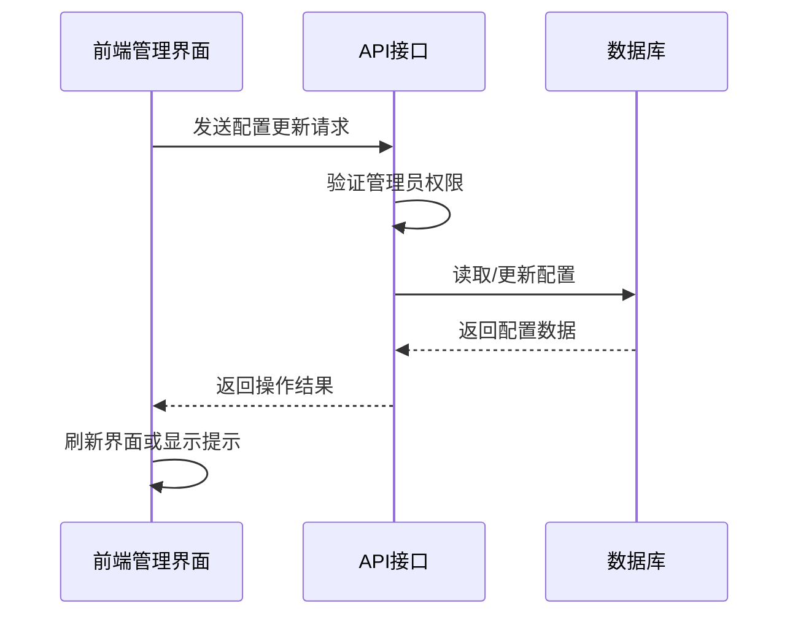
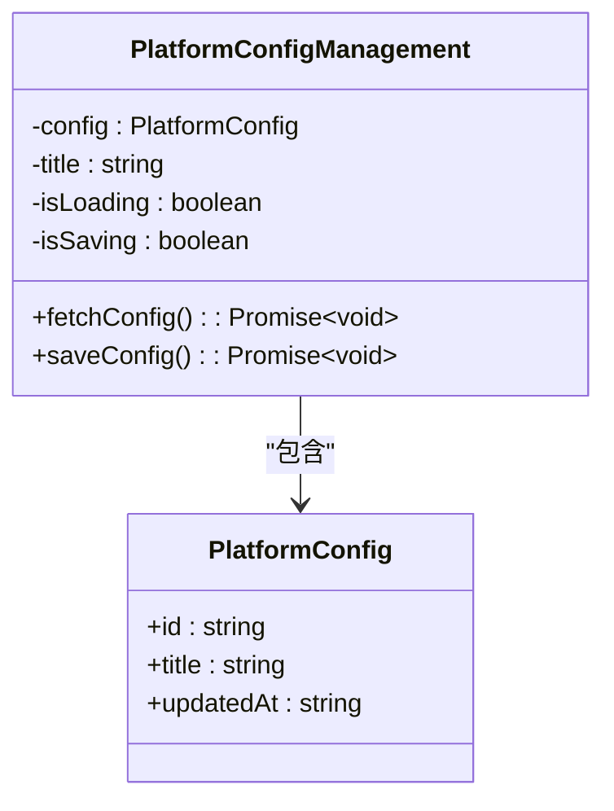
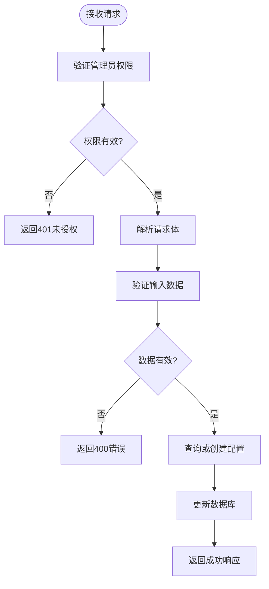
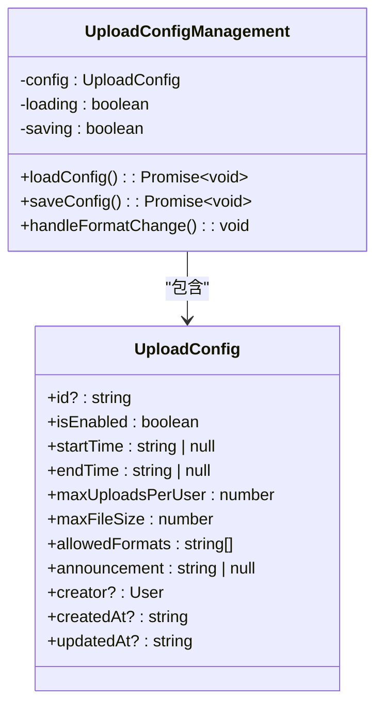
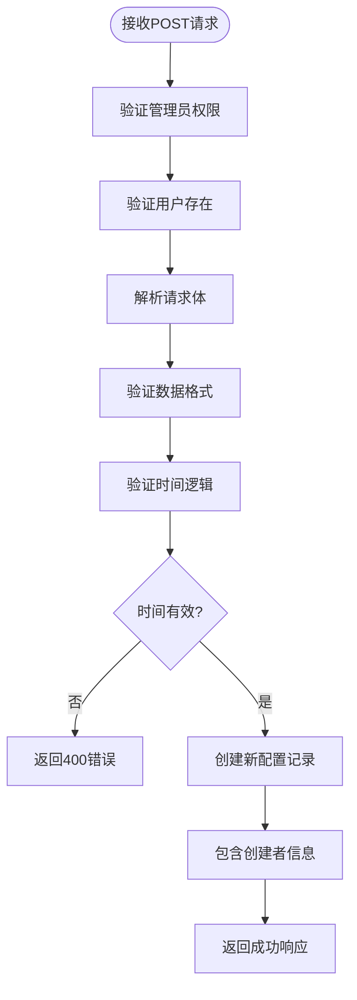
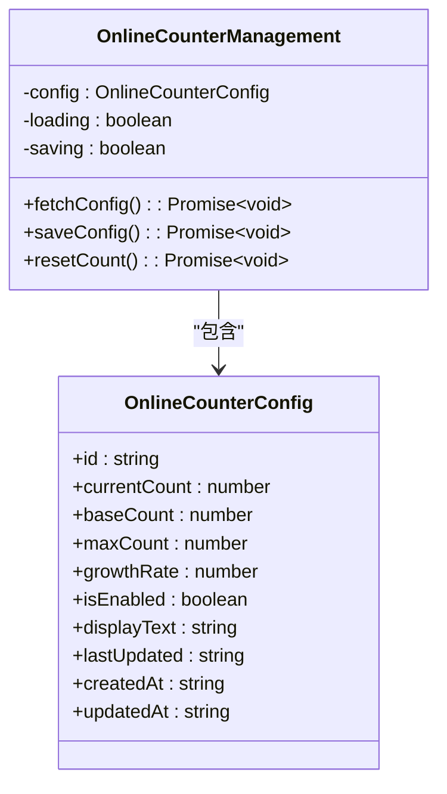
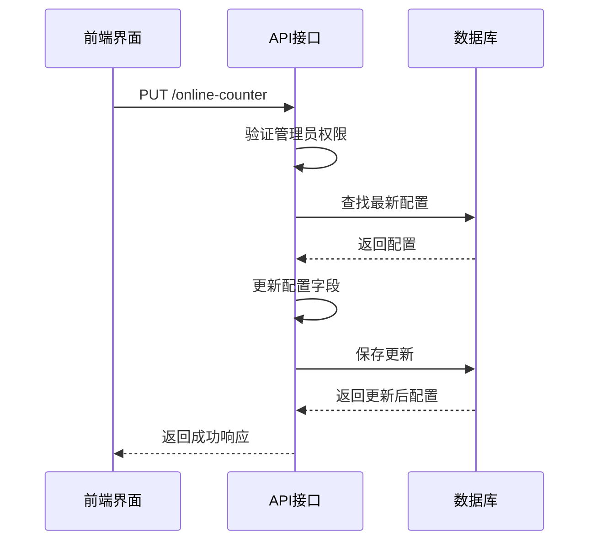
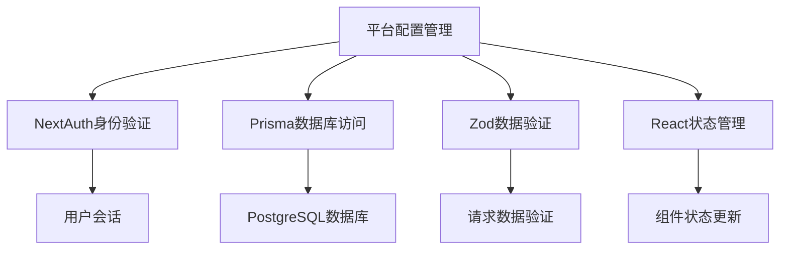

# 平台配置管理

<cite>
**本文档引用的文件**  
- [PlatformConfigManagement.tsx](file://src/components/admin/PlatformConfigManagement.tsx)
- [route.ts](file://src/app/api/platform-config/route.ts)
- [UploadConfigManagement.tsx](file://src/components/admin/UploadConfigManagement.tsx)
- [upload-config/route.ts](file://src/app/api/admin/upload-config/route.ts)
- [OnlineCounterManagement.tsx](file://src/components/admin/OnlineCounterManagement.tsx)
- [online-counter/route.ts](file://src/app/api/admin/online-counter/route.ts)
- [migration.sql](file://prisma/migrations/20250905150839_add_platform_config/migration.sql)
- [migration.sql](file://prisma/migrations/20250905143157_add_online_counter_config/migration.sql)
- [migration.sql](file://prisma/migrations/20250917050212_add_missing_fields/migration.sql)
</cite>

## 目录
1. [简介](#简介)
2. [项目结构](#项目结构)
3. [核心组件](#核心组件)
4. [架构概述](#架构概述)
5. [详细组件分析](#详细组件分析)
6. [依赖分析](#依赖分析)
7. [性能考虑](#性能考虑)
8. [故障排除指南](#故障排除指南)
9. [结论](#结论)

## 简介
本系统为数字化作品互动展示平台提供全面的配置管理功能，涵盖平台参数、上传限制、在线计数器等关键配置项。系统通过API实现管理员对配置的动态修改，配置数据存储于数据库中，并通过前端管理界面进行可视化操作。配置变更即时生效，无需重启服务，系统具备默认值回滚机制以确保稳定性。本文档将系统性地说明配置管理功能的设计与实现。

## 项目结构
平台配置管理相关功能分布在多个目录中，主要包括API路由、前端组件和数据库迁移脚本。API接口位于`src/app/api`目录下，前端管理界面组件位于`src/components/admin`目录，数据库表结构通过Prisma迁移脚本定义在`prisma/migrations`目录中。

```mermaid
graph TB
subgraph "API 接口"
A[/api/platform-config\route.ts]
B[/api/admin/upload-config\route.ts]
C[/api/admin/online-counter\route.ts]
end
subgraph "前端组件"
D[PlatformConfigManagement.tsx]
E[UploadConfigManagement.tsx]
F[OnlineCounterManagement.tsx]
end
subgraph "数据库"
G[20250905150839_add_platform_config]
H[20250905143157_add_online_counter_config]
I[20250917050212_add_missing_fields]
end
D --> A
E --> B
F --> C
A --> G
B --> I
C --> H
```

**图示来源**  
- [PlatformConfigManagement.tsx](file://src/components/admin/PlatformConfigManagement.tsx)
- [route.ts](file://src/app/api/platform-config/route.ts)
- [UploadConfigManagement.tsx](file://src/components/admin/UploadConfigManagement.tsx)
- [upload-config/route.ts](file://src/app/api/admin/upload-config/route.ts)
- [OnlineCounterManagement.tsx](file://src/components/admin/OnlineCounterManagement.tsx)
- [online-counter/route.ts](file://src/app/api/admin/online-counter/route.ts)
- [migration.sql](file://prisma/migrations/20250905150839_add_platform_config/migration.sql)
- [migration.sql](file://prisma/migrations/20250905143157_add_online_counter_config/migration.sql)
- [migration.sql](file://prisma/migrations/20250917050212_add_missing_fields/migration.sql)

**本节来源**  
- [src/components/admin/PlatformConfigManagement.tsx](file://src/components/admin/PlatformConfigManagement.tsx)
- [src/app/api/platform-config/route.ts](file://src/app/api/platform-config/route.ts)
- [prisma/migrations/20250905150839_add_platform_config/migration.sql)

## 核心组件
平台配置管理功能由三个核心组件构成：平台参数配置、上传限制配置和在线计数器配置。每个组件都包含前端管理界面和后端API接口，通过Prisma ORM与数据库交互。配置数据采用单记录模式存储，确保全局唯一性。

**本节来源**  
- [PlatformConfigManagement.tsx](file://src/components/admin/PlatformConfigManagement.tsx)
- [route.ts](file://src/app/api/platform-config/route.ts)
- [UploadConfigManagement.tsx](file://src/components/admin/UploadConfigManagement.tsx)
- [upload-config/route.ts](file://src/app/api/admin/upload-config/route.ts)
- [OnlineCounterManagement.tsx](file://src/components/admin/OnlineCounterManagement.tsx)
- [online-counter/route.ts](file://src/app/api/admin/online-counter/route.ts)

## 架构概述
系统采用前后端分离架构，前端通过fetch API调用后端RESTful接口实现配置管理。后端使用Next.js API路由处理请求，通过Prisma访问数据库。配置数据存储在独立的数据表中，每种配置类型对应一张表。系统实现了完整的权限验证机制，确保只有管理员可以修改配置。



**图示来源**  
- [PlatformConfigManagement.tsx](file://src/components/admin/PlatformConfigManagement.tsx)
- [route.ts](file://src/app/api/platform-config/route.ts)
- [UploadConfigManagement.tsx](file://src/components/admin/UploadConfigManagement.tsx)
- [upload-config/route.ts](file://src/app/api/admin/upload-config/route.ts)

## 详细组件分析

### 平台参数配置分析
平台参数配置组件允许管理员修改平台主标题等基本信息。前端组件提供表单输入和验证功能，后端API实现数据持久化。

#### 前端组件


**图示来源**  
- [PlatformConfigManagement.tsx](file://src/components/admin/PlatformConfigManagement.tsx#L5-L9)

#### 后端API


**图示来源**  
- [route.ts](file://src/app/api/platform-config/route.ts#L44-L113)

**本节来源**  
- [PlatformConfigManagement.tsx](file://src/components/admin/PlatformConfigManagement.tsx)
- [route.ts](file://src/app/api/platform-config/route.ts)
- [migration.sql](file://prisma/migrations/20250905150839_add_platform_config/migration.sql)

### 上传限制配置分析
上传限制配置组件管理用户上传作品的相关设置，包括时间窗口、文件大小限制等。

#### 前端组件


**图示来源**  
- [UploadConfigManagement.tsx](file://src/components/admin/UploadConfigManagement.tsx#L10-L26)

#### 后端API


**图示来源**  
- [upload-config/route.ts](file://src/app/api/admin/upload-config/route.ts#L88-L132)

**本节来源**  
- [UploadConfigManagement.tsx](file://src/components/admin/UploadConfigManagement.tsx)
- [upload-config/route.ts](file://src/app/api/admin/upload-config/route.ts)
- [migration.sql](file://prisma/migrations/20250917050212_add_missing_fields/migration.sql)

### 在线计数器配置分析
在线计数器配置组件管理平台首页显示的虚拟在线人数。

#### 前端组件


**图示来源**  
- [OnlineCounterManagement.tsx](file://src/components/admin/OnlineCounterManagement.tsx#L10-L22)

#### 后端API


**图示来源**  
- [online-counter/route.ts](file://src/app/api/admin/online-counter/route.ts#L57-L118)

**本节来源**  
- [OnlineCounterManagement.tsx](file://src/components/admin/OnlineCounterManagement.tsx)
- [online-counter/route.ts](file://src/app/api/admin/online-counter/route.ts)
- [migration.sql](file://prisma/migrations/20250905143157_add_online_counter_config/migration.sql)

## 依赖分析
配置管理功能依赖于多个核心模块，包括身份验证、数据库访问和前端状态管理。各组件之间通过清晰的接口进行交互，确保了系统的可维护性和扩展性。



**图示来源**  
- [route.ts](file://src/app/api/platform-config/route.ts)
- [upload-config/route.ts](file://src/app/api/admin/upload-config/route.ts)
- [online-counter/route.ts](file://src/app/api/admin/online-counter/route.ts)

**本节来源**  
- [route.ts](file://src/app/api/platform-config/route.ts)
- [upload-config/route.ts](file://src/app/api/admin/upload-config/route.ts)
- [online-counter/route.ts](file://src/app/api/admin/online-counter/route.ts)

## 性能考虑
配置管理功能设计时考虑了性能因素。由于配置数据访问频率高但更新频率低，系统采用了直接数据库查询的方式，避免了额外的缓存层复杂性。API接口实现了输入验证和错误处理，确保了系统的稳定性和安全性。前端组件使用了加载状态和防重复提交机制，提升了用户体验。

## 故障排除指南
当配置未生效或出现数据类型错误时，可按以下步骤排查：

1. **检查权限**：确保操作用户具有管理员角色
2. **验证输入**：检查前端表单输入是否符合验证规则
3. **查看日志**：检查服务器日志中的错误信息
4. **数据库检查**：直接查询数据库确认配置是否已更新
5. **API测试**：使用工具直接调用API接口进行测试

对于配置未生效问题，特别注意前端可能需要手动刷新才能显示最新配置。数据类型错误通常由Zod验证捕获并返回详细的错误信息。

**本节来源**  
- [route.ts](file://src/app/api/platform-config/route.ts)
- [upload-config/route.ts](file://src/app/api/admin/upload-config/route.ts)
- [online-counter/route.ts](file://src/app/api/admin/online-counter/route.ts)

## 结论
平台配置管理功能实现了对关键系统参数的动态管理，通过完善的前后端设计确保了配置变更的即时生效和数据一致性。系统具备良好的错误处理机制和默认值回滚策略，保证了运行的稳定性。建议未来引入配置版本管理功能，记录每次配置变更的历史，便于审计和回滚。