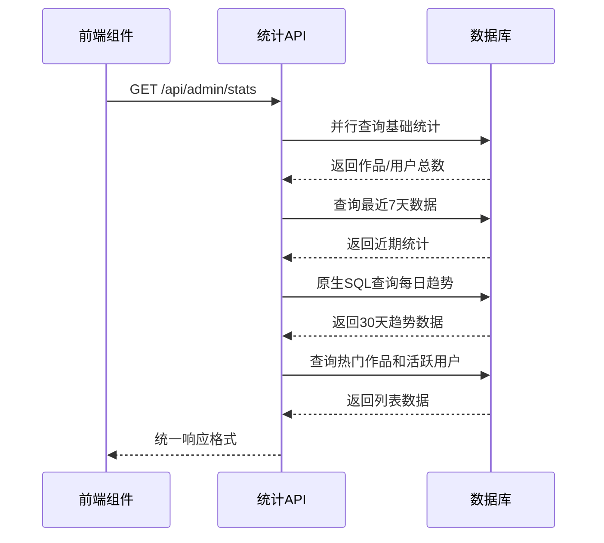
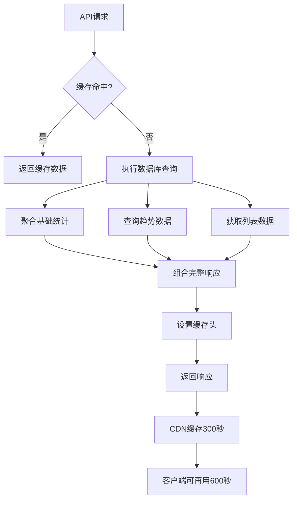
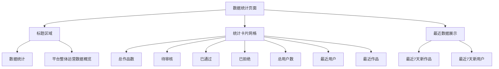
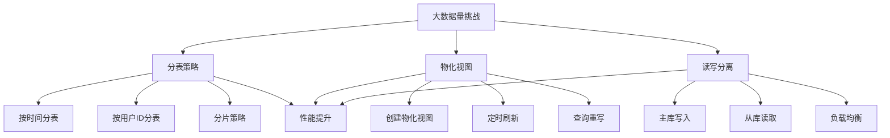
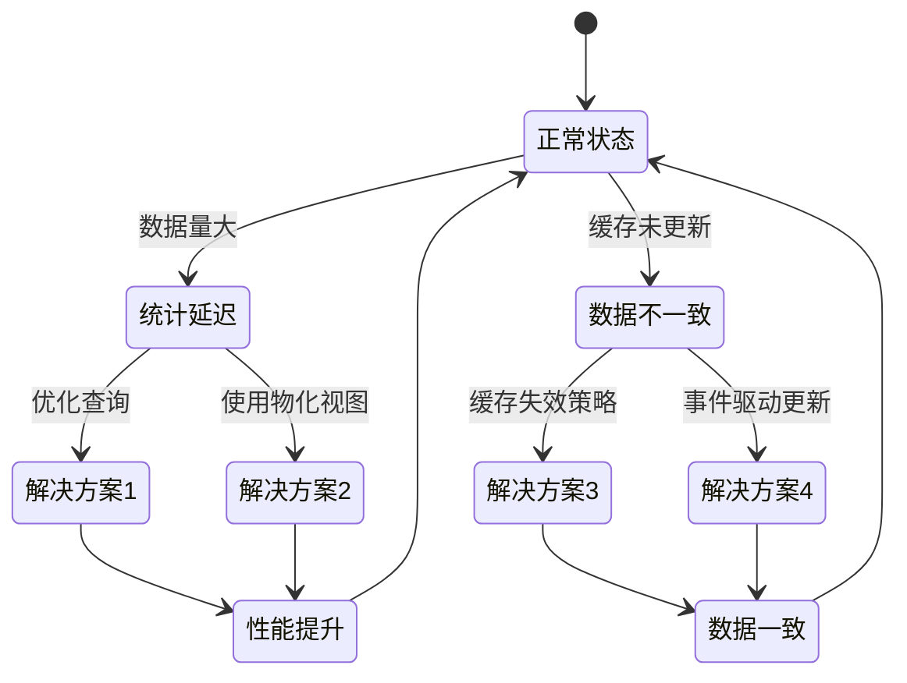

# 数据统计

<cite>
**本文档引用的文件**   
- [route.ts](file://src/app/api/admin/stats/route.ts)
- [AdminStats.tsx](file://src/components/admin/AdminStats.tsx)
- [db-utils.ts](file://src/lib/db-utils.ts)
</cite>

## 目录
1. [简介](#简介)
2. [统计API实现](#统计api实现)
3. [数据缓存策略](#数据缓存策略)
4. [前端图表渲染](#前端图表渲染)
5. [管理员面板布局](#管理员面板布局)
6. [性能分析与优化建议](#性能分析与优化建议)
7. [常见问题与解决方案](#常见问题与解决方案)

## 简介
本系统实现了全面的数据统计功能，涵盖作品数量、用户增长、互动趋势等核心指标。通过Prisma聚合查询获取数据，采用缓存策略提升性能，并在管理员面板中以可视化方式展示。系统支持实时数据刷新和历史趋势分析，为平台运营提供决策支持。

## 统计API实现
统计API通过Prisma客户端实现聚合查询，获取多维度的运营数据。



**Diagram sources**
- [route.ts](file://src/app/api/admin/stats/route.ts#L1-L162)

**Section sources**
- [route.ts](file://src/app/api/admin/stats/route.ts#L1-L162)

## 数据缓存策略
系统采用多层缓存策略确保数据性能和实时性平衡。



**Diagram sources**
- [route.ts](file://src/app/api/admin/stats/route.ts#L149-L155)

**Section sources**
- [route.ts](file://src/app/api/admin/stats/route.ts#L149-L155)

## 前端图表渲染
前端组件负责数据获取和可视化展示，采用响应式设计。

```mermaid
classDiagram
class AdminStats {
+stats : ApiStatsResponse | null
+loading : boolean
+error : string | null
-loadStats() : Promise~void~
+render() : JSX.Element
}
class ApiStatsResponse {
+overview : Overview
+charts : Charts
+lists : Lists
}
class Overview {
+totalUsers : number
+totalWorks : number
+pendingWorks : number
+approvedWorks : number
+rejectedWorks : number
+recentUsers : number
+recentWorks : number
}
class Charts {
+dailyWorks : {date : Date, count : number}[]
+dailyUsers : {date : Date, count : number}[]
}
class Lists {
+popularWorks : any[]
+activeUsers : any[]
}
AdminStats --> ApiStatsResponse : 使用
useApi --> AdminStats : 提供
LoadingSpinner --> AdminStats : 显示
ErrorMessage --> AdminStats : 显示
```

**Diagram sources**
- [AdminStats.tsx](file://src/components/admin/AdminStats.tsx#L8-L26)
- [AdminStats.tsx](file://src/components/admin/AdminStats.tsx#L28-L174)

**Section sources**
- [AdminStats.tsx](file://src/components/admin/AdminStats.tsx#L8-L174)

## 管理员面板布局
管理员面板采用卡片式布局展示统计信息，具有良好的用户体验。



**Diagram sources**
- [AdminStats.tsx](file://src/components/admin/AdminStats.tsx#L105-L174)

**Section sources**
- [AdminStats.tsx](file://src/components/admin/AdminStats.tsx#L105-L174)

## 性能分析与优化建议
针对大数据量场景，系统需要进行性能优化以确保响应速度。

### SQL查询模式分析
当前系统使用多种查询模式，性能特征如下：

| 查询类型 | SQL模式 | 复杂度 | 潜在问题 |
|---------|--------|-------|---------|
| 基础统计 | Prisma count() | O(1) | 无 |
| 分组统计 | groupBy + _count | O(n) | 大数据量时较慢 |
| 趋势分析 | 原生SQL + GROUP BY | O(n) | 需要索引优化 |
| 列表查询 | findMany + orderBy | O(n log n) | 排序性能问题 |

**Section sources**
- [route.ts](file://src/app/api/admin/stats/route.ts#L12-L120)

### 大数据量优化建议


**Diagram sources**
- [db-utils.ts](file://src/lib/db-utils.ts#L58-L67)
- [route.ts](file://src/app/api/admin/stats/route.ts#L53-L75)

**Section sources**
- [db-utils.ts](file://src/lib/db-utils.ts#L58-L67)
- [route.ts](file://src/app/api/admin/stats/route.ts#L53-L75)

## 常见问题与解决方案
系统运行中可能出现统计延迟和数据不一致问题，需要针对性解决。



**Diagram sources**
- [route.ts](file://src/app/api/admin/stats/route.ts#L149-L155)
- [AdminStats.tsx](file://src/components/admin/AdminStats.tsx#L36-L50)

**Section sources**
- [route.ts](file://src/app/api/admin/stats/route.ts#L149-L155)
- [AdminStats.tsx](file://src/components/admin/AdminStats.tsx#L36-L50)