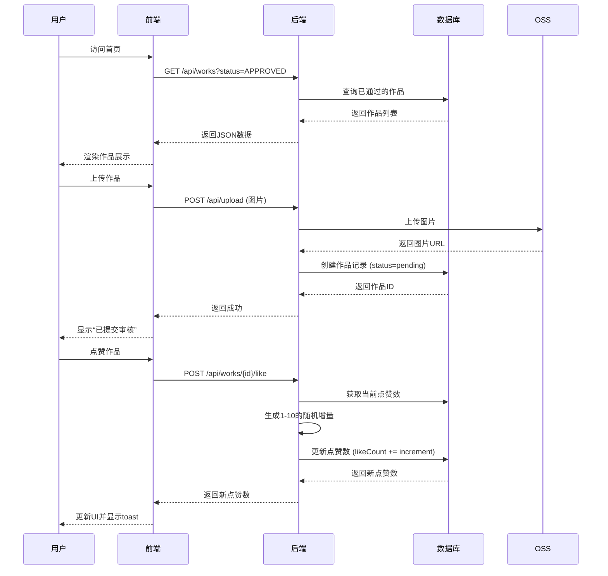
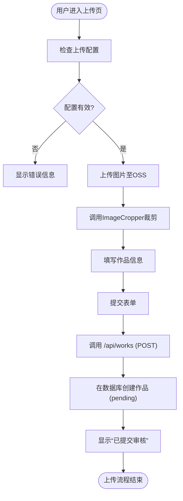
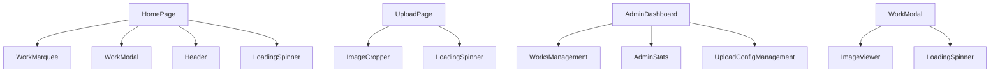

# 核心功能

<cite>
**本文档中引用的文件**  
- [page.tsx](file://src/app/page.tsx)
- [upload\page.tsx](file://src/app/upload/page.tsx)
- [admin\page.tsx](file://src/app/admin/page.tsx)
- [route.ts](file://src/app/api/works/route.ts)
- [route.ts](file://src/app/api/works/[id]/route.ts)
- [route.ts](file://src/app/api/works/[id]/like/route.ts)
- [route.ts](file://src/app/api/admin/works/[id]/approve/route.ts)
- [route.ts](file://src/app/api/admin/works/[id]/reject/route.ts)
- [route.ts](file://src/app/api/user/works/route.ts)
- [route.ts](file://src/app/api/admin/users/route.ts)
- [route.ts](file://src/app/api/admin/stats/route.ts)
- [route.ts](file://src/app/api/admin/upload-config/route.ts)
- [route.ts](file://src/app/api/platform-config/route.ts)
- [route.ts](file://src/app/api/admin/online-counter/route.ts)
- [数字化作品互动展示平台 PRD (产品需求文档).md](file://数字化作品互动展示平台 PRD (产品需求文档).md)
</cite>

## 目录
1. [简介](#简介)
2. [项目结构](#项目结构)
3. [核心组件](#核心组件)
4. [架构概览](#架构概览)
5. [详细组件分析](#详细组件分析)
6. [依赖分析](#依赖分析)
7. [性能考虑](#性能考虑)
8. [故障排除指南](#故障排除指南)
9. [结论](#结论)

## 简介
本平台旨在为大型线下活动（如云栖大会）提供一个数字化作品互动展示系统。平台支持用户上传AI创作作品（图片与Prompt），并通过审核机制确保内容安全，最终在会场大屏或个人设备上实时展示。系统强调互动性与氛围营造，支持点赞、复制Prompt、动态在线人数模拟等功能。管理员可通过独立后台进行作品审核、用户管理、数据统计与平台配置。本文档系统化地描述了平台所有核心功能，涵盖用户端与管理端的完整业务流程、前端页面、API端点及数据操作。

## 项目结构
平台采用Next.js 15构建，遵循App Router架构。核心功能模块化分布在`src/app`目录下，包括用户界面、API路由和管理后台。数据层使用Prisma ORM连接数据库，并通过OSS存储用户上传的图片。项目结构清晰，分离了前端组件、业务逻辑、数据访问与配置管理。

```mermaid
graph TB
subgraph "前端 (src/app)"
A[app/page.tsx] --> B[作品展示首页]
C[app/upload/page.tsx] --> D[作品上传页]
E[app/admin/page.tsx] --> F[管理后台首页]
G[app/api] --> H[API路由]
end
subgraph "后端服务"
H --> I[数据库 (Prisma)]
H --> J[对象存储 (OSS)]
end
subgraph "静态资源"
K[public] --> L[图片、图标]
end
B --> H
D --> H
F --> H
```

**图示来源**  
- [page.tsx](file://src/app/page.tsx)
- [upload\page.tsx](file://src/app/upload/page.tsx)
- [admin\page.tsx](file://src/app/admin/page.tsx)

**本节来源**  
- [src/app](file://src/app)

## 核心组件
平台的核心功能围绕“作品”（Work）这一核心数据模型展开。用户功能包括注册登录、作品上传、浏览与互动；管理员功能包括作品审核、用户管理、数据统计和平台配置。所有功能通过RESTful API进行交互，前端使用React组件和Next.js Server Actions实现动态交互。系统通过`prisma`进行数据持久化，通过`useSession`管理用户会话，并利用`react-hot-toast`提供用户反馈。

**本节来源**  
- [数字化作品互动展示平台 PRD (产品需求文档).md](file://数字化作品互动展示平台 PRD (产品需求文档).md)
- [types/work.d.ts](file://src/types/work.d.ts)

## 架构概览
系统采用前后端分离的架构。前端负责用户界面渲染与交互，后端通过API路由处理业务逻辑。用户上传作品后，数据暂存于数据库，状态为“待审核”。管理员在后台审核作品，通过则状态变为“已通过”，作品进入前台展示池。用户可浏览作品并进行点赞互动，点赞数由后端随机增量更新。系统通过定时任务和WebSocket（或长轮询）实现数据的实时更新。



**图示来源**  
- [page.tsx](file://src/app/page.tsx)
- [upload\page.tsx](file://src/app/upload/page.tsx)
- [route.ts](file://src/app/api/works/route.ts)
- [route.ts](file://src/app/api/works/[id]/like/route.ts)
- [route.ts](file://src/app/api/upload/route.ts)

## 详细组件分析
### 用户功能分析
#### 作品上传功能
用户通过点击首页的“上传作品”按钮进入上传页面。该页面提供表单用于输入作品名称、作者名、Prompt和上传图片。图片上传后，系统会调用`ImageCropper`组件引导用户进行16:9比例的裁剪，以确保展示美观。表单提交后，前端先将图片上传至OSS，获取图片URL，再将作品信息（含URL）通过POST请求发送至`/api/works`端点。后端接收到请求后，创建一条新的作品记录，状态为`pending`，并将其持久化到数据库。



**图示来源**  
- [upload\page.tsx](file://src/app/upload/page.tsx)
- [route.ts](file://src/app/api/upload/route.ts)
- [route.ts](file://src/app/api/works/route.ts)

**本节来源**  
- [upload\page.tsx](file://src/app/upload/page.tsx)
- [数字化作品互动展示平台 PRD (产品需求文档).md](file://数字化作品互动展示平台 PRD (产品需求文档).md)

#### 作品浏览与互动功能
首页通过`/api/works`端点获取已通过审核的作品列表，并使用`WorkMarquee`和`InfiniteScrollWorks`组件进行展示。作品按“最新”和“热门”两个维度组织：最新作品行每3分钟无缝刷新，热门作品行每10分钟刷新一次。用户点击作品卡片会打开`WorkModal`，显示作品详情。在详情页中，用户可点击“夸夸他”按钮进行点赞。前端通过`fetch`调用`/api/works/{id}/like`端点，后端处理后返回新的点赞数，前端随即更新UI。

**本节来源**  
- [page.tsx](file://src/app/page.tsx)
- [components/WorkCard.tsx](file://src/components/WorkCard.tsx)
- [components/WorkModal.tsx](file://src/components/WorkModal.tsx)
- [route.ts](file://src/app/api/works/[id]/like/route.ts)

### 管理员功能分析
#### 作品审核功能
管理员通过`/admin`路由访问管理后台。后台页面由`AdminDashboard`组件渲染，其中包含`WorksManagement`子组件，用于展示待审核的作品列表。管理员可以查看作品的图片、名称、作者、Prompt等信息。点击“通过”按钮时，前端向`/api/admin/works/{id}/approve`端点发送请求。后端接收到请求后，将作品状态更新为`approved`，设置`approvedAt`时间戳，并赋予一个10-50之间的随机初始点赞数。点击“拒绝”按钮则调用`/api/admin/works/{id}/reject`端点，将状态更新为`rejected`。

**本节来源**  
- [admin\page.tsx](file://src/app/admin/page.tsx)
- [components/admin/WorksManagement.tsx](file://src/components/admin/WorksManagement.tsx)
- [route.ts](file://src/app/api/admin/works/[id]/approve/route.ts)
- [route.ts](file://src/app/api/admin/works/[id]/reject/route.ts)
- [数字化作品互动展示平台 PRD (产品需求文档).md](file://数字化作品互动展示平台 PRD (产品需求文档).md)

#### 用户管理与数据统计功能
管理员后台还集成了用户管理和数据统计功能。`UsersManagement`组件通过调用`/api/admin/users`端点获取所有用户列表，支持查看和管理用户信息。`AdminStats`组件则通过`/api/admin/stats`端点获取核心数据指标，包括作品总上传数、审核通过/拒绝数、总点赞数以及PV/UV等访问数据，为管理员提供运营洞察。

**本节来源**  
- [components/admin/AdminDashboard.tsx](file://src/components/admin/AdminDashboard.tsx)
- [components/admin/AdminStats.tsx](file://src/components/admin/AdminStats.tsx)
- [route.ts](file://src/app/api/admin/users/route.ts)
- [route.ts](file://src/app/api/admin/stats/route.ts)

#### 平台配置功能
系统支持动态平台配置。管理员可通过`UploadConfigManagement`、`PlatformConfigManagement`和`OnlineCounterManagement`等组件修改平台参数。这些配置的读取和更新通过对应的API端点实现，如`/api/admin/upload-config`用于管理上传功能的开关、时间范围和文件限制。这些配置在前端被缓存，并在用户操作时进行实时校验。

**本节来源**  
- [components/admin/UploadConfigManagement.tsx](file://src/components/admin/UploadConfigManagement.tsx)
- [components/admin/PlatformConfigManagement.tsx](file://src/components/admin/PlatformConfigManagement.tsx)
- [route.ts](file://src/app/api/admin/upload-config/route.ts)
- [route.ts](file://src/app/api/platform-config/route.ts)
- [route.ts](file://src/app/api/admin/online-counter/route.ts)

## 依赖分析
系统依赖于多个外部服务和库。核心依赖包括Next.js框架、Prisma ORM、NextAuth.js用于身份验证、React Hot Toast用于通知、Tailwind CSS用于样式。数据存储依赖于关系型数据库（如PostgreSQL）和对象存储服务（如阿里云OSS）。前端组件之间存在清晰的依赖关系，如`HomePage`依赖`WorkMarquee`和`WorkModal`，而`UploadPage`依赖`ImageCropper`。



**图示来源**  
- [page.tsx](file://src/app/page.tsx)
- [upload\page.tsx](file://src/app/upload/page.tsx)
- [admin\page.tsx](file://src/app/admin/page.tsx)
- [components](file://src/components)

**本节来源**  
- [package.json](file://package.json)
- [prisma/schema.prisma](file://prisma/schema.prisma)

## 性能考虑
平台在设计时充分考虑了性能。所有图片资源均通过CDN分