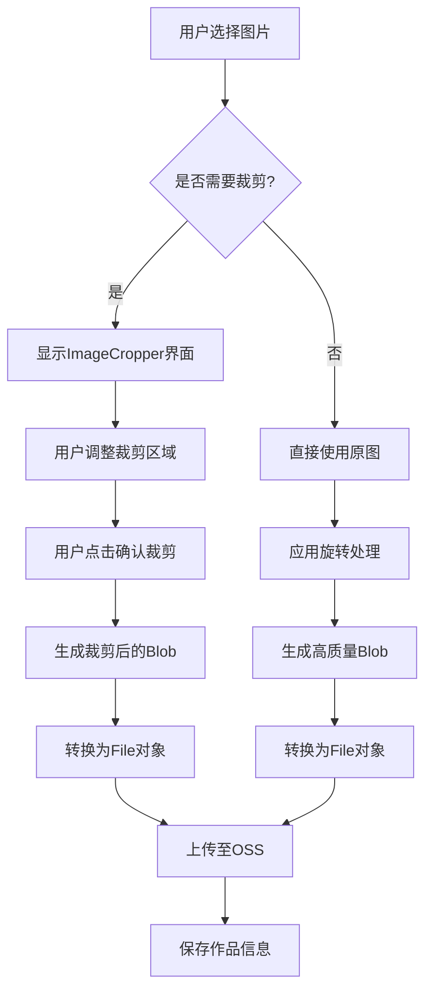
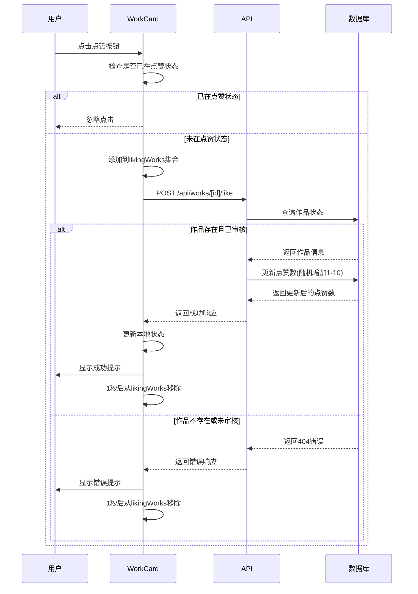
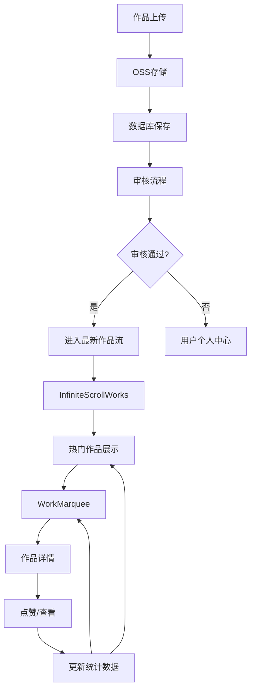

# 核心功能

<cite>
**本文档引用的文件**
- [upload/page.tsx](file://src/app/upload/page.tsx)
- [ImageCropper.tsx](file://src/components/ImageCropper.tsx)
- [WorkCard.tsx](file://src/components/WorkCard.tsx)
- [WorkMarquee.tsx](file://src/components/WorkMarquee.tsx)
- [InfiniteScrollWorks.tsx](file://src/components/InfiniteScrollWorks.tsx)
- [like/route.ts](file://src/app/api/works/[id]/like/route.ts)
- [view/route.ts](file://src/app/api/works/[id]/view/route.ts)
- [upload/route.ts](file://src/app/api/upload/route.ts)
- [oss.ts](file://src/lib/oss.ts)
- [work.d.ts](file://src/types/work.d.ts)
</cite>

## 目录
1. [作品上传与展示](#作品上传与展示)
2. [作品互动](#作品互动)
3. [作品流展示](#作品流展示)
4. [精选作品展示](#精选作品展示)
5. [功能协同](#功能协同)

## 作品上传与展示

该功能允许用户上传数字化作品，通过集成图片裁剪组件确保作品符合展示比例要求，并通过OSS服务实现文件上传。

### 用户旅程
1. 用户进入上传页面
2. 选择图片文件
3. 系统自动弹出裁剪界面，引导用户将图片裁剪为16:9比例
4. 用户可选择确认裁剪、跳过裁剪或取消操作
5. 填写作品信息（名称、作者、Prompt）
6. 提交作品，系统上传至OSS并保存作品信息

### 文件处理流程
上传组件通过`ImageCropper`集成实现图片处理流程：
- 用户选择图片后，系统创建预览并显示裁剪界面
- `ImageCropper`组件支持旋转、跳过裁剪和确认裁剪功能
- 裁剪完成后，将Blob转换为File对象用于上传
- 支持高质量JPEG输出（质量设置为0.95）



**Diagram sources**
- [ImageCropper.tsx](file://src/components/ImageCropper.tsx#L40-L309)
- [upload/page.tsx](file://src/app/upload/page.tsx#L1-L645)

**OSS上传逻辑**
系统通过`uploadToOSS`函数实现文件上传：
- 支持Buffer或File类型的输入
- 可生成唯一文件名避免冲突
- 支持添加文件夹前缀
- 返回标准化的上传结果（包含名称、URL、ETag等）

**Section sources**
- [upload/page.tsx](file://src/app/upload/page.tsx#L1-L645)
- [ImageCropper.tsx](file://src/components/ImageCropper.tsx#L40-L309)
- [oss.ts](file://src/lib/oss.ts#L48-L92)

## 作品互动

该功能通过API接口实现作品的点赞和查看计数，包含防重复提交机制。

### 点赞功能
`WorkCard`组件通过`handleLike`函数实现点赞功能：
- 点击点赞按钮时，触发`onLike`回调
- 通过`fetch`请求调用`/api/works/[id]/like`接口
- 后端随机增加1-10个点赞数，增加互动趣味性
- 返回实际增加的数量用于显示个性化提示

### 查看计数
查看计数在作品被展示时自动触发：
- 当用户查看作品详情时，调用`/api/works/[id]/view`接口
- 每次请求增加1个浏览量
- 仅对已审核通过的作品进行计数

### 防重复提交机制
系统通过多种方式防止重复提交：
- 前端使用`setLikingWorks`状态跟踪正在点赞的作品ID
- 在请求完成前禁用点赞按钮
- 后端验证作品是否存在且已审核通过



**Diagram sources**
- [WorkCard.tsx](file://src/components/WorkCard.tsx#L7-L92)
- [like/route.ts](file://src/app/api/works/[id]/like/route.ts#L0-L64)
- [view/route.ts](file://src/app/api/works/[id]/view/route.ts#L0-L61)

**Section sources**
- [WorkCard.tsx](file://src/components/WorkCard.tsx#L7-L92)
- [like/route.ts](file://src/app/api/works/[id]/like/route.ts#L0-L64)
- [view/route.ts](file://src/app/api/works/[id]/view/route.ts#L0-L61)

## 作品流展示

`InfiniteScrollWorks`组件实现作品的分页加载和无限滚动功能。

### 分页加载机制
- 初始加载第一页数据（24个作品）
- 当用户滚动到页面底部时，自动加载下一页
- 支持手动点击"加载更多"按钮
- 使用IntersectionObserver检测滚动位置

### 状态管理
组件使用多个ref来避免闭包问题：
- `isLoadingRef`：跟踪加载状态
- `hasMoreRef`：跟踪是否还有更多数据
- `currentPageRef`：跟踪当前页码

### 加载流程
```mermaid
flowchart TD
A[初始加载] --> B[设置page=1, hasMore=true]
B --> C[调用loadWorks(1)]
C --> D{是否正在加载?}
D --> |是| E[跳过请求]
D --> |否| F[发送API请求]
F --> G{请求成功?}
G --> |是| H[更新作品列表]
H --> I[更新hasMore状态]
I --> J[通知父组件]
J --> K[设置loading=false]
G --> |否| L[设置错误状态]
L --> K
K --> M{是否有更多数据?}
M --> |是| N[创建IntersectionObserver]
N --> O[监听底部元素]
O --> P{底部元素可见?}
P --> |是| Q[加载下一页]
Q --> C
P --> |否| R[等待滚动]
M --> |否| S[显示"已加载完毕"提示]
```

**Diagram sources**
- [InfiniteScrollWorks.tsx](file://src/components/InfiniteScrollWorks.tsx#L7-L267)

**Section sources**
- [InfiniteScrollWorks.tsx](file://src/components/InfiniteScrollWorks.tsx#L7-L267)

## 精选作品展示

`WorkMarquee`组件实现精选作品的跑马灯式展示效果。

### 实现原理
- 使用CSS动画实现无缝滚动
- 通过复制作品列表确保滚动连续性
- 添加渐变遮罩实现平滑过渡效果
- 支持左右两个方向的滚动

### 关键特性
- 自动处理作品数量不足的情况（少于8个时自动复制）
- 支持自定义滚动速度
- 响应式设计，适配不同屏幕尺寸
- 悬停时暂停滚动（通过CSS实现）


**Diagram sources**
- [WorkMarquee.tsx](file://src/components/WorkMarquee.tsx#L6-L59)

**Section sources**
- [WorkMarquee.tsx](file://src/components/WorkMarquee.tsx#L6-L59)

## 功能协同

各核心功能之间存在紧密的协同关系，形成完整的用户闭环。

### 上传后自动进入展示流
当用户成功上传作品后，作品经过审核即可自动进入作品展示流：
1. 用户上传作品 → 2. 管理员审核 → 3. 作品进入最新作品轮播 → 4. 根据热度进入热门作品流

### 数据联动
- 点赞操作同时更新本地状态和服务器数据
- 浏览量在查看作品时自动增加
- 作品状态变化实时同步到所有展示组件

### 用户体验优化
- 上传页面根据配置动态显示状态信息
- 作品流支持自动刷新和手动刷新
- 提供新内容通知，增强用户参与感



**Diagram sources**
- [upload/page.tsx](file://src/app/upload/page.tsx#L1-L645)
- [InfiniteScrollWorks.tsx](file://src/components/InfiniteScrollWorks.tsx#L7-L267)
- [WorkMarquee.tsx](file://src/components/WorkMarquee.tsx#L6-L59)

**Section sources**
- [upload/page.tsx](file://src/app/upload/page.tsx#L1-L645)
- [InfiniteScrollWorks.tsx](file://src/components/InfiniteScrollWorks.tsx#L7-L267)
- [WorkMarquee.tsx](file://src/components/WorkMarquee.tsx#L6-L59)