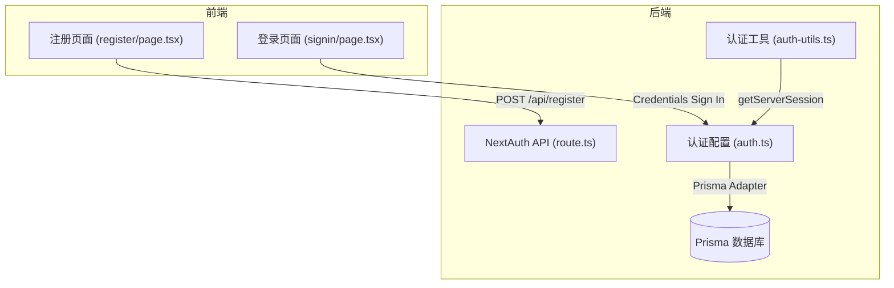
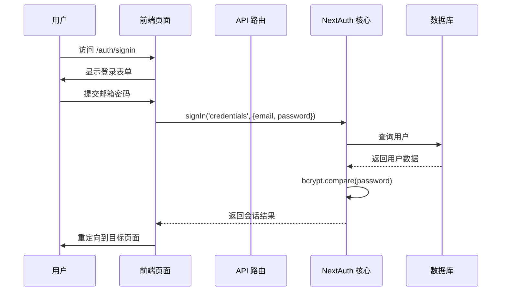
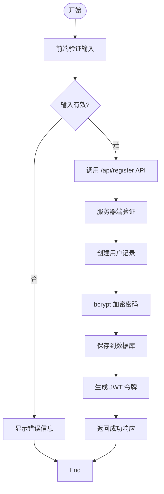
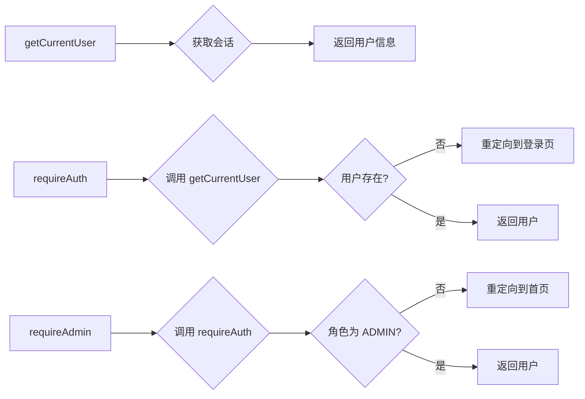
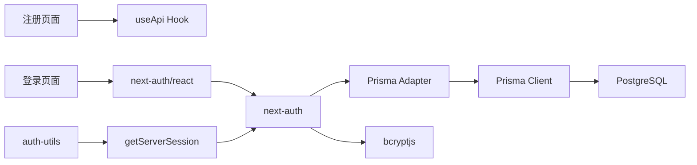

# 用户认证

<cite>
**本文档引用的文件**  
- [auth.ts](file://src/lib/auth.ts)
- [auth-utils.ts](file://src/lib/auth-utils.ts)
- [register/page.tsx](file://src/app/auth/register/page.tsx)
- [signin/page.tsx](file://src/app/auth/signin/page.tsx)
- [route.ts](file://src/app/api/auth/[...nextauth]/route.ts)
- [prisma/schema.prisma](file://prisma/schema.prisma)
</cite>

## 目录
1. [简介](#简介)
2. [项目结构](#项目结构)
3. [核心组件](#核心组件)
4. [架构概览](#架构概览)
5. [详细组件分析](#详细组件分析)
6. [依赖分析](#依赖分析)
7. [性能考虑](#性能考虑)
8. [故障排除指南](#故障排除指南)
9. [结论](#结论)

## 简介
本文档系统性地描述了基于 NextAuth.js 的用户认证功能实现，涵盖注册、登录和会话管理的全流程。重点解析 JWT 令牌生成、会话持久化机制、身份校验中间件的设计与实现。同时说明前端页面与后端 API 的交互流程，包括表单提交、状态同步和错误处理。提供扩展认证提供者和自定义用户模型的方法，并针对常见问题如会话失效、OAuth 配置错误提出解决方案，最后给出缓存策略等性能优化建议。

## 项目结构
用户认证相关代码分布在多个目录中，主要包括：
- `src/app/auth`：包含注册和登录页面的前端实现
- `src/lib/auth.ts` 和 `auth-utils.ts`：认证逻辑核心配置与工具函数
- `src/app/api/auth/[...nextauth]/route.ts`：NextAuth API 路由处理
- `prisma/schema.prisma`：用户数据模型定义



**Diagram sources**  
- [auth.ts](file://src/lib/auth.ts#L1-L72)
- [register/page.tsx](file://src/app/auth/register/page.tsx#L1-L279)
- [signin/page.tsx](file://src/app/auth/signin/page.tsx#L1-L154)

**Section sources**  
- [auth.ts](file://src/lib/auth.ts#L1-L72)
- [auth-utils.ts](file://src/lib/auth-utils.ts#L1-L24)

## 核心组件
本系统使用 NextAuth.js 实现完整的用户认证体系，采用 JWT 会话策略并通过 Prisma 适配器与数据库集成。支持凭据登录（邮箱/密码），并扩展了角色权限管理功能。前端通过 useApi 自定义 Hook 与后端交互，实现了健壮的表单验证和错误反馈机制。

**Section sources**  
- [auth.ts](file://src/lib/auth.ts#L1-L72)
- [auth-utils.ts](file://src/lib/auth-utils.ts#L1-L24)

## 架构概览
系统采用 Next.js App Router 架构，认证流程如下：
1. 用户访问 `/auth/signin` 或 `/auth/register`
2. 前端页面通过 API 路由与后端通信
3. NextAuth 处理认证逻辑，生成 JWT 令牌
4. 会话信息通过回调函数注入到客户端 session
5. 权限中间件通过工具函数校验用户身份



**Diagram sources**  
- [auth.ts](file://src/lib/auth.ts#L1-L72)
- [signin/page.tsx](file://src/app/auth/signin/page.tsx#L1-L154)

## 详细组件分析

### 注册功能分析
注册功能包含前端表单验证和后端用户创建两个部分。前端实现了实时字段验证和错误提示，后端通过 API 路由接收数据并存储到数据库。



**Diagram sources**  
- [register/page.tsx](file://src/app/auth/register/page.tsx#L1-L279)
- [auth.ts](file://src/lib/auth.ts#L1-L72)

**Section sources**  
- [register/page.tsx](file://src/app/auth/register/page.tsx#L1-L279)

### 登录与会话管理
登录流程采用 NextAuth 的凭据提供者模式，通过 JWT 实现无状态会话管理。用户角色信息被注入到令牌和会话中，用于后续权限控制。

```mermaid
classDiagram
class authOptions {
+adapter : PrismaAdapter
+providers : [CredentialsProvider]
+session : {strategy : 'jwt'}
+callbacks : {jwt(), session()}
+pages : {signIn : '/auth/signin'}
+secret : string
}
class CredentialsProvider {
+name : 'credentials'
+credentials : {email, password}
+authorize(credentials) : User | null
}
class JWTCallback {
+jwt({token, user}) : token
+session({session, token}) : session
}
authOptions --> CredentialsProvider : 包含
authOptions --> JWTCallback : 使用回调
```

**Diagram sources**  
- [auth.ts](file://src/lib/auth.ts#L1-L72)

**Section sources**  
- [auth.ts](file://src/lib/auth.ts#L1-L72)
- [signin/page.tsx](file://src/app/auth/signin/page.tsx#L1-L154)

### 权限校验工具
提供了一系列服务器端权限校验工具函数，可用于保护需要认证或特定角色才能访问的页面。



**Diagram sources**  
- [auth-utils.ts](file://src/lib/auth-utils.ts#L1-L24)

**Section sources**  
- [auth-utils.ts](file://src/lib/auth-utils.ts#L1-L24)

## 依赖分析
认证系统依赖于多个核心模块和外部库，形成清晰的依赖链。



**Diagram sources**  
- [package.json](file://package.json)
- [auth.ts](file://src/lib/auth.ts#L1-L72)

**Section sources**  
- [auth.ts](file://src/lib/auth.ts#L1-L72)
- [auth-utils.ts](file://src/lib/auth-utils.ts#L1-L24)

## 性能考虑
虽然当前系统未显式实现缓存策略，但可通过以下方式优化认证性能：
1. 对频繁访问的用户信息进行 Redis 缓存
2. 使用 CDN 缓存静态认证页面
3. 实现会话令牌的本地存储以减少重复验证
4. 数据库查询优化，为常用查询字段添加索引

## 故障排除指南
### 常见问题及解决方案
- **会话失效问题**：检查 `NEXTAUTH_SECRET` 环境变量是否一致，确保 JWT 签名密钥稳定
- **OAuth 配置错误**：验证提供者的客户端 ID 和密钥是否正确配置在环境变量中
- **角色信息丢失**：确认 `jwt` 和 `session` 回调函数正确传递了角色字段
- **数据库连接失败**：检查 Prisma 客户端配置和数据库连接字符串

**Section sources**  
- [auth.ts](file://src/lib/auth.ts#L1-L72)
- [auth-utils.ts](file://src/lib/auth-utils.ts#L1-L24)

## 结论
本系统基于 NextAuth.js 构建了安全可靠的用户认证体系，实现了注册、登录和会话管理的完整流程。通过 JWT 令牌和 Prisma 适配器实现了无状态会话和数据库集成，结合自定义工具函数提供了灵活的权限控制机制。系统结构清晰，易于维护和扩展，为数字化作品互动展示平台提供了坚实的用户管理基础。