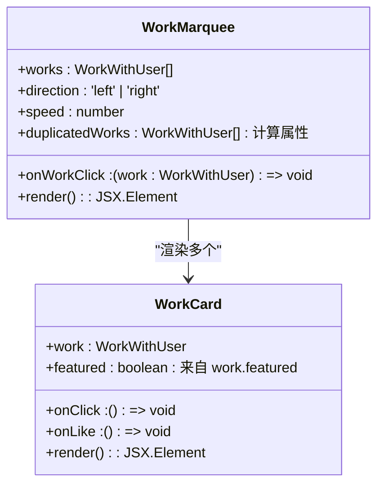

# 精选展示

<cite>
**本文档中引用的文件**  
- [WorkMarquee.tsx](file://src/components/WorkMarquee.tsx)
- [WorkCard.tsx](file://src/components/WorkCard.tsx)
- [work.d.ts](file://src/types/work.d.ts)
- [globals.css](file://src/app/globals.css)
- [tailwind.config.js](file://tailwind.config.js)
- [schema.prisma](file://prisma/schema.prisma)
- [featured/route.ts](file://src/app/api/admin/works/[id]/featured/route.ts)
- [works/route.ts](file://src/app/api/works/route.ts)
</cite>

## 目录
1. [简介](#简介)
2. [核心功能](#核心功能)
3. [滚动动画实现机制](#滚动动画实现机制)
4. [精选作品数据流](#精选作品数据流)
5. [性能与用户体验优化](#性能与用户体验优化)
6. [结论](#结论)

## 简介
`WorkMarquee` 组件是数字化作品互动展示平台中实现精选作品无缝滚动展示的核心UI组件。该组件通过CSS动画与React逻辑结合，实现了作品的自动循环滚动、鼠标悬停暂停、响应式布局等高级交互功能。组件接收作品列表，通过构造重复数据确保滚动连续性，并利用Tailwind CSS的动画系统实现高性能的视觉效果。本技术文档将深入解析其内部实现机制，涵盖动画原理、数据处理、前后端协同及性能优化策略。

**Section sources**
- [WorkMarquee.tsx](file://src/components/WorkMarquee.tsx#L1-L59)

## 核心功能
`WorkMarquee` 组件主要实现以下核心功能：
- **无缝滚动动画**：通过CSS `@keyframes` 和 `animation` 属性实现作品的水平循环滚动。
- **动态速度控制**：通过 `--marquee-duration` CSS变量动态调整滚动速度。
- **交互式暂停**：当用户鼠标悬停在组件上时，动画自动暂停，提升可操作性。
- **滚动连续性保障**：通过构造 `duplicatedWorks` 数组，确保在作品数量不足时仍能实现无缝滚动。
- **响应式设计**：结合渐变遮罩，优化滚动边缘的视觉效果，适配不同屏幕尺寸。
- **精选作品展示**：与 `WorkCard` 组件集成，突出显示被标记为“精选”的作品。

组件通过 `WorkMarqueeProps` 接口接收 `works`（作品数组）、`onWorkClick`（点击回调）、`direction`（滚动方向）和 `speed`（滚动速度）等参数，具有高度的可配置性和复用性。

**Section sources**
- [WorkMarquee.tsx](file://src/components/WorkMarquee.tsx#L1-L59)
- [work.d.ts](file://src/types/work.d.ts#L83-L88)

## 滚动动画实现机制

### CSS动画关键帧
组件的滚动动画由CSS `@keyframes` 规则驱动。在 `src/app/globals.css` 和 `tailwind.config.js` 中定义了名为 `marquee` 的关键帧动画：

```css
@keyframes marquee {
  0% { transform: translateX(0%); }
  100% { transform: translateX(-50%); }
}
```

该动画的核心原理是将元素从其原始位置（`translateX(0%)`）向左移动其自身宽度的50%（`translateX(-50%)`）。通过将作品列表的总宽度设置为单个作品宽度的两倍（即 `duplicatedWorks` 数组的长度），当元素移动到其自身宽度的50%时，恰好是第二个完整作品列表的起始位置，从而实现了视觉上的无缝循环。

```mermaid
flowchart LR
A[初始位置 translateX(0%)] --> B[移动到 translateX(-50%)]
B --> C[视觉上显示为新的作品序列]
C --> D[动画循环]
```

**Diagram sources**
- [globals.css](file://src/app/globals.css#L66-L71)
- [tailwind.config.js](file://tailwind.config.js#L10-L14)

### 动态duration控制
滚动速度通过 `--marquee-duration` CSS变量实现动态控制。在 `WorkMarquee` 组件的JSX中，通过内联样式将 `speed` prop 传递给该变量：

```tsx
style={{
  width: `${duplicatedWorks.length * 340}px`,
  '--marquee-duration': `${speed}s`
} as React.CSSProperties}
```

Tailwind CSS的 `animate-marquee` 类使用该变量作为动画时长：

```css
.animate-marquee {
  animation: marquee var(--marquee-duration, 30s) linear infinite;
}
```

这使得开发者可以在不修改CSS的情况下，通过传递不同的 `speed` 值（如 `speed={20}`）来精确控制每行滚动的时长，满足不同展示场景的需求。

**Section sources**
- [WorkMarquee.tsx](file://src/components/WorkMarquee.tsx#L36-L59)
- [globals.css](file://src/app/globals.css#L77-L78)

### duplicatedWorks数组构造策略
为了确保滚动的连续性，`WorkMarquee` 组件通过 `duplicatedWorks` 数组策略处理不同数量的作品：

```ts
const minWorksForScroll = 8;
const duplicatedWorks = works.length < minWorksForScroll 
  ? [...works, ...works, ...works].slice(0, minWorksForScroll)
  : [...works, ...works];
```

该策略包含两个关键点：
1. **最小作品数保障**：设定 `minWorksForScroll` 为8，确保即使作品数量很少，也能形成足够长的滚动序列，避免在小屏幕上出现明显的空白。
2. **智能克隆**：
   - 当作品数量少于8个时，将原始数组复制三次，然后截取前8个元素，以保证有足够的作品进行滚动。
   - 当作品数量大于等于8个时，仅将原始数组复制一次，形成一个首尾相连的循环序列。

这种策略既保证了滚动的流畅性，又避免了不必要的内存开销。

**Section sources**
- [WorkMarquee.tsx](file://src/components/WorkMarquee.tsx#L15-L20)

## 精选作品数据流

### 后台featured字段标记
精选作品的标记由后台数据库模型 `Work` 中的 `featured` 字段控制。该字段是一个布尔类型（`Boolean`），默认值为 `false`。

```prisma
model Work {
  // ... 其他字段
  featured Boolean @default(false)
  // ... 其他字段
}
```

管理员通过访问 `/api/admin/works/[id]/featured` API端点来切换此状态。在 `src/app/api/admin/works/[id]/featured/route.ts` 中，后端接收请求并更新指定作品的 `featured` 值。

**Section sources**
- [schema.prisma](file://prisma/schema.prisma#L105-L144)
- [featured/route.ts](file://src/app/api/admin/works/[id]/featured/route.ts#L45-L75)

### 前端API筛选与排序
前端通过 `/api/works` API端点获取作品列表。在 `src/app/api/works/route.ts` 中，后端根据 `sortBy` 参数决定排序规则。

当 `sortBy` 为 `default` 时，排序规则优先考虑 `featured` 字段：

```ts
orderBy = [
  { featured: 'desc' }, // 1. 精选作品优先
  { likeCount: 'desc' }, // 2. 点赞数高的在前
  { createdAt: 'desc' } // 3. 新作品在前
];
```

这确保了被标记为“精选”的作品会优先展示在列表的前面。`WorkMarquee` 组件接收这个已排序的列表，从而实现了精选作品的优先展示。

**Section sources**
- [works/route.ts](file://src/app/api/works/route.ts#L32-L90)

### 前端精选徽章渲染
`WorkCard` 组件负责在前端渲染“精选”徽章。当 `work.featured` 为 `true` 时，会显示一个渐变色徽章：

```tsx
{work.featured && (
  <div className="absolute top-2 right-2 z-10">
    <div className="bg-gradient-to-r from-yellow-400 to-orange-500 text-white px-2 py-1 rounded-full text-xs font-bold shadow-lg flex items-center">
      <span className="mr-1">⭐</span>
      精选
    </div>
  </div>
)}
```

这为用户提供了直观的视觉反馈，突出了精选作品。

**Section sources**
- [WorkCard.tsx](file://src/components/WorkCard.tsx#L25-L35)

## 性能与用户体验优化

### 滚动速度自适应算法
虽然当前实现中滚动速度是静态配置的，但根据产品需求文档，可以实现一个自适应算法。该算法可以根据作品数量和容器宽度动态计算 `speed` 值，以保持恒定的视觉滚动速度。

例如，可以计算每个作品通过视口所需的时间，然后根据总作品数计算总动画时长。这需要在 `WorkMarquee` 组件中使用 `useEffect` 和 `useRef` 来测量DOM元素的宽度。

### 移动端触摸事件支持
根据产品需求文档，移动端应禁用自动横向滚动，转为单列垂直瀑布流。这一逻辑应在 `InfiniteScrollWorks` 组件中实现，通过 `useMediaQuery` 或 `window.matchMedia` 检测设备类型，并根据结果决定是否渲染 `WorkMarquee` 组件。

```tsx
{isMobile ? (
  // 渲染垂直瀑布流
  <div className="space-y-4">{works.map(...)}</div>
) : (
  // 渲染多行滚动
  {workRows.map((rowWorks, rowIndex) => (
    <WorkMarquee works={rowWorks} direction={rowIndex % 2 === 0 ? 'left' : 'right'} />
  ))}
)}
```

**Section sources**
- [InfiniteScrollWorks.tsx](file://src/components/InfiniteScrollWorks.tsx#L210-L249)

### 性能监控指标
- **FPS稳定性**：由于滚动动画使用的是CSS `transform` 和 `animation`，这些属性由浏览器的合成器（compositor）处理，通常能保持60FPS的流畅度。通过Chrome DevTools的Performance面板可以监控FPS。
- **内存占用优化**：
  - `duplicatedWorks` 数组的构造是轻量级的，因为它只是对原始对象的引用，不会创建新的对象实例。
  - 使用 `IntersectionObserver` 在 `InfiniteScrollWorks` 中实现懒加载，避免一次性渲染过多DOM节点。
  - `WorkCard` 内部使用Next.js的 `Image` 组件，支持懒加载和响应式图片，有效控制内存和带宽使用。



**Diagram sources**
- [WorkMarquee.tsx](file://src/components/WorkMarquee.tsx#L1-L59)
- [WorkCard.tsx](file://src/components/WorkCard.tsx#L7-L92)

## 结论
`WorkMarquee` 组件通过巧妙的CSS动画与React逻辑结合，实现了高效、流畅的精选作品滚动展示。其核心在于利用 `@keyframes` 和 `animation` 实现无缝滚动，通过 `duplicatedWorks` 策略保障滚动连续性，并利用CSS变量实现动态速度控制。前后端通过 `featured` 字段协同工作，实现了精选作品的标记、筛选和优先展示。组件设计充分考虑了性能和用户体验，通过懒加载、响应式设计和高效的动画机制，确保了在各种设备上的流畅运行。该组件是平台内容展示的核心，为用户提供了动态、吸引人的视觉体验。