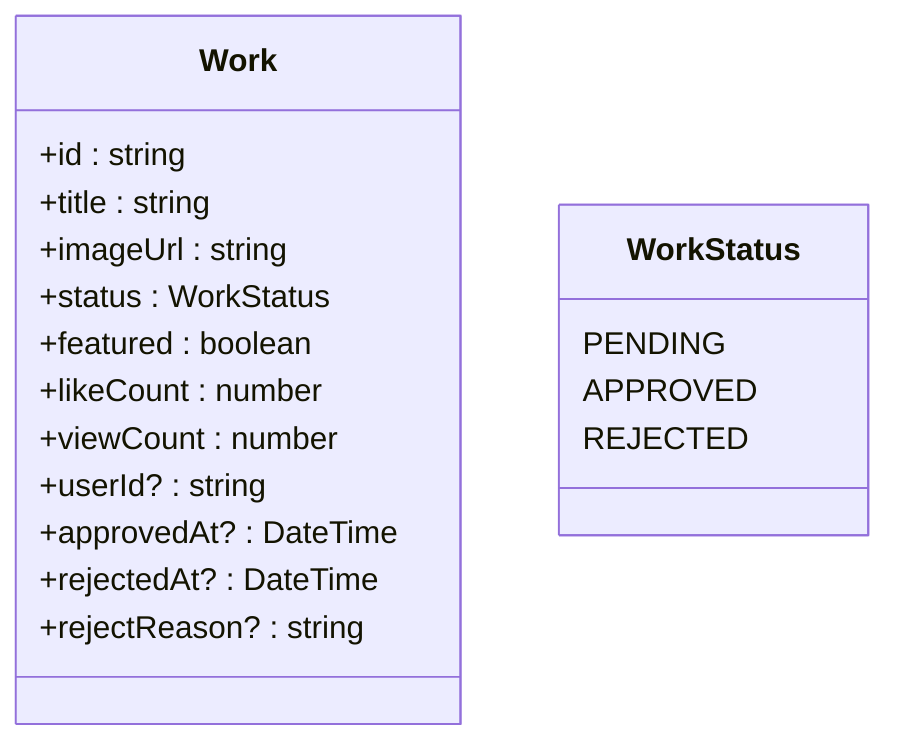
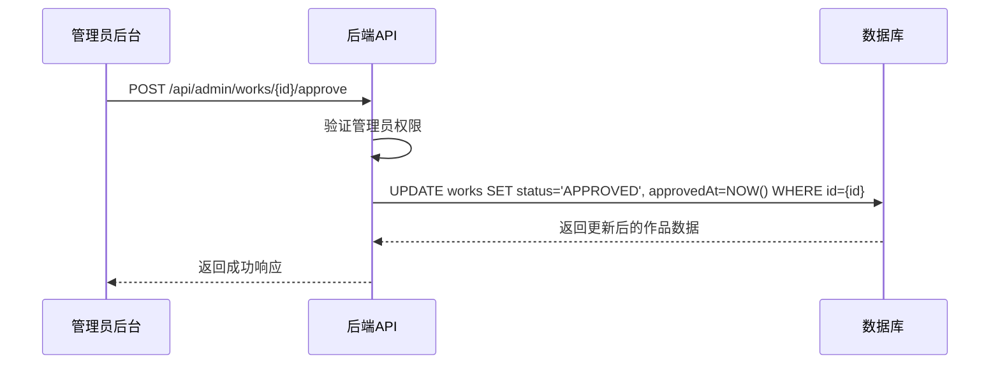

# 作品管理

<cite>
**本文档引用文件**  
- [prisma/schema.prisma](file://prisma/schema.prisma)
- [src/types/work.d.ts](file://src/types/work.d.ts)
- [src/app/api/admin/works/[id]/approve/route.ts](file://src/app/api/admin/works/[id]/approve/route.ts)
- [src/app/api/admin/works/[id]/reject/route.ts](file://src/app/api/admin/works/[id]/reject/route.ts)
- [src/app/api/admin/works/route.ts](file://src/app/api/admin/works/route.ts)
- [src/components/WorkCard.tsx](file://src/components/WorkCard.tsx)
- [src/components/WorksManagement.tsx](file://src/components/admin/WorksManagement.tsx)
</cite>

## 目录
1. [简介](#简介)
2. [作品实体与关键字段](#作品实体与关键字段)
3. [作品管理全流程](#作品管理全流程)
4. [审批接口实现细节](#审批接口实现细节)
5. [前端页面与后端API交互](#前端页面与后端api交互)
6. [典型使用场景](#典型使用场景)
7. [潜在问题与解决方案](#潜在问题与解决方案)
8. [分页与查询优化](#分页与查询优化)
9. [结论](#结论)

## 简介
本技术文档详细阐述了数字化作品互动展示平台中作品管理功能的全流程实现机制。文档涵盖了作品从上传、审核、编辑到状态变更的完整生命周期，重点分析了管理员后台与后端API的交互逻辑，特别是作品审批（approve）和驳回（reject）接口的实现细节。文档结合Prisma数据模型，说明了`Work`实体的关键业务字段，并通过典型场景和潜在问题分析，为系统的稳定运行和持续优化提供指导。

## 作品实体与关键字段
作品管理功能的核心是`Work`数据模型，其在Prisma Schema中定义，承载了所有作品的业务数据。

**Section sources**
- [prisma/schema.prisma](file://prisma/schema.prisma#L39-L160)

### 核心字段及其业务含义
`Work`模型的关键字段定义了作品的状态、属性和行为，是实现管理功能的基础。

| 字段名 | 类型 | 业务含义 |
|--------|------|----------|
| `id` | String | 作品的唯一标识符，使用cuid生成。 |
| `title` | String | 作品的简述信息，用于展示和搜索。 |
| `imageUrl` | String | 作品图片的URL地址，通常指向CDN资源。 |
| `status` | WorkStatus | **审核状态**，枚举类型，包含`PENDING`(待审核)、`APPROVED`(已通过)、`REJECTED`(已拒绝)三种状态，是内容审核的核心控制字段。 |
| `featured` | Boolean | **精选标记**，布尔值，用于标记是否为运营推广的“精选”作品，前端可据此进行特殊展示或优先排序。 |
| `likeCount` | Int | 作品的总点赞数，记录用户互动。 |
| `viewCount` | Int | 作品的总浏览次数，记录作品热度。 |
| `userId` | String? | 外键，关联上传用户的ID，可为空以支持匿名上传。 |
| `approvedAt` / `rejectedAt` | DateTime? | 审核通过或拒绝的时间戳，用于记录审核操作的时间。 |
| `rejectReason` | String? | 审核被拒绝时的原因，提供反馈信息。 |



**Diagram sources**
- [prisma/schema.prisma](file://prisma/schema.prisma#L39-L160)

## 作品管理全流程
作品管理功能覆盖了从内容创建到发布的完整生命周期，主要流程如下：

1.  **作品上传**：用户通过前端`/upload`页面上传作品，触发`/api/upload`接口，后端处理文件并创建`Work`记录，初始`status`为`PENDING`。
2.  **作品审核**：管理员登录后台，通过`/admin`页面访问`WorksManagement`组件，获取待审核作品列表。管理员可对作品执行“通过”或“驳回”操作。
3.  **状态变更**：管理员执行审批操作后，后端API更新作品的`status`、`approvedAt`/`rejectedAt`等字段。
4.  **作品编辑**：管理员或用户（根据权限）可通过`/api/admin/works/[id]/edit`或用户端接口修改作品信息。
5.  **上下架操作**：通过修改`status`字段，可实现作品的“上架”（`APPROVED`）和“下架”（`REJECTED`或`PENDING`）。
6.  **前端展示**：前端组件（如`WorkCard`）根据`status`和`featured`等字段决定是否展示作品及如何渲染。

**Section sources**
- [src/components/admin/WorksManagement.tsx](file://src/components/admin/WorksManagement.tsx#L1-L200)
- [prisma/schema.prisma](file://prisma/schema.prisma#L39-L160)

## 审批接口实现细节
作品的审批（approve）和驳回（reject）是内容管理的核心操作，其后端实现具有严格的权限校验和数据更新逻辑。

**Section sources**
- [src/app/api/admin/works/[id]/approve/route.ts](file://src/app/api/admin/works/[id]/approve/route.ts#L45-L75)
- [src/app/api/admin/works/[id]/reject/route.ts](file://src/app/api/admin/works/[id]/reject/route.ts#L45-L75)

### 权限校验
两个接口均位于`/api/admin`路径下，继承了管理员认证逻辑。在执行任何数据库操作前，会验证当前会话用户是否为管理员角色，确保只有授权人员才能变更作品状态。

### approve接口实现
当管理员点击“通过”时，前端调用`/api/admin/works/[id]/approve`接口。

- **数据库状态更新**：
  ```typescript
  const updatedWork = await prisma.work.update({
    where: { id },
    data: {
      status: WorkStatus.APPROVED,
      approvedAt: new Date()
    },
    include: { user: true } // 返回用户信息
  });
  ```
  此操作将`status`更新为`APPROVED`，并设置`approvedAt`时间戳。`include: { user: true }`确保返回的数据包含上传者信息。

- **错误处理**：
  - 若作品ID不存在，Prisma会抛出`NotFoundError`，后端捕获并返回`404 Not Found`。
  - 若非管理员用户尝试访问，认证中间件会阻止请求，返回`403 Forbidden`。
  - 数据库连接或查询错误会返回`500 Internal Server Error`。

### reject接口实现
当管理员点击“驳回”时，前端调用`/api/admin/works/[id]/reject`接口。

- **数据库状态更新**：
  ```typescript
  const updatedWork = await prisma.work.update({
    where: { id },
    data: {
      status: WorkStatus.REJECTED,
      rejectedAt: new Date(),
      rejectReason: reason // 来自请求体
    },
    include: { user: true }
  });
  ```
  此操作将`status`更新为`REJECTED`，设置`rejectedAt`时间戳，并将管理员输入的`rejectReason`存入数据库。

- **错误处理**：
  - 与`approve`接口类似，处理ID不存在、权限不足和服务器错误。
  - 对`rejectReason`进行基本的非空校验。



**Diagram sources**
- [src/app/api/admin/works/[id]/approve/route.ts](file://src/app/api/admin/works/[id]/approve/route.ts#L45-L75)

## 前端页面与后端API交互
作品管理功能依赖于管理员后台页面与后端API的紧密协作。

### 前端组件
管理员后台的`WorksManagement`组件是核心管理界面，它负责：
- 调用`/api/admin/works`接口获取作品列表。
- 渲染作品列表，显示`title`、`author`、`status`等信息。
- 提供“通过”和“驳回”按钮，点击后分别调用对应的审批API。
- 处理API响应，更新UI状态或显示错误信息。

### 后端API
后端提供了清晰的RESTful API来支持前端操作：
- **获取列表**：`GET /api/admin/works`，支持分页、状态过滤和排序。
- **审批**：`POST /api/admin/works/[id]/approve`，无请求体。
- **驳回**：`POST /api/admin/works/[id]/reject`，请求体包含`rejectReason`。
- **编辑**：`PUT /api/admin/works/[id]/edit`，请求体包含要更新的字段。

**Section sources**
- [src/components/admin/WorksManagement.tsx](file://src/components/admin/WorksManagement.tsx#L1-L200)
- [src/app/api/admin/works/route.ts](file://src/app/api/admin/works/route.ts#L34-L79)

## 典型使用场景
### 场景一：管理员审核流程
1.  管理员登录`/admin`页面。
2.  `WorksManagement`组件加载，向`/api/admin/works?status=PENDING`发起请求，获取所有待审核作品。
3.  管理员浏览作品，决定通过或驳回。
4.  点击“通过”，前端调用`approve`接口。后端更新数据库，作品状态变为`APPROVED`，并记录时间。
5.  前端收到成功响应，刷新列表，该作品从待审核列表中移除，并可能出现在前台的精选或推荐区域。

### 场景二：作品上下架操作
- **上架**：将一个`status`为`PENDING`或`REJECTED`的作品，通过`approve`接口将其`status`更新为`APPROVED`。
- **下架**：将一个`status`为`APPROVED`的作品，通过`reject`接口将其`status`更新为`REJECTED`。此时作品将不再对普通用户可见。

## 潜在问题与解决方案
### 问题一：并发修改冲突
**问题描述**：多个管理员同时审核同一作品，可能导致状态被覆盖或时间戳不一致。

**解决方案**：
- **乐观锁**：在`Work`模型中增加一个`version`字段（Int）。每次更新时，检查数据库中的`version`是否与请求携带的`version`一致，一致则更新并递增`version`，否则返回冲突错误（`409 Conflict`），提示用户刷新页面后重试。
- **队列处理**：对于高并发场景，可将审核请求放入消息队列，由单一消费者按顺序处理，避免并发问题。

### 问题二：审核日志缺失
**问题描述**：当前模型记录了`approvedAt`和`rejectedAt`，但未记录操作者（管理员ID）和详细的审核意见。

**解决方案**：
- **引入审核日志表**：创建新的`AuditLog`或`Review`模型，包含`workId`、`adminId`、`action`（approve/reject）、`comment`、`createdAt`等字段。每次审核操作都向此表插入一条记录，实现完整的操作追溯。

## 分页与查询优化
### 分页策略
后端`GET /api/admin/works`接口采用标准的分页模式：
- **参数**：`page`（页码）和`limit`（每页数量）。
- **实现**：使用Prisma的`skip`和`take`选项进行分页查询。
  ```typescript
  const works = await prisma.work.findMany({
    skip: (page - 1) * limit,
    take: limit,
    where: { status },
    orderBy: { [sortBy]: sortOrder }
  });
  ```

### 查询优化策略
为提升查询性能，特别是对于高频查询，应采取以下优化措施：

- **数据库索引**：在以下字段上创建数据库索引，以加速`WHERE`、`ORDER BY`和`JOIN`操作：
  - `status`: 快速筛选待审核、已通过的作品。
  - `createdAt` 和 `approvedAt`: 按时间排序。
  - `likeCount` 和 `viewCount`: 按热度排序。
  - `userId`: 快速查询特定用户的所有作品。
- **原子操作**：对于`likeCount`和`viewCount`的更新，使用Prisma的`{ increment: 1 }`原子操作，避免“读-改-写”竞态条件，确保计数准确。
- **选择性查询**：在不需要用户信息的场景，避免使用`include: { user: true }`，减少数据传输量。

**Section sources**
- [src/app/api/admin/works/route.ts](file://src/app/api/admin/works/route.ts#L34-L79)
- [src/lib/db-utils.ts](file://src/lib/db-utils.ts#L51-L67)

## 结论
作品管理功能通过`Work`数据模型的`status`和`featured`等关键字段，实现了对内容生命周期的精确控制。后端API提供了安全、健壮的审批接口，配合前端管理员后台，形成了高效的内容审核流程。通过采用原子操作和建议的数据库索引，系统在性能和数据一致性方面得到了保障。针对并发冲突和审计追溯等潜在问题，提出了引入乐观锁和审核日志表的解决方案，为系统的长期稳定运行和功能演进提供了坚实基础。