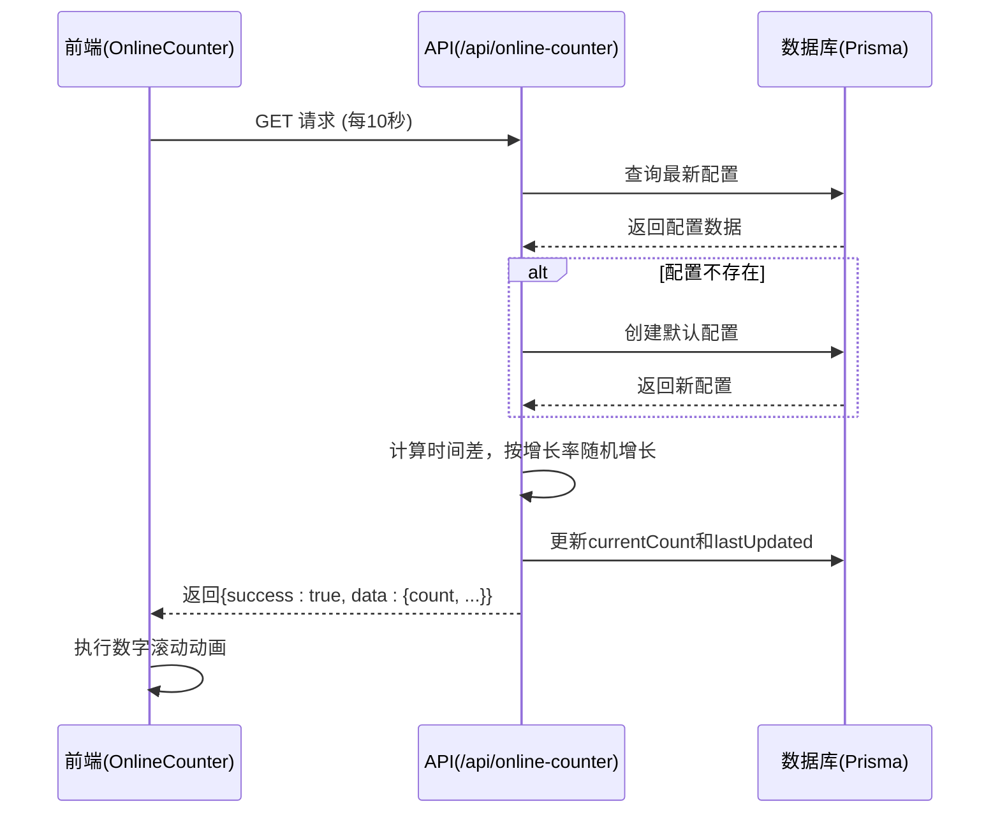
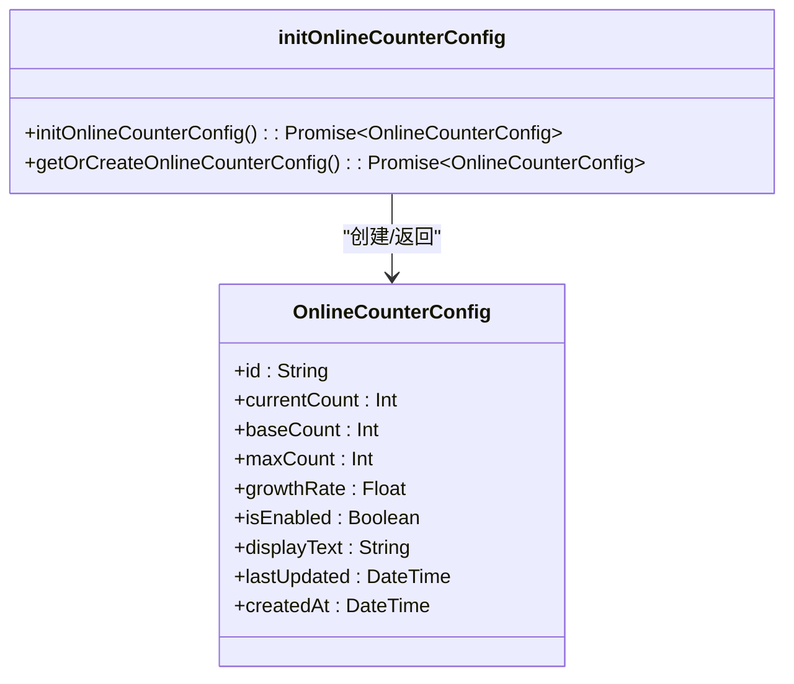
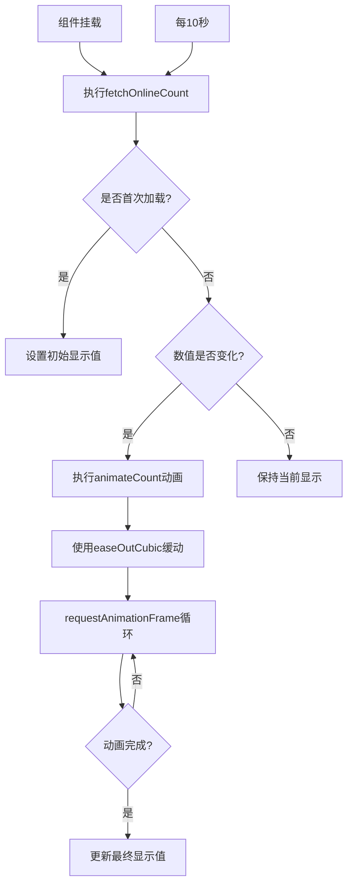

# 在线计数器实现

<cite>
**本文档引用的文件**  
- [init-online-counter.ts](file://src/lib/init-online-counter.ts)
- [OnlineCounter.tsx](file://src/components/OnlineCounter.tsx)
- [route.ts](file://src/app/api/online-counter/route.ts)
- [user-count/route.ts](file://src/app/api/works/user-count/route.ts)
</cite>

## 目录
1. [引言](#引言)
2. [项目结构](#项目结构)
3. [核心组件](#核心组件)
4. [架构概览](#架构概览)
5. [详细组件分析](#详细组件分析)
6. [依赖分析](#依赖分析)
7. [性能考量](#性能考量)
8. [故障排查指南](#故障排查指南)
9. [结论](#结论)

## 引言
本文档深入剖析“数字化作品互动展示平台”中在线计数器功能的技术实现原理。该功能用于模拟并展示当前正在云栖大会创作的用户数量，通过动态增长机制营造活跃氛围。系统采用Prisma操作数据库存储配置，并结合前端轮询与平滑动画提升用户体验。同时，文档还将探讨用户作品数量统计接口的实现方式及其安全机制。

## 项目结构
本项目基于Next.js 15构建，采用App Router架构，整体结构清晰，模块化程度高。核心功能集中在`src/app/api`目录下的API路由中，前端组件位于`src/components`，业务逻辑与初始化脚本存放于`src/lib`。在线计数器相关代码分布如下：
- 初始化逻辑：`src/lib/init-online-counter.ts`
- 前端组件：`src/components/OnlineCounter.tsx`
- API接口：`src/app/api/online-counter/route.ts`
- 用户作品统计：`src/app/api/works/user-count/route.ts`

```mermaid
graph TB
subgraph "前端"
OC[OnlineCounter组件]
FE[Next.js客户端]
end
subgraph "后端"
API[/api/online-counter]
DB[(Prisma数据库)]
end
OC --> |每10秒轮询| API
API --> |读写| DB
API --> |返回数据| OC
```

**图示来源**  
- [OnlineCounter.tsx](file://src/components/OnlineCounter.tsx#L15-L157)
- [route.ts](file://src/app/api/online-counter/route.ts#L1-L188)

**本节来源**  
- [src](file://src#L1)

## 核心组件
系统的核心组件包括在线计数器前端展示组件、后端API接口以及数据库配置初始化模块。这些组件协同工作，实现了动态、实时的在线人数模拟功能。初始化模块确保系统启动时存在默认配置，API接口负责计算和返回当前人数，前端组件则通过轮询获取数据并以动画形式呈现。

**本节来源**  
- [init-online-counter.ts](file://src/lib/init-online-counter.ts#L6-L52)
- [OnlineCounter.tsx](file://src/components/OnlineCounter.tsx#L15-L157)
- [route.ts](file://src/app/api/online-counter/route.ts#L1-L188)

## 架构概览
整个在线计数器功能采用典型的客户端-服务器架构。前端组件在页面加载时初始化，并设置定时器每10秒向后端API发起请求。后端API接收到请求后，根据数据库中存储的最后更新时间与当前时间的差值，按预设的增长率进行随机增量计算，更新数据库并返回最新数据。该设计避免了实时WebSocket的复杂性，同时保证了数据的动态变化。



**图示来源**  
- [OnlineCounter.tsx](file://src/components/OnlineCounter.tsx#L100-L120)
- [route.ts](file://src/app/api/online-counter/route.ts#L10-L80)

## 详细组件分析

### 在线计数器初始化逻辑分析
`init-online-counter.ts` 文件中的 `initOnlineCounterConfig` 函数负责在应用启动时检查并初始化在线人数配置。若数据库中不存在 `onlineCounterConfig` 记录，则创建一条包含默认值的记录，包括基础人数、最大人数、增长率和显示文本等。`getOrCreateOnlineCounterConfig` 函数作为封装，确保调用方总能获取到有效的配置对象。



**图示来源**  
- [init-online-counter.ts](file://src/lib/init-online-counter.ts#L6-L52)

**本节来源**  
- [init-online-counter.ts](file://src/lib/init-online-counter.ts#L6-L52)

### 前端在线计数器组件分析
`OnlineCounter.tsx` 是一个客户端组件，使用React的 `useEffect` 钩子在组件挂载时执行 `fetchOnlineCount` 函数，并设置一个10秒的定时器持续更新数据。组件内部实现了平滑的数字滚动动画，利用 `requestAnimationFrame` 和缓动函数（easeOutCubic）提供流畅的视觉体验。当数据更新时，若新旧数值不同，则触发动画。



**图示来源**  
- [OnlineCounter.tsx](file://src/components/OnlineCounter.tsx#L50-L150)

**本节来源**  
- [OnlineCounter.tsx](file://src/components/OnlineCounter.tsx#L15-L157)

### 在线计数器API接口分析
`/api/online-counter` 的 `GET` 接口是系统的核心。它首先查询最新的配置，若不存在则创建默认配置。关键逻辑在于根据 `lastUpdated` 时间戳计算自上次更新以来经过的时间，并按每10秒一个间隔进行随机增长。增长量为 `0` 到 `growthRate` 之间的随机整数，确保了数据的自然波动。此设计避免了并发更新冲突，因为每次请求都基于当前时间独立计算。

```mermaid
flowchart TD
A[收到GET请求] --> B[查询最新配置]
B --> C{配置存在?}
C --> |否| D[创建默认配置]
C --> |是| E[计算时间差(秒)]
E --> F{时间差>=10秒?}
F --> |否| G[返回当前count]
F --> |是| H[计算间隔数]
H --> I[循环每个间隔]
I --> J[生成0~growthRate随机整数]
J --> K[累加到newCount]
K --> L{是否完成所有间隔?}
L --> |否| I
L --> |是| M[限制newCount在base~max之间]
M --> N[更新数据库currentCount和lastUpdated]
N --> O[返回新数据]
```

**图示来源**  
- [route.ts](file://src/app/api/online-counter/route.ts#L10-L80)

**本节来源**  
- [route.ts](file://src/app/api/online-counter/route.ts#L1-L188)

### 用户作品数量统计分析
`/api/works/user-count` 接口用于获取当前登录用户的作品数量。该接口首先通过 `getServerSession` 验证用户身份，确保只有认证用户才能访问。随后，使用Prisma的 `count` 方法查询 `work` 表中属于该用户ID的记录总数。此接口体现了基本的安全防护措施，即身份验证和错误处理。

**本节来源**  
- [user-count/route.ts](file://src/app/api/works/user-count/route.ts#L1-L41)

## 依赖分析
在线计数器功能依赖于多个核心库和系统组件。前端依赖React进行状态管理和渲染，后端依赖Next.js的API路由和Prisma进行数据库操作。`zod` 用于POST接口的数据验证，`next-auth` 用于用户认证（在user-count接口中体现）。数据库通过Prisma Client与应用连接，其模式定义了 `onlineCounterConfig` 模型。

```mermaid
graph LR
A[OnlineCounter组件] --> B[React]
C[init-online-counter.ts] --> D[Prisma]
E[/api/online-counter] --> D
F[/api/works/user-count] --> D
F --> G[next-auth]
E --> H[zod]
D --> I[PostgreSQL]
```

**图示来源**  
- [package.json](file://package.json#L1)
- [prisma/schema.prisma](file://prisma/schema.prisma#L1)

**本节来源**  
- [package.json](file://package.json#L1)
- [prisma/schema.prisma](file://prisma/schema.prisma#L1)

## 性能考量
当前实现的性能表现良好，但也存在潜在瓶颈。优点包括：
- **轻量级轮询**：前端每10秒轮询一次，对服务器压力较小。
- **计算简单**：增长计算在单次请求内完成，无需复杂状态管理。

潜在瓶颈与优化建议：
1. **单点故障**：当前计数器状态存储在数据库中，若应用部署多实例，可能因时钟不同步导致计数不一致。建议引入Redis等内存数据库，利用其原子操作和过期策略。
2. **数据库压力**：每次GET请求都可能导致一次UPDATE操作。可优化为仅在特定时间窗口（如每分钟）更新一次，或采用批处理。
3. **并发竞争**：高并发下多个请求同时读取并计算更新，可能导致重复增长。可通过数据库行锁或乐观锁解决。
4. **前端动画性能**：`requestAnimationFrame` 实现的动画在低端设备上可能卡顿，可考虑使用CSS动画替代。

## 故障排查指南
常见问题及解决方案：
- **计数器不更新**：检查前端定时器是否正常运行，确认API端点 `/api/online-counter` 是否可访问。
- **数字动画卡顿**：检查浏览器性能，确认 `requestAnimationFrame` 是否被正确取消。
- **数据库错误**：查看日志中 `PrismaClientKnownRequestError` 错误，检查数据库连接和表结构。
- **用户作品数返回0**：确认用户已登录，且 `work` 表中存在对应 `userId` 的记录。

**本节来源**  
- [route.ts](file://src/app/api/online-counter/route.ts#L50-L188)
- [user-count/route.ts](file://src/app/api/works/user-count/route.ts#L10-L41)

## 结论
在线计数器功能通过简洁而有效的设计，实现了动态展示用户活跃度的目标。其核心在于利用数据库持久化配置和状态，并通过时间驱动的增长算法模拟真实用户增长。前端组件提供了良好的用户体验，后端接口具备基本的错误处理和安全措施。未来可考虑引入缓存层和更高级的并发控制机制，以支持更大规模的部署。