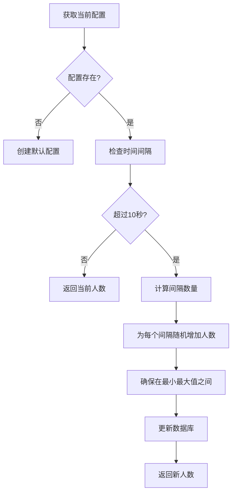

# 核心功能详解

<cite>
**本文档引用的文件**  
- [init-online-counter.ts](file://src/lib/init-online-counter.ts)
- [online-counter/route.ts](file://src/app/api/online-counter/route.ts)
- [admin/online-counter/route.ts](file://src/app/api/admin/online-counter/route.ts)
- [OnlineCounter.tsx](file://src/components/OnlineCounter.tsx)
- [OnlineCounterManagement.tsx](file://src/components/admin/OnlineCounterManagement.tsx)
- [upload/route.ts](file://src/app/api/upload/route.ts)
- [works/route.ts](file://src/app/api/works/route.ts)
- [admin/works/[id]/approve/route.ts](file://src/app/api/admin/works/[id]/approve/route.ts)
- [admin/works/[id]/reject/route.ts](file://src/app/api/admin/works/[id]/reject/route.ts)
- [works/[id]/like/route.ts](file://src/app/api/works/[id]/like/route.ts)
- [works/[id]/view/route.ts](file://src/app/api/works/[id]/view/route.ts)
- [admin/upload-config/route.ts](file://src/app/api/admin/upload-config/route.ts)
- [prisma/migrations/20250905143157_add_online_counter_config/migration.sql](file://prisma/migrations/20250905143157_add_online_counter_config/migration.sql)
</cite>

## 目录
1. [作品上传流程](#作品上传流程)
2. [作品审核机制](#作品审核机制)
3. [用户互动功能](#用户互动功能)
4. [在线计数器实现逻辑](#在线计数器实现逻辑)
5. [平台配置管理接口](#平台配置管理接口)

## 作品上传流程

该平台实现了完整的无登录作品上传流程，涵盖前端表单、API处理、OSS存储和数据库记录四个核心环节。

**用户流程**：
1. 用户在前端 `/upload` 页面选择图片文件
2. 前端调用 `/api/upload` 接口上传文件至OSS
3. 获取图片URL后，调用 `/api/works` 创建作品记录
4. 作品进入待审核状态，等待管理员审批

**涉及的API端点**：
- `POST /api/upload`：文件上传至OSS
- `POST /api/works`：创建作品数据库记录

**数据库变更**：
- `works` 表新增一条记录，状态为 `PENDING`
- `oss_files` 表记录文件元数据（通过OSS回调）

**异常处理策略**：
- 文件类型不符时返回400错误，提示支持的格式
- 文件大小超限时返回400错误，明确最大允许大小
- 上传时间窗口外操作返回403错误，提示具体时间
- 用户上传数量超限返回403错误，说明限制规则

**性能优化考虑**：
- 上传文件使用唯一命名避免覆盖
- OSS存储设置 `public-read` ACL确保可访问性
- 设置 `Cache-Control` 头部实现长期缓存
- 使用 `x-oss-tagging` 添加元数据便于管理

**Section sources**
- [upload/route.ts](file://src/app/api/upload/route.ts#L0-L114)
- [works/route.ts](file://src/app/api/works/route.ts#L0-L206)

## 作品审核机制

平台实现了管理员对作品的审核审批机制，确保内容质量。

**用户流程**：
1. 管理员在后台管理界面查看待审核作品
2. 点击"通过"按钮，作品状态变更为 `APPROVED`
3. 点击"拒绝"按钮，需填写拒绝理由，作品状态变更为 `REJECTED`
4. 审核后的作品在前端作品列表中可见或标记为已拒绝

**涉及的API端点**：
- `POST /api/admin/works/[id]/approve`：审核通过作品
- `POST /api/admin/works/[id]/reject`：拒绝作品并填写理由

**数据库变更**：
- `works` 表中对应作品的 `status` 字段更新
- 审核通过时设置 `approvedAt` 时间戳
- 拒绝时设置 `rejectedAt` 时间戳和 `rejectReason`

**异常处理策略**：
- 非管理员访问返回403权限不足错误
- 作品不存在返回404错误
- 非待审核状态作品返回422错误，防止重复操作
- 拒绝理由为空时返回400验证错误

**性能优化考虑**：
- 使用数据库事务确保状态更新的原子性
- 查询时包含用户信息减少后续查询
- 使用索引加速状态和时间字段的查询

**Section sources**
- [admin/works/[id]/approve/route.ts](file://src/app/api/admin/works/[id]/approve/route.ts#L0-L75)
- [admin/works/[id]/reject/route.ts](file://src/app/api/admin/works/[id]/reject/route.ts#L0-L94)

## 用户互动功能

平台实现了点赞计数和浏览统计两项核心用户互动功能。

### 点赞功能

**用户流程**：
1. 用户点击作品的"点赞"按钮
2. 前端调用 `/api/works/[id]/like` 接口
3. 服务器随机增加1-10个点赞数
4. 前端更新显示的点赞数量

**涉及的API端点**：
- `POST /api/works/[id]/like`：增加作品点赞数

**数据库变更**：
- `works` 表中对应作品的 `likeCount` 字段递增随机值

**异常处理策略**：
- 作品不存在或未审核通过返回404错误
- 数据库操作失败返回500错误
- 使用Prisma的原子递增操作确保数据一致性

**性能优化考虑**：
- 随机增长机制防止机器人刷赞
- 原子操作避免并发问题
- 仅返回必要字段减少响应大小

### 浏览统计

**用户流程**：
1. 用户查看作品详情页
2. 页面加载时自动调用 `/api/works/[id]/view` 接口
3. 服务器增加浏览量计数
4. 更新页面显示的浏览次数

**涉及的API端点**：
- `POST /api/works/[id]/view`：增加作品浏览量

**数据库变更**：
- `works` 表中对应作品的 `viewCount` 字段递增1

**异常处理策略**：
- 作品不存在或未审核通过返回404错误
- 数据库操作失败返回500错误
- 使用原子递增确保计数准确

**性能优化考虑**：
- 轻量级更新操作，仅修改计数字段
- 无复杂业务逻辑，响应速度快
- 可配合缓存进一步优化性能

**Section sources**
- [works/[id]/like/route.ts](file://src/app/api/works/[id]/like/route.ts#L0-L64)
- [works/[id]/view/route.ts](file://src/app/api/works/[id]/view/route.ts#L0-L61)

## 在线计数器实现逻辑

在线计数器功能通过 `init-online-counter.ts` 模块实现动态人数增长逻辑。

**Diagram sources**
- [init-online-counter.ts](file://src/lib/init-online-counter.ts#L0-L52)
- [online-counter/route.ts](file://src/app/api/online-counter/route.ts#L0-L188)

**核心逻辑**：
1. 初始化时检查数据库是否存在配置，若无则创建默认配置
2. 每次获取在线人数时，计算距离上次更新的时间
3. 每10秒作为一个增长间隔，每个间隔随机增加0到`growthRate`之间的人数
4. 确保人数在`baseCount`和`maxCount`之间
5. 更新数据库中的当前人数和最后更新时间

**关键参数**：
- `currentCount`：当前显示人数
- `baseCount`：基础人数（重置时使用）
- `maxCount`：最大人数上限
- `growthRate`：每10秒最大增长人数
- `isEnabled`：功能开关

**异常处理策略**：
- 数据库连接失败时返回默认值确保可用性
- 使用Prisma客户端错误类型进行精确错误处理
- 任何错误情况下保证返回有效响应

**性能优化考虑**：
- 每10秒才检查一次增长，减少计算频率
- 使用数据库原子更新确保数据一致性
- 前端实现平滑动画效果提升用户体验

**Section sources**
- [init-online-counter.ts](file://src/lib/init-online-counter.ts#L0-L52)
- [online-counter/route.ts](file://src/app/api/online-counter/route.ts#L0-L188)
- [OnlineCounter.tsx](file://src/components/OnlineCounter.tsx#L0-L157)

## 平台配置管理接口

平台提供了多个管理接口用于配置上传限制和平台参数。

### 上传配置管理

**功能描述**：
管理员可通过 `/api/admin/upload-config` 接口管理上传相关配置。

**可配置参数**：
- `isEnabled`：上传功能开关
- `startTime`/`endTime`：上传时间窗口
- `maxUploadsPerUser`：用户上传数量限制
- `maxFileSize`：最大文件大小
- `allowedFormats`：允许的文件格式
- `announcement`：上传公告

**API端点**：
- `GET /api/admin/upload-config`：获取当前上传配置
- `POST /api/admin/upload-config`：更新上传配置

**数据验证**：
- 使用Zod进行严格的输入验证
- 验证开始时间早于结束时间
- 限制文件大小和上传数量的合理范围

### 在线计数器配置管理

**功能描述**：
管理员可通过 `/api/admin/online-counter` 接口管理在线人数显示配置。

**可配置参数**：
- `currentCount`：当前人数
- `baseCount`：基础人数
- `maxCount`：最大人数
- `growthRate`：增长速率
- `isEnabled`：功能启用状态
- `displayText`：显示文本

**API端点**：
- `GET /api/admin/online-counter`：获取配置
- `PUT /api/admin/online-counter`：更新配置
- `POST /api/admin/online-counter`：重置人数

**管理界面**：
- 管理员可通过 `OnlineCounterManagement` 组件进行可视化配置
- 提供实时状态显示和操作反馈
- 包含保存、重置和刷新功能

**异常处理策略**：
- 严格的管理员权限验证
- 输入数据验证失败返回400错误
- 数据库操作失败返回500错误
- 提供详细的错误信息辅助调试

**性能优化考虑**：
- 配置数据缓存减少数据库查询
- 使用最新创建的配置记录
- 前端防重复提交处理

**Section sources**
- [admin/upload-config/route.ts](file://src/app/api/admin/upload-config/route.ts#L0-L150)
- [admin/online-counter/route.ts](file://src/app/api/admin/online-counter/route.ts#L0-L175)
- [OnlineCounterManagement.tsx](file://src/components/admin/OnlineCounterManagement.tsx#L0-L323)