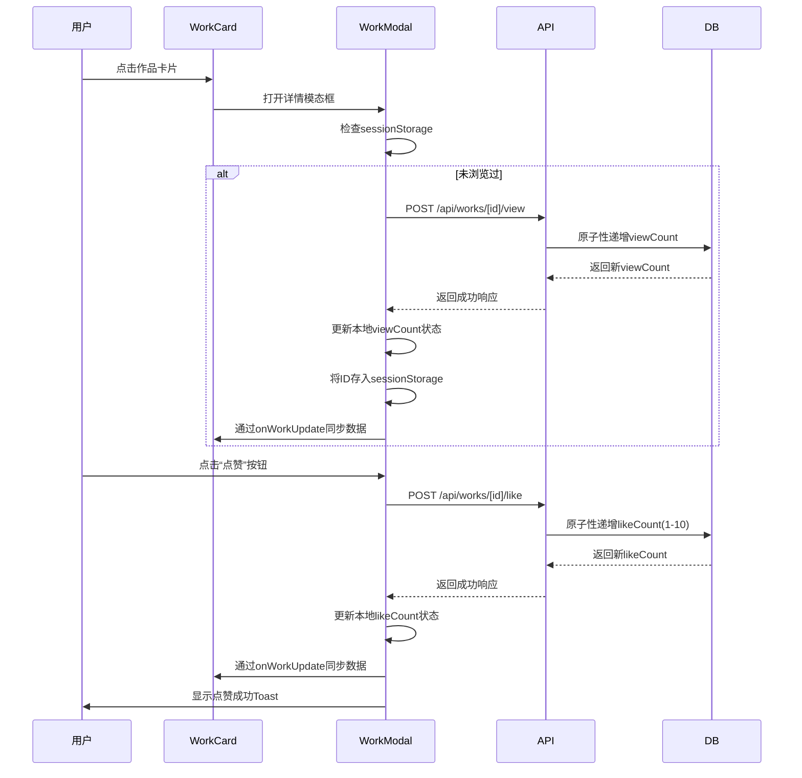

# 用户互动功能

<cite>
**本文档引用的文件**  
- [like/route.ts](file://src/app/api/works/[id]/like/route.ts)
- [view/route.ts](file://src/app/api/works/[id]/view/route.ts)
- [db-utils.ts](file://src/lib/db-utils.ts)
- [WorkCard.tsx](file://src/components/WorkCard.tsx)
- [WorkModal.tsx](file://src/components/WorkModal.tsx)
</cite>

## 目录
1. [简介](#简介)
2. [点赞功能实现](#点赞功能实现)
3. [浏览统计功能实现](#浏览统计功能实现)
4. [前端交互逻辑分析](#前端交互逻辑分析)
5. [数据库更新与性能优化](#数据库更新与性能优化)
6. [异常处理与重试机制](#异常处理与重试机制)
7. [安全与防刷策略](#安全与防刷策略)
8. [总结](#总结)

## 简介
本文档深入解析数字化作品互动展示平台中的用户互动功能，重点围绕点赞（like）和浏览统计（view）两大核心行为展开。系统通过 `/api/works/[id]/like` 和 `/api/works/[id]/view` 接口处理用户互动请求，结合前端组件 WorkCard 和 WorkModal 实现流畅的用户体验。文档将详细说明接口的请求处理流程、幂等性设计、身份验证机制、频率限制策略，以及防止刷量攻击的技术手段。同时，分析 db-utils 模块中数据库更新方法的封装逻辑与性能优化方案，并提供网络异常时的重试建议。

## 点赞功能实现

### 接口请求处理流程
点赞功能由 `/api/works/[id]/like` 接口处理，采用 POST 方法接收请求。当用户点击“点赞”按钮时，前端发起请求至该接口，携带作品 ID 作为路径参数。后端首先验证作品是否存在且状态为“已通过审核”（APPROVED），若验证失败则返回 404 错误。验证通过后，系统执行原子性数据库更新操作，使用 Prisma 的 `increment` 指令将作品的 `likeCount` 字段增加一个 1-10 之间的随机数，确保每次点赞都能带来动态变化的反馈效果。更新完成后，接口返回最新的点赞总数及本次增加的具体数值，供前端更新 UI 并展示激励性提示。

### 幂等性与频率控制
尽管点赞操作本身不具备严格的幂等性（每次点击都会增加计数），但系统通过前端节流（throttle）机制间接实现了频率控制。根据产品需求文档，前端对点赞请求进行节流处理，限制每 500ms 最多发送一次请求，有效防止了用户快速连续点击导致的服务器过载。后端未设置显式的频率限制中间件，依赖前端行为规范来维持系统稳定性。

**Section sources**
- [like/route.ts](file://src/app/api/works/[id]/like/route.ts#L1-L65)

## 浏览统计功能实现

### 浏览量自动递增机制
浏览量的递增由 `/api/works/[id]/view` 接口触发，同样采用 POST 方法。该接口的调用时机与前端组件的生命周期紧密相关。在 `WorkModal` 组件中，通过 `useEffect` Hook 监听作品数据和模态框状态的变化。当作品详情模态框打开（`isOpen` 为 true）且作品数据加载完成后，组件会检查当前浏览器会话（sessionStorage）中是否已记录该作品的浏览行为。若未记录，则自动向 `/api/works/[id]/view` 接口发起请求，实现浏览量的自动递增。请求成功后，系统会将作品 ID 存入 `sessionStorage` 的 `viewedWorks` 数组中，确保同一用户在同一会话内重复打开同一作品不会重复计数。

### 防止刷量攻击
该机制通过客户端会话存储（sessionStorage）实现了基础的防刷功能。由于 `sessionStorage` 在页面会话结束（关闭标签页或浏览器）后即被清除，因此用户必须关闭并重新打开页面才能再次为同一作品增加浏览量。这种设计在保证真实用户正常体验的同时，显著增加了自动化脚本批量刷量的难度和成本，是一种轻量级但有效的反作弊策略。

**Section sources**
- [view/route.ts](file://src/app/api/works/[id]/view/route.ts#L1-L62)
- [WorkModal.tsx](file://src/components/WorkModal.tsx#L10-L308)

## 前端交互逻辑分析

### WorkCard 与 WorkModal 组件协同
`WorkCard` 组件作为作品列表中的展示单元，其主要职责是呈现作品的缩略图、名称、作者及互动数据（点赞数、浏览数）。当用户点击卡片时，会触发 `onClick` 回调，通常用于打开 `WorkModal` 详情页。卡片上的点赞按钮通过 `onLike` 回调与父组件通信，但其点击事件通过 `e.stopPropagation()` 阻止了冒泡，避免了与卡片点击事件冲突。

`WorkModal` 组件则负责展示作品的完整信息。它不仅继承了 `WorkCard` 的点赞功能，还集成了浏览量自动递增的逻辑。两个组件通过状态（`likeCount`, `viewCount`）和回调函数（`onWorkUpdate`）保持数据同步。当 `WorkModal` 中的点赞或浏览量发生变化时，会通过 `onWorkUpdate` 回调通知父组件（如作品列表页），从而实现跨组件的状态更新，确保用户在不同视图下看到的数据始终保持一致。

**Diagram sources**
- [WorkCard.tsx](file://src/components/WorkCard.tsx#L7-L92)
- [WorkModal.tsx](file://src/components/WorkModal.tsx#L10-L308)
- [like/route.ts](file://src/app/api/works/[id]/like/route.ts#L1-L65)
- [view/route.ts](file://src/app/api/works/[id]/view/route.ts#L1-L62)

## 数据库更新与性能优化

### db-utils 封装逻辑
`db-utils.ts` 文件对数据库操作进行了封装，提供了 `incrementViewCount` 和 `incrementLikeCount` 两个工具函数。这些函数直接调用 Prisma Client，执行 `work.update` 操作，并利用 Prisma 提供的 `increment` 原子操作符。这种封装方式将数据访问逻辑与业务逻辑分离，提高了代码的可维护性和复用性。例如，`incrementViewCount` 函数仅需传入作品 ID，即可完成浏览量的递增，无需在业务代码中重复编写数据库查询和更新逻辑。

### 性能优化策略
系统在数据库层面采用了关键的性能优化策略：
1.  **原子操作**：使用 Prisma 的 `increment` 指令，确保点赞和浏览量的更新是原子性的。这避免了“读取-修改-写入”模式可能引发的并发问题（如竞态条件），保证了数据的一致性。
2.  **连接池优化**：在 `prisma.ts` 配置中，通过 URL 参数对数据库连接池进行了精细调优，设置了合理的连接数限制（`connection_limit=20`）、超时时间等，以适应生产环境的高并发需求。
3.  **缓存策略**：虽然直接的数据库写入是实时的，但系统通过 Next.js 的页面级缓存（`stale-while-revalidate`）和客户端缓存（`sessionStorage`）减少了对数据库的直接查询压力。例如，热门作品列表每10分钟刷新一次，而非实时查询。

**Section sources**
- [db-utils.ts](file://src/lib/db-utils.ts#L1-L68)
- [prisma.ts](file://src/lib/prisma.ts#L1-L50)

## 异常处理与重试机制

### 前端错误处理
前端通过 `useApi` 自定义 Hook 统一处理 API 请求的异常。当网络请求失败或服务器返回错误时，`useApi` 会捕获异常，将错误信息存入组件状态，并返回一个标准化的错误响应对象。在 `WorkModal` 的点赞处理函数 `handleLike` 中，使用了 `try-catch` 块包裹 `fetch` 请求。捕获到错误后，会通过 `toast.error` 显示“点赞失败，请稍后重试”的全局提示，为用户提供清晰的反馈。

### 重试机制建议
当前实现中未包含自动重试逻辑。为提升用户体验，建议在 `useApi` Hook 中集成指数退避（exponential backoff）重试机制。例如，当请求因网络原因失败时，可自动在 1s、2s、4s 后分别重试最多 3 次。这能有效应对短暂的网络波动，减少用户手动重试的需要。同时，应设置合理的超时时间（如 10s），避免请求长时间挂起。

**Section sources**
- [useApi.ts](file://src/hooks/useApi.ts#L1-L85)
- [WorkModal.tsx](file://src/components/WorkModal.tsx#L10-L308)

## 安全与防刷策略

### 身份验证
系统使用 NextAuth.js 进行身份验证。虽然点赞和浏览接口允许游客访问（`allowGuest: true`），但其背后的身份验证系统确保了只有经过认证的用户才能执行上传、审核等敏感操作。对于互动功能，系统依赖会话（session）来识别用户，但并未对游客的互动行为做严格限制，符合产品“鼓励广泛参与”的定位。

### 防刷综合策略
系统采用了多层策略来防止恶意刷量：
-   **客户端会话去重**：通过 `sessionStorage` 防止同一会话内重复计数。
-   **随机增量**：点赞数增加 1-10 的随机值，使得简单的脚本难以预测和模拟真实用户行为。
-   **前端节流**：限制点赞请求的频率，增加自动化脚本的复杂度。
-   **服务端验证**：所有请求均需验证作品 ID 的有效性及状态，无效请求会被直接拒绝。

这些策略共同作用，构建了一个相对健壮的防刷体系，在保证系统性能的同时，维护了互动数据的真实性。

**Section sources**
- [auth.ts](file://src/lib/auth.ts#L1-L60)
- [WorkModal.tsx](file://src/components/WorkModal.tsx#L10-L308)

## 总结
本文档全面解析了平台用户互动功能的技术实现。系统通过精心设计的 API 接口、高效的数据库原子操作、智能的前端交互逻辑和多层防刷策略，成功实现了点赞与浏览统计两大核心功能。`WorkCard` 和 `WorkModal` 组件的协同工作确保了状态同步与 UI 反馈的及时性。尽管当前实现已较为完善，未来仍可通过引入更智能的频率限制（如基于 IP 或用户 ID 的限流）和前端自动重试机制，进一步提升系统的健壮性和用户体验。