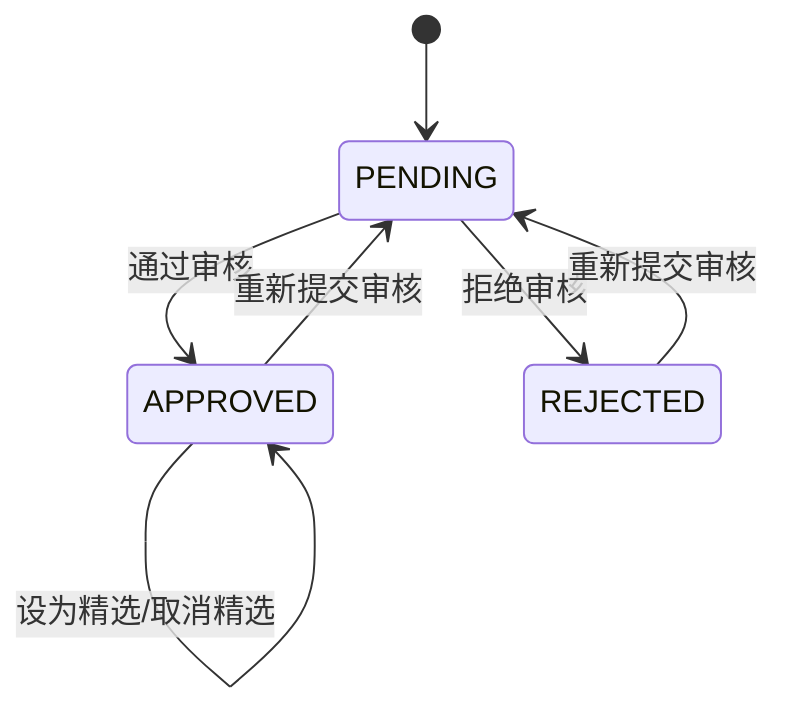

# 作品管理

<cite>
**本文档引用的文件**  
- [WorksManagement.tsx](file://src/components/admin/WorksManagement.tsx)
- [route.ts](file://src/app/api/admin/works/[id]/route.ts)
- [featured/route.ts](file://src/app/api/admin/works/[id]/featured/route.ts)
- [edit/route.ts](file://src/app/api/admin/works/[id]/edit/route.ts)
- [work.d.ts](file://src/types/work.d.ts)
- [auth.ts](file://src/lib/auth.ts)
- [seed.ts](file://prisma/seed.ts)
</cite>

## 目录
1. [简介](#简介)
2. [作品管理组件概述](#作品管理组件概述)
3. [API端点详解](#api端点详解)
4. [权限校验机制](#权限校验机制)
5. [数据库操作与Prisma实现](#数据库操作与prisma实现)
6. [作品状态流转机制](#作品状态流转机制)
7. [管理员操作指南](#管理员操作指南)
8. [错误处理策略](#错误处理策略)
9. [优化建议](#优化建议)
10. [总结](#总结)

## 简介
本文档详细说明了数字化作品互动展示平台中作品管理功能的实现。重点阐述了管理员如何通过`/admin/works`系列API对用户提交的作品进行审核、编辑、设为精选等操作。文档涵盖了前端组件实现、后端API逻辑、数据库操作、权限控制、状态流转机制以及错误处理策略，并提供了优化建议。

## 作品管理组件概述
`WorksManagement`组件是管理员进行作品管理的核心界面，提供了作品列表展示、筛选、搜索、分页、审核、编辑和设为精选等功能。

该组件使用React Hooks管理状态，包括作品列表、分页信息、筛选条件、排序方式以及模态框的显示状态。通过`useApi`自定义Hook与后端API进行通信。

**Section sources**
- [WorksManagement.tsx](file://src/components/admin/WorksManagement.tsx#L22-L782)

## API端点详解
作品管理功能通过一系列RESTful API端点实现，每个端点都有明确的职责。

### 获取作品列表 (GET /api/admin/works)
- **请求方式**: GET
- **参数格式**: 查询参数
  - `page`: 页码 (默认1)
  - `limit`: 每页数量 (默认10)
  - `status`: 状态筛选 (PENDING, APPROVED, REJECTED)
  - `search`: 搜索关键词
  - `sortBy`: 排序字段 (createdAt, approvedAt, likeCount, viewCount)
  - `sortOrder`: 排序顺序 (asc, desc)
- **返回结果**: 包含作品列表和分页信息的JSON对象

### 审核作品 (PATCH /api/admin/works/[id])
- **请求方式**: PATCH
- **参数格式**: JSON请求体
```json
{
  "status": "APPROVED" | "REJECTED",
  "rejectReason": "string (可选)"
}
```
- **返回结果**: 更新后的作品信息

### 设为精选 (PATCH /api/admin/works/[id]/featured)
- **请求方式**: PATCH
- **参数格式**: JSON请求体
```json
{
  "featured": true | false
}
```
- **返回结果**: 更新后的作品信息

### 编辑作品 (PUT /api/admin/works/[id]/edit)
- **请求方式**: PUT
- **参数格式**: JSON请求体
```json
{
  "name": "string",
  "author": "string",
  "prompt": "string (可选)"
}
```
- **返回结果**: 更新后的作品信息

**Section sources**
- [route.ts](file://src/app/api/admin/works/route.ts#L25-L200)
- [route.ts](file://src/app/api/admin/works/[id]/route.ts#L17-L111)
- [featured/route.ts](file://src/app/api/admin/works/[id]/featured/route.ts#L22-L90)
- [edit/route.ts](file://src/app/api/admin/works/[id]/edit/route.ts#L22-L180)

## 权限校验机制
所有管理员API端点都实现了严格的权限校验，确保只有管理员才能访问。

### 后端权限校验
在每个API处理函数中，首先通过`getServerSession(authOptions)`获取当前会话信息。如果用户未登录或角色不是管理员，则返回403 Forbidden错误。

```typescript
const session = await getServerSession(authOptions);
if (!session?.user || session.user.role !== Role.ADMIN) {
  return NextResponse.json({
    success: false,
    error: '权限不足',
    code: 'FORBIDDEN'
  }, { status: 403 });
}
```

### 前端权限控制
管理员页面通过`useSession` Hook检查用户会话。如果用户未登录或不是管理员，则重定向到登录页面或首页。

**Section sources**
- [auth.ts](file://src/lib/auth.ts#L1-L71)
- [route.ts](file://src/app/api/admin/works/[id]/route.ts#L20-L25)
- [page.tsx](file://src/app/admin/page.tsx#L1-L47)

## 数据库操作与Prisma实现
作品管理功能使用Prisma ORM与数据库进行交互，实现了高效的数据操作。

### 作品审核
当管理员审核作品时，后端使用Prisma的`update`方法更新作品状态，并根据审核结果设置相应的时间戳和初始点赞数。

```typescript
const updatedWork = await prisma.work.update({
  where: { id },
  data: updateData,
  include: {
    user: {
      select: {
        id: true,
        name: true,
        email: true
      }
    }
  }
});
```

### 作品编辑
管理员编辑作品信息时，直接更新作品的基本字段，如名称、作者和提示词。

### 精选状态设置
只有已通过审核的作品才能被设为精选，这在API逻辑中进行了验证。

**Section sources**
- [route.ts](file://src/app/api/admin/works/[id]/route.ts#L50-L110)
- [featured/route.ts](file://src/app/api/admin/works/[id]/featured/route.ts#L60-L80)
- [edit/route.ts](file://src/app/api/admin/works/[id]/edit/route.ts#L100-L150)

## 作品状态流转机制
作品在平台中存在三种状态：待审核(PENDING)、已通过(APPROVED)和已拒绝(REJECTED)。状态流转由管理员操作驱动。



**Diagram sources**
- [route.ts](file://src/app/api/admin/works/[id]/route.ts#L17-L111)
- [seed.ts](file://prisma/seed.ts#L5-L309)

## 管理员操作指南
### 批量处理待审作品
管理员可以通过以下步骤批量处理待审作品：
1. 在作品管理界面，将状态筛选设置为"待审核"
2. 查看待审核作品列表
3. 逐个点击"通过"或"拒绝"按钮进行审核
4. 对于拒绝的作品，系统会提示输入拒绝理由

### 编辑作品信息
1. 在作品列表中点击"编辑"按钮
2. 在弹出的编辑模态框中修改作品名称、作者和提示词
3. 点击"保存"按钮提交更改

### 设为精选
1. 找到已通过审核的作品
2. 点击"设为精选"按钮
3. 该作品将在前台展示中获得特殊标识

**Section sources**
- [WorksManagement.tsx](file://src/components/admin/WorksManagement.tsx#L22-L782)

## 错误处理策略
系统实现了完善的错误处理机制，确保用户体验和系统稳定性。

### 常见错误类型
- **权限不足**: 当非管理员尝试访问管理员API时，返回403错误
- **ID无效**: 当请求的作品ID不存在时，返回404错误
- **参数验证失败**: 当请求参数不符合验证规则时，返回400错误
- **服务器内部错误**: 当发生未预期的错误时，返回500错误

### 前端错误处理
前端通过`try-catch`捕获API调用错误，并使用`toast`组件向用户显示友好的错误提示。

```typescript
try {
  const response = await fetch(`/api/admin/works/${workId}`, {
    method: 'PATCH',
    headers: { 'Content-Type': 'application/json' },
    body: JSON.stringify({ status: newStatus })
  });

  if (!response.ok) {
    const errorData = await response.json().catch(() => null);
    throw new Error(errorData?.error || '更新失败');
  }
} catch (err) {
  toast.error(err instanceof Error ? err.message : '更新失败，请重试');
}
```

**Section sources**
- [route.ts](file://src/app/api/admin/works/[id]/route.ts#L100-L150)
- [WorksManagement.tsx](file://src/components/admin/WorksManagement.tsx#L150-L200)

## 优化建议
### 增加分页加载
当前实现已经支持分页加载，但可以进一步优化：
- 实现无限滚动加载，提升用户体验
- 增加每页数量选择器，让用户自定义每页显示的作品数量

### 搜索过滤功能
现有的搜索功能已经支持按名称、标题和作者搜索，可以进一步增强：
- 支持按时间范围筛选
- 支持按用户邮箱搜索
- 增加高级搜索功能，支持多条件组合查询

### 性能优化
- 为常用查询字段添加数据库索引，提高查询性能
- 实现API响应缓存，减少数据库查询压力
- 使用GraphQL替代REST API，实现更灵活的数据查询

## 总结
作品管理功能是数字化作品互动展示平台的核心管理模块，通过前后端协同工作，实现了作品的审核、编辑、精选等关键操作。系统具有完善的权限控制、状态流转和错误处理机制，确保了平台的安全性和稳定性。通过持续优化，可以进一步提升管理员的工作效率和用户体验。