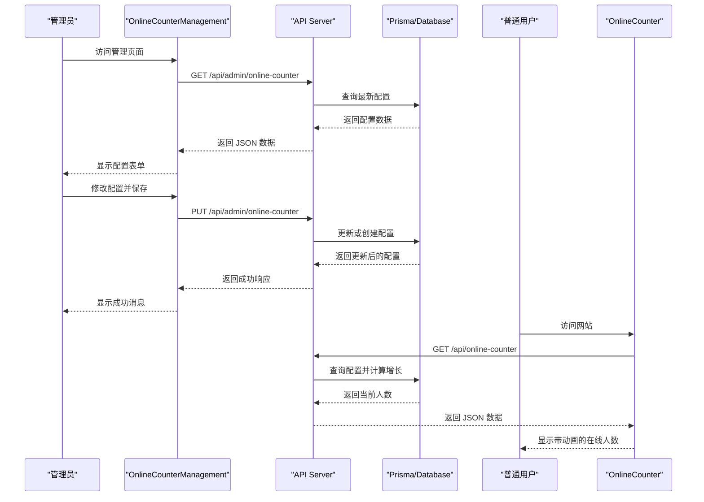
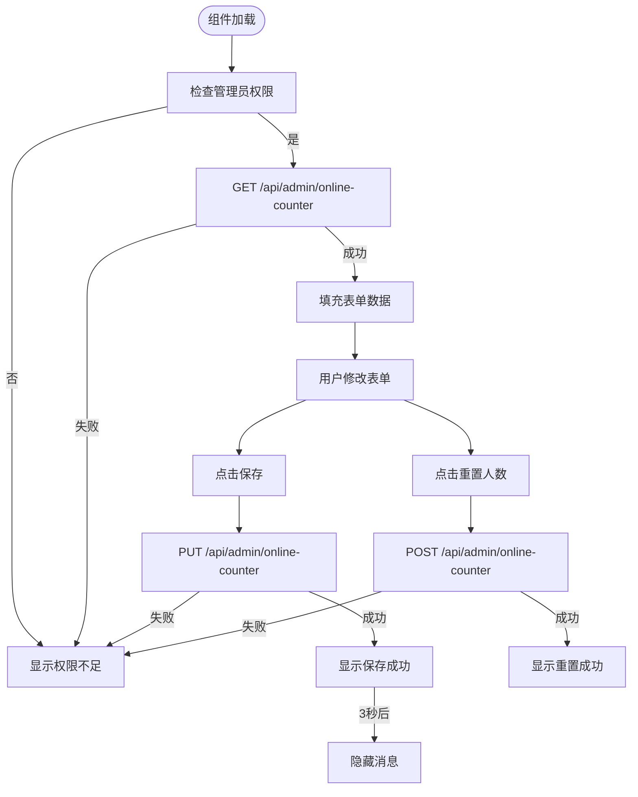
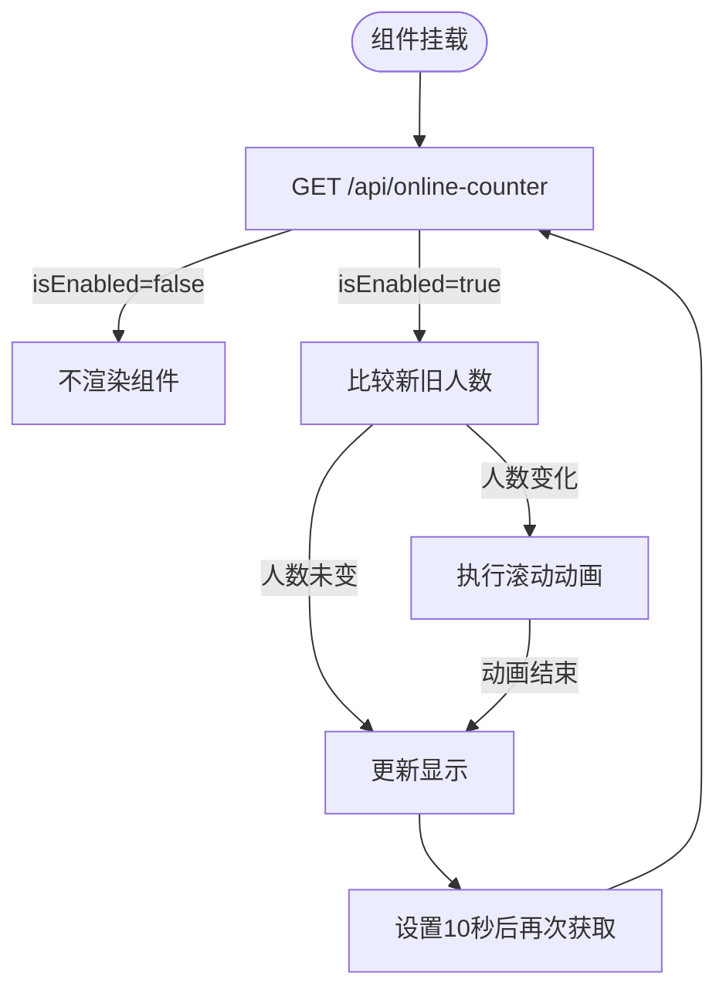
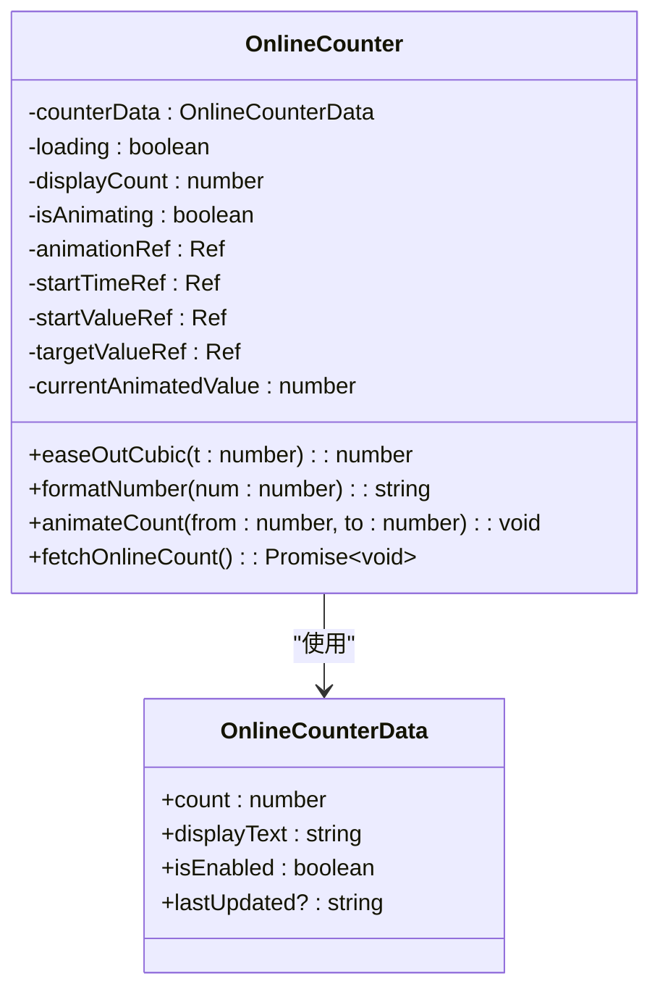
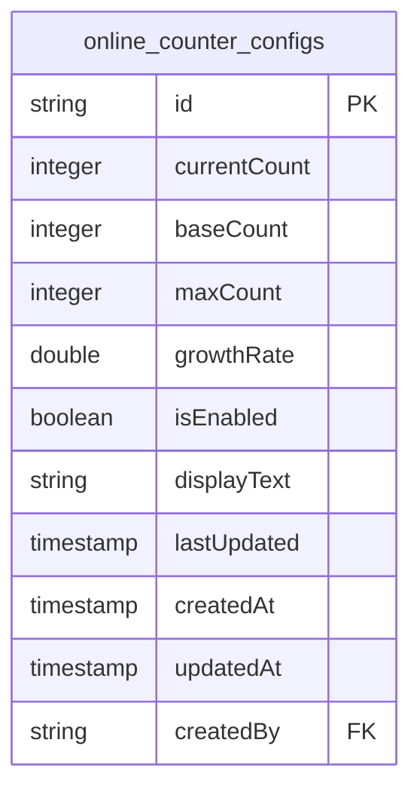
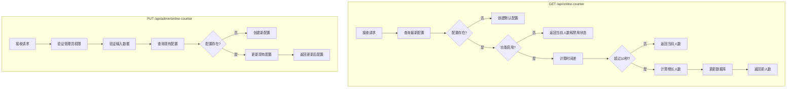
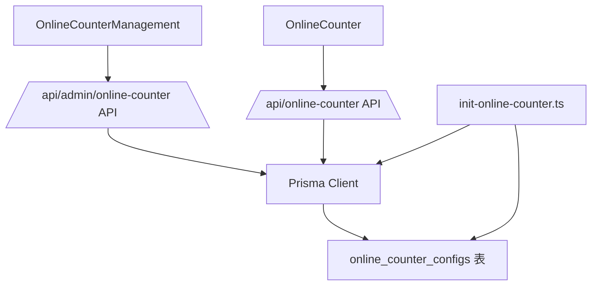

# 在线计数器配置

<cite>
**本文档引用的文件**
- [OnlineCounterManagement.tsx](file://src/components/admin/OnlineCounterManagement.tsx)
- [OnlineCounter.tsx](file://src/components/OnlineCounter.tsx)
- [route.ts](file://src/app/api/admin/online-counter/route.ts)
- [route.ts](file://src/app/api/online-counter/route.ts)
- [migration.sql](file://prisma/migrations/20250905143157_add_online_counter_config/migration.sql)
- [init-online-counter.ts](file://src/lib/init-online-counter.ts)
</cite>

## 目录
1. [简介](#简介)
2. [项目结构](#项目结构)
3. [核心组件](#核心组件)
4. [架构概述](#架构概述)
5. [详细组件分析](#详细组件分析)
6. [依赖分析](#依赖分析)
7. [性能考虑](#性能考虑)
8. [故障排除指南](#故障排除指南)
9. [结论](#结论)
10. [附录](#附录)（如有必要）

## 简介
本文档详细说明了在线计数器配置功能的实现机制。该功能允许管理员通过 `/admin/online-counter` API 管理在线人数显示的开关、显示样式、刷新频率等参数。文档将阐述 `OnlineCounterManagement` 组件如何与后端交互，`OnlineCounter` 组件如何根据配置动态响应，以及配置数据如何在数据库中持久化存储和通过 API 实时读取。同时，文档将讨论高并发场景下的性能优化策略。

## 项目结构
该项目采用基于 Next.js 15 的 App Router 架构，文件组织清晰，功能模块化。核心的在线计数器功能相关文件分布在 `src` 目录下的 `components`、`app/api` 和 `prisma` 子目录中。

```mermaid
graph TB
subgraph "前端组件"
A[OnlineCounterManagement.tsx]
B[OnlineCounter.tsx]
end
subgraph "API 路由"
C[api/admin/online-counter/route.ts]
D[api/online-counter/route.ts]
end
subgraph "数据层"
E[prisma/migrations/.../migration.sql]
F[src/lib/init-online-counter.ts]
end
A --> C : "发送配置请求"
B --> D : "获取显示数据"
C --> E : "读写数据库"
D --> E : "读写数据库"
F --> E : "初始化配置"
```

**图表来源**
- [OnlineCounterManagement.tsx](file://src/components/admin/OnlineCounterManagement.tsx)
- [OnlineCounter.tsx](file://src/components/OnlineCounter.tsx)
- [route.ts](file://src/app/api/admin/online-counter/route.ts)
- [route.ts](file://src/app/api/online-counter/route.ts)
- [migration.sql](file://prisma/migrations/20250905143157_add_online_counter_config/migration.sql)
- [init-online-counter.ts](file://src/lib/init-online-counter.ts)

**章节来源**
- [src/components/admin/OnlineCounterManagement.tsx](file://src/components/admin/OnlineCounterManagement.tsx)
- [src/components/OnlineCounter.tsx](file://src/components/OnlineCounter.tsx)
- [src/app/api/admin/online-counter/route.ts](file://src/app/api/admin/online-counter/route.ts)
- [src/app/api/online-counter/route.ts](file://src/app/api/online-counter/route.ts)
- [prisma/migrations/20250905143157_add_online_counter_config/migration.sql](file://prisma/migrations/20250905143157_add_online_counter_config/migration.sql)
- [src/lib/init-online-counter.ts](file://src/lib/init-online-counter.ts)

## 核心组件
在线计数器功能的核心由两个主要组件构成：`OnlineCounterManagement` 和 `OnlineCounter`。前者是管理员用于配置的界面，后者是向所有用户展示的在线人数组件。

**章节来源**
- [src/components/admin/OnlineCounterManagement.tsx](file://src/components/admin/OnlineCounterManagement.tsx)
- [src/components/OnlineCounter.tsx](file://src/components/OnlineCounter.tsx)

## 架构概述
该功能的架构遵循典型的前后端分离模式。前端组件通过 RESTful API 与后端进行通信。后端 API 处理请求，与数据库交互，并返回 JSON 格式的数据。数据库使用 Prisma ORM 进行管理，确保数据操作的安全性和一致性。



**图表来源**
- [src/components/admin/OnlineCounterManagement.tsx](file://src/components/admin/OnlineCounterManagement.tsx)
- [src/components/OnlineCounter.tsx](file://src/components/OnlineCounter.tsx)
- [src/app/api/admin/online-counter/route.ts](file://src/app/api/admin/online-counter/route.ts)
- [src/app/api/online-counter/route.ts](file://src/app/api/online-counter/route.ts)

## 详细组件分析

### OnlineCounterManagement 组件分析
`OnlineCounterManagement` 组件是管理员配置在线计数器的核心界面。它提供了一个表单，允许管理员修改在线人数的当前值、基础值、最大值、增长速率、显示文本以及启用/禁用状态。

#### 组件交互流程


**图表来源**
- [src/components/admin/OnlineCounterManagement.tsx](file://src/components/admin/OnlineCounterManagement.tsx)
- [src/app/api/admin/online-counter/route.ts](file://src/app/api/admin/online-counter/route.ts)

**章节来源**
- [src/components/admin/OnlineCounterManagement.tsx](file://src/components/admin/OnlineCounterManagement.tsx)

### OnlineCounter 组件分析
`OnlineCounter` 组件负责向所有用户展示实时的在线人数。它的行为完全由后端返回的配置决定。

#### 前端响应机制


**图表来源**
- [src/components/OnlineCounter.tsx](file://src/components/OnlineCounter.tsx)
- [src/app/api/online-counter/route.ts](file://src/app/api/online-counter/route.ts)

**章节来源**
- [src/components/OnlineCounter.tsx](file://src/components/OnlineCounter.tsx)

#### 动画效果实现
该组件实现了平滑的数字滚动动画效果，提升用户体验。


**图表来源**
- [src/components/OnlineCounter.tsx](file://src/components/OnlineCounter.tsx)

### 后端 API 与数据库分析
后端 API 是连接前端和数据库的桥梁，负责处理所有与在线计数器相关的逻辑。

#### 数据库表结构


**图表来源**
- [migration.sql](file://prisma/migrations/20250905143157_add_online_counter_config/migration.sql)

#### API 工作流程


**图表来源**
- [src/app/api/online-counter/route.ts](file://src/app/api/online-counter/route.ts)
- [src/app/api/admin/online-counter/route.ts](file://src/app/api/admin/online-counter/route.ts)

**章节来源**
- [src/app/api/online-counter/route.ts](file://src/app/api/online-counter/route.ts)
- [src/app/api/admin/online-counter/route.ts](file://src/app/api/admin/online-counter/route.ts)

## 依赖分析
该功能的组件依赖关系清晰，耦合度低，便于维护和扩展。



**图表来源**
- [src/components/admin/OnlineCounterManagement.tsx](file://src/components/admin/OnlineCounterManagement.tsx)
- [src/components/OnlineCounter.tsx](file://src/components/OnlineCounter.tsx)
- [src/app/api/admin/online-counter/route.ts](file://src/app/api/admin/online-counter/route.ts)
- [src/app/api/online-counter/route.ts](file://src/app/api/online-counter/route.ts)
- [src/lib/init-online-counter.ts](file://src/lib/init-online-counter.ts)
- [prisma/migrations/20250905143157_add_online_counter_config/migration.sql](file://prisma/migrations/20250905143157_add_online_counter_config/migration.sql)

**章节来源**
- [src/components/admin/OnlineCounterManagement.tsx](file://src/components/admin/OnlineCounterManagement.tsx)
- [src/components/OnlineCounter.tsx](file://src/components/OnlineCounter.tsx)
- [src/app/api/admin/online-counter/route.ts](file://src/app/api/admin/online-counter/route.ts)
- [src/app/api/online-counter/route.ts](file://src/app/api/online-counter/route.ts)
- [src/lib/init-online-counter.ts](file://src/lib/init-online-counter.ts)

## 性能考虑
在高并发场景下，频繁的数据库读写操作可能成为性能瓶颈。为确保系统稳定，建议采取以下措施：

1.  **引入缓存层**：使用 Redis 等内存数据库缓存在线人数配置和当前人数。API 在响应请求时优先从缓存读取，仅在缓存失效或需要更新时才访问主数据库，从而大幅减少数据库压力。
2.  **确保配置更新的原子性**：当管理员更新配置时，后端 API 使用 Prisma 的 `update` 操作，并通过 `where` 条件指定 `id`，确保了对单条记录的更新是原子操作，避免了并发更新导致的数据不一致。
3.  **优化数据库查询**：确保 `online_counter_configs` 表的 `createdAt` 字段有