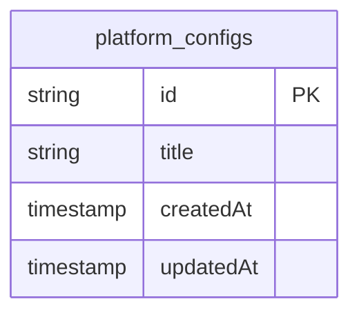
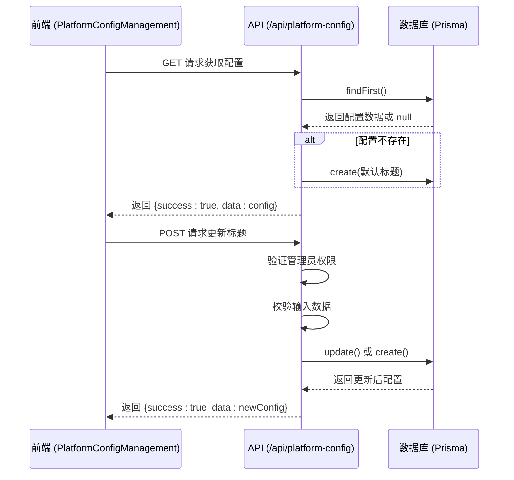
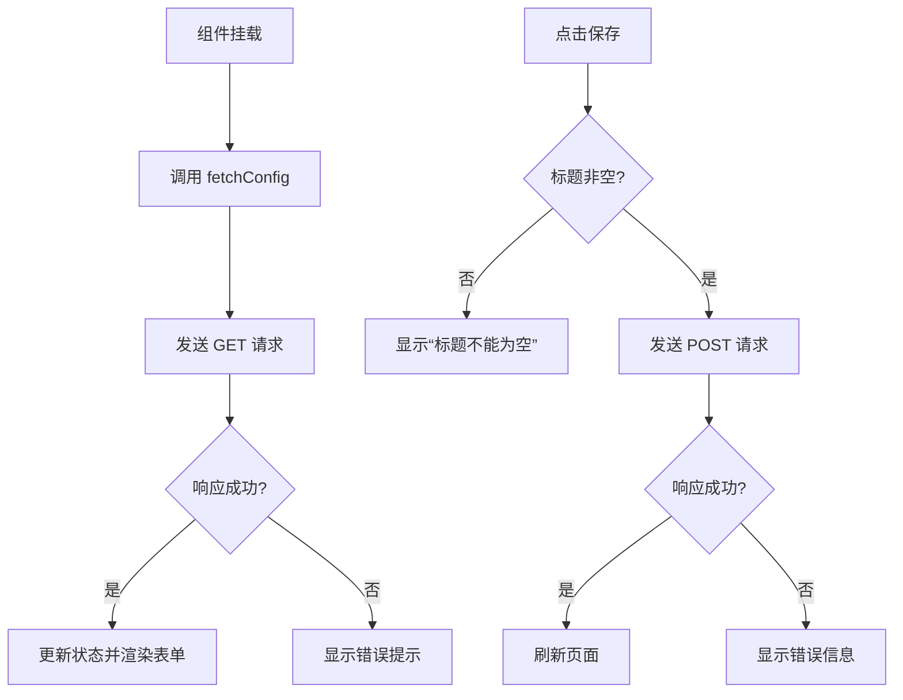

# 平台配置

<cite>
**本文档引用的文件**  
- [PlatformConfigManagement.tsx](file://src/components/admin/PlatformConfigManagement.tsx)
- [route.ts](file://src/app/api/platform-config/route.ts)
- [schema.prisma](file://prisma/schema.prisma)
- [Header.tsx](file://src/components/Header.tsx)
</cite>

## 目录
1. [简介](#简介)
2. [配置数据结构与存储](#配置数据结构与存储)
3. [API 接口实现](#api-接口实现)
4. [前端管理组件](#前端管理组件)
5. [权限控制与输入验证](#权限控制与输入验证)
6. [配置生效策略](#配置生效策略)
7. [扩展建议](#扩展建议)

## 简介
本系统通过 `/admin/platform-config` 管理端界面与 `/api/platform-config` API 接口，实现对平台全局配置的读取与更新功能。当前支持配置项包括平台主标题等核心展示信息，未来可扩展支持注册开关、默认主题等更多设置。配置数据持久化存储于数据库中，确保服务重启后仍可保留。

## 配置数据结构与存储
平台配置信息存储于 PostgreSQL 数据库的 `platform_configs` 表中，由 Prisma ORM 进行模型定义和数据访问。该表仅保留一条记录，代表全局唯一的平台配置。



**图示来源**  
- [schema.prisma](file://prisma/schema.prisma#L147-L152)

### Prisma 模型定义
```prisma
model PlatformConfig {
  id        String   @id @default(cuid())
  title     String   @default("Qoder和通义灵码 AI Coding 作品秀")
  createdAt DateTime @default(now())
  updatedAt DateTime @updatedAt

  @@map("platform_configs")
}
```

该模型包含以下字段：
- `id`: 唯一标识符，使用 cuid 自动生成
- `title`: 平台主标题，必填字段，带默认值
- `createdAt`: 创建时间戳
- `updatedAt`: 最后更新时间戳，由 Prisma 自动维护

**本节来源**  
- [schema.prisma](file://prisma/schema.prisma#L147-L152)

## API 接口实现
平台配置功能通过 `/api/platform-config` 路由提供 RESTful API 支持，包含 GET（获取）和 POST（更新）两种方法。

### GET 方法：获取配置
当客户端发起 GET 请求时，系统执行以下逻辑：
1. 查询数据库中是否存在 `platformConfig` 记录
2. 若不存在，则使用默认标题创建初始配置
3. 返回配置数据（含 ID、标题、更新时间）

此设计确保系统始终存在有效配置，避免空值异常。

### POST 方法：更新配置
POST 请求用于更新平台配置，处理流程如下：
1. 验证用户身份与管理员权限
2. 解析并校验请求体数据
3. 查找现有配置并执行更新操作
4. 返回更新后的配置信息



**图示来源**  
- [route.ts](file://src/app/api/platform-config/route.ts#L0-L113)

**本节来源**  
- [route.ts](file://src/app/api/platform-config/route.ts#L0-L113)

## 前端管理组件
`PlatformConfigManagement` 组件为管理员提供可视化配置界面，位于 `/admin` 后台页面中。

### 功能特性
- **实时加载**：组件挂载时自动调用 API 获取当前配置
- **表单绑定**：输入框与 `title` 状态变量双向绑定
- **字符计数**：显示当前输入字符数（最大 100 字符）
- **防重复提交**：当内容未修改或正在保存时禁用提交按钮
- **加载状态**：使用骨架屏展示加载过程

### 表单提交逻辑
提交后执行以下操作：
1. 发送 POST 请求至 `/api/platform-config`
2. 成功后更新本地状态并显示成功提示
3. 调用 `window.location.reload()` 刷新页面以更新全局标题显示



**图示来源**  
- [PlatformConfigManagement.tsx](file://src/components/admin/PlatformConfigManagement.tsx#L0-L143)

**本节来源**  
- [PlatformConfigManagement.tsx](file://src/components/admin/PlatformConfigManagement.tsx#L0-L143)

## 权限控制与输入验证
系统在多个层级实施安全控制，确保配置操作的安全性与数据完整性。

### 权限控制
所有写操作（POST）均需通过身份验证：
- 调用 `getServerSession(authOptions)` 获取会话信息
- 验证用户是否存在且角色为 `ADMIN`
- 未通过验证返回 401 状态码

### 输入验证
使用 Zod 库对输入数据进行严格校验：
- `title` 字段必须为字符串类型
- 最小长度为 1（不能为空）
- 最大长度为 100 字符

若验证失败，返回 400 状态码及详细错误信息，便于前端展示具体问题。

**本节来源**  
- [route.ts](file://src/app/api/platform-config/route.ts#L0-L113)

## 配置生效策略
当前配置变更采用**即时生效 + 页面刷新**策略：
- **后端**：配置更新后立即写入数据库，所有后续请求均可获取最新值
- **前端**：通过 `window.location.reload()` 强制刷新页面，确保 `Header` 组件中显示的平台标题同步更新

此策略简单可靠，避免了复杂的前端状态全局广播机制。虽然需要刷新页面，但配置修改属于低频操作，用户体验影响较小。

未来可优化为：
- 使用 React Context 或 Zustand 管理全局配置状态
- 更新配置后仅刷新相关组件而非整个页面
- 增加 WebSocket 通知机制，实现多标签页同步更新

**本节来源**  
- [PlatformConfigManagement.tsx](file://src/components/admin/PlatformConfigManagement.tsx#L78)
- [Header.tsx](file://src/components/Header.tsx#L87-L90)

## 扩展建议
为提升平台配置管理能力，建议进行以下扩展：

### 多环境配置支持
引入环境变量前缀区分不同环境（开发、测试、生产），或在数据库中增加 `environment` 字段，实现多环境独立配置。

### 配置版本回滚
- 在 `platform_configs` 表中增加 `version` 字段
- 每次更新创建新记录而非覆盖旧数据
- 提供历史版本列表与一键回滚功能
- 可结合数据库迁移工具实现版本管理

### 更多配置项
可扩展支持以下配置：
- `isRegistrationEnabled`: 是否开启用户注册
- `defaultTheme`: 默认主题（亮色/暗色）
- `maintenanceMode`: 维护模式开关
- `seoDescription`: SEO 描述文本

### 配置变更日志
记录每次配置变更的操作人、时间、旧值与新值，便于审计与问题追踪。