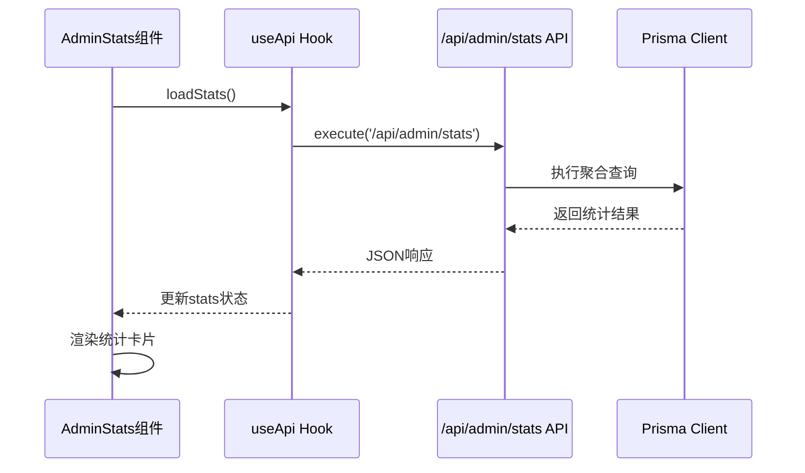
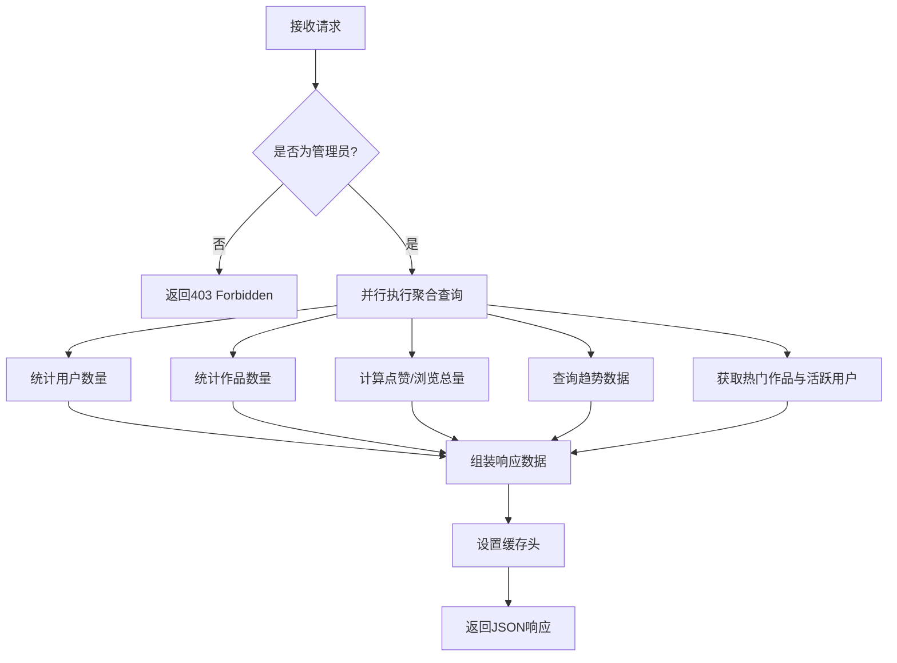

# 数据统计

<cite>
**本文档中引用的文件**  
- [AdminStats.tsx](file://src/components/admin/AdminStats.tsx)
- [route.ts](file://src/app/api/admin/stats/route.ts)
- [useApi.ts](file://src/hooks/useApi.ts)
- [prisma.ts](file://src/lib/prisma.ts)
- [work.d.ts](file://src/types/work.d.ts)
</cite>

## 目录
1. [简介](#简介)
2. [数据统计功能实现](#数据统计功能实现)
3. [后端聚合查询机制](#后端聚合查询机制)
4. [API响应格式示例](#api响应格式示例)
5. [前端图表渲染逻辑](#前端图表渲染逻辑)
6. [数据更新频率与实时性保障](#数据更新频率与实时性保障)
7. [性能瓶颈分析与优化建议](#性能瓶颈分析与优化建议)

## 简介
本系统为数字化作品互动展示平台提供全面的数据统计功能，主要面向管理员角色。通过 `/admin/stats` API 接口，系统可获取平台核心运营指标，包括作品数量、用户增长、互动数据等聚合信息。该功能结合前端组件 `AdminStats` 与后端 Prisma 聚合查询，实现了高效、安全且可扩展的统计能力。

## 数据统计功能实现

`AdminStats` 组件作为管理后台的数据看板入口，负责调用 `/api/admin/stats` 接口并渲染统计结果。组件使用 `useApi` 自定义 Hook 封装了对 API 的请求逻辑，确保加载状态、错误处理和重试机制的一致性。

组件在初始化时自动触发 `loadStats` 方法，向后端发送请求获取统计数据。响应数据经过类型校验后更新本地状态，并通过网格布局以数字卡片形式展示关键指标。若请求失败或数据为空，组件会显示加载动画或错误提示，保障用户体验的完整性。



**Diagram sources**  
- [AdminStats.tsx](file://src/components/admin/AdminStats.tsx#L28-L174)
- [useApi.ts](file://src/hooks/useApi.ts#L19-L85)

**Section sources**  
- [AdminStats.tsx](file://src/components/admin/AdminStats.tsx#L28-L174)
- [useApi.ts](file://src/hooks/useApi.ts#L19-L85)

## 后端聚合查询机制

后端通过 `src/app/api/admin/stats/route.ts` 文件中的 `GET` 方法处理统计请求。首先进行管理员权限校验，确保只有具备 `ADMIN` 角色的用户才能访问敏感数据。

核心统计逻辑使用 Prisma ORM 提供的聚合功能从数据库高效提取数据：
- 使用 `count()` 方法统计用户总数、作品总数及不同审核状态的作品数量
- 使用 `aggregate({ _sum: ... })` 计算总点赞量和总浏览量
- 使用 `groupBy` 和原始 SQL 查询（`$queryRaw`）生成按日分组的趋势数据
- 使用 `findMany` 与 `_count` 子查询获取活跃用户和热门作品列表

所有查询通过 `Promise.all` 并行执行，显著减少整体响应时间。此外，系统通过 `BigInt` 到 `Number` 的显式转换确保前端兼容性。



**Diagram sources**  
- [route.ts](file://src/app/api/admin/stats/route.ts#L0-L162)

**Section sources**  
- [route.ts](file://src/app/api/admin/stats/route.ts#L0-L162)

## API响应格式示例

API 返回结构化 JSON 数据，包含概览、图表和列表三类信息：

```json
{
  "success": true,
  "data": {
    "overview": {
      "totalUsers": 1582,
      "totalWorks": 3421,
      "pendingWorks": 47,
      "approvedWorks": 3210,
      "rejectedWorks": 164,
      "recentUsers": 89,
      "recentWorks": 134
    },
    "charts": {
      "dailyWorks": [
        { "date": "2025-09-17", "count": 12, "type": "works" },
        { "date": "2025-09-16", "count": 18, "type": "works" }
      ],
      "dailyUsers": [
        { "date": "2025-09-17", "count": 7, "type": "users" },
        { "date": "2025-09-16", "count": 12, "type": "users" }
      ]
    },
    "lists": {
      "popularWorks": [/* 作品列表 */],
      "activeUsers": [/* 用户列表 */]
    }
  }
}
```

响应头中包含缓存策略：`Cache-Control: public, s-maxage=300, stale-while-revalidate=600`，即 CDN 或代理服务器可缓存 5 分钟，在此期间内后续请求将直接返回缓存结果，提升性能并降低数据库负载。

**Section sources**  
- [route.ts](file://src/app/api/admin/stats/route.ts#L80-L137)
- [work.d.ts](file://src/types/work.d.ts#L0-L95)

## 前端图表渲染逻辑

前端使用简单的 UI 组件展示统计信息，主要采用数字卡片与渐变背景区块两种形式：
- **数字卡片**：以网格布局展示核心指标，每张卡片包含标题、数值和图标，背景色区分不同指标类型
- **趋势展示**：使用渐变色块突出“最近数据”区域，增强视觉重点
- **响应式设计**：支持从移动端到桌面端的自适应布局

组件通过 `toLocaleString()` 格式化大数显示，提升可读性。错误边界和加载状态确保在异常情况下仍能提供良好用户体验。

```mermaid
classDiagram
class AdminStats {
+stats : ApiStatsResponse | null
+loading : boolean
+error : string | null
+loadStats() : Promise~void~
}
class ApiStatsResponse {
+overview : Overview
+charts : Charts
+lists : Lists
}
class Overview {
+totalUsers : number
+totalWorks : number
+pendingWorks : number
+approvedWorks : number
+rejectedWorks : number
+recentUsers : number
+recentWorks : number
}
class Charts {
+dailyWorks : {date : Date, count : number}[]
+dailyUsers : {date : Date, count : number}[]
}
class Lists {
+popularWorks : WorkWithUser[]
+activeUsers : UserWithWorkCount[]
}
AdminStats --> ApiStatsResponse : 使用
ApiStatsResponse --> Overview
ApiStatsResponse --> Charts
ApiStatsResponse --> Lists
```

**Diagram sources**  
- [AdminStats.tsx](file://src/components/admin/AdminStats.tsx#L28-L174)
- [work.d.ts](file://src/types/work.d.ts#L0-L95)

**Section sources**  
- [AdminStats.tsx](file://src/components/admin/AdminStats.tsx#L28-L174)

## 数据更新频率与实时性保障

当前系统采用**按需计算 + 短时缓存**策略：
- 数据在每次管理员访问统计页面时实时计算
- 响应结果被缓存 5 分钟（`s-maxage=300`），在此期间内重复请求将命中缓存
- 缓存允许陈旧数据再验证（`stale-while-revalidate=600`），即缓存过期后仍可短暂返回旧数据，同时后台异步更新，保障响应速度

此机制在数据实时性与系统性能之间取得平衡。对于管理后台场景，5 分钟延迟可接受，且避免了定时任务带来的额外复杂性。

**Section sources**  
- [route.ts](file://src/app/api/admin/stats/route.ts#L134-L162)

## 性能瓶颈分析与优化建议

### 潜在性能瓶颈
1. **大数据量下的聚合查询延迟**：当作品或用户表记录达到百万级时，`count()` 和 `aggregate()` 操作可能变慢
2. **高并发访问压力**：若多个管理员同时访问统计页面，可能导致数据库连接压力
3. **复杂查询资源消耗**：原始 SQL 查询和多表关联可能影响数据库性能

### 优化建议
1. **引入 Redis 缓存层**：
   - 将统计结果缓存至 Redis，设置 TTL（如 5 分钟）
   - 使用键如 `stats:overview:20250917` 实现细粒度缓存
   - 减少对数据库的直接压力

2. **定时任务预计算**：
   - 使用 cron 任务每 5 分钟预计算一次统计数据并存入缓存或专用统计表
   - API 直接读取预计算结果，实现毫秒级响应

3. **数据库层面优化**：
   - 为 `status`、`createdAt` 等常用查询字段添加索引
   - 考虑使用物化视图（Materialized View）存储聚合结果

4. **分页与懒加载**：
   - 对于“热门作品”和“活跃用户”等列表数据，支持分页加载
   - 避免一次性返回过多数据

5. **监控与告警**：
   - 记录统计接口响应时间
   - 设置慢查询告警，及时发现性能退化

通过上述优化，系统可在数据规模持续增长的情况下保持稳定高效的统计服务能力。

**Section sources**  
- [route.ts](file://src/app/api/admin/stats/route.ts#L0-L162)
- [prisma.ts](file://src/lib/prisma.ts#L6-L17)