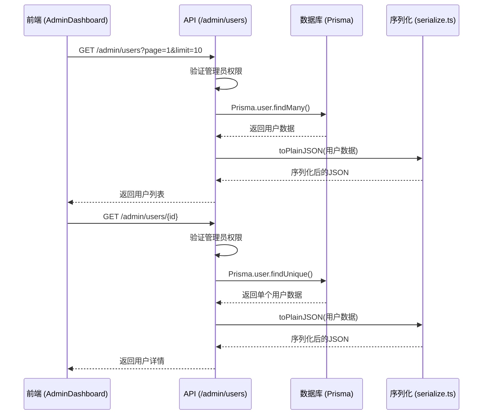
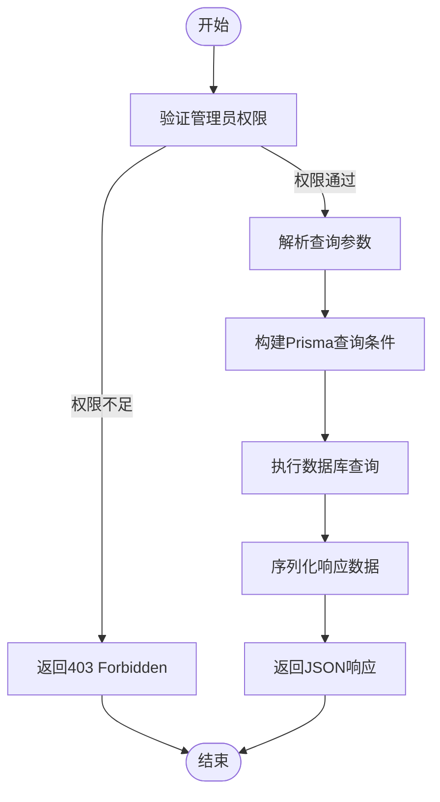
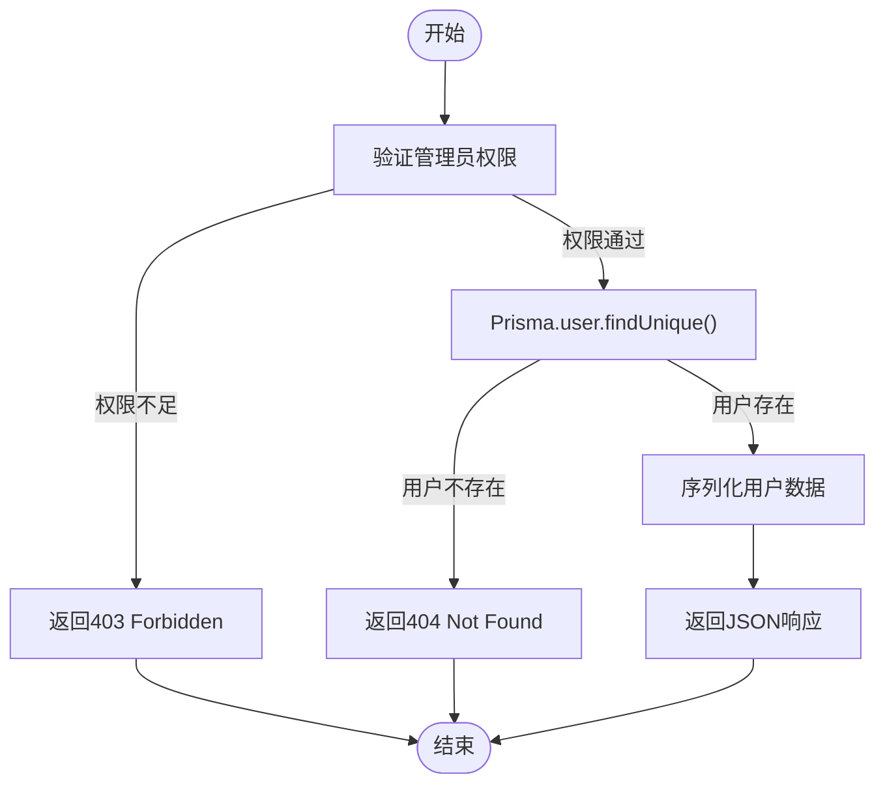
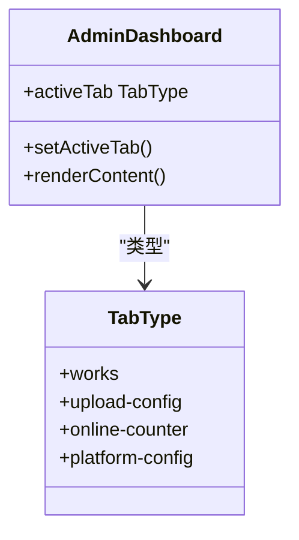
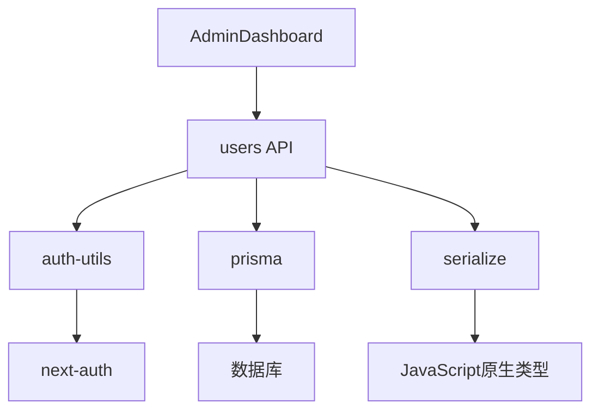

# 用户管理

<cite>
**本文档中引用的文件**   
- [AdminDashboard.tsx](file://src/components/admin/AdminDashboard.tsx)
- [users/route.ts](file://src/app/api/admin/users/route.ts)
- [users/[id]/route.ts](file://src/app/api/admin/users/[id]/route.ts)
- [serialize.ts](file://src/lib/serialize.ts)
- [auth-utils.ts](file://src/lib/auth-utils.ts)
- [admin/page.tsx](file://src/app/admin/page.tsx)
</cite>

## 目录
1. [简介](#简介)
2. [项目结构](#项目结构)
3. [核心组件](#核心组件)
4. [架构概述](#架构概述)
5. [详细组件分析](#详细组件分析)
6. [依赖分析](#依赖分析)
7. [性能考虑](#性能考虑)
8. [故障排除指南](#故障排除指南)
9. [结论](#结论)

## 简介
本文档详细说明了数字化作品互动展示平台中用户管理功能的实现机制。重点描述管理员如何通过 `/admin/users` API 获取所有用户列表及单个用户详情，包括用户注册时间、作品数量、账户状态等信息。文档涵盖API的分页支持、查询过滤机制、敏感数据（如邮箱）的展示权限控制，以及后端如何通过Prisma查询用户数据并进行序列化处理。同时提供前端调用示例，展示AdminDashboard中用户管理模块的数据渲染逻辑，并讨论安全性设计。

## 项目结构
用户管理功能主要分布在API路由、前端组件和工具库中。API端点位于 `src/app/api/admin/users` 目录下，前端管理界面由 `AdminDashboard` 组件驱动，序列化逻辑封装在 `lib/serialize.ts` 中。

```mermaid
graph TB
subgraph "前端"
AD[AdminDashboard.tsx]
AP[admin/page.tsx]
end
subgraph "API"
UG[users/route.ts]
UD[users/[id]/route.ts]
end
subgraph "工具库"
S[serialize.ts]
AU[auth-utils.ts]
end
AD --> UG
AD --> UD
AP --> AD
UG --> S
UD --> S
UG --> AU
UD --> AU
```

**Diagram sources**
- [AdminDashboard.tsx](file://src/components/admin/AdminDashboard.tsx)
- [users/route.ts](file://src/app/api/admin/users/route.ts)
- [users/[id]/route.ts](file://src/app/api/admin/users/[id]/route.ts)
- [serialize.ts](file://src/lib/serialize.ts)
- [auth-utils.ts](file://src/lib/auth-utils.ts)
- [admin/page.tsx](file://src/app/admin/page.tsx)

**Section sources**
- [AdminDashboard.tsx](file://src/components/admin/AdminDashboard.tsx)
- [users/route.ts](file://src/app/api/admin/users/route.ts)
- [users/[id]/route.ts](file://src/app/api/admin/users/[id]/route.ts)
- [serialize.ts](file://src/lib/serialize.ts)
- [auth-utils.ts](file://src/lib/auth-utils.ts)
- [admin/page.tsx](file://src/app/admin/page.tsx)

## 核心组件
用户管理功能的核心组件包括管理员仪表盘前端界面、获取用户列表和详情的API端点、用户权限验证工具和数据序列化工具。这些组件协同工作，实现安全、高效、功能完整的用户管理。

**Section sources**
- [AdminDashboard.tsx](file://src/components/admin/AdminDashboard.tsx)
- [users/route.ts](file://src/app/api/admin/users/route.ts)
- [users/[id]/route.ts](file://src/app/api/admin/users/[id]/route.ts)
- [auth-utils.ts](file://src/lib/auth-utils.ts)
- [serialize.ts](file://src/lib/serialize.ts)

## 架构概述
系统采用前后端分离架构。前端通过 `AdminDashboard` 组件提供用户界面，后端通过API路由处理数据请求。所有用户管理API均受权限保护，仅允许管理员角色访问。数据查询通过Prisma ORM执行，结果通过 `serialize.ts` 中的 `toPlainJSON` 函数进行序列化处理后返回。



**Diagram sources**
- [users/route.ts](file://src/app/api/admin/users/route.ts)
- [users/[id]/route.ts](file://src/app/api/admin/users/[id]/route.ts)
- [prisma](file://src/lib/prisma)
- [serialize.ts](file://src/lib/serialize.ts)

## 详细组件分析

### 用户列表API分析
`/api/admin/users` 端点实现了分页、过滤和权限控制功能。管理员可以获取所有用户列表，支持按角色和搜索关键词过滤，并返回分页信息。



**Diagram sources**
- [users/route.ts](file://src/app/api/admin/users/route.ts)

**Section sources**
- [users/route.ts](file://src/app/api/admin/users/route.ts)

### 用户详情API分析
`/api/admin/users/[id]` 端点用于获取单个用户详情，包括其作品列表。该端点同样需要管理员权限，并对用户ID进行验证。



**Diagram sources**
- [users/[id]/route.ts](file://src/app/api/admin/users/[id]/route.ts)

**Section sources**
- [users/[id]/route.ts](file://src/app/api/admin/users/[id]/route.ts)

### 数据序列化分析
`lib/serialize.ts` 文件中的 `toPlainJSON` 函数负责将复杂数据结构（如Prisma查询结果）转换为可序列化的JSON格式，处理Date对象、BigInt和循环引用等问题。

```mermaid
classDiagram
class toPlainJSON {
+toPlainJSON(value T) JSONValue
-处理基本类型()
-处理Date()
-处理Array()
-处理Object()
-优化图片URL()
}
class JSONValue {
+string
+number
+boolean
+null
+JSONValue[]
+{ [key : string] : JSONValue }
}
toPlainJSON --> JSONValue : "返回类型"
```

**Diagram sources**
- [serialize.ts](file://src/lib/serialize.ts)

**Section sources**
- [serialize.ts](file://src/lib/serialize.ts)

### 前端管理界面分析
`AdminDashboard` 组件是管理员功能的入口，通过标签页导航到不同的管理模块，包括用户管理。



**Diagram sources**
- [AdminDashboard.tsx](file://src/components/admin/AdminDashboard.tsx)

**Section sources**
- [AdminDashboard.tsx](file://src/components/admin/AdminDashboard.tsx)

## 依赖分析
用户管理功能依赖于多个核心模块，包括身份验证、数据库访问、API路由和前端组件。



**Diagram sources**
- [AdminDashboard.tsx](file://src/components/admin/AdminDashboard.tsx)
- [users/route.ts](file://src/app/api/admin/users/route.ts)
- [users/[id]/route.ts](file://src/app/api/admin/users/[id]/route.ts)
- [auth-utils.ts](file://src/lib/auth-utils.ts)
- [prisma](file://src/lib/prisma)
- [serialize.ts](file://src/lib/serialize.ts)

**Section sources**
- [AdminDashboard.tsx](file://src/components/admin/AdminDashboard.tsx)
- [users/route.ts](file://src/app/api/admin/users/route.ts)
- [users/[id]/route.ts](file://src/app/api/admin/users/[id]/route.ts)
- [auth-utils.ts](file://src/lib/auth-utils.ts)
- [prisma](file://src/lib/prisma)
- [serialize.ts](file://src/lib/serialize.ts)

## 性能考虑
- **数据库查询优化**：使用 `select` 字段精确控制返回的用户数据，避免N+1查询问题。
- **分页机制**：通过 `skip` 和 `take` 实现分页，防止一次性加载过多数据。
- **并发查询**：使用 `Promise.all` 并发执行用户列表和总数查询，提高响应速度。
- **序列化效率**：`toPlainJSON` 函数递归处理数据，对大型数据集可能成为性能瓶颈，建议在必要时进行优化。

## 故障排除指南
- **权限不足错误 (403)**：确保请求者为管理员角色，检查会话状态。
- **用户不存在错误 (404)**：验证提供的用户ID是否正确。
- **查询参数无效错误 (400)**：检查分页参数（page, limit）是否为有效数字。
- **服务器内部错误 (500)**：查看服务器日志，检查数据库连接和Prisma查询。
- **序列化错误**：检查数据中是否存在无法序列化的类型（如函数、Symbol）。

**Section sources**
- [users/route.ts](file://src/app/api/admin/users/route.ts)
- [users/[id]/route.ts](file://src/app/api/admin/users/[id]/route.ts)

## 结论
用户管理功能通过清晰的API设计、严格的权限控制和高效的数据处理，为管理员提供了全面的用户信息查看和管理能力。系统安全性高，扩展性好，未来可轻松添加封禁用户、重置密码等管理功能。