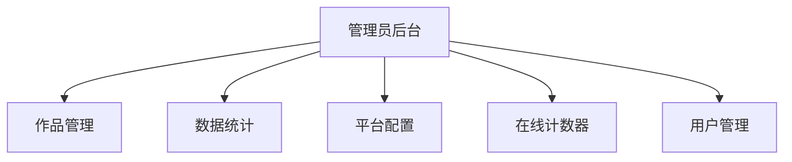
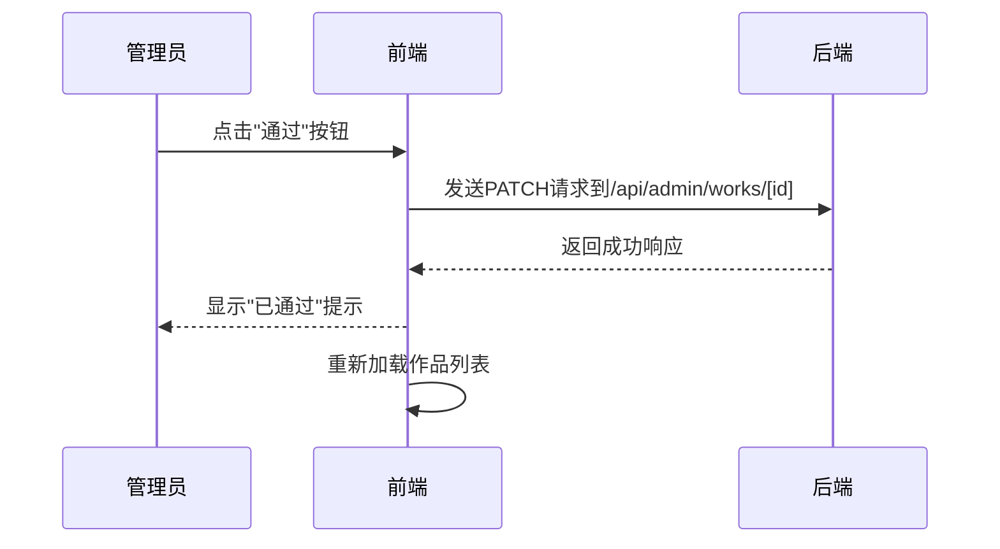
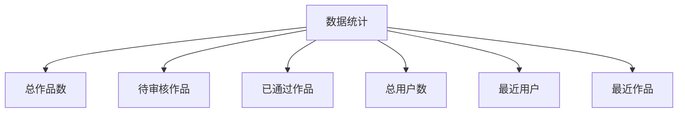
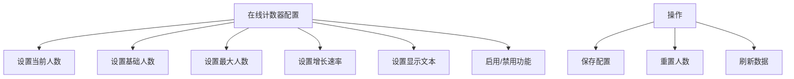

# 管理功能

<cite>
**本文档引用的文件**   
- [AdminDashboard.tsx](file://src/components/admin/AdminDashboard.tsx)
- [WorksManagement.tsx](file://src/components/admin/WorksManagement.tsx)
- [AdminStats.tsx](file://src/components/admin/AdminStats.tsx)
- [PlatformConfigManagement.tsx](file://src/components/admin/PlatformConfigManagement.tsx)
- [OnlineCounterManagement.tsx](file://src/components/admin/OnlineCounterManagement.tsx)
- [route.ts](file://src/app/api/admin/works/route.ts)
- [route.ts](file://src/app/api/admin/stats/route.ts)
- [route.ts](file://src/app/api/platform-config/route.ts)
- [route.ts](file://src/app/api/admin/online-counter/route.ts)
</cite>

## 目录
1. [管理员后台概述](#管理员后台概述)
2. [作品管理](#作品管理)
3. [用户管理](#用户管理)
4. [数据统计](#数据统计)
5. [平台配置](#平台配置)
6. [在线计数器配置](#在线计数器配置)
7. [权限与安全性](#权限与安全性)
8. [操作指南](#操作指南)

## 管理员后台概述

管理员后台是平台运营人员进行内容审核、用户管理、数据监控和系统配置的核心工作界面。通过`AdminDashboard`组件实现，采用标签页导航布局，包含作品管理、上传配置、在线人数和平台配置四个主要功能模块。管理员登录后可访问此界面，通过顶部导航栏的标签页切换不同管理功能。

**图源**
- [AdminDashboard.tsx](file://src/components/admin/AdminDashboard.tsx#L12-L89)

## 作品管理

作品管理模块通过`WorksManagement`组件实现，提供对用户提交作品的全面管理功能，包括审核、编辑、设为精选等操作。该模块通过`/api/admin/works`路由与后端API交互，支持分页、搜索和排序功能。

### 审核功能
管理员可以对处于"待审核"状态的作品进行通过或拒绝操作。当点击"通过"按钮时，系统会调用`handleStatusChange`函数，发送PATCH请求将作品状态更新为"APPROVED"。若点击"拒绝"，则状态更新为"REJECTED"，并可选择性地输入拒绝理由。

### 编辑功能
管理员可点击"编辑"按钮打开编辑模态框，修改作品的名称、作者和创作提示词。编辑完成后，系统会发送PUT请求到`/api/admin/works/[id]/edit`端点，更新作品信息。

### 精选功能
对于已通过审核的作品，管理员可将其设为"精选"。此功能通过`handleFeaturedChange`函数实现，发送PATCH请求到`/api/admin/works/[id]/featured`端点，切换作品的精选状态。

**图源**
- [WorksManagement.tsx](file://src/components/admin/WorksManagement.tsx#L78-L106)
- [route.ts](file://src/app/api/admin/works/route.ts)

**节源**
- [WorksManagement.tsx](file://src/components/admin/WorksManagement.tsx#L22-L782)

## 用户管理

用户管理功能通过`/users`路由实现，允许管理员查看和管理平台用户。虽然具体实现代码未提供，但根据项目结构，该功能应位于`src/app/api/admin/users`目录下。管理员可以查看用户基本信息、注册时间、作品数量等数据，并可根据需要进行用户状态管理（如禁用/启用账户）。

## 数据统计

数据统计模块由`AdminStats`组件实现，通过调用`/api/admin/stats` API获取平台运营数据。该组件展示多项关键指标，包括总作品数、待审核作品数、已通过作品数、总用户数等。

统计数据显示为卡片网格布局，每张卡片包含图标、标题和数值。数据还包括最近7天的新作品和新用户数量，帮助管理员了解平台近期活跃度。

**图源**
- [AdminStats.tsx](file://src/components/admin/AdminStats.tsx#L28-L174)
- [route.ts](file://src/app/api/admin/stats/route.ts)

**节源**
- [AdminStats.tsx](file://src/components/admin/AdminStats.tsx#L28-L174)

## 平台配置

平台配置管理通过`PlatformConfigManagement`组件实现，允许管理员修改平台的全局设置。当前主要功能是修改平台主标题，通过`/api/platform-config` API进行数据的获取和保存。

管理员在输入框中修改标题后，点击"保存配置"按钮，系统会发送POST请求到`/api/platform-config`端点。保存成功后，页面会自动刷新以更新显示的标题。

**节源**
- [PlatformConfigManagement.tsx](file://src/components/admin/PlatformConfigManagement.tsx#L11-L143)
- [route.ts](file://src/app/api/platform-config/route.ts)

## 在线计数器配置

在线计数器管理通过`OnlineCounterManagement`组件实现，允许管理员配置实时在线人数显示的各项参数。该功能通过`/api/admin/online-counter` API进行数据交互。

管理员可配置的参数包括：
- 当前显示人数
- 基础人数（重置时的最小值）
- 最大人数（自动增长上限）
- 增长速率（每10秒最大增加人数）
- 显示文本（如"人正在云栖大会创作"）
- 功能启用状态

管理员可执行保存配置、重置人数和刷新数据等操作。

**图源**
- [OnlineCounterManagement.tsx](file://src/components/admin/OnlineCounterManagement.tsx#L18-L322)
- [route.ts](file://src/app/api/admin/online-counter/route.ts)

**节源**
- [OnlineCounterManagement.tsx](file://src/components/admin/OnlineCounterManagement.tsx#L18-L322)

## 权限与安全性

所有管理API均具有严格的安全控制，仅限管理员角色访问。系统通过会话验证确保只有经过身份验证的管理员才能访问管理功能。在`OnlineCounterManagement`等组件中，明确检查用户角色，若非管理员则显示"权限不足"提示。

API端点均采用安全的HTTP方法：GET用于数据读取，POST/PUT/PATCH用于数据修改，DELETE用于数据删除。敏感操作如作品审核和配置修改均需通过身份验证和权限检查。

**节源**
- [OnlineCounterManagement.tsx](file://src/components/admin/OnlineCounterManagement.tsx#L18-L322)

## 操作指南

### 处理待审核作品
1. 进入"作品管理"页面
2. 在状态筛选器中选择"待审核"
3. 查看作品详情，包括作品图片、作者信息和创作提示词
4. 根据内容质量决定通过或拒绝
5. 点击"通过"或"拒绝"按钮完成审核
6. 系统将自动刷新列表显示最新状态

### 设置精选作品
1. 在作品列表中找到已通过审核的作品
2. 点击"设为精选"按钮
3. 作品将显示"⭐ 精选"标识
4. 精选作品将在前台获得更高曝光

### 配置在线人数
1. 进入"在线人数"管理页面
2. 在配置表单中调整各项参数
3. 点击"保存配置"应用更改
4. 可点击"重置人数"将在线人数重置为基础值

**节源**
- [WorksManagement.tsx](file://src/components/admin/WorksManagement.tsx#L22-L782)
- [OnlineCounterManagement.tsx](file://src/components/admin/OnlineCounterManagement.tsx#L18-L322)