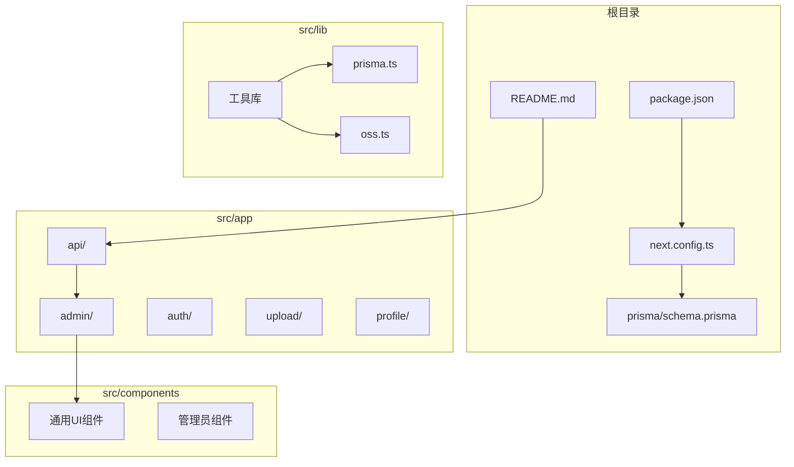
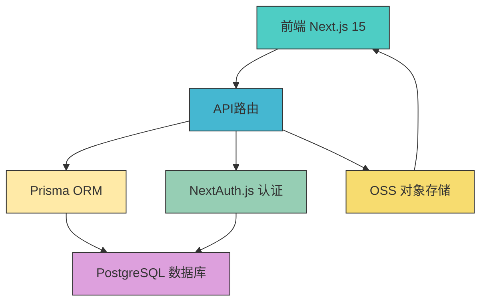
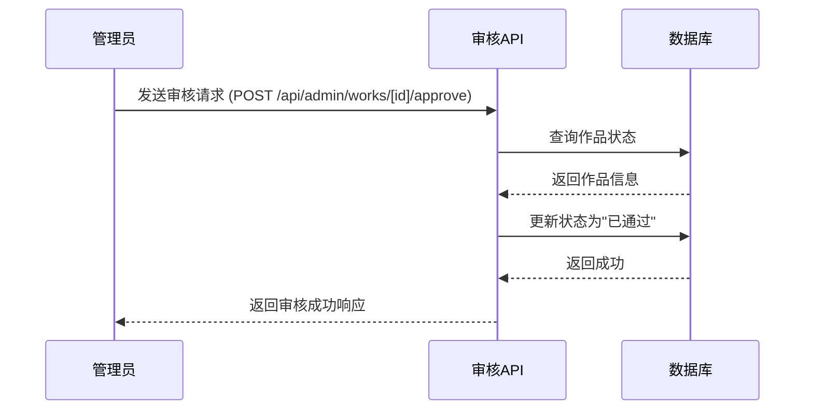
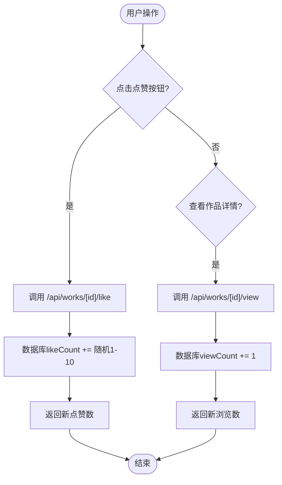
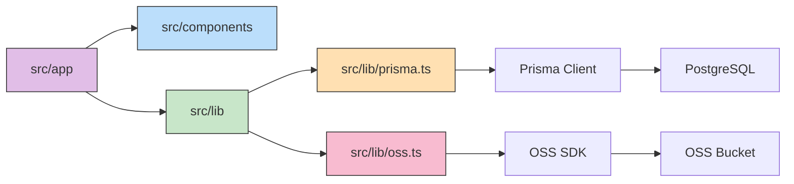

# 系统概述

<cite>
**本文档引用文件**  
- [README.md](file://README.md)
- [数字化作品互动展示平台 PRD (产品需求文档).md](file://数字化作品互动展示平台 PRD (产品需求文档).md)
- [src/app/api/upload/route.ts](file://src/app/api/upload/route.ts)
- [src/app/api/works/[id]/like/route.ts](file://src/app/api/works/[id]/like/route.ts)
- [src/app/api/works/[id]/view/route.ts](file://src/app/api/works/[id]/view/route.ts)
- [src/app/api/admin/works/route.ts](file://src/app/api/admin/works/route.ts)
- [src/app/api/admin/works/[id]/approve/route.ts](file://src/app/api/admin/works/[id]/approve/route.ts)
- [src/app/api/admin/works/[id]/reject/route.ts](file://src/app/api/admin/works/[id]/reject/route.ts)
- [src/app/api/online-counter/route.ts](file://src/app/api/online-counter/route.ts)
- [src/app/api/admin/online-counter/route.ts](file://src/app/api/admin/online-counter/route.ts)
- [src/lib/prisma.ts](file://src/lib/prisma.ts)
- [src/lib/oss.ts](file://src/lib/oss.ts)
</cite>

## 目录
1. [简介](#简介)
2. [项目结构](#项目结构)
3. [核心组件](#核心组件)
4. [架构概览](#架构概览)
5. [详细组件分析](#详细组件分析)
6. [依赖分析](#依赖分析)
7. [性能考量](#性能考量)
8. [故障排除指南](#故障排除指南)
9. [结论](#结论)

## 简介
“数字化作品互动展示平台”是一个全栈式AI创作作品上传、展示与互动平台，旨在为大型线下活动（如云栖大会）提供一个高效、安全且富有互动性的数字作品展示解决方案。平台支持用户上传AI生成的图片作品及其Prompt，并通过审核机制确保内容合规。作品在前端以动态“传送带”形式展示，支持点赞、浏览统计和模拟在线人数等互动功能，营造热烈的社区氛围。系统采用现代化技术栈，具备高并发承载能力，适配PC大屏与移动端浏览场景。

## 项目结构
项目采用Next.js 15的App Router架构，代码组织清晰，功能模块化。

**Diagram sources**
- [README.md](file://README.md)
- [next.config.ts](file://next.config.ts)
- [prisma/schema.prisma](file://prisma/schema.prisma)

**Section sources**
- [README.md](file://README.md)
- [next.config.ts](file://next.config.ts)

## 核心组件
平台的核心功能由前端展示、后端API、数据库和身份认证四大组件协同实现。前端使用Next.js 15和React 19构建响应式UI，通过Tailwind CSS实现现代化设计。后端利用Next.js API路由处理所有业务逻辑，包括作品上传、审核、互动等。数据库采用Prisma ORM操作PostgreSQL，确保数据持久化和高效查询。身份认证由NextAuth.js提供，支持用户注册、登录和权限管理。

**Section sources**
- [README.md](file://README.md)
- [数字化作品互动展示平台 PRD (产品需求文档).md](file://数字化作品互动展示平台 PRD (产品需求文档).md)

## 架构概览
系统采用分层架构，从前端到后端再到数据层，职责分明。

**Diagram sources**
- [src/app/api/upload/route.ts](file://src/app/api/upload/route.ts)
- [src/lib/prisma.ts](file://src/lib/prisma.ts)
- [src/lib/oss.ts](file://src/lib/oss.ts)

## 详细组件分析
### 作品上传与审核流程
用户上传作品后，系统将其存储于OSS并记录于数据库，状态为“待审核”。管理员通过后台审核页面查看待审作品，决定通过或拒绝。

#### 审核功能实现

**Diagram sources**
- [src/app/api/admin/works/[id]/approve/route.ts](file://src/app/api/admin/works/[id]/approve/route.ts)
- [src/app/api/admin/works/[id]/reject/route.ts](file://src/app/api/admin/works/[id]/reject/route.ts)

**Section sources**
- [src/app/api/admin/works/[id]/approve/route.ts](file://src/app/api/admin/works/[id]/approve/route.ts)
- [src/app/api/admin/works/[id]/reject/route.ts](file://src/app/api/admin/works/[id]/reject/route.ts)

### 互动功能实现
平台支持点赞和浏览统计，增强用户参与感。

#### 点赞与浏览逻辑

**Diagram sources**
- [src/app/api/works/[id]/like/route.ts](file://src/app/api/works/[id]/like/route.ts)
- [src/app/api/works/[id]/view/route.ts](file://src/app/api/works/[id]/view/route.ts)

**Section sources**
- [src/app/api/works/[id]/like/route.ts](file://src/app/api/works/[id]/like/route.ts)
- [src/app/api/works/[id]/view/route.ts](file://src/app/api/works/[id]/view/route.ts)

## 依赖分析
系统依赖关系清晰，各模块耦合度低。

**Diagram sources**
- [src/lib/prisma.ts](file://src/lib/prisma.ts)
- [src/lib/oss.ts](file://src/lib/oss.ts)

**Section sources**
- [src/lib/prisma.ts](file://src/lib/prisma.ts)
- [src/lib/oss.ts](file://src/lib/oss.ts)

## 性能考量
系统设计充分考虑性能需求。前端采用懒加载和无限滚动，确保3G网络下5秒内完成首屏加载。API接口通过Prisma高效查询，目标平均响应时间低于200ms。所有静态资源和用户上传图片均通过CDN分发，降低服务器负载，提升全球访问速度。在线人数和作品数据采用模拟与缓存机制，避免高频数据库写入。

## 故障排除指南
常见问题包括上传失败、审核无权限、在线人数不更新等。上传失败通常由文件大小、格式或上传时段限制引起。审核无权限需确认用户角色为管理员。在线人数不更新可检查`onlineCounterConfig`表是否存在有效配置。数据库连接问题需核对`DATABASE_URL`环境变量。

**Section sources**
- [log/nextjs15-build-error.md](file://log/nextjs15-build-error.md)
- [log/online-counter-issue.md](file://log/online-counter-issue.md)

## 结论
“数字化作品互动展示平台”是一个功能完备、架构清晰的现代化Web应用。它成功整合了作品上传、内容审核、用户互动和实时数据展示等核心功能，为活动场景提供了强大的数字化支持。系统技术选型先进，代码结构合理，具备良好的可维护性和扩展性，能够有效支撑高并发场景下的稳定运行。