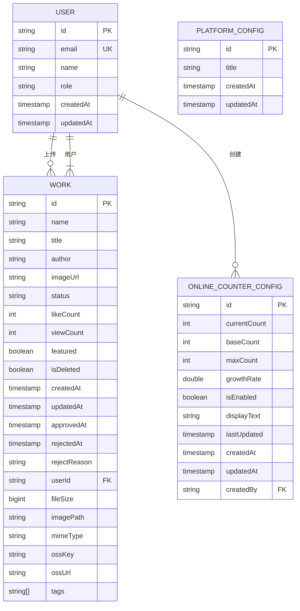
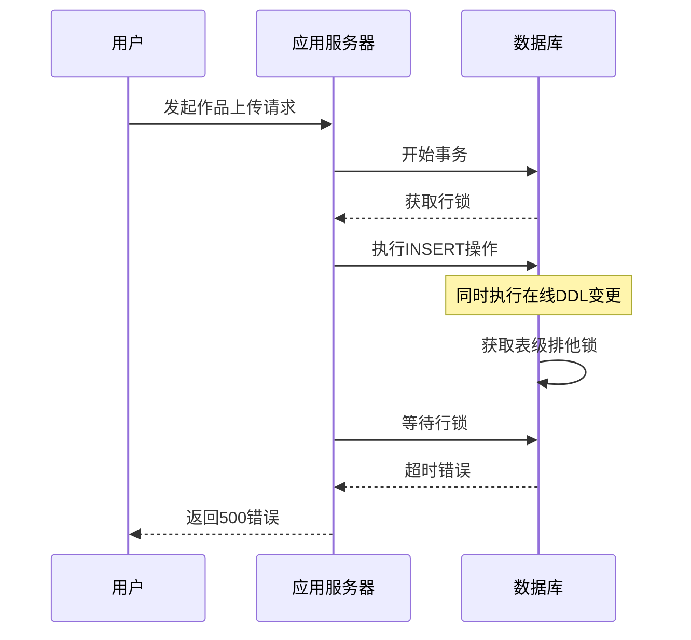
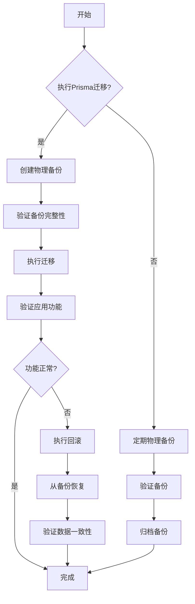

# 备份恢复与版本回滚

<cite>
**本文档引用文件**  
- [prisma/migrations/20250831084947_add_featured_field/migration.sql](file://prisma/migrations/20250831084947_add_featured_field/migration.sql)
- [prisma/migrations/20250905143157_add_online_counter_config/migration.sql](file://prisma/migrations/20250905143157_add_online_counter_config/migration.sql)
- [prisma/migrations/20250905150839_add_platform_config/migration.sql](file://prisma/migrations/20250905150839_add_platform_config/migration.sql)
- [prisma/migrations/20250917050212_add_missing_fields/migration.sql](file://prisma/migrations/20250917050212_add_missing_fields/migration.sql)
- [prisma/seed.ts](file://prisma/seed.ts)
- [src/lib/prisma.ts](file://src/lib/prisma.ts)
- [src/数字化作品互动展示平台 - 开发文档.md](file://src/数字化作品互动展示平台 - 开发文档.md)
- [verify-database.ts](file://verify-database.ts)
</cite>

## 目录
1. [引言](#引言)
2. [物理备份与恢复策略](#物理备份与恢复策略)
3. [Prisma迁移与版本回滚](#prisma迁移与版本回滚)
4. [在线DDL变更风险与最佳实践](#在线ddl变更风险与最佳实践)
5. [综合备份恢复流程](#综合备份恢复流程)
6. [结论](#结论)

## 引言
数字化作品互动展示平台采用Prisma作为ORM框架，结合PostgreSQL数据库，支持动态内容展示与用户互动。为确保系统稳定性和数据安全性，必须建立完善的数据库备份与恢复策略。本文档详细阐述了物理备份（pg_dump/pg_restore）与逻辑迁移回滚两种方式，结合Prisma迁移历史记录，说明如何安全执行版本回滚操作，避免数据丢失。同时，讨论在线DDL变更的风险，并提供分阶段发布、读写分离环境验证等最佳实践。

## 物理备份与恢复策略

### 物理备份（pg_dump）
物理备份使用`pg_dump`工具导出数据库的完整快照，适用于灾难恢复和大规模数据迁移。该方法生成的SQL文件包含重建数据库所需的所有DDL和DML语句。

```bash
# 完整数据库备份
pg_dump -h localhost -U postgres -d yunqi_db -f yunqi_backup_$(date +%Y%m%d_%H%M%S).sql

# 仅导出数据（不包含模式）
pg_dump -h localhost -U postgres -d yunqi_db --data-only -f yunqi_data_only.sql

# 仅导出模式（不包含数据）
pg_dump -h localhost -U postgres -d yunqi_db --schema-only -f yunqi_schema_only.sql
```

**Section sources**
- [src/数字化作品互动展示平台 - 开发文档.md](file://src/数字化作品互动展示平台 - 开发文档.md#L1-L1602)

### 物理恢复（pg_restore）
物理恢复使用`pg_restore`工具将备份文件导入数据库。在执行恢复前，必须确保目标数据库为空或已做好数据覆盖准备。

```bash
# 恢复完整数据库备份
psql -h localhost -U postgres -d yunqi_db -f yunqi_backup_20250831_084947.sql

# 使用pg_restore恢复（适用于自定义格式备份）
pg_restore -h localhost -U postgres -d yunqi_db yunqi_backup.custom
```

**Section sources**
- [src/数字化作品互动展示平台 - 开发文档.md](file://src/数字化作品互动展示平台 - 开发文档.md#L1-L1602)

## Prisma迁移与版本回滚

### Prisma迁移历史
Prisma通过迁移文件管理数据库模式变更。每个迁移文件包含`up`（应用变更）和`down`（撤销变更）两个部分。项目中的迁移历史记录如下：

- `20250831084947_add_featured_field`: 创建基础数据表，包括用户、作品、会话等
- `20250905143157_add_online_counter_config`: 添加在线计数器配置表
- `20250905150839_add_platform_config`: 添加平台配置表
- `20250917050212_add_missing_fields`: 为作品表添加缺失字段（如fileSize、imagePath等）



**Diagram sources**
- [prisma/migrations/20250831084947_add_featured_field/migration.sql](file://prisma/migrations/20250831084947_add_featured_field/migration.sql#L1-L122)
- [prisma/migrations/20250905143157_add_online_counter_config/migration.sql](file://prisma/migrations/20250905143157_add_online_counter_config/migration.sql#L1-L18)
- [prisma/migrations/20250905150839_add_platform_config/migration.sql](file://prisma/migrations/20250905150839_add_platform_config/migration.sql#L1-L9)
- [prisma/migrations/20250917050212_add_missing_fields/migration.sql](file://prisma/migrations/20250917050212_add_missing_fields/migration.sql#L1-L7)

**Section sources**
- [prisma/migrations/20250831084947_add_featured_field/migration.sql](file://prisma/migrations/20250831084947_add_featured_field/migration.sql)
- [prisma/migrations/20250905143157_add_online_counter_config/migration.sql](file://prisma/migrations/20250905143157_add_online_counter_config/migration.sql)
- [prisma/migrations/20250905150839_add_platform_config/migration.sql](file://prisma/migrations/20250905150839_add_platform_config/migration.sql)
- [prisma/migrations/20250917050212_add_missing_fields/migration.sql](file://prisma/migrations/20250917050212_add_missing_fields/migration.sql)

### 安全版本回滚操作
在执行版本回滚前，必须进行完整备份，并验证迁移脚本的可逆性。Prisma迁移脚本的`down`部分必须能够安全地撤销`up`部分的变更。

```bash
# 1. 执行完整数据库备份
pg_dump -h localhost -U postgres -d yunqi_db -f yunqi_backup_pre_rollback.sql

# 2. 验证当前数据库状态
npx ts-node verify-database.ts

# 3. 回滚到指定迁移版本
npx prisma migrate resolve --rolled-back "20250917050212_add_missing_fields"

# 4. 应用回滚迁移
npx prisma migrate down 1
```

**Section sources**
- [verify-database.ts](file://verify-database.ts#L1-L125)
- [prisma/migrations/20250917050212_add_missing_fields/migration.sql](file://prisma/migrations/20250917050212_add_missing_fields/migration.sql#L1-L7)

## 在线DDL变更风险与最佳实践

### 在线DDL变更风险
在线DDL变更可能引发长事务阻塞和锁表问题，影响系统可用性。例如，为大表添加字段或修改字段类型时，PostgreSQL会获取排他锁，阻止其他读写操作。



**Diagram sources**
- [src/lib/prisma.ts](file://src/lib/prisma.ts#L6-L17)
- [prisma/seed.ts](file://prisma/seed.ts#L1-L318)

**Section sources**
- [src/lib/prisma.ts](file://src/lib/prisma.ts#L6-L17)
- [prisma/seed.ts](file://prisma/seed.ts#L1-L318)

### 最佳实践
为降低在线DDL变更风险，建议采用以下最佳实践：

1. **分阶段发布**：将大变更拆分为多个小变更，逐步应用。
2. **读写分离环境验证**：在读写分离环境中验证变更影响，确保不会影响读操作。
3. **低峰期执行**：选择用户访问量低的时段执行DDL变更。
4. **使用并发安全的DDL**：优先使用不会阻塞读写的DDL操作，如`CREATE INDEX CONCURRENTLY`。

```bash
# 使用并发方式创建索引，避免阻塞DML操作
CREATE INDEX CONCURRENTLY idx_works_status ON works(status);

# 验证索引创建进度
SELECT * FROM pg_stat_progress_create_index;
```

**Section sources**
- [src/数字化作品互动展示平台 - 开发文档.md](file://src/数字化作品互动展示平台 - 开发文档.md#L1-L1602)

## 综合备份恢复流程
为确保数据安全，建议采用以下综合备份恢复流程：

1. **定期物理备份**：每天执行一次完整数据库备份，保留最近7天的备份文件。
2. **迁移前逻辑备份**：在执行任何Prisma迁移前，使用`pg_dump`创建逻辑备份。
3. **回滚验证**：在测试环境中验证迁移回滚流程，确保`down`脚本的正确性。
4. **监控与告警**：监控数据库锁等待时间和长事务，及时发现潜在问题。



**Diagram sources**
- [verify-database.ts](file://verify-database.ts#L1-L125)
- [prisma/seed.ts](file://prisma/seed.ts#L1-L318)

**Section sources**
- [verify-database.ts](file://verify-database.ts#L1-L125)
- [prisma/seed.ts](file://prisma/seed.ts#L1-L318)

## 结论
通过结合物理备份与Prisma迁移回滚，可以构建多层次的数据库保护机制。物理备份提供灾难恢复能力，而Prisma迁移回滚支持精确的版本控制。在执行任何数据库变更前，必须进行完整备份，并在测试环境中验证变更的可逆性。对于在线DDL变更，应采用分阶段发布和读写分离验证等最佳实践，最大限度降低对系统可用性的影响。