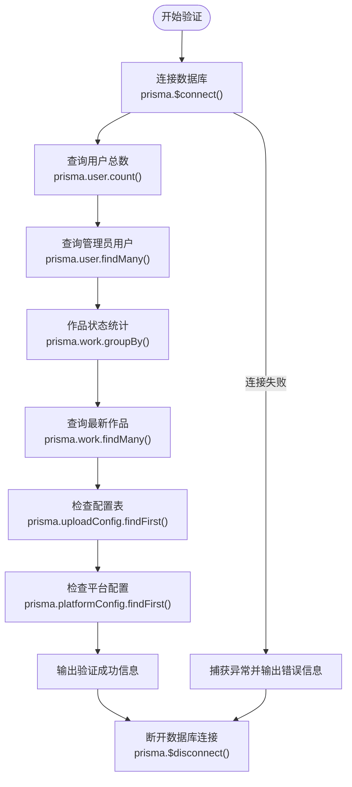
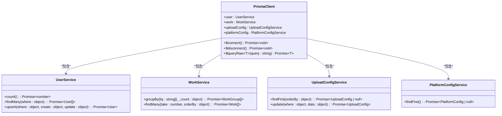
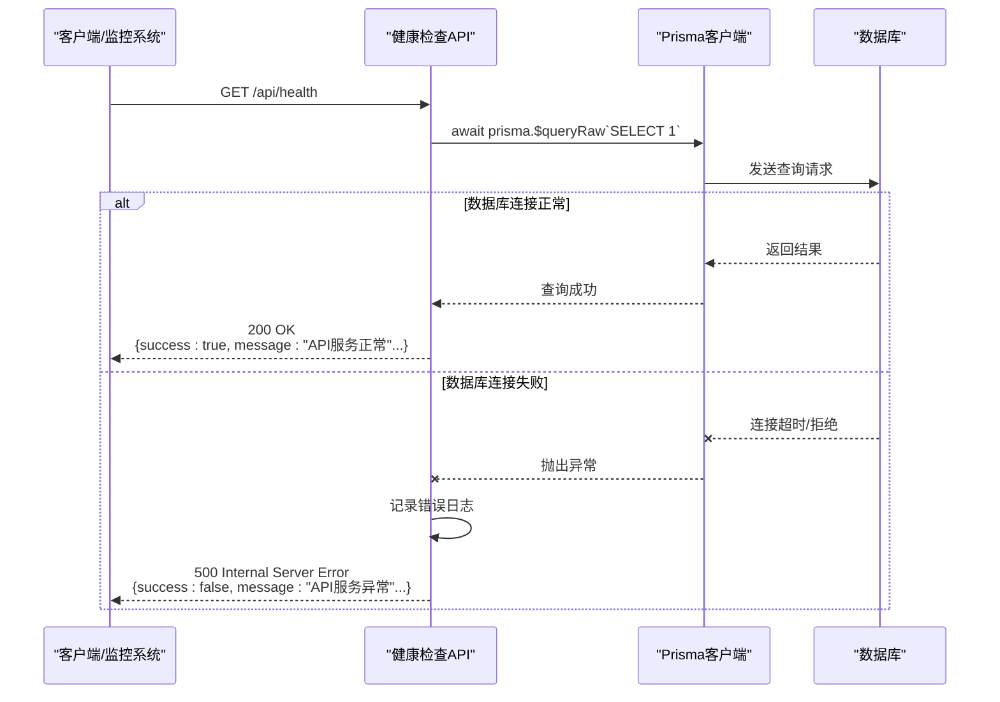
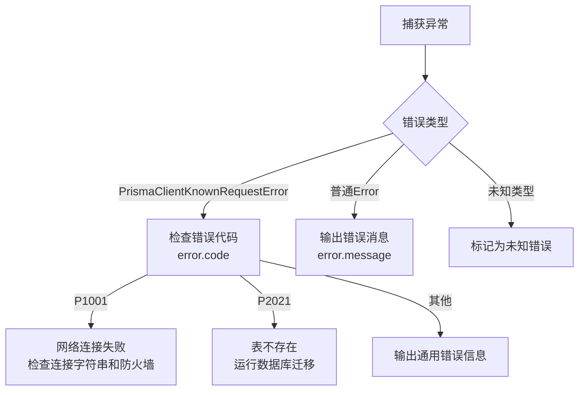

# 数据库健康检查

<cite>
**本文档引用的文件**  
- [verify-database.ts](file://verify-database.ts)
- [src/lib/prisma.ts](file://src/lib/prisma.ts)
- [src/app/api/health/route.ts](file://src/app/api/health/route.ts)
</cite>

## 目录
1. [简介](#简介)
2. [数据库连通性验证机制](#数据库连通性验证机制)
3. [Prisma客户端连接池与配置](#prisma客户端连接池与配置)
4. [健康检查端点设计](#健康检查端点设计)
5. [错误处理与诊断策略](#错误处理与诊断策略)
6. [集成与部署建议](#集成与部署建议)

## 简介
本文档详细说明基于 `verify-database.ts` 实现的数据库连通性验证机制，结合 `prisma.ts` 中的 PrismaClient 实例化逻辑，阐述连接池配置、超时设置和错误重试策略。同时，介绍如何设计适用于 Kubernetes 探针或监控系统的健康检查端点，支持 JSON 格式输出数据库响应时间、版本信息等关键指标。

**Section sources**
- [verify-database.ts](file://verify-database.ts#L1-L125)
- [src/lib/prisma.ts](file://src/lib/prisma.ts#L1-L19)

## 数据库连通性验证机制
通过 `verify-database.ts` 脚本实现全面的数据库状态验证，包括连接测试、数据完整性检查和配置验证。该脚本通过 Prisma 客户端执行简单查询（如 `SELECT 1`）来检测数据库服务状态，并输出详细的验证结果。

验证流程包括：
- 数据库连接测试
- 用户表数据统计
- 管理员用户检查
- 作品数据统计
- 最新作品查询
- 配置表状态检查

**Diagram sources**
- [verify-database.ts](file://verify-database.ts#L7-L45)

**Section sources**
- [verify-database.ts](file://verify-database.ts#L7-L45)

## Prisma客户端连接池与配置
`src/lib/prisma.ts` 文件中实现了 PrismaClient 的单例模式，确保在开发和生产环境中正确管理数据库连接。连接池配置通过 DATABASE_URL 中的参数进行控制，而非在代码中硬编码。

关键配置特点：
- 使用全局变量避免在热重载时创建多个实例
- 通过 `globalForPrisma` 类型断言确保类型安全
- 连接字符串从环境变量 `DATABASE_URL` 读取
- 开发环境下保留全局实例以提高性能

**Diagram sources**
- [src/lib/prisma.ts](file://src/lib/prisma.ts#L1-L19)

**Section sources**
- [src/lib/prisma.ts](file://src/lib/prisma.ts#L1-L19)

## 健康检查端点设计
`src/app/api/health/route.ts` 实现了标准化的健康检查 API 端点，可用于 Kubernetes liveness/readiness 探针或外部监控系统。该端点通过执行简单的数据库查询来验证服务的健康状态。

端点特性：
- HTTP GET 方法暴露在 `/api/health` 路径
- 使用 `prisma.$queryRaw` 执行 `SELECT 1` 查询
- 返回结构化 JSON 响应，包含时间戳和状态信息
- 错误情况下返回 500 状态码和详细错误信息

**Diagram sources**
- [src/app/api/health/route.ts](file://src/app/api/health/route.ts#L1-L25)

**Section sources**
- [src/app/api/health/route.ts](file://src/app/api/health/route.ts#L1-L25)

## 错误处理与诊断策略
系统实现了多层次的错误处理机制，能够识别和响应不同类型的数据库连接问题。在 `verify-database.ts` 中，通过类型守卫对 Prisma 错误进行分类处理。

主要错误类型及应对策略：
- `P1001`: 网络连接问题，建议检查数据库连接字符串和网络配置
- `P2021`: 数据库表不存在，需要运行迁移脚本
- 一般错误：输出错误消息供进一步诊断

**Diagram sources**
- [verify-database.ts](file://verify-database.ts#L47-L71)

**Section sources**
- [verify-database.ts](file://verify-database.ts#L47-L71)

## 集成与部署建议
为确保数据库健康检查机制在生产环境中的可靠性，建议采用以下集成策略：

1. **Kubernetes 集成**：
   - 配置 livenessProbe 访问 `/api/health`
   - 设置适当的初始延迟和超时时间
   - 使用 HTTP 200 响应作为存活依据

2. **监控系统集成**：
   - 将健康检查端点添加到监控工具（如 Prometheus）
   - 设置告警规则，当连续多次检查失败时触发通知
   - 记录响应时间以监控性能趋势

3. **CI/CD 流程**：
   - 在部署前运行 `verify-database.ts --create-admin` 确保管理员账户存在
   - 将数据库验证作为部署流水线的一部分

4. **性能优化**：
   - 在 DATABASE_URL 中配置连接池参数（如 connection_limit）
   - 避免在高频率探针中执行复杂查询
   - 考虑缓存健康检查结果以减轻数据库压力

**Section sources**
- [verify-database.ts](file://verify-database.ts#L73-L125)
- [src/app/api/health/route.ts](file://src/app/api/health/route.ts#L1-L25)