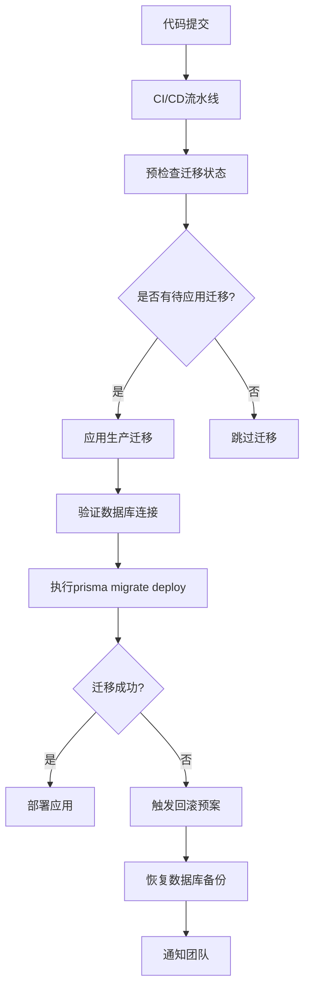

# 数据库迁移管理

<cite>
**本文档引用文件**  
- [add_featured_field](file://prisma/migrations/20250831084947_add_featured_field/migration.sql)
- [add_online_counter_config](file://prisma/migrations/20250905143157_add_online_counter_config/migration.sql)
- [add_platform_config](file://prisma/migrations/20250905150839_add_platform_config/migration.sql)
- [add_missing_fields](file://prisma/migrations/20250917050212_add_missing_fields/migration.sql)
- [migration_lock.toml](file://prisma/migrations/migration_lock.toml)
- [schema.prisma](file://prisma/schema.prisma)
- [package.json](file://package.json)
</cite>

## 目录
1. [开发与生产环境迁移差异](#开发与生产环境迁移差异)  
2. [迁移脚本生成逻辑](#迁移脚本生成逻辑)  
3. [字段变更实现方式](#字段变更实现方式)  
4. [团队协作与锁文件机制](#团队协作与锁文件机制)  
5. [CI/CD自动化迁移实践](#cicd自动化迁移实践)  
6. [总结](#总结)

## 开发与生产环境迁移差异

在Prisma迁移流程中，`prisma migrate dev`和`prisma migrate deploy`分别用于开发和生产环境，二者在执行策略和安全性上存在显著差异。

`prisma migrate dev`命令适用于开发阶段，其主要特点包括：自动创建新的迁移文件、允许修改已存在的迁移、支持数据重置和模式同步。该命令会根据`schema.prisma`文件的变更自动生成SQL迁移脚本，并直接应用到数据库中。开发人员可以频繁使用此命令进行数据库模式迭代，且支持回滚和重新生成迁移。

相比之下，`prisma migrate deploy`专为生产环境设计，具有更高的安全性和稳定性要求。该命令不会创建新的迁移文件，仅执行已存在于版本控制系统中的待应用迁移。它采用只进不退的策略，确保生产环境的数据库变更可追溯且不可逆。部署前会进行预检查，验证迁移文件的完整性和依赖关系，避免因文件缺失导致部署失败。

**Section sources**  
- [package.json](file://package.json#L10-L15)

## 迁移脚本生成逻辑

Prisma迁移脚本的生成基于`schema.prisma`文件的变更检测，通过比较当前数据库模式与期望模式的差异来生成相应的SQL语句。每次执行`prisma migrate dev`时，Prisma会分析模式变化并创建包含详细SQL指令的迁移文件。

迁移文件包含多种类型的SQL操作指令，主要包括：`CreateEnum`用于创建枚举类型，`CreateTable`用于创建新表，`AlterTable`用于修改现有表结构，`CreateIndex`用于创建索引，以及`AddForeignKey`用于添加外键约束。这些指令按照依赖关系有序排列，确保数据库模式变更的原子性和一致性。

每个迁移文件都有一个时间戳前缀（如`20250831084947_add_featured_field`），这保证了迁移的有序执行。Prisma通过维护一个内部的迁移历史表来跟踪已应用的迁移，避免重复执行。迁移脚本中的SQL语句经过优化，确保在不同数据库系统上的兼容性。

**Section sources**  
- [add_featured_field](file://prisma/migrations/20250831084947_add_featured_field/migration.sql#L1-L122)

## 字段变更实现方式

通过分析实际迁移文件，可以深入了解字段变更的具体实现方式。以`add_featured_field`迁移为例，该迁移不仅创建了新的枚举类型和表结构，还为`works`表添加了`featured`布尔字段，并设置了默认值。

```prisma
-- 在works表中添加featured字段
ALTER TABLE "works" ADD COLUMN "featured" BOOLEAN NOT NULL DEFAULT false;
```

`add_online_counter_config`迁移展示了如何创建包含业务逻辑配置的表结构。该迁移创建了`online_counter_configs`表，包含当前计数、基础计数、最大计数、增长率等字段，支持在线人数的动态计算。

```prisma
-- 创建在线计数配置表
CREATE TABLE "online_counter_configs" (
    "id" TEXT NOT NULL,
    "currentCount" INTEGER NOT NULL DEFAULT 1075,
    "baseCount" INTEGER NOT NULL DEFAULT 1000,
    "maxCount" INTEGER NOT NULL DEFAULT 2000,
    "growthRate" DOUBLE PRECISION NOT NULL DEFAULT 0.5,
    "isEnabled" BOOLEAN NOT NULL DEFAULT true,
    ...
);
```

`add_missing_fields`迁移则演示了如何为现有表添加多个字段。该迁移使用单个`ALTER TABLE`语句为`works`表添加了文件大小、图片路径、MIME类型等字段，体现了Prisma对批量字段变更的支持。

**Section sources**  
- [add_featured_field](file://prisma/migrations/20250831084947_add_featured_field/migration.sql#L1-L122)  
- [add_online_counter_config](file://prisma/migrations/20250905143157_add_online_counter_config/migration.sql#L1-L19)  
- [add_missing_fields](file://prisma/migrations/20250917050212_add_missing_fields/migration.sql#L1-L7)

## 团队协作与锁文件机制

`migration_lock.toml`文件在团队协作中起着至关重要的作用，它通过锁定迁移状态来防止并行迁移导致的冲突。该文件记录了当前使用的数据库提供程序，确保团队成员使用一致的数据库环境。

当多个开发人员同时进行数据库模式变更时，`migration_lock.toml`文件作为协调机制，确保迁移的有序执行。每个开发人员在创建新迁移前需要拉取最新的迁移文件，避免生成具有相同时间戳的迁移。Prisma会检查锁文件的状态，如果检测到冲突，会提示开发人员先同步迁移历史。

该机制有效防止了以下问题：迁移顺序混乱导致的依赖错误、重复迁移创建引起的冲突、以及不同开发环境间的模式不一致。团队成员应将`migration_lock.toml`文件纳入版本控制系统，确保所有环境的一致性。

**Section sources**  
- [migration_lock.toml](file://prisma/migrations/migration_lock.toml#L1-L3)

## CI/CD自动化迁移实践

在CI/CD流程中实施自动化迁移需要考虑预检查、回滚预案和权限控制等关键因素。首先，在部署前应执行`prisma migrate status`命令进行预检查，验证迁移文件的完整性和应用状态。



**Diagram sources**  
- [package.json](file://package.json#L10-L15)

对于回滚预案，建议采用双阶段策略：首先在非生产环境验证迁移脚本，然后在生产环境部署时保留数据库备份。如果迁移失败，可以通过备份快速恢复服务。同时，应避免在生产环境中执行破坏性操作（如删除表或字段），采用渐进式变更策略。

权限控制方面，生产环境的数据库账户应遵循最小权限原则，仅授予执行迁移所需的必要权限。建议使用专用的部署账户，并通过环境变量管理数据库连接信息，避免敏感信息泄露。

## 总结

Prisma的迁移系统为数据库模式管理提供了强大而灵活的解决方案。通过合理使用`prisma migrate dev`和`prisma migrate deploy`，团队可以在开发和生产环境间实现平滑的数据库演进。迁移脚本的自动生成和SQL结构的标准化简化了数据库变更管理，而`migration_lock.toml`文件则有效解决了团队协作中的冲突问题。

在CI/CD实践中，结合预检查、回滚预案和权限控制的最佳实践，可以确保数据库迁移的安全性和可靠性。建议团队建立明确的迁移规范，包括命名约定、审查流程和应急响应机制，以最大化Prisma迁移系统的价值。