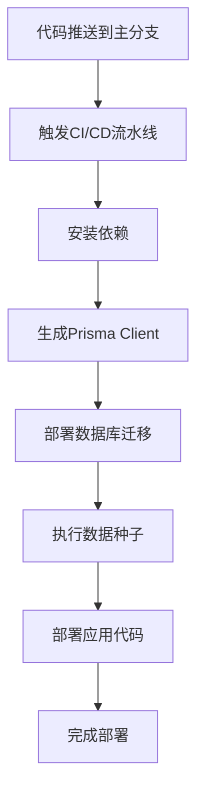
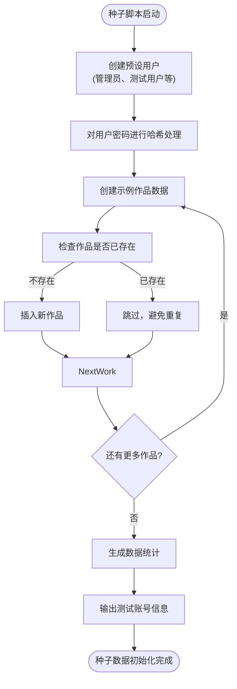

# 数据库运维

<cite>
**本文档引用文件**  
- [seed.ts](file://prisma/seed.ts)
- [migration_lock.toml](file://prisma/migrations/migration_lock.toml)
- [verify-database.ts](file://verify-database.ts)
- [prisma.ts](file://src/lib/prisma.ts)
- [schema.prisma](file://prisma/schema.prisma)
- [package.json](file://package.json)
- [health/route.ts](file://src/app/api/health/route.ts)
</cite>

## 目录
1. [引言](#引言)
2. [Prisma迁移部署流程](#prisma迁移部署流程)
3. [数据种子管理](#数据种子管理)
4. [数据库健康检查机制](#数据库健康检查机制)
5. [数据库备份与恢复策略](#数据库备份与恢复策略)
6. [在线DDL变更风险控制](#在线ddl变更风险控制)
7. [结论](#结论)

## 引言

本文件旨在系统阐述生产环境下数据库运维的规范与最佳实践。基于项目实际架构，重点分析Prisma迁移部署流程、数据种子初始化、数据库健康检查机制，并提出备份恢复与在线变更的完整策略。通过分析现有代码结构和配置，确保数据库操作的安全性、可追溯性和高可用性。

## Prisma迁移部署流程

### 迁移部署命令与CI/CD集成

`prisma migrate deploy` 是生产环境数据库迁移的核心命令，用于将本地迁移文件应用到目标数据库。该命令不会生成新的迁移文件，而是执行已存在于 `prisma/migrations` 目录中的待应用迁移。

在CI/CD流水线中，该命令应作为部署流程的关键步骤。典型集成方式如下：
1. 代码合并至主分支后触发CI/CD流水线。
2. 执行 `prisma generate` 生成Prisma Client。
3. 执行 `prisma migrate deploy` 将所有待应用的迁移部署到生产数据库。
4. 执行 `prisma db seed`（或自定义种子脚本）以确保基础数据一致性。
5. 最后部署应用代码。

此流程确保了数据库结构变更与应用代码变更的原子性，避免了因结构不匹配导致的应用启动失败。



**Diagram sources**
- [package.json](file://package.json#L0-L36)

**Section sources**
- [package.json](file://package.json#L0-L36)

### 迁移锁文件机制与冲突解决

`prisma/migrations/migration_lock.toml` 是Prisma迁移系统的关键组成部分，其主要作用是锁定迁移的数据库提供者（Provider），防止因环境不一致导致的迁移错误。

该文件内容为：
```
provider = "postgresql"
```

**作用与重要性：**
- **环境一致性保证**：明确指定生产环境使用的数据库为PostgreSQL，防止开发人员在本地使用SQLite等其他数据库进行迁移，导致SQL语法不兼容。
- **版本控制**：该文件必须提交到版本控制系统（如Git），确保团队成员和CI/CD环境使用一致的数据库提供者。
- **冲突预防**：当团队成员在不同数据库提供者上工作时，该锁文件会阻止不兼容的迁移被创建或应用，从根本上避免了因数据库方言差异（如`TEXT` vs `VARCHAR`）引发的生产事故。

**冲突解决机制：**
1. **预防为主**：通过将 `migration_lock.toml` 纳入版本控制，确保所有开发环境与生产环境一致。
2. **错误处理**：如果尝试在与锁文件不符的数据库上运行迁移，Prisma会抛出明确的错误，阻止操作继续。
3. **变更流程**：若需变更数据库提供者（如从SQLite迁移到PostgreSQL），必须作为一次有计划的、全团队知晓的重大变更，手动修改 `migration_lock.toml` 并同步更新所有相关配置。

**Section sources**
- [prisma/migrations/migration_lock.toml](file://prisma/migrations/migration_lock.toml#L0-L2)

## 数据种子管理

### 种子脚本功能与使用场景

`prisma/seed.ts` 是项目的数据库种子脚本，用于在初始化、测试和开发环境中填充基础数据。它通过Prisma Client直接与数据库交互，创建预设的用户、作品等数据。

**核心功能：**
- **初始化数据**：为新部署的系统创建管理员账号、测试用户和示例作品，确保系统开箱即用。
- **测试环境准备**：为自动化测试提供一致的、可预测的数据集，保证测试的稳定性和可重复性。
- **开发环境便利性**：开发者在本地启动项目时，无需手动创建账号，可直接使用预设的测试账号登录。

**关键实现细节：**
- 使用 `upsert` 操作创建用户，确保脚本可重复执行而不会产生重复数据。
- 使用 `bcryptjs` 对用户密码进行哈希处理，保证密码安全。
- 包含详细的日志输出，便于跟踪种子数据的填充过程。



**Diagram sources**
- [prisma/seed.ts](file://prisma/seed.ts#L3-L318)

**Section sources**
- [prisma/seed.ts](file://prisma/seed.ts#L3-L318)
- [package.json](file://package.json#L0-L36)

## 数据库健康检查机制

### 健康检查脚本设计与实现

`verify-database.ts` 是一个独立的数据库连通性和健康检查脚本，可作为自动化校验的参考实现。它不仅检查数据库连接，还验证关键数据表的完整性和数据状态。

**核心检查项：**
1.  **连接性**：通过 `prisma.$connect()` 测试与数据库的网络连接。
2.  **数据完整性**：查询关键表（如 `user`, `work`）的记录数，确保表存在且有数据。
3.  **业务状态**：检查管理员用户是否存在，平台配置是否已设置。
4.  **错误处理**：捕获并分类Prisma错误（如 `P1001` 网络错误，`P2021` 表不存在），提供具体的解决方案建议。

该脚本可通过命令行参数 `--create-admin` 创建管理员用户，为自动化运维提供了便利。

```mermaid
flowchart TD
A[执行 verify-database.ts] --> B{包含 --create-admin?}
B --> |是| C[调用 createAdminUser()]
B --> |否| D[调用 verifyDatabase()]
C --> E[检查管理员是否存在]
E --> F[不存在则创建]
E --> G[存在则更新]
F --> H[输出成功信息]
G --> H
D --> I[测试数据库连接]
I --> J[检查用户表]
J --> K[检查管理员用户]
K --> L[检查作品数据]
L --> M[检查配置表]
M --> N[输出验证报告]
I --> O[捕获错误]
O --> P{错误类型?}
P --> |PrismaClientKnownRequestError| Q[根据错误码提供解决方案]
P --> |其他Error| R[输出错误详情]
P --> |未知| S[输出未知错误]
Q --> T[输出错误信息]
R --> T
S --> T
H --> U[断开数据库连接]
N --> U
T --> U
U --> V[脚本结束]
```

**Diagram sources**
- [verify-database.ts](file://verify-database.ts#L3-L125)

**Section sources**
- [verify-database.ts](file://verify-database.ts#L3-L125)

### 与API健康检查的协同

项目还通过API端点 `/api/health` 提供了运行时的健康检查。该端点与 `verify-database.ts` 相辅相成：
- `verify-database.ts` 用于部署前或独立的运维检查，检查更全面。
- `/api/health` 用于应用运行时的探活，集成在应用内部，响应更快。

两者共同构成了多层次的健康检查体系。

**Section sources**
- [src/app/api/health/route.ts](file://src/app/api/health/route.ts#L0-L25)

## 数据库备份与恢复策略

### 备份策略

虽然项目代码中未直接体现备份脚本，但基于PostgreSQL的生产环境，应实施以下备份策略：
- **自动备份**：使用 `pg_dump` 或云数据库的自动备份功能，每日进行全量备份，并保留7-30天的历史备份。
- **增量备份**：开启WAL（Write-Ahead Logging）归档，实现基于时间点的恢复（PITR）。
- **异地存储**：将备份文件存储在与数据库服务器隔离的存储系统（如对象存储OSS）中，防止本地灾难导致数据丢失。

### 恢复与版本回滚

- **恢复**：当发生数据丢失时，首先从最近的全量备份恢复，然后应用WAL日志到故障前的任意时间点。
- **版本回滚**：Prisma迁移是可逆的。若新版本应用因数据库问题需要回滚，应：
  1.  回滚应用代码到旧版本。
  2.  执行 `prisma migrate resolve --rolled-back <migration-name>` 命令，标记该迁移为已回滚。
  3.  此操作不会自动执行反向SQL，因此必须确保旧版本应用能兼容当前的数据库结构，或手动执行回滚脚本。

## 在线DDL变更风险控制

### 风险分析

在线DDL（数据定义语言）变更，如 `ALTER TABLE`，在大型生产数据库上可能带来严重风险：
- **锁表**：某些DDL操作会持有表级锁，阻塞所有读写操作，导致服务不可用。
- **长事务**：大表的结构变更可能耗时数小时，期间占用大量系统资源。
- **数据不一致**：在变更过程中，应用可能读取到部分更新的数据。

### 最佳实践

1.  **使用Prisma迁移**：始终通过 `prisma migrate dev` 生成迁移文件，而不是直接在数据库执行DDL。这保证了变更的可追溯性和可重复性。
2.  **评估影响**：在执行迁移前，使用 `prisma migrate diff` 分析变更对现有数据的影响。
3.  **分阶段部署**：
    -   **第一阶段**：添加新列（允许NULL）或新表。此操作通常是非阻塞的。
    -   **第二阶段**：在应用代码中使用新结构，并逐步填充数据。
    -   **第三阶段**：修改新列为非NULL或添加约束。此操作需在低峰期执行，并监控性能。
4.  **使用在线DDL工具**：对于PostgreSQL，考虑使用 `pg_repack` 或 `pg_cron` 等工具来执行无锁的表重组。
5.  **充分测试**：在预发布环境中对大表进行完整的迁移测试，评估执行时间和资源消耗。

## 结论

本项目通过Prisma框架实现了现代化的数据库运维。`prisma migrate deploy` 和 `migration_lock.toml` 确保了迁移的安全与一致；`seed.ts` 和 `verify-database.ts` 提供了强大的数据初始化和健康检查能力。为确保生产环境的稳定，必须在此基础上建立严格的备份恢复流程和在线变更控制规范。通过遵循上述最佳实践，可以最大限度地降低数据库运维风险，保障系统的高可用性和数据安全。