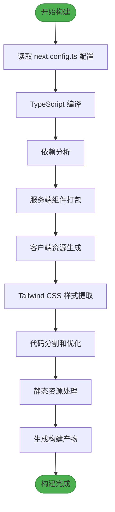
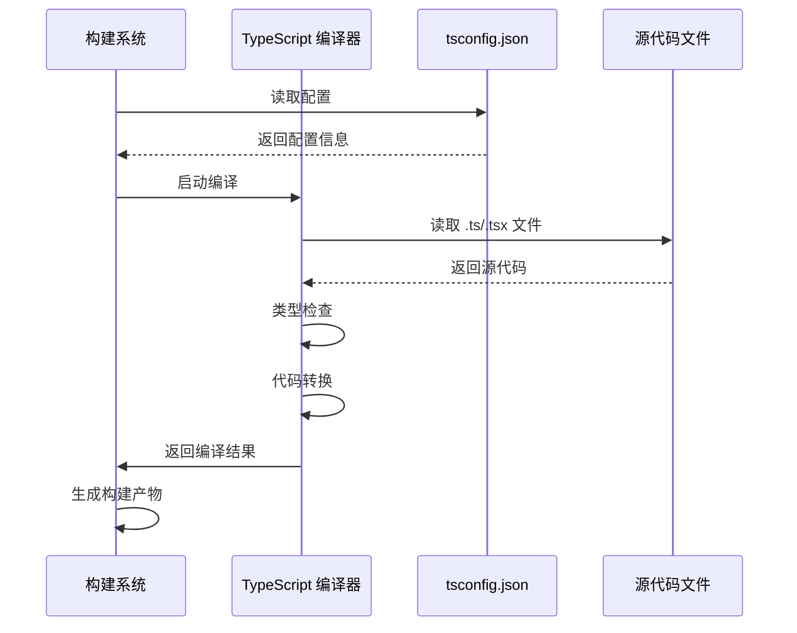
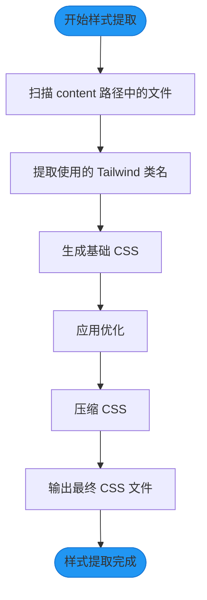
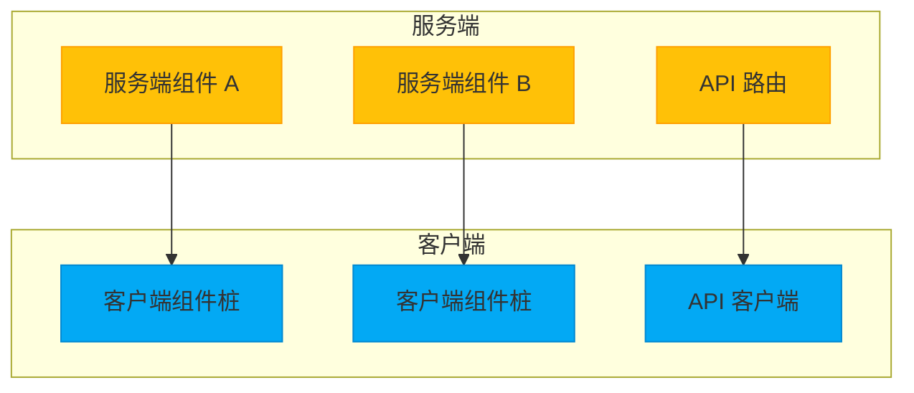
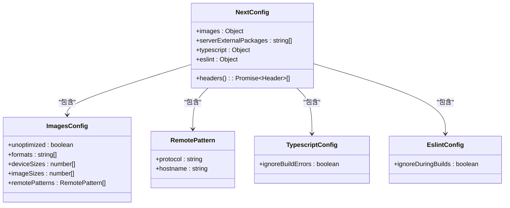
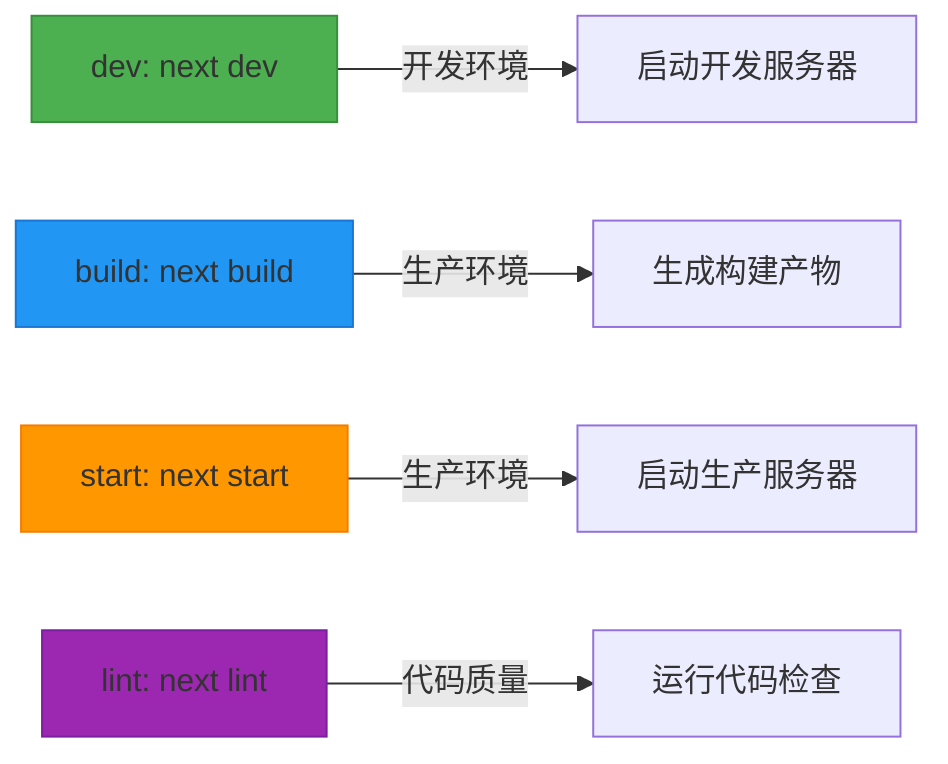
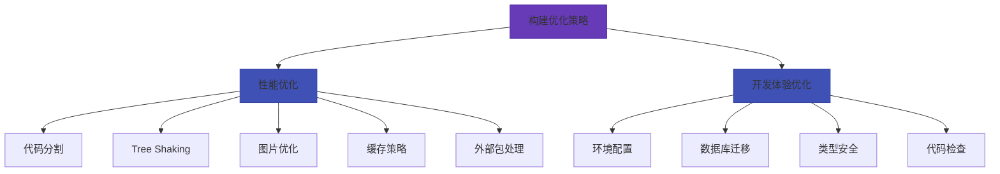
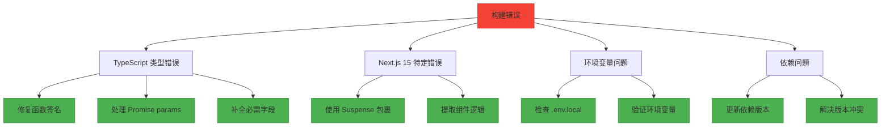

# 构建流程

<cite>
**本文档引用的文件**
- [next.config.ts](file://next.config.ts)
- [package.json](file://package.json)
- [tailwind.config.js](file://tailwind.config.js)
- [ecosystem.config.js](file://ecosystem.config.js)
- [README.md](file://README.md)
- [src/数字化作品互动展示平台 - 开发文档.md](file://src/数字化作品互动展示平台 - 开发文档.md)
- [src/nextjs15-type-fixes-report.md](file://src/nextjs15-type-fixes-report.md)
- [log/nextjs15-build-error.md](file://log/nextjs15-build-error.md)
</cite>

## 目录
1. [项目概述](#项目概述)
2. [构建流程详解](#构建流程详解)
3. [构建配置分析](#构建配置分析)
4. [构建优化策略](#构建优化策略)
5. [常见构建错误排查](#常见构建错误排查)
6. [自定义构建脚本](#自定义构建脚本)
7. [构建产物结构](#构建产物结构)
8. [部署流程](#部署流程)

## 项目概述

数字化作品互动展示平台是一个基于 Next.js 15 和 Prisma 构建的现代化数字作品展示系统。平台支持用户上传、浏览和互动，采用现代化的全栈Web开发技术栈，包括 Next.js 15、React 18、TypeScript、Tailwind CSS 和 PostgreSQL 数据库。项目采用 App Router 架构，支持服务端组件和 API 路由。

**Section sources**
- [README.md](file://README.md#L1-L243)
- [src/数字化作品互动展示平台 - 开发文档.md](file://src/数字化作品互动展示平台 - 开发文档.md#L0-L37)

## 构建流程详解

### 构建命令执行过程

`next build` 命令是 Next.js 应用的核心构建命令，它会执行一系列复杂的构建步骤，将源代码转换为优化的生产版本。构建过程主要包括以下几个阶段：

1. **初始化阶段**：读取 `next.config.ts` 配置文件，解析构建选项
2. **TypeScript 编译**：使用 TypeScript 编译器将 `.ts` 和 `.tsx` 文件编译为 JavaScript
3. **依赖分析**：分析模块依赖关系，构建依赖图
4. **服务端组件打包**：处理服务端组件的打包和优化
5. **客户端资源生成**：生成客户端 JavaScript、CSS 和静态资源
6. **Tailwind CSS 样式提取**：根据内容配置提取和优化 CSS 样式
7. **代码分割和优化**：进行代码分割、Tree Shaking 和压缩
8. **静态资源处理**：处理图片、字体等静态资源
9. **构建产物生成**：生成最终的 `.next` 目录结构

构建过程会自动进行类型检查和 ESLint 检查，如果配置了 `typescript.ignoreBuildErrors: false` 和 `eslint.ignoreDuringBuilds: false`，则任何类型错误或 ESLint 错误都会导致构建失败。



**Diagram sources**
- [next.config.ts](file://next.config.ts#L2-L66)
- [package.json](file://package.json#L1-L61)

**Section sources**
- [next.config.ts](file://next.config.ts#L2-L66)
- [package.json](file://package.json#L1-L61)

### TypeScript 编译阶段

TypeScript 编译是构建流程中的关键环节。项目使用 TypeScript 5.7.2 版本，配置在 `tsconfig.json` 文件中。在构建过程中，Next.js 会使用这些配置来编译 TypeScript 代码。

从 `next.config.ts` 中可以看到，项目配置了 `typescript.ignoreBuildErrors: false`，这意味着任何 TypeScript 类型错误都会导致构建失败。这种严格的配置有助于在构建阶段捕获潜在的类型问题，确保代码质量。

构建过程中，TypeScript 编译器会：
- 检查所有 `.ts` 和 `.tsx` 文件的类型
- 将 TypeScript 代码转换为兼容的 JavaScript 代码
- 生成类型声明文件（`.d.ts`）
- 处理装饰器和实验性特性



**Diagram sources**
- [next.config.ts](file://next.config.ts#L60-L63)
- [tsconfig.json](file://tsconfig.json)

**Section sources**
- [next.config.ts](file://next.config.ts#L60-L63)
- [src/nextjs15-type-fixes-report.md](file://src/nextjs15-type-fixes-report.md#L0-L256)

### Tailwind CSS 样式提取

Tailwind CSS 的样式提取是构建流程中的重要优化步骤。项目使用 Tailwind CSS 3.4.14 版本，配置在 `tailwind.config.js` 文件中。

构建过程中，Tailwind CSS 会：
1. 扫描配置的 `content` 路径中的所有文件
2. 提取使用到的 Tailwind 类名
3. 生成精简的 CSS 文件，只包含实际使用的样式
4. 应用各种优化，如压缩、合并等

从 `tailwind.config.js` 中可以看到，项目配置了以下内容路径：
- `./src/pages/**/*.{js,ts,jsx,tsx,mdx}`
- `./src/components/**/*.{js,ts,jsx,tsx,mdx}`
- `./src/app/**/*.{js,ts,jsx,tsx,mdx}`

这确保了所有相关文件中的 Tailwind 类名都能被正确提取。项目还配置了暗色模式支持（`darkMode: 'class'`）和自定义动画（如 `marquee` 动画）。



**Diagram sources**
- [tailwind.config.js](file://tailwind.config.js#L1-L25)
- [src/app/globals.css](file://src/app/globals.css)

**Section sources**
- [tailwind.config.js](file://tailwind.config.js#L1-L25)
- [src/数字化作品互动展示平台 - 开发文档.md](file://src/数字化作品互动展示平台 - 开发文档.md#L0-L37)

### 服务端组件打包

Next.js 15 的服务端组件打包机制是构建流程的核心部分。服务端组件允许在服务器端渲染组件，然后将结果发送到客户端，从而减少客户端的 JavaScript 负载。

构建过程中，服务端组件的处理包括：
- 识别服务端组件（默认情况下，App Router 中的所有组件都是服务端组件）
- 将服务端组件编译为服务器可执行的代码
- 处理服务端组件的数据获取逻辑
- 生成相应的客户端组件桩（stubs）
- 优化服务端组件的依赖关系

项目中的 API 路由（位于 `src/app/api/` 目录下）也是服务端组件的一部分，它们在构建过程中会被单独处理，生成相应的 API 端点。



**Diagram sources**
- [src/app/page.tsx](file://src/app/page.tsx)
- [src/app/api/works/route.ts](file://src/app/api/works/route.ts)

**Section sources**
- [src/app/page.tsx](file://src/app/page.tsx)
- [src/app/api/works/route.ts](file://src/app/api/works/route.ts)

## 构建配置分析

### next.config.ts 配置详解

`next.config.ts` 文件是 Next.js 应用的核心配置文件，它定义了构建过程中的各种行为和选项。项目中的配置主要包括以下几个部分：

**图片配置**：配置了图片优化选项，包括支持的格式（WebP 和 AVIF）、设备尺寸和远程模式。`unoptimized: false` 表示启用 Next.js 的图片优化功能。

**外部包配置**：`serverExternalPackages: ['bcryptjs', 'ali-oss']` 配置了在服务端构建时需要外部化的包，这对于使用原生模块的包特别重要。

**HTTP 头配置**：通过 `headers()` 函数配置了各种 HTTP 头，包括 CORS 头、缓存控制头等，这些头信息会在构建时应用到相应的路由。

**TypeScript 和 ESLint 配置**：设置了 `ignoreBuildErrors: false`，确保类型错误和 ESLint 错误会导致构建失败。



**Diagram sources**
- [next.config.ts](file://next.config.ts#L2-L66)

**Section sources**
- [next.config.ts](file://next.config.ts#L2-L66)
- [README.md](file://README.md#L1-L243)

### package.json 脚本配置

`package.json` 文件中的 `scripts` 部分定义了项目的各种命令，包括构建相关的命令。项目中的构建相关脚本包括：

- `build`: 执行 `next build`，启动生产构建
- `dev`: 执行 `next dev`，启动开发服务器
- `start`: 执行 `next start`，启动生产服务器
- `lint`: 执行 `next lint`，运行代码检查
- `type-check`: 可能用于类型检查（虽然未在文件中显示，但通常会包含）

这些脚本为开发和构建提供了标准化的接口，确保团队成员使用一致的命令。



**Diagram sources**
- [package.json](file://package.json#L1-L61)

**Section sources**
- [package.json](file://package.json#L1-L61)
- [README.md](file://README.md#L1-L243)

## 构建优化策略

### 构建性能优化

项目通过多种策略优化构建性能和产物质量：

**代码分割**：Next.js 自动进行代码分割，将代码拆分为多个 bundle，实现按需加载，减少初始加载时间。

**Tree Shaking**：通过 ES6 模块语法，构建工具能够消除未使用的代码，减小最终包的大小。

**图片优化**：配置了多种图片格式和尺寸，Next.js 会根据设备自动提供最合适的图片版本。

**缓存策略**：通过 `headers()` 配置了详细的缓存策略，包括静态资源的长期缓存和 API 路由的短期缓存。

**外部包处理**：通过 `serverExternalPackages` 配置，将特定包从服务端构建中排除，避免构建问题。

### 开发体验优化

项目还关注开发体验的优化：

**环境配置**：提供了 `.env.example` 文件作为模板，简化了环境变量的配置过程。

**数据库迁移**：通过 Prisma 提供了便捷的数据库迁移命令，如 `prisma migrate dev` 和 `prisma db seed`。

**类型安全**：严格的 TypeScript 配置确保了代码的类型安全，减少了运行时错误。



**Diagram sources**
- [next.config.ts](file://next.config.ts#L2-L66)
- [ecosystem.config.js](file://ecosystem.config.js#L1-L109)

**Section sources**
- [next.config.ts](file://next.config.ts#L2-L66)
- [ecosystem.config.js](file://ecosystem.config.js#L1-L109)

## 常见构建错误排查

### TypeScript 类型错误

由于配置了 `typescript.ignoreBuildErrors: false`，任何 TypeScript 类型错误都会导致构建失败。常见的类型错误包括：

- **函数签名不匹配**：如 `withAuth` 函数在静态路由和动态路由中的签名不一致
- **动态路由参数类型**：Next.js 15 要求动态路由的 `params` 参数为 Promise 类型
- **数据模型缺失字段**：Prisma 模型更新后，创建对象时缺少必需字段

解决方法包括：
- 修改函数签名以兼容不同类型
- 使用 `await` 处理 Promise 类型的 `params`
- 确保创建对象时包含所有必需字段

### Next.js 15 特定错误

Next.js 15 引入了一些新的要求和限制：

**useSearchParams() 问题**：在预渲染时使用 `useSearchParams()` 必须被 `Suspense` 边界包裹。如 `log/nextjs15-build-error.md` 中所述，`/auth/signin` 和 `/upload` 页面都出现了这个问题。

解决方法是将使用 `useSearchParams()` 的逻辑提取到子组件，并用 `Suspense` 包裹：

```tsx
function SignInForm() {
  const searchParams = useSearchParams();
  const callbackUrl = searchParams.get('callbackUrl');
  // ... 其他逻辑
}

export default function SignInPage() {
  return (
    <Suspense fallback={<div>加载中...</div>}>
      <SignInForm />
    </Suspense>
  );
}
```

### 环境变量和依赖问题

**环境变量缺失**：如 `run-oss-test.js` 中所示，缺少必要的环境变量会导致构建或运行失败。解决方法是确保 `.env.local` 文件包含所有必需的环境变量。

**依赖版本冲突**：不同包之间的版本不兼容可能导致构建问题。解决方法是保持依赖版本的一致性，并定期更新。



**Diagram sources**
- [log/nextjs15-build-error.md](file://log/nextjs15-build-error.md#L0-L56)
- [src/nextjs15-type-fixes-report.md](file://src/nextjs15-type-fixes-report.md#L0-L256)

**Section sources**
- [log/nextjs15-build-error.md](file://log/nextjs15-build-error.md#L0-L56)
- [src/nextjs15-type-fixes-report.md](file://src/nextjs15-type-fixes-report.md#L0-L256)

## 自定义构建脚本

### package.json 脚本

项目在 `package.json` 中定义了多个有用的脚本：

- `db:push`: 执行 `prisma db push`，将 Prisma 模式推送到数据库
- `db:studio`: 执行 `prisma studio`，启动 Prisma Studio 数据库浏览器
- `db:generate`: 执行 `prisma generate`，生成 Prisma 客户端
- `db:seed`: 执行 `tsx prisma/seed.ts`，运行种子数据脚本
- `test:oss`: 运行 OSS 测试脚本

这些脚本简化了数据库管理和测试流程。

### PM2 部署脚本

`ecosystem.config.js` 文件配置了 PM2 进程管理器，用于生产环境的部署：

- 定义了生产环境和开发环境的应用配置
- 配置了自动重启、日志文件等
- 提供了部署钩子，如 `post-deploy` 命令

部署时会自动执行 `npm install && npm run build && pm2 reload`，确保应用始终是最新的构建版本。

```mermaid
flowchart LR
    CustomScripts["自定义构建脚本"] --> PackageScripts["package.json 脚本"]
    Custom