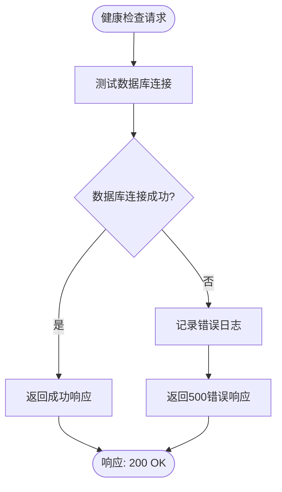
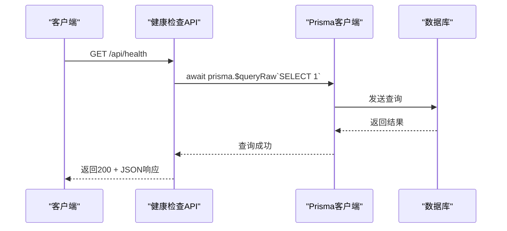
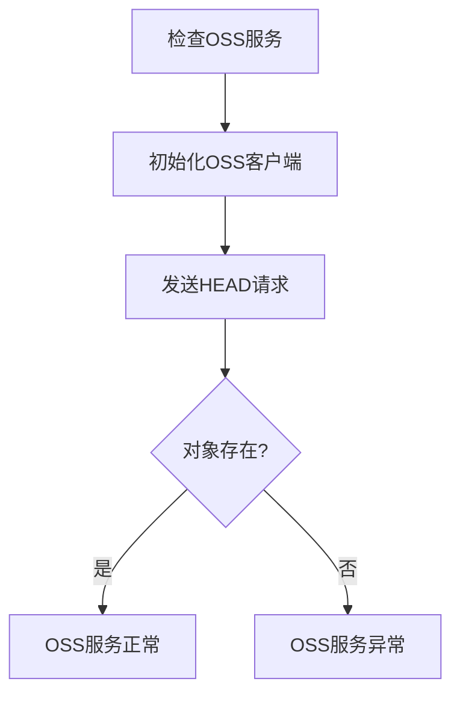
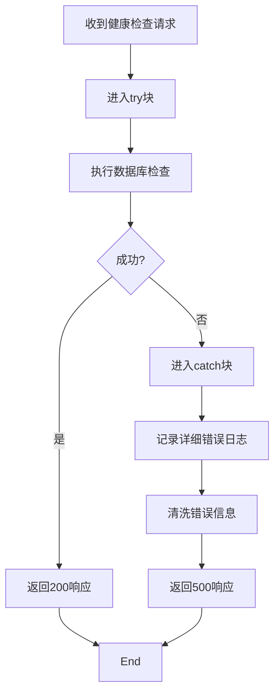

# 健康检查

<cite>
**本文档引用文件**  
- [route.ts](file://src/app/api/health/route.ts)
- [prisma.ts](file://src/lib/prisma.ts)
- [oss.ts](file://src/lib/oss.ts)
</cite>

## 目录
1. [简介](#简介)
2. [健康检查端点实现](#健康检查端点实现)
3. [数据库连接验证机制](#数据库连接验证机制)
4. [OSS服务可用性检查](#oss服务可用性检查)
5. [HTTP状态码与响应格式](#http状态码与响应格式)
6. [Kubernetes探针集成](#kubernetes探针集成)
7. [请求示例与监控集成](#请求示例与监控集成)
8. [失败场景与排查路径](#失败场景与排查路径)
9. [错误传播机制分析](#错误传播机制分析)

## 简介
健康检查接口是系统稳定性保障的核心组件，用于验证后端服务、数据库连接及外部存储服务的运行状态。该接口在Kubernetes或负载均衡环境中作为探针使用，确保服务实例的可用性。本文档详细说明`src/app/api/health/route.ts`的实现逻辑，涵盖数据库与OSS服务的检测机制、响应格式、集成方式及故障排查方法。

## 健康检查端点实现
健康检查接口通过`GET /api/health`提供服务，其主要职责是验证核心依赖组件的连通性。当前实现已集成数据库连接检测，未来可扩展以包含OSS存储服务的可用性验证。



**Diagram sources**  
- [route.ts](file://src/app/api/health/route.ts#L1-L25)

**Section sources**  
- [route.ts](file://src/app/api/health/route.ts#L1-L25)

## 数据库连接验证机制
健康检查通过执行一个轻量级的数据库查询来验证数据库连接状态。具体实现使用Prisma的`$queryRaw`方法执行`SELECT 1`语句，该语句不涉及任何表数据，仅用于测试数据库连接是否活跃。



**Diagram sources**  
- [route.ts](file://src/app/api/health/route.ts#L7-L12)
- [prisma.ts](file://src/lib/prisma.ts#L1-L20)

**Section sources**  
- [route.ts](file://src/app/api/health/route.ts#L7-L12)
- [prisma.ts](file://src/lib/prisma.ts#L1-L20)

## OSS服务可用性检查
尽管当前健康检查接口未直接集成OSS服务检测，但项目中已实现完整的OSS操作工具库，可用于扩展健康检查功能。通过调用`objectExists`或`getObjectInfo`等函数，可验证OSS服务的连通性与对象访问能力。



**Diagram sources**  
- [oss.ts](file://src/lib/oss.ts#L1-L302)

**Section sources**  
- [oss.ts](file://src/lib/oss.ts#L1-L302)

## HTTP状态码与响应格式
健康检查接口遵循标准HTTP状态码规范，返回清晰的JSON格式响应，便于监控系统解析。

### 响应格式说明
| 字段 | 类型 | 说明 |
|------|------|------|
| success | boolean | 检查是否成功 |
| message | string | 状态描述信息 |
| timestamp | string | 响应生成时间（ISO格式） |
| database | string | 数据库连接状态（connected/disconnected） |
| error | string | 错误信息（仅失败时存在） |

### 状态码逻辑
- **200 OK**: 所有检查项通过，服务正常
- **500 Internal Server Error**: 任一核心依赖检查失败

**Section sources**  
- [route.ts](file://src/app/api/health/route.ts#L13-L25)

## Kubernetes探针集成
健康检查接口可直接作为Kubernetes的liveness和readiness探针使用，确保Pod在异常时被正确重启或从服务中移除。

```yaml
livenessProbe:
  httpGet:
    path: /api/health
    port: 3000
  initialDelaySeconds: 30
  periodSeconds: 10
  timeoutSeconds: 5
  failureThreshold: 3

readinessProbe:
  httpGet:
    path: /api/health
    port: 3000
  initialDelaySeconds: 5
  periodSeconds: 5
  timeoutSeconds: 3
  failureThreshold: 3
```

**Section sources**  
- [route.ts](file://src/app/api/health/route.ts#L1-L25)

## 请求示例与监控集成
### 成功响应示例
```json
{
  "success": true,
  "message": "API服务正常",
  "timestamp": "2025-09-20T08:00:00.000Z",
  "database": "connected"
}
```

### 失败响应示例
```json
{
  "success": false,
  "message": "API服务异常",
  "timestamp": "2025-09-20T08:00:00.000Z",
  "database": "disconnected",
  "error": "connect ECONNREFUSED 127.0.0.1:5432"
}
```

### 监控系统集成建议
1. 在Prometheus中配置HTTP探针抓取`/api/health`
2. 设置告警规则：当`success`字段为`false`持续超过1分钟时触发
3. 在Grafana仪表板中展示服务健康状态趋势

**Section sources**  
- [route.ts](file://src/app/api/health/route.ts#L13-L25)

## 失败场景与排查路径
### 常见失败场景
1. **数据库连接失败**
   - 可能原因：数据库服务宕机、网络不通、连接池耗尽
   - 排查路径：检查数据库服务状态、网络连通性、连接数监控

2. **OSS服务不可达**
   - 可能原因：OSS endpoint配置错误、网络策略限制、凭证失效
   - 排查路径：验证环境变量配置、测试网络连通性、检查访问密钥

3. **环境变量缺失**
   - 可能原因：`.env`文件未正确加载、必需变量未设置
   - 排查路径：确认环境变量文件存在且包含所有必需项

**Section sources**  
- [route.ts](file://src/app/api/health/route.ts#L17-L25)
- [oss.ts](file://src/lib/oss.ts#L1-L302)

## 错误传播机制分析
健康检查接口采用集中式错误处理模式，所有异常被捕获并转换为标准化的错误响应。错误信息经过清洗，避免敏感数据泄露，同时保留足够的诊断信息。



**Diagram sources**  
- [route.ts](file://src/app/api/health/route.ts#L17-L25)

**Section sources**  
- [route.ts](file://src/app/api/health/route.ts#L17-L25)