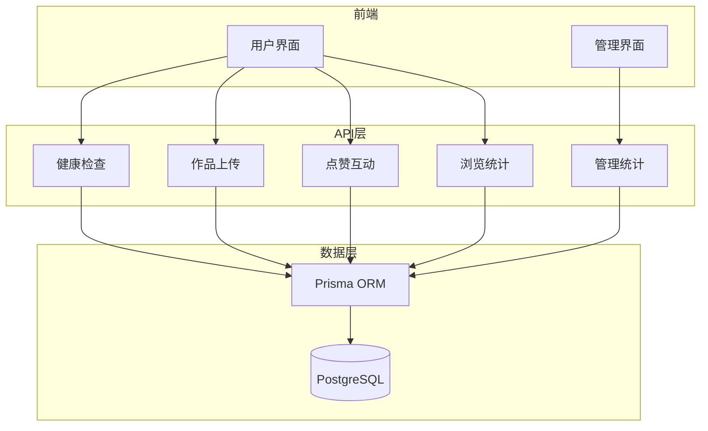
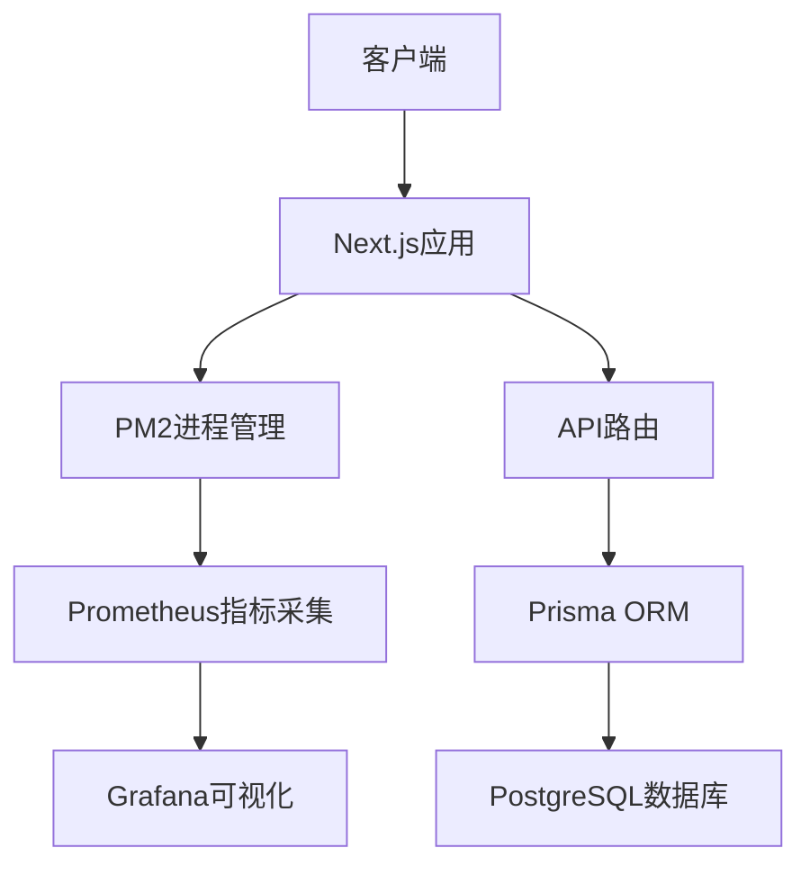
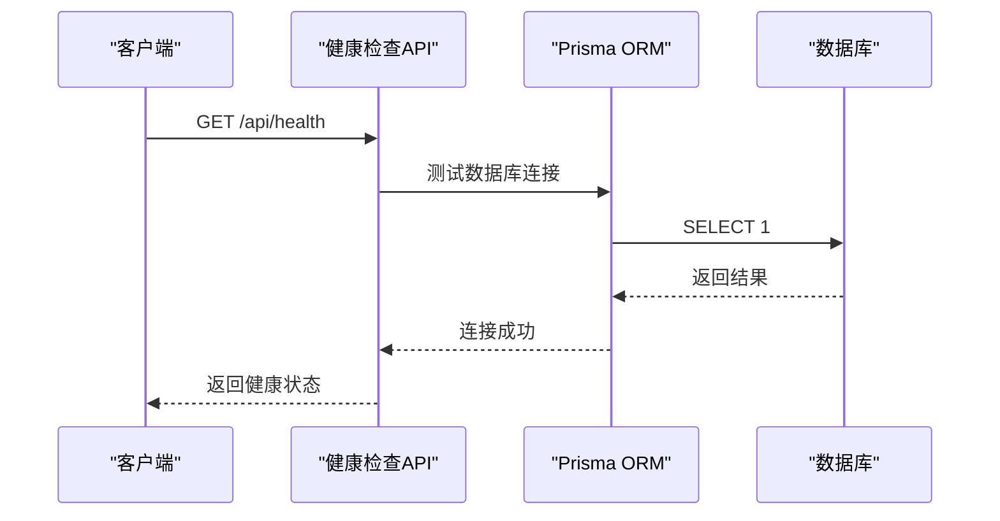
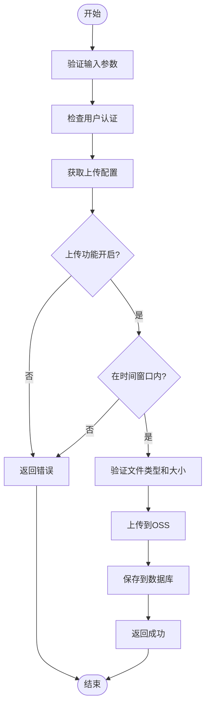
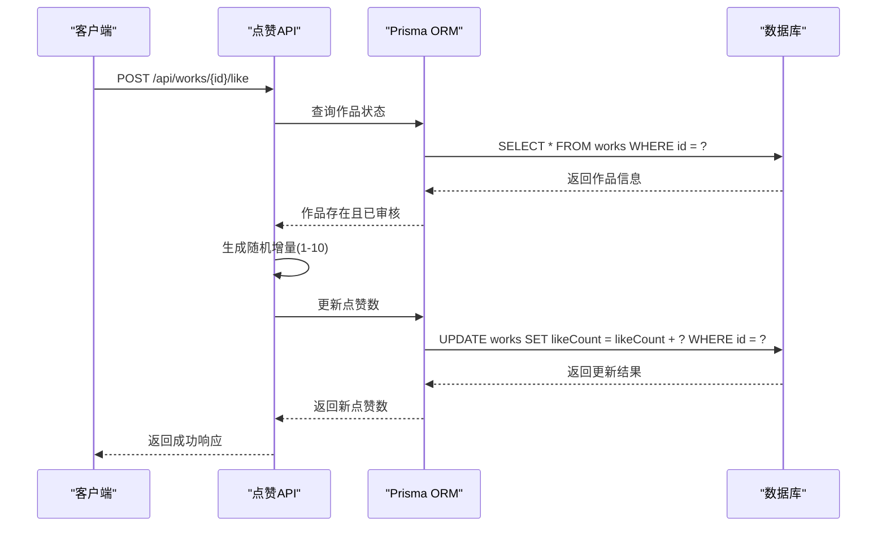
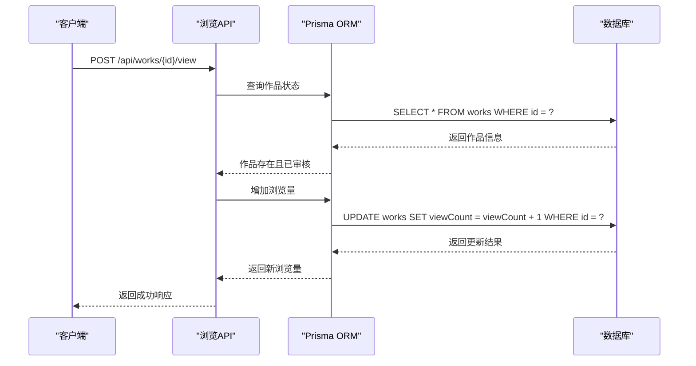
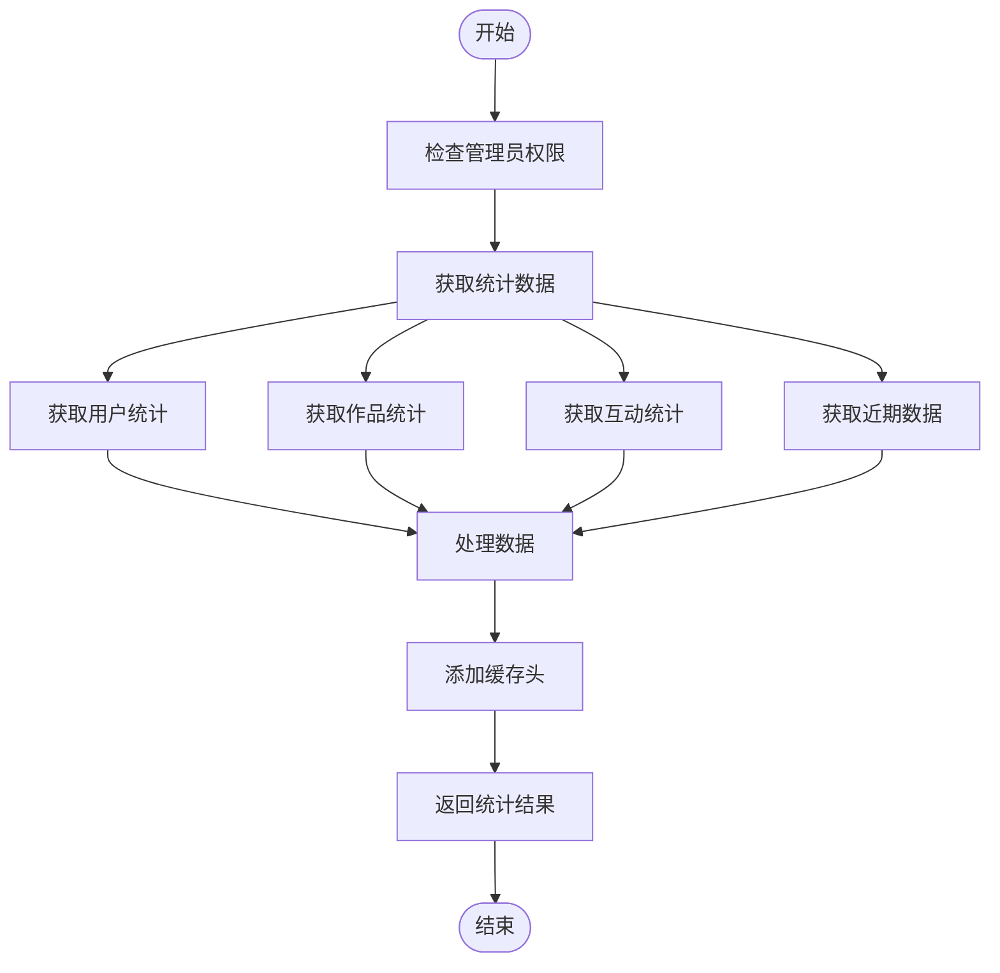
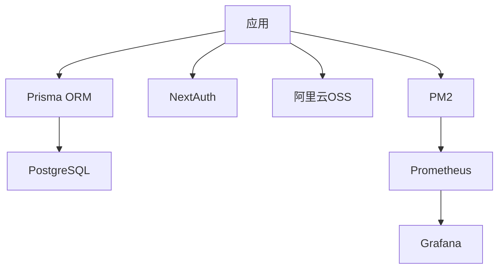

# 性能监控

<cite>
**本文档引用的文件**
- [ecosystem.config.js](file://ecosystem.config.js)
- [src/app/api/health/route.ts](file://src/app/api/health/route.ts)
- [src/app/api/admin/stats/route.ts](file://src/app/api/admin/stats/route.ts)
- [src/app/api/works/[id]/like/route.ts](file://src/app/api/works/[id]/like/route.ts)
- [src/app/api/works/[id]/view/route.ts](file://src/app/api/works/[id]/view/route.ts)
- [src/app/api/upload/route.ts](file://src/app/api/upload/route.ts)
- [src/lib/prisma.ts](file://src/lib/prisma.ts)
- [src/components/admin/AdminStats.tsx](file://src/components/admin/AdminStats.tsx)
</cite>

## 目录
1. [引言](#引言)
2. [项目结构](#项目结构)
3. [核心组件](#核心组件)
4. [架构概览](#架构概览)
5. [详细组件分析](#详细组件分析)
6. [依赖分析](#依赖分析)
7. [性能考量](#性能考量)
8. [故障排除指南](#故障排除指南)
9. [结论](#结论)

## 引言
本文档旨在设计一个性能监控方案，利用现有健康检查接口扩展关键性能指标采集能力，包括API响应延迟、内存占用、请求吞吐量等。说明如何通过ecosystem.config.js配置PM2的监控插件或集成Prometheus进行指标暴露。指导部署Grafana仪表板以可视化系统运行状态。结合平台实际负载场景（如作品上传、点赞互动）定义监控阈值与告警规则，确保及时发现性能瓶颈。提供与Next.js和Prisma协作的性能采样最佳实践。

## 项目结构
本项目采用Next.js 15作为前端框架，结合Prisma进行数据库操作，使用PM2进行进程管理。主要功能模块包括用户认证、作品上传、在线人数统计、管理员统计等。API路由位于`src/app/api`目录下，前端组件位于`src/components`目录下，数据库模型通过Prisma管理。



**Diagram sources**
- [src/app/api/health/route.ts](file://src/app/api/health/route.ts#L1-L25)
- [src/app/api/upload/route.ts](file://src/app/api/upload/route.ts#L1-L147)
- [src/app/api/works/[id]/like/route.ts](file://src/app/api/works/[id]/like/route.ts#L1-L64)
- [src/app/api/works/[id]/view/route.ts](file://src/app/api/works/[id]/view/route.ts#L1-L61)
- [src/app/api/admin/stats/route.ts](file://src/app/api/admin/stats/route.ts#L1-L162)

**Section sources**
- [src/app/api](file://src/app/api)
- [src/components](file://src/components)
- [prisma](file://prisma)

## 核心组件
系统的核心组件包括健康检查接口、作品上传接口、点赞互动接口、浏览统计接口和管理统计接口。这些接口共同构成了平台的主要功能，也是性能监控的重点对象。

**Section sources**
- [src/app/api/health/route.ts](file://src/app/api/health/route.ts#L1-L25)
- [src/app/api/upload/route.ts](file://src/app/api/upload/route.ts#L1-L147)
- [src/app/api/works/[id]/like/route.ts](file://src/app/api/works/[id]/like/route.ts#L1-L64)
- [src/app/api/works/[id]/view/route.ts](file://src/app/api/works/[id]/view/route.ts#L1-L61)
- [src/app/api/admin/stats/route.ts](file://src/app/api/admin/stats/route.ts#L1-L162)

## 架构概览
系统采用分层架构，前端通过Next.js Server Components与API层交互，API层通过Prisma与PostgreSQL数据库通信。PM2负责进程管理和监控，Prometheus负责指标采集，Grafana负责可视化展示。



**Diagram sources**
- [ecosystem.config.js](file://ecosystem.config.js#L1-L109)
- [src/lib/prisma.ts](file://src/lib/prisma.ts#L1-L19)

## 详细组件分析

### 健康检查组件分析
健康检查接口用于检测系统和服务的运行状态，是性能监控的基础。



**Diagram sources**
- [src/app/api/health/route.ts](file://src/app/api/health/route.ts#L1-L25)

**Section sources**
- [src/app/api/health/route.ts](file://src/app/api/health/route.ts#L1-L25)

### 作品上传组件分析
作品上传接口处理用户上传的作品，涉及文件验证、OSS上传和数据库记录。



**Diagram sources**
- [src/app/api/upload/route.ts](file://src/app/api/upload/route.ts#L1-L147)

**Section sources**
- [src/app/api/upload/route.ts](file://src/app/api/upload/route.ts#L1-L147)

### 点赞互动组件分析
点赞接口实现作品的点赞功能，采用随机增量策略增加互动真实性。



**Diagram sources**
- [src/app/api/works/[id]/like/route.ts](file://src/app/api/works/[id]/like/route.ts#L1-L64)

**Section sources**
- [src/app/api/works/[id]/like/route.ts](file://src/app/api/works/[id]/like/route.ts#L1-L64)

### 浏览统计组件分析
浏览统计接口记录作品的浏览次数，用于分析用户行为。



**Diagram sources**
- [src/app/api/works/[id]/view/route.ts](file://src/app/api/works/[id]/view/route.ts#L1-L61)

**Section sources**
- [src/app/api/works/[id]/view/route.ts](file://src/app/api/works/[id]/view/route.ts#L1-L61)

### 管理统计组件分析
管理统计接口为管理员提供平台运营数据，包括用户、作品和互动统计。



**Diagram sources**
- [src/app/api/admin/stats/route.ts](file://src/app/api/admin/stats/route.ts#L1-L162)

**Section sources**
- [src/app/api/admin/stats/route.ts](file://src/app/api/admin/stats/route.ts#L1-L162)

## 依赖分析
系统依赖于多个外部服务和库，包括数据库、对象存储、身份认证等。



**Diagram sources**
- [ecosystem.config.js](file://ecosystem.config.js#L1-L109)
- [src/lib/prisma.ts](file://src/lib/prisma.ts#L1-L19)
- [src/lib/oss.ts](file://src/lib/oss.ts)
- [src/lib/auth.ts](file://src/lib/auth.ts)

**Section sources**
- [package.json](file://package.json)
- [ecosystem.config.js](file://ecosystem.config.js#L1-L109)

## 性能考量
### PM2监控配置
通过ecosystem.config.js配置PM2的监控功能：

```javascript
module.exports = {
  apps: [
    {
      name: 'yunqi-platform',
      script: 'npm',
      args: 'start',
      instances: 1,
      autorestart: true,
      max_memory_restart: '1G',
      env: {
        NODE_ENV: 'production',
        PORT: 3000
      },
      // 启用PM2监控
      watch: false,
      ignore_watch: ['node_modules', '.next', 'logs'],
      // 日志配置
      log_file: './logs/combined.log',
      out_file: './logs/out.log',
      error_file: './logs/error.log',
      log_date_format: 'YYYY-MM-DD HH:mm:ss Z',
      // 进程管理
      min_uptime: '10s',
      max_restarts: 10
    }
  ]
};
```

### Prometheus指标暴露
需要安装`prom-client`库来暴露指标：

```bash
npm install prom-client
```

创建指标收集器：

```typescript
import client from 'prom-client';

// 创建计数器
const httpRequestCounter = new client.Counter({
  name: 'http_requests_total',
  help: 'Total number of HTTP requests',
  labelNames: ['method', 'route', 'status']
});

// 创建直方图
const httpRequestDuration = new client.Histogram({
  name: 'http_request_duration_seconds',
  help: 'Duration of HTTP requests in seconds',
  labelNames: ['method', 'route'],
  buckets: [0.1, 0.5, 1, 2, 5]
});
```

### Grafana仪表板配置
1. 添加Prometheus数据源
2. 导入或创建仪表板
3. 配置关键指标可视化：
   - API响应延迟
   - 内存使用情况
   - 请求吞吐量
   - 数据库连接数
   - 错误率

### 监控阈值与告警规则
#### 作品上传场景
- **响应时间**: 超过2秒触发警告，超过5秒触发严重告警
- **错误率**: 连续5分钟错误率超过5%触发警告
- **内存使用**: 超过800MB触发警告，超过900MB触发严重告警

#### 点赞互动场景
- **请求吞吐量**: 每秒超过100次触发警告
- **数据库延迟**: 超过500ms触发警告
- **缓存命中率**: 低于80%触发警告

### Next.js与Prisma性能采样最佳实践
1. **连接池管理**: 使用全局Prisma实例避免重复创建连接
2. **查询优化**: 使用`select`指定需要的字段，避免获取不必要的数据
3. **批量操作**: 对于大量数据操作，使用`createMany`、`updateMany`等批量方法
4. **缓存策略**: 对于频繁读取但不常更新的数据，使用HTTP缓存头
5. **错误处理**: 实现优雅的错误处理和降级策略

**Section sources**
- [ecosystem.config.js](file://ecosystem.config.js#L1-L109)
- [src/lib/prisma.ts](file://src/lib/prisma.ts#L1-L19)
- [src/app/api/upload/route.ts](file://src/app/api/upload/route.ts#L1-L147)
- [src/app/api/works/[id]/like/route.ts](file://src/app/api/works/[id]/like/route.ts#L1-L64)

## 故障排除指南
### 常见问题
1. **健康检查失败**
   - 检查数据库连接
   - 验证环境变量配置
   - 查看PM2进程状态

2. **上传功能异常**
   - 检查OSS配置和权限
   - 验证文件类型和大小限制
   - 查看上传时间窗口设置

3. **性能下降**
   - 检查PM2监控中的内存使用
   - 分析数据库查询性能
   - 查看API响应时间分布

**Section sources**
- [src/app/api/health/route.ts](file://src/app/api/health/route.ts#L1-L25)
- [src/app/api/upload/route.ts](file://src/app/api/upload/route.ts#L1-L147)
- [ecosystem.config.js](file://ecosystem.config.js#L1-L109)

## 结论
本文档详细描述了基于现有健康检查接口的性能监控方案。通过PM2进程管理和Prometheus指标采集，结合Grafana可视化，可以全面监控系统运行状态。针对作品上传、点赞互动等关键场景设置了合理的监控阈值和告警规则。同时提供了与Next.js和Prisma协作的性能采样最佳实践，确保系统在高负载下仍能稳定运行。