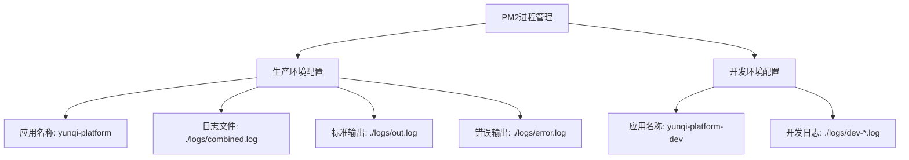
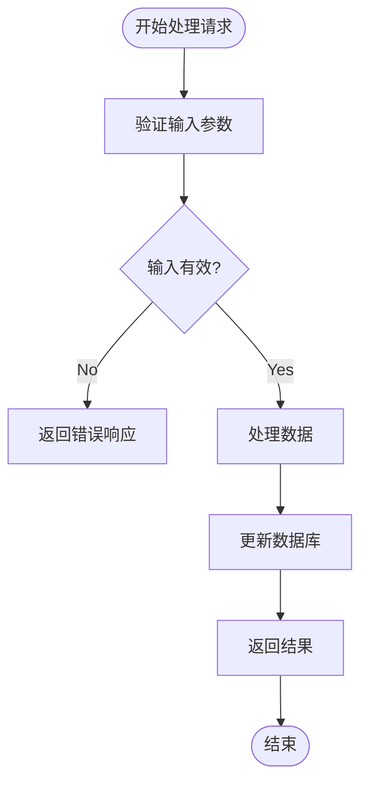
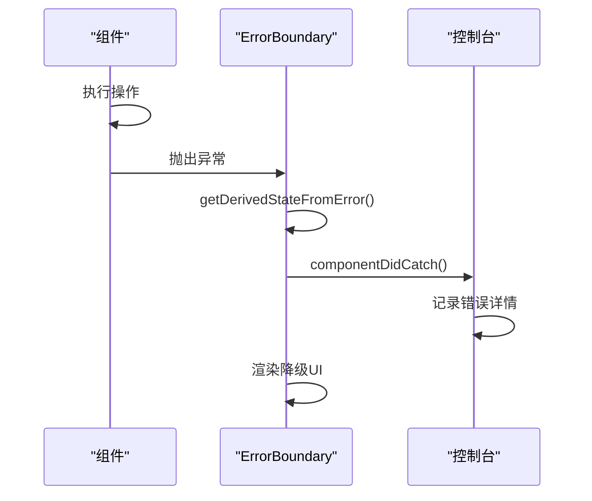

# 日志管理

<cite>
**本文档引用的文件**  
- [ecosystem.config.js](file://ecosystem.config.js)
- [nextjs15-build-error.md](file://log/nextjs15-build-error.md)
- [online-counter-issue.md](file://log/online-counter-issue.md)
- [random-likes-feature.md](file://log/random-likes-feature.md)
- [spacing-adjustment-issue.md](file://log/spacing-adjustment-issue.md)
- [error.tsx](file://src/app/error.tsx)
- [ErrorBoundary.tsx](file://src/components/ErrorBoundary.tsx)
- [ErrorMessage.tsx](file://src/components/ErrorMessage.tsx)
- [serialize.ts](file://src/lib/serialize.ts)
- [health/route.ts](file://src/app/api/health/route.ts)
</cite>

## 目录
1. [引言](#引言)
2. [常见错误类型与日志记录模式](#常见错误类型与日志记录模式)
3. [PM2日志配置与管理策略](#pm2日志配置与管理策略)
4. [结构化日志记录规范](#结构化日志记录规范)
5. [日志级别使用指南](#日志级别使用指南)
6. [日志在故障定位中的实际应用](#日志在故障定位中的实际应用)
7. [结论](#结论)

## 引言
本规范旨在建立统一的日志管理标准，通过分析项目中已记录的问题案例，归纳常见错误类型与日志模式，指导开发人员正确使用日志系统。文档涵盖PM2日志配置、结构化日志记录、日志级别使用等关键方面，确保系统具备良好的可观测性和故障排查能力。

## 常见错误类型与日志记录模式

通过对log目录中问题记录文件的分析，可归纳出以下常见错误类型及其日志记录模式：

### 构建与运行时错误
在`nextjs15-build-error.md`中记录了Next.js 15构建错误，主要涉及`useSearchParams()`未被`Suspense`边界包裹的问题。此类错误通常在构建阶段暴露，需要通过详细的构建日志进行定位。

### 功能实现问题
`online-counter-issue.md`记录了在线人数计数器组件的实现问题，包括组件位置错误导致的重复渲染。此类问题可通过前端错误边界和控制台日志进行捕获。

### 业务逻辑异常
`random-likes-feature.md`中描述了作品审核时随机点赞数功能的实现，涉及状态变更检测和随机数生成逻辑。此类业务逻辑错误需要在关键决策点添加调试日志。

### 样式与布局问题
`spacing-adjustment-issue.md`记录了页面间距过大的问题，通过检查Tailwind CSS类的使用情况进行修复。此类问题通常不产生运行时错误日志，但可通过开发工具的控制台输出进行调试。

**Section sources**
- [nextjs15-build-error.md](file://log/nextjs15-build-error.md)
- [online-counter-issue.md](file://log/online-counter-issue.md)
- [random-likes-feature.md](file://log/random-likes-feature.md)
- [spacing-adjustment-issue.md](file://log/spacing-adjustment-issue.md)

## PM2日志配置与管理策略

### PM2配置概述
`ecosystem.config.js`文件定义了PM2进程管理器的配置，包括生产环境和开发环境的应用实例。



**Diagram sources**
- [ecosystem.config.js](file://ecosystem.config.js)

### 日志收集策略
PM2配置了详细的日志收集策略：
- `log_file`: 综合日志文件，记录所有输出
- `out_file`: 标准输出日志
- `error_file`: 错误输出日志
- `log_date_format`: 统一日志时间格式为"YYYY-MM-DD HH:mm:ss Z"

### 日志轮转与归档
虽然当前配置未显式定义日志轮转策略，但建议结合外部工具（如logrotate）实现：
1. 按大小或时间轮转日志文件
2. 压缩历史日志文件以节省存储空间
3. 设置日志保留策略，定期清理过期日志
4. 将重要日志归档到远程存储系统

**Section sources**
- [ecosystem.config.js](file://ecosystem.config.js)

## 结构化日志记录规范

### JSON格式日志
推荐使用JSON格式记录关键操作与异常信息，便于集中采集与分析。参考`src/lib/serialize.ts`中的序列化函数，确保日志数据的完整性和一致性。

```mermaid
classDiagram
class JSONValue {
+string
+number
+boolean
+null
+JSONValue[]
+{ [key : string] : JSONValue }
}
class toPlainJSON {
+toPlainJSON(value : T) : JSONValue
+处理null/undefined
+处理基本类型
+处理Date对象
+处理数组
+处理对象
+优化图片URL
}
toPlainJSON --> JSONValue : "返回"
```

**Diagram sources**
- [serialize.ts](file://src/lib/serialize.ts)

### 关键操作日志
应在以下关键操作点记录结构化日志：
- 用户认证与授权
- 数据库操作（增删改查）
- 文件上传与下载
- 外部API调用
- 定时任务执行

### 异常信息记录
异常信息应包含以下结构化字段：
- `timestamp`: 时间戳
- `level`: 日志级别
- `message`: 错误消息
- `error`: 错误对象（序列化）
- `stack`: 调用栈
- `context`: 上下文信息（如用户ID、请求路径等）

**Section sources**
- [serialize.ts](file://src/lib/serialize.ts)

## 日志级别使用指南

### 日志级别定义
应遵循以下日志级别使用规范：

| 日志级别 | 使用场景 | 示例 |
|---------|--------|------|
| debug | 调试信息，详细执行流程 | "开始处理用户上传请求" |
| info | 重要操作记录，系统状态变更 | "用户登录成功" |
| error | 错误信息，需要关注和处理 | "数据库连接失败" |

### 各级别使用建议
#### Debug级别
用于记录详细的执行流程，帮助开发人员理解代码执行路径。在生产环境中通常关闭debug日志以减少日志量。



**Diagram sources**
- [health/route.ts](file://src/app/api/health/route.ts)

#### Info级别
记录系统的重要操作和状态变更，如用户登录、数据更新等。这些日志对于审计和监控系统行为至关重要。

#### Error级别
记录系统错误和异常情况，必须包含足够的上下文信息以便快速定位问题。参考`src/app/error.tsx`中的错误处理模式。

**Section sources**
- [error.tsx](file://src/app/error.tsx)
- [ErrorBoundary.tsx](file://src/components/ErrorBoundary.tsx)
- [ErrorMessage.tsx](file://src/components/ErrorMessage.tsx)

## 日志在故障定位中的实际应用

### 错误边界与异常捕获
通过`ErrorBoundary.tsx`和`error.tsx`中的实现，系统能够捕获未处理的异常并记录详细的错误信息。



**Diagram sources**
- [ErrorBoundary.tsx](file://src/components/ErrorBoundary.tsx)
- [error.tsx](file://src/app/error.tsx)

### 健康检查与监控
`health/route.ts`中的健康检查API通过日志记录数据库连接状态，为系统监控提供依据。

### 案例分析
结合`nextjs15-build-error.md`中的案例，当构建错误发生时，应：
1. 检查构建日志中的具体错误信息
2. 定位到相关代码文件和行号
3. 分析错误原因（如`useSearchParams()`使用不当）
4. 实施修复方案（提取到子组件并用`Suspense`包裹）
5. 验证修复结果

**Section sources**
- [health/route.ts](file://src/app/api/health/route.ts)
- [nextjs15-build-error.md](file://log/nextjs15-build-error.md)

## 结论
建立完善的日志管理体系对于保障系统稳定运行至关重要。通过规范PM2日志配置、采用结构化日志记录、正确使用日志级别，可以显著提升系统的可观测性和故障排查效率。开发人员应养成良好的日志记录习惯，在关键路径添加适当的日志输出，为系统的维护和优化提供有力支持。