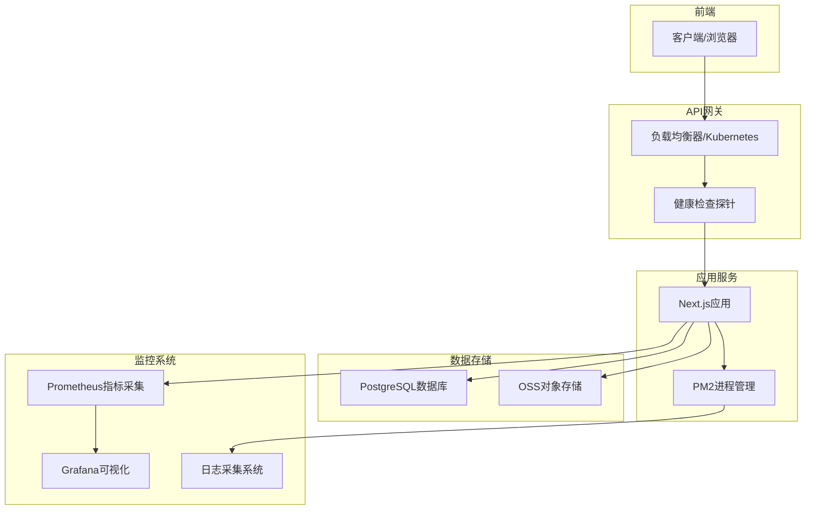
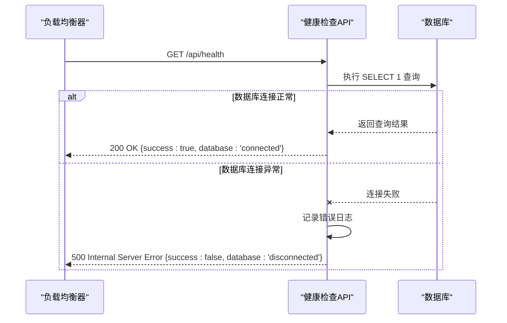
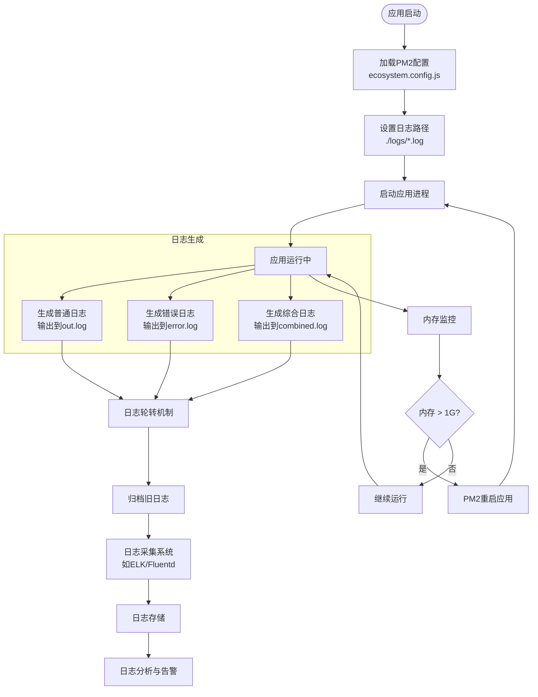

# 监控与日志

<cite>
**本文档引用的文件**   
- [health/route.ts](file://src/app/api/health/route.ts)
- [ecosystem.config.js](file://ecosystem.config.js)
- [prisma.ts](file://src/lib/prisma.ts)
- [oss.ts](file://src/lib/oss.ts)
</cite>

## 目录
1. [引言](#引言)
2. [健康检查机制设计](#健康检查机制设计)
3. [日志管理体系](#日志管理体系)
4. [结构化日志与监控集成](#结构化日志与监控集成)
5. [系统监控架构图](#系统监控架构图)
6. [健康检查API序列图](#健康检查api序列图)
7. [日志处理流程图](#日志处理流程图)
8. [依赖分析](#依赖分析)
9. [性能考虑](#性能考虑)
10. [故障排查指南](#故障排查指南)
11. [结论](#结论)

## 引言
本文档旨在为数字化作品互动展示平台制定完整的系统监控与日志管理方案。基于现有的健康检查API端点和PM2配置，设计全面的监控体系，确保系统稳定性与可观测性。方案涵盖健康检查机制、日志分类采集、结构化输出以及与主流监控工具的集成。

## 健康检查机制设计
健康检查API（`src/app/api/health/route.ts`）通过测试数据库连接来判断系统状态。当收到GET请求时，系统会执行一个简单的数据库查询（`SELECT 1`）来验证数据库连接。如果查询成功，返回包含"connected"状态的JSON响应；如果失败，则捕获异常并返回"disconnected"状态及错误信息。该机制可被Kubernetes或负载均衡器用于探活，确保只有健康的实例接收流量。

**Section sources**
- [health/route.ts](file://src/app/api/health/route.ts#L0-L25)

## 日志管理体系
PM2配置文件（`ecosystem.config.js`）定义了完善的日志管理策略。生产环境和开发环境分别配置了独立的日志文件：`./logs/combined.log`、`./logs/out.log`和`./logs/error.log`用于生产环境，而`./logs/dev-combined.log`、`./logs/dev-out.log`和`./logs/dev-error.log`用于开发环境。所有日志均按指定格式（YYYY-MM-DD HH:mm:ss Z）记录时间戳，并实现了日志轮转和进程异常重启（最大内存1G时重启）。该配置确保了应用日志的有效聚合与管理。

**Section sources**
- [ecosystem.config.js](file://ecosystem.config.js#L0-L58)

## 结构化日志与监控集成
建议采用JSON格式的结构化日志，便于日志采集系统解析。可集成Prometheus进行性能指标采集，如API延迟、错误率和内存使用情况。通过暴露/metrics端点，Prometheus可定期抓取这些指标。Grafana可用于可视化这些指标，创建仪表板监控系统健康状况。对于OSS存储服务的监控，可利用`src/lib/oss.ts`中定义的`objectExists`等函数实现存储服务可达性检测。

**Section sources**
- [oss.ts](file://src/lib/oss.ts#L261-L302)
- [prisma.ts](file://src/lib/prisma.ts#L6-L17)

## 系统监控架构图

**Diagram sources **
- [health/route.ts](file://src/app/api/health/route.ts#L0-L25)
- [ecosystem.config.js](file://ecosystem.config.js#L0-L58)

## 健康检查API序列图

**Diagram sources **
- [health/route.ts](file://src/app/api/health/route.ts#L0-L25)

## 日志处理流程图

**Diagram sources **
- [ecosystem.config.js](file://ecosystem.config.js#L0-L58)

## 依赖分析
系统健康检查依赖于Prisma数据库客户端（`prisma.$queryRaw`）和Next.js的API路由功能。日志管理依赖PM2进程管理器及其配置文件。OSS存储服务的健康检查依赖`ali-oss`库和相关环境变量配置。这些依赖关系构成了系统监控的基础，任何依赖项的故障都可能影响监控结果的准确性。

**Section sources**
- [health/route.ts](file://src/app/api/health/route.ts#L0-L25)
- [ecosystem.config.js](file://ecosystem.config.js#L0-L58)
- [prisma.ts](file://src/lib/prisma.ts#L6-L17)
- [oss.ts](file://src/lib/oss.ts#L0-L302)

## 性能考虑
健康检查API应保持轻量，避免复杂的数据库查询以减少对生产数据库的压力。建议在健康检查中使用只读连接或连接池中的空闲连接。日志记录应避免在高频率的代码路径中记录大量调试信息，以免影响应用性能。PM2的`max_memory_restart`配置（1G）有助于防止内存泄漏导致的性能下降。

## 故障排查指南
当健康检查失败时，首先检查数据库连接配置和网络连通性。查看`./logs/error.log`中的详细错误信息，特别是"健康检查失败"相关的日志条目。对于日志文件问题，确认`./logs`目录存在且应用有写入权限。若PM2进程频繁重启，检查内存使用情况并分析`out.log`中的应用输出。

**Section sources**
- [health/route.ts](file://src/app/api/health/route.ts#L0-L25)
- [ecosystem.config.js](file://ecosystem.config.js#L0-L58)

## 结论
本方案基于现有代码基础，设计了完整的系统监控与日志管理架构。通过健康检查API、PM2日志管理和结构化监控集成，可有效提升系统的可观测性和稳定性。建议进一步实现OSS服务的健康检查，并建立完善的告警机制，以实现全面的系统监控。