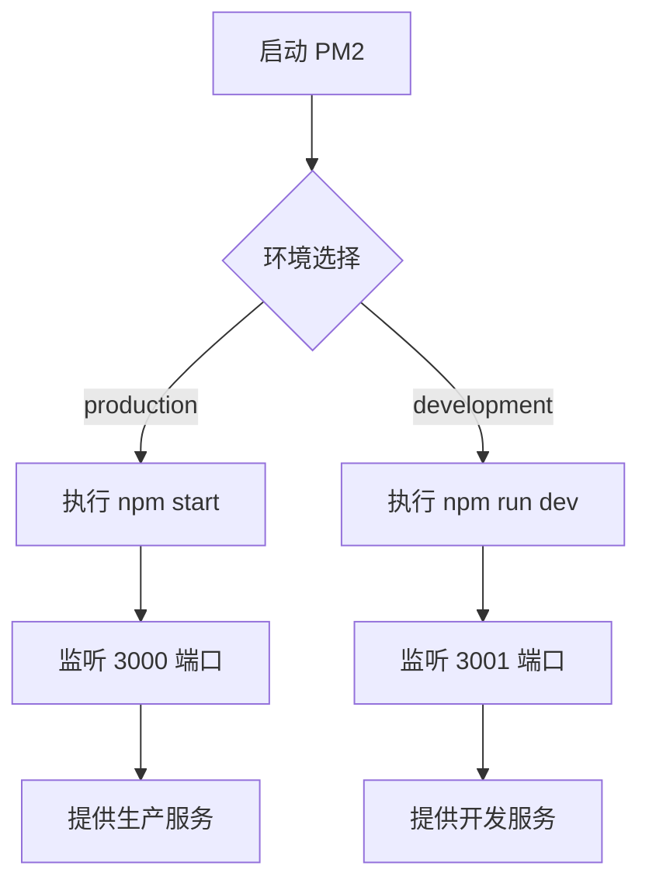

# Docker 容器化部署

<cite>
**本文档引用文件**  
- [ecosystem.config.js](file://ecosystem.config.js)
- [middleware.ts](file://middleware.ts)
- [next.config.ts](file://next.config.ts)
- [package.json](file://package.json)
</cite>

## 目录
1. [简介](#简介)
2. [Docker 多阶段构建流程](#docker-多阶段构建流程)
3. [Dockerfile 构建优化策略](#dockerfile-构建优化策略)
4. [Next.js 集成与静态资源输出](#nextjs-集成与静态资源输出)
5. [PM2 进程管理配置](#pm2-进程管理配置)
6. [中间件与请求路径处理](#中间件与请求路径处理)
7. [Docker Compose 编排示例](#docker-compose-编排示例)
8. [环境变量与 HTTPS 反向代理](#环境变量与-https-反向代理)
9. [CI/CD 流水线集成](#cicd-流水线集成)
10. [性能与安全考量](#性能与安全考量)

## 简介
本文档全面阐述了基于 Next.js 的“数字化作品互动展示平台”在 Docker 环境下的容器化部署流程。通过分析项目结构与核心配置文件，详细说明了如何利用多阶段构建实现高效、安全的镜像打包，并结合 PM2 实现生产环境下的进程管理，确保服务的高可用性与稳定性。

## Docker 多阶段构建流程
Docker 多阶段构建通过在单个 Dockerfile 中使用多个 `FROM` 指令，将构建过程划分为独立的阶段，从而实现构建环境与运行环境的分离。第一阶段用于安装依赖和构建应用，第二阶段则基于轻量基础镜像仅复制构建产物，显著减小最终镜像体积。

**Section sources**
- [package.json](file://package.json#L0-L61)

## Dockerfile 构建优化策略
### 依赖安装缓存优化
通过将 `package.json` 和 `package-lock.json` 文件优先复制到镜像中并执行 `npm install`，可以利用 Docker 的层缓存机制。当源代码变更而依赖未变时，无需重新下载和安装依赖，大幅提升构建速度。

### 构建上下文精简
通过 `.dockerignore` 文件排除 `node_modules`、`.git`、`logs` 等非必要文件，减少发送到 Docker 守护进程的上下文大小，加快构建过程。

### 镜像分层与生产环境最小化
采用多阶段构建，生产镜像仅包含 Node.js 运行时和构建后的 Next.js 应用（位于 `.next` 目录），不包含开发依赖、源码和构建工具，实现了生产环境的最小化打包，提高了安全性和启动效率。

**Section sources**
- [package.json](file://package.json#L0-L61)

## Next.js 集成与静态资源输出
### 构建与启动命令
项目通过 `package.json` 中的 `scripts` 定义了标准的 Next.js 命令：`npm run build` 执行构建，生成优化的静态资源和服务器端代码；`npm start` 启动生产环境服务器。Dockerfile 中的 `CMD` 指令应配置为 `npm start` 以正确启动应用。

### 端口暴露
应用通过 `PORT` 环境变量指定监听端口。在 `ecosystem.config.js` 中，生产环境配置为 `3000` 端口。Dockerfile 必须使用 `EXPOSE 3000` 显式声明该端口，以便在容器编排时进行映射。

**Section sources**
- [package.json](file://package.json#L0-L61)
- [ecosystem.config.js](file://ecosystem.config.js#L0-L109)

## PM2 进程管理配置
### 适用场景
PM2 适用于需要在生产环境中长期运行 Node.js 应用的场景。它提供了进程守护、自动重启、负载均衡（集群模式）、日志管理、性能监控和开机自启等功能，是确保应用高可用性的理想选择。

### 配置方式
`ecosystem.config.js` 文件定义了 PM2 的应用配置。`apps` 数组中包含两个应用实例：
- `yunqi-platform`：生产环境实例，执行 `npm start`，配置了内存重启阈值（`max_memory_restart: '1G'`）和日志文件路径。
- `yunqi-platform-dev`：开发环境实例，执行 `npm run dev`，启用了文件监听（`watch: true`）以实现热重载。

通过 `pm2 start ecosystem.config.js --env production` 命令即可启动生产环境应用。



**Diagram sources**
- [ecosystem.config.js](file://ecosystem.config.js#L0-L109)

**Section sources**
- [ecosystem.config.js](file://ecosystem.config.js#L0-L109)

## 中间件与请求路径处理
`middleware.ts` 文件利用 NextAuth.js 的 `withAuth` 函数实现了全局请求拦截和路径访问控制。它根据用户的登录状态和角色（`token?.role`），对特定路径（如 `/admin`、`/profile`）进行重定向或权限验证。

在容器化部署中，此中间件逻辑完全内置于应用代码中，无需额外配置。容器启动后，该中间件会自动生效，确保所有请求都经过安全校验。

**Section sources**
- [middleware.ts](file://middleware.ts#L0-L50)

## Docker Compose 编排示例
```yaml
version: '3.8'
services:
  web:
    build: .
    ports:
      - "3000:3000"
    environment:
      - NODE_ENV=production
      - PORT=3000
      - DATABASE_URL=postgresql://user:password@db:5432/yunqi
      - NEXTAUTH_SECRET=your_strong_secret
      - ALI_OSS_REGION=oss-cn-hangzhou
      # ... 其他环境变量
    depends_on:
      - db
    restart: unless-stopped

  db:
    image: postgres:15
    environment:
      POSTGRES_DB: yunqi
      POSTGRES_USER: user
      POSTGRES_PASSWORD: password
    volumes:
      - postgres_data:/var/lib/postgresql/data
    restart: unless-stopped

volumes:
  postgres_data:
```

## 环境变量与 HTTPS 反向代理
### 环境变量管理
敏感信息（如数据库连接字符串、OSS 密钥、NextAuth 密钥）应通过环境变量注入容器，而非硬编码在代码或 Dockerfile 中。可使用 `.env` 文件或 Docker Compose 的 `environment` 字段进行管理，并确保 `.env` 文件被 `.gitignore` 和 `.dockerignore` 排除。

### HTTPS 反向代理集成
生产环境中，通常使用 Nginx 或 Traefik 作为反向代理，部署在应用容器之前。代理服务器负责处理 HTTPS 加密、SSL 证书管理、负载均衡和静态资源缓存。应用容器只需监听 HTTP 请求，由代理负责将外部 HTTPS 流量转发至内部 HTTP 端口。

## CI/CD 流水线集成
CI/CD 流水线可自动化整个部署过程：
1.  **代码推送**：开发者推送代码至 Git 仓库。
2.  **自动构建**：CI 服务器拉取代码，运行测试，并根据 Dockerfile 构建镜像。
3.  **镜像推送**：将构建好的镜像推送到私有或公有镜像仓库（如 Docker Hub、阿里云容器镜像服务）。
4.  **部署**：在目标服务器上，通过脚本或编排工具（如 Docker Compose, Kubernetes）拉取新镜像并重启服务，实现无缝更新。

`ecosystem.config.js` 中的 `deploy` 配置展示了 PM2 的部署脚本，其中 `post-deploy` 命令 `npm install && npm run build && pm2 reload ecosystem.config.js --env production` 可直接集成到 CI/CD 的部署阶段。

**Section sources**
- [ecosystem.config.js](file://ecosystem.config.js#L0-L109)

## 性能与安全考量
### 性能开销
容器化引入了轻微的性能开销，主要来自网络虚拟化和文件系统层。但通过优化镜像大小、合理配置资源限制（CPU、内存）以及使用反向代理缓存，可以将影响降至最低。多阶段构建和生产环境最小化打包是控制开销的关键。

### 安全性考量
- **最小化原则**：使用轻量基础镜像（如 `node:alpine`），仅安装必要依赖。
- **非 root 用户**：在 Dockerfile 中创建非 root 用户运行应用，降低权限提升风险。
- **环境变量安全**：避免在日志或错误信息中泄露敏感环境变量。
- **依赖更新**：定期更新 `package.json` 中的依赖，修复已知漏洞。
- **网络隔离**：通过 Docker 网络和防火墙规则，限制容器间的通信和外部访问。