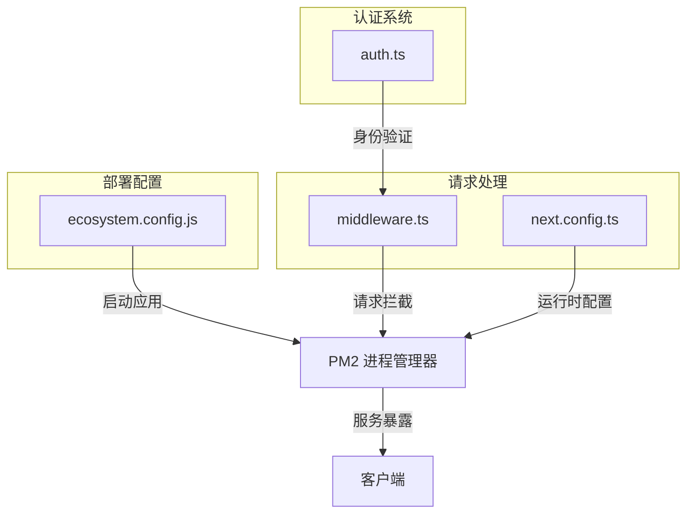
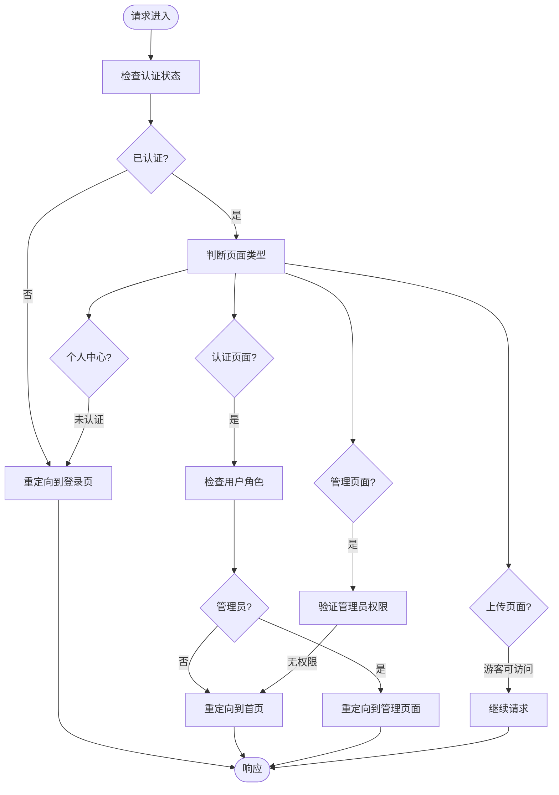
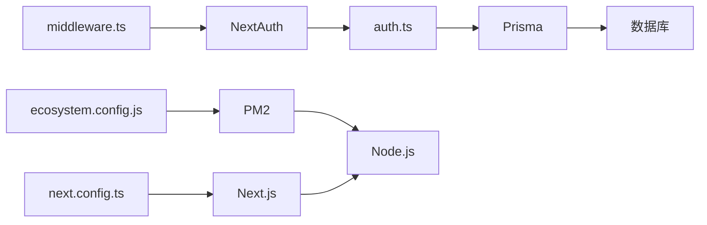

# PM2 部署方案

<cite>
**本文档引用文件**  
- [ecosystem.config.js](file://ecosystem.config.js)
- [middleware.ts](file://middleware.ts)
- [next.config.ts](file://next.config.ts)
- [auth.ts](file://src/lib/auth.ts)
</cite>

## 目录
1. [简介](#简介)
2. [项目结构](#项目结构)
3. [核心组件](#核心组件)
4. [架构概览](#架构概览)
5. [详细组件分析](#详细组件分析)
6. [依赖分析](#依赖分析)
7. [性能考虑](#性能考虑)
8. [故障排除指南](#故障排除指南)
9. [结论](#结论)

## 简介
本文档详细说明基于PM2的部署实施方案，深入解析多环境配置、中间件处理机制、进程守护策略、日志管理与性能监控最佳实践，并提供常见部署问题的解决方案。

## 项目结构
项目采用标准Next.js结构，核心部署配置文件包括`ecosystem.config.js`用于PM2进程管理，`middleware.ts`处理请求预处理和身份验证，`next.config.ts`定义构建和运行时配置。

**Section sources**
- [ecosystem.config.js](file://ecosystem.config.js#L0-L110)
- [middleware.ts](file://middleware.ts#L0-L51)
- [next.config.ts](file://next.config.ts#L0-L69)

## 核心组件

### PM2 多环境配置
`ecosystem.config.js`文件定义了生产环境和开发环境的部署配置，包含实例数量、日志路径、错误监控、自动重启策略等关键参数。

**Section sources**
- [ecosystem.config.js](file://ecosystem.config.js#L0-L110)

## 架构概览



**Diagram sources**
- [ecosystem.config.js](file://ecosystem.config.js#L0-L110)
- [middleware.ts](file://middleware.ts#L0-L51)
- [next.config.ts](file://next.config.ts#L0-L69)

## 详细组件分析

### ecosystem.config.js 多环境配置分析

#### 生产环境配置
- **实例数量**: 单实例运行 (`instances: 1`)
- **自动重启**: 启用 (`autorestart: true`)
- **内存监控重启**: 当内存使用超过1GB时自动重启 (`max_memory_restart: '1G'`)
- **端口配置**: 使用3000端口
- **环境变量**: 设置`NODE_ENV=production`

#### 开发环境配置
- **热重载**: 启用文件监听 (`watch: true`)
- **忽略监听目录**: 包括`node_modules`、`.next`等
- **独立端口**: 使用3001端口避免冲突
- **独立日志**: 开发专用日志文件路径

#### 日志管理配置
- 综合日志: `./logs/combined.log`
- 输出日志: `./logs/out.log`
- 错误日志: `./logs/error.log`
- 开发日志: 分别对应`dev-`前缀的独立文件

#### 进程管理策略
- 最小运行时间: `10s`，防止频繁崩溃重启
- 最大重启次数: `10`次，避免无限重启循环
- 日期格式: `YYYY-MM-DD HH:mm:ss Z`

#### 集群模式（可选）
通过取消注释以下配置可启用集群模式：
```javascript
instances: 'max', // 使用所有CPU核心
exec_mode: 'cluster'
```

**Section sources**
- [ecosystem.config.js](file://ecosystem.config.js#L0-L110)

### middleware.ts 请求处理分析

#### 中间件功能


**Diagram sources**
- [middleware.ts](file://middleware.ts#L0-L51)

#### 路由匹配规则
中间件应用于以下路径模式：
- `/admin/:path*` - 管理页面
- `/upload/:path*` - 上传页面
- `/auth/:path*` - 认证页面
- `/profile/:path*` - 个人中心页面

#### 身份验证逻辑
1. 提取JWT令牌信息
2. 根据角色进行访问控制
3. 实现基于角色的重定向策略
4. 管理员访问控制保护

**Section sources**
- [middleware.ts](file://middleware.ts#L0-L51)
- [auth.ts](file://src/lib/auth.ts#L0-L72)

## 依赖分析



**Diagram sources**
- [ecosystem.config.js](file://ecosystem.config.js#L0-L110)
- [middleware.ts](file://middleware.ts#L0-L51)
- [next.config.ts](file://next.config.ts#L0-L69)
- [auth.ts](file://src/lib/auth.ts#L0-L72)

## 性能考虑

### PM2 最佳实践
1. **生产环境部署命令**:
   ```
   pm2 start ecosystem.config.js --env production
   ```

2. **开发环境启动**:
   ```
   pm2 start ecosystem.config.js --only yunqi-platform-dev
   ```

3. **进程监控**:
   ```
   pm2 monit
   ```

4. **日志查看**:
   ```
   pm2 logs yunqi-platform --lines 100
   ```

5. **开机自启配置**:
   ```
   pm2 save
   pm2 startup
   ```

### 环境变量注入
通过`ecosystem.config.js`的`env`对象注入环境变量，支持多环境配置：
- `NODE_ENV`: 区分环境模式
- `PORT`: 指定服务端口
- 其他敏感配置可通过系统环境变量注入

### 与Next.js构建流程集成
部署脚本自动集成构建流程：
```
'post-deploy': 'npm install && npm run build && pm2 reload ecosystem.config.js --env production'
```

此命令序列确保：
1. 安装最新依赖
2. 执行生产构建
3. 重新加载PM2配置

**Section sources**
- [ecosystem.config.js](file://ecosystem.config.js#L0-L110)

## 故障排除指南

### 常见问题及解决方案

#### 内存溢出问题
**症状**: 应用频繁重启，日志显示`max_memory_restart`触发  
**解决方案**:
1. 增加`max_memory_restart`阈值
2. 优化应用内存使用
3. 启用集群模式分散负载
4. 监控内存使用情况

#### 端口冲突
**症状**: 启动失败，提示端口已被占用  
**解决方案**:
1. 检查并修改`PORT`配置
2. 使用`netstat`或`lsof`查找占用进程
3. 开发环境使用不同端口（如3001）
4. 确保PM2进程完全停止后再启动

#### 部署失败
**检查清单**:
1. 确认`post-deploy`脚本权限
2. 检查Git仓库访问权限
3. 验证服务器磁盘空间
4. 确保Node.js版本兼容
5. 检查环境变量配置

#### 日志问题
**最佳实践**:
1. 定期轮转日志文件
2. 设置合理的日志级别
3. 监控错误日志频率
4. 使用`pm2 logs`实时查看

**Section sources**
- [ecosystem.config.js](file://ecosystem.config.js#L0-L110)
- [middleware.ts](file://middleware.ts#L0-L51)

## 结论
本文档提供了完整的PM2部署方案，涵盖了从配置到运维的各个方面。通过合理的多环境配置、有效的中间件处理、完善的监控策略和标准化的部署流程，确保了应用的稳定性和可维护性。建议在生产环境中启用集群模式以提高性能和可用性。