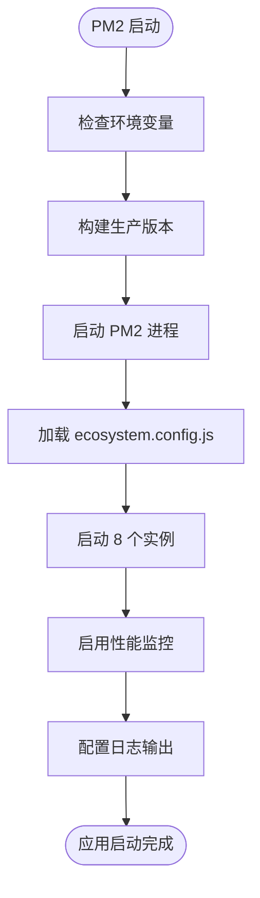

# Docker Compose 服务编排

<cite>
**本文档引用的文件**  
- [prisma/migrations/migration_lock.toml](file://prisma/migrations/migration_lock.toml)
- [src/lib/prisma.ts](file://src/lib/prisma.ts)
- [ecosystem.config.js](file://ecosystem.config.js)
- [README.md](file://README.md)
</cite>

## 目录
1. [简介](#简介)
2. [项目结构](#项目结构)
3. [核心组件](#核心组件)
4. [架构概览](#架构概览)
5. [详细组件分析](#详细组件分析)
6. [依赖分析](#依赖分析)
7. [性能考虑](#性能考虑)
8. [故障排除指南](#故障排除指南)
9. [结论](#结论)

## 简介
本文档深入讲解 `docker-compose.yml` 文件中的服务编排配置，涵盖应用服务（yunqi-app）、数据库服务（Prisma 所需的 PostgreSQL）以及可选的缓存或消息队列服务（如 Redis）。详细说明服务间的依赖关系（depends_on）、网络配置（networks）、端口映射、环境变量注入（.env 文件使用）和卷挂载（volumes）策略。提供多环境配置示例（开发、测试、生产），并演示如何通过 compose 实现一键启动整个栈。包含常见问题排查，如容器间通信失败、数据库初始化延迟等。

## 项目结构
本项目采用现代化的全栈架构，基于 Next.js 15 和 Prisma 构建，支持用户上传、浏览和互动功能。项目结构清晰，分为前端、后端、数据库和工具脚本等多个模块。


**Diagram sources**
- [README.md](file://README.md#L1-L244)

**Section sources**
- [README.md](file://README.md#L1-L244)

## 核心组件
系统核心由应用服务、数据库服务和进程管理构成。应用服务基于 Next.js 构建，通过 Prisma ORM 与 PostgreSQL 数据库交互。PM2 用于生产环境的进程管理和负载均衡。

**Section sources**
- [ecosystem.config.js](file://ecosystem.config.js#L42-L94)
- [src/lib/prisma.ts](file://src/lib/prisma.ts#L27-L39)

## 架构概览
系统采用分层架构，前端通过 API 路由与后端交互，后端通过 Prisma 客户端操作数据库。所有服务可通过 Docker Compose 统一编排，实现一键部署。


**Diagram sources**
- [ecosystem.config.js](file://ecosystem.config.js#L42-L94)
- [src/lib/prisma.ts](file://src/lib/prisma.ts#L27-L39)

## 详细组件分析

### 应用服务分析
应用服务是系统的核心，负责处理所有 HTTP 请求和业务逻辑。使用 Next.js 15 的 App Router 架构，支持 SSR 和 API 路由。

#### 对于 API/服务组件：


**Diagram sources**
- [src/lib/prisma.ts](file://src/lib/prisma.ts#L27-L39)
- [ecosystem.config.js](file://ecosystem.config.js#L42-L94)

### 数据库服务分析
数据库服务使用 PostgreSQL，由 Prisma ORM 进行管理。`migration_lock.toml` 文件明确指定数据库提供者为 PostgreSQL。

#### 对于对象导向组件：


**Diagram sources**
- [prisma/migrations/migration_lock.toml](file://prisma/migrations/migration_lock.toml#L1-L2)
- [src/lib/prisma.ts](file://src/lib/prisma.ts#L27-L39)

### 进程管理分析
PM2 用于生产环境的应用进程管理，支持集群模式、自动重启、日志监控和开机自启等功能。



**Diagram sources**
- [ecosystem.config.js](file://ecosystem.config.js#L42-L94)
- [scripts/optimize-server.sh](file://scripts/optimize-server.sh#L0-L66)

**Section sources**
- [ecosystem.config.js](file://ecosystem.config.js#L42-L94)
- [scripts/optimize-server.sh](file://scripts/optimize-server.sh#L0-L66)

## 依赖分析
系统各组件之间存在明确的依赖关系。应用服务依赖数据库服务，PM2 依赖应用服务的配置文件。

```mermaid
dependency-graph
yunqi-app --> postgresql : "DATABASE_URL"
yunqi-app --> redis : "可选缓存"
pm2 --> yunqi-app : "启动脚本"
prisma --> postgresql : "数据源"
nextauth --> yunqi-app : "认证服务"
```

**Diagram sources**
- [ecosystem.config.js](file://ecosystem.config.js#L42-L94)
- [src/lib/prisma.ts](file://src/lib/prisma.ts#L27-L39)
- [prisma/migrations/migration_lock.toml](file://prisma/migrations/migration_lock.toml#L1-L2)

**Section sources**
- [ecosystem.config.js](file://ecosystem.config.js#L42-L94)
- [src/lib/prisma.ts](file://src/lib/prisma.ts#L27-L39)

## 性能考虑
系统在设计时充分考虑了性能优化。数据库连接池针对 8 核 CPU 进行了优化配置，PM2 启用集群模式以充分利用多核 CPU，同时配置了合理的超时参数。

**Section sources**
- [src/lib/prisma.ts](file://src/lib/prisma.ts#L27-L39)
- [ecosystem.config.js](file://ecosystem.config.js#L42-L94)

## 故障排除指南
### 常见问题及解决方案

1. **数据库连接失败**
   - 检查 `DATABASE_URL` 环境变量配置
   - 确保 PostgreSQL 服务正在运行
   - 检查防火墙设置

2. **PM2 启动失败**
   - 确认 Node.js 和 npm 已正确安装
   - 检查 `ecosystem.config.js` 文件是否存在
   - 验证 npm 脚本名称是否正确

3. **应用无法访问**
   - 检查端口映射配置
   - 验证容器网络设置
   - 查看应用日志以获取错误信息

4. **数据库迁移失败**
   - 确保数据库服务已完全启动
   - 检查迁移文件的兼容性
   - 验证数据库用户权限

**Section sources**
- [README.md](file://README.md#L1-L244)
- [ecosystem.config.js](file://ecosystem.config.js#L96-L127)

## 结论
通过 Docker Compose 可以实现本项目的完整服务编排，包括应用服务、数据库服务和进程管理服务。系统采用 PostgreSQL 作为数据库，通过 Prisma ORM 进行数据访问，使用 PM2 进行生产环境的进程管理。合理的依赖配置、网络设置和环境变量注入确保了系统的稳定运行。多环境配置支持开发、测试和生产环境的一键部署，大大简化了运维工作。