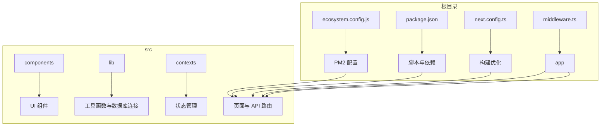
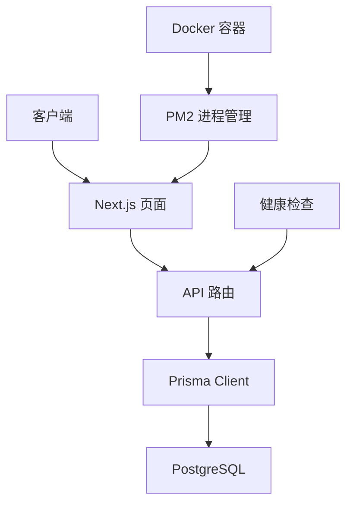
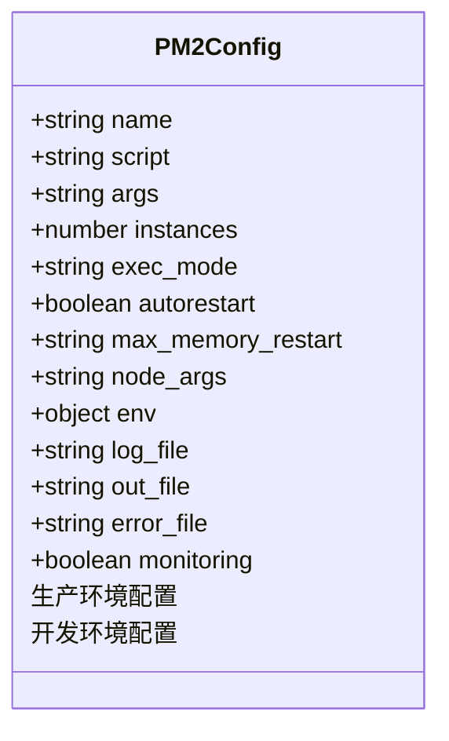
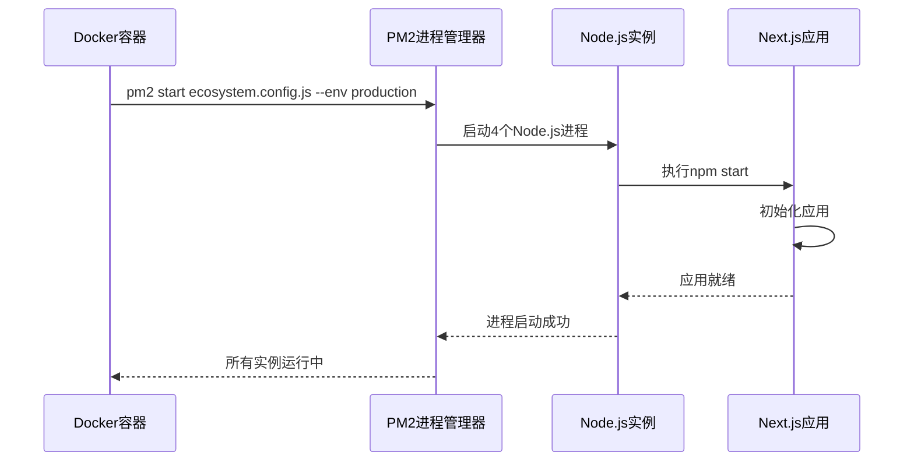
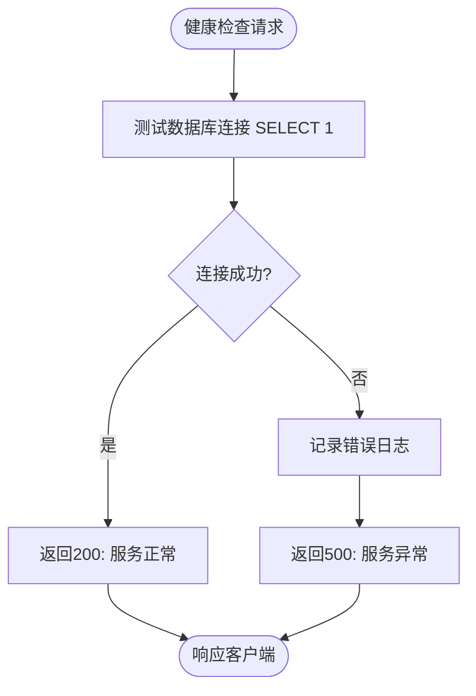
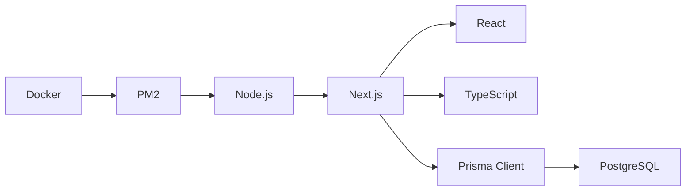

# PM2 运行时管理

<cite>
**本文档引用的文件**  
- [ecosystem.config.js](file://ecosystem.config.js)
- [package.json](file://package.json)
- [src/app/api/health/route.ts](file://src/app/api/health/route.ts)
- [src/lib/prisma.ts](file://src/lib/prisma.ts)
- [next.config.ts](file://next.config.ts)
- [middleware.ts](file://middleware.ts)
</cite>

## 目录
1. [简介](#简介)
2. [项目结构](#项目结构)
3. [核心组件](#核心组件)
4. [架构概述](#架构概述)
5. [详细组件分析](#详细组件分析)
6. [依赖分析](#依赖分析)
7. [性能考虑](#性能考虑)
8. [故障排除指南](#故障排除指南)
9. [结论](#结论)

## 简介
本文档详细介绍了如何在容器化环境中使用 PM2 进程管理器启动和监控 Next.js 应用。基于 `ecosystem.config.js` 文件，解释其配置项含义，包括应用入口（script）、工作进程模式（cluster vs fork）、实例数量、日志输出路径、错误监控和自动重启策略。同时说明 PM2 与 Docker 的结合优势，如内存监控、CPU 利用率优化和热重载支持，并提供容器内 PM2 健康检查脚本集成方案，确保容器编排平台能正确识别应用状态。

## 项目结构
本项目采用标准的 Next.js 15 App Router 架构，结合 Prisma ORM 实现数据持久化。整体结构清晰，模块化程度高，便于维护和扩展。

**Diagram sources**
- [ecosystem.config.js](file://ecosystem.config.js#L1-L127)
- [package.json](file://package.json#L1-L62)
- [next.config.ts](file://next.config.ts#L1-L103)

**Section sources**
- [ecosystem.config.js](file://ecosystem.config.js#L1-L127)
- [package.json](file://package.json#L1-L62)

## 核心组件
系统核心由 PM2 进程管理、Next.js 应用框架、Prisma 数据访问层和健康检查机制构成。PM2 负责应用的生命周期管理，Next.js 提供 SSR 和 API 路由能力，Prisma 实现类型安全的数据操作，健康检查确保服务可用性。

**Section sources**
- [ecosystem.config.js](file://ecosystem.config.js#L1-L127)
- [src/app/api/health/route.ts](file://src/app/api/health/route.ts#L1-L25)
- [src/lib/prisma.ts](file://src/lib/prisma.ts#L1-L51)

## 架构概述
系统采用多层架构设计，前端通过 Next.js 渲染页面，后端通过 API 路由处理业务逻辑，数据层使用 PostgreSQL 存储信息。PM2 在容器中以集群模式运行多个实例，实现负载均衡和高可用。

**Diagram sources**
- [ecosystem.config.js](file://ecosystem.config.js#L1-L127)
- [src/app/api/health/route.ts](file://src/app/api/health/route.ts#L1-L25)
- [src/lib/prisma.ts](file://src/lib/prisma.ts#L1-L51)

## 详细组件分析

### PM2 配置分析
`ecosystem.config.js` 定义了生产环境和开发环境的应用配置。生产环境使用集群模式运行 4 个实例，每个实例限制最大内存为 3GB，防止内存溢出。日志统一输出到 `logs/` 目录，支持 JSON 格式便于集中收集。

#### 配置项说明

**Diagram sources**
- [ecosystem.config.js](file://ecosystem.config.js#L1-L127)

#### 启动流程序列图

**Diagram sources**
- [ecosystem.config.js](file://ecosystem.config.js#L1-L127)
- [package.json](file://package.json#L1-L62)

### 健康检查机制
系统提供 `/api/health` 接口用于健康检查，该接口会测试数据库连接状态，返回服务整体健康状况。此接口可被 Kubernetes 或 Docker Compose 等编排工具调用，判断容器是否需要重启。

**Diagram sources**
- [src/app/api/health/route.ts](file://src/app/api/health/route.ts#L1-L25)

**Section sources**
- [src/app/api/health/route.ts](file://src/app/api/health/route.ts#L1-L25)

## 依赖分析
项目依赖关系清晰，PM2 作为运行时管理工具，依赖于 Node.js 环境；Next.js 作为应用框架，依赖于 React 和 TypeScript；Prisma 作为 ORM，直接连接 PostgreSQL 数据库。

**Diagram sources**
- [package.json](file://package.json#L1-L62)
- [ecosystem.config.js](file://ecosystem.config.js#L1-L127)

**Section sources**
- [package.json](file://package.json#L1-L62)

## 性能考虑
系统在多个层面进行了性能优化：PM2 配置中设置了 `--max-old-space-size=3072` 限制内存使用；Next.js 配置启用了 ISR 缓存和图片优化；Prisma 连接池针对 8 核 CPU 进行了调优。此外，PM2 自带监控功能，可实时查看 CPU 和内存使用情况。

**Section sources**
- [ecosystem.config.js](file://ecosystem.config.js#L1-L127)
- [next.config.ts](file://next.config.ts#L1-L103)
- [src/lib/prisma.ts](file://src/lib/prisma.ts#L1-L51)

## 故障排除指南
当应用出现异常时，可通过以下步骤排查：
1. 使用 `pm2 status` 查看进程状态
2. 使用 `pm2 logs` 查看实时日志
3. 访问 `/api/health` 检查服务健康状态
4. 检查数据库连接配置是否正确
5. 确认环境变量已正确加载

**Section sources**
- [ecosystem.config.js](file://ecosystem.config.js#L96-L127)
- [src/app/api/health/route.ts](file://src/app/api/health/route.ts#L1-L25)

## 结论
通过 PM2 管理 Next.js 应用，可在容器化环境中实现高效的进程监控与自动恢复。合理的配置不仅能提升系统稳定性，还能充分利用服务器资源。结合健康检查机制，可确保容器编排平台准确掌握应用状态，实现高可用部署。